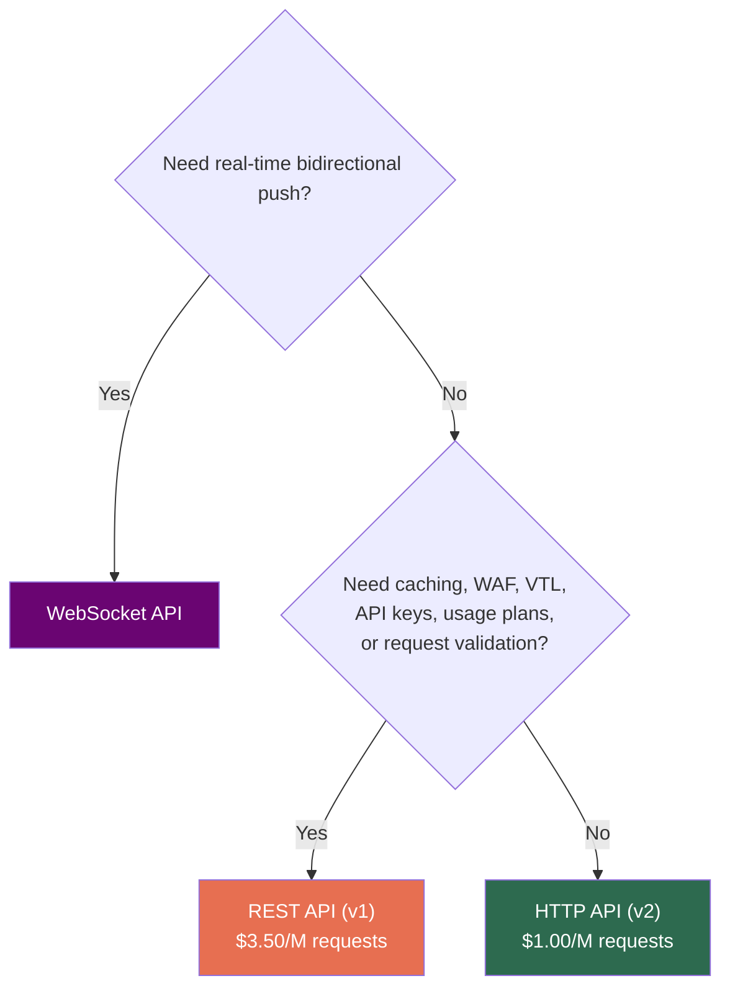

# AWS API Gateway — Core Concept & Flavors

## What is an API Gateway?

A **single entry point** between clients and backend services that centralizes cross-cutting concerns: authentication, rate-limiting, routing, transformation, and observability.

> **Analogy:** A smart receptionist at a corporate building — checks your ID (auth), verifies your appointment (authZ), directs you to the right floor (routing), and logs your visit (observability).

### Reverse Proxy vs. API Gateway

| | Reverse Proxy (Nginx, HAProxy) | API Gateway |
|---|---|---|
| **Primary Job** | Route traffic, terminate TLS, load balance | All of that + auth, rate-limiting, request transformation, API lifecycle management |
| **Awareness** | L4/L7 but "dumb" about business logic | Understands API semantics (methods, paths, query params, body schemas) |
| **Examples** | Nginx, HAProxy, Envoy | AWS API Gateway, Kong, Apigee |

> A reverse proxy is a **traffic cop**. An API Gateway is a **traffic cop + security guard + translator + auditor**.

### ALB vs. API Gateway — Interview Favorite

| | ALB | API Gateway |
|---|---|---|
| Auth | Limited (Cognito/OIDC) | IAM, Cognito, Lambda Authorizer, Resource Policies |
| Transformation | ❌ None | ✅ VTL mapping templates |
| Throttling | ❌ No per-client throttling | ✅ API keys, usage plans, quotas |
| Caching | ❌ No | ✅ Built-in (REST API) |
| Canary | ❌ No | ✅ Canary deployments |
| Best for | Internal service-to-service, gRPC, sticky sessions | External-facing API management |

> **API Gateway = external-facing API management. ALB = internal traffic distribution.** They often coexist.

---

## The Three Flavors

### REST API (v1) — The Feature-Rich One

- Launched 2015. **Most features**: VTL mapping, WAF, caching, API keys, usage plans, canary deployments, resource policies, request validation.
- **~$3.50 per million requests.**
- Choose when: You need **any** of the advanced features above.

### HTTP API (v2) — The Lean One

- Launched 2019. **~70% cheaper** (~$1.00/M), **~60% lower latency**.
- Supports: JWT authorizers natively, Lambda proxy, HTTP proxy, OIDC/OAuth2.
- **Does NOT support**: VTL, caching, API keys/usage plans, WAF, resource policies, request validation.
- Choose when: Simple Lambda-backed or HTTP-proxy API, cost is priority.

### WebSocket API — The Real-Time One

- **Persistent, bidirectional connections** (chat, live dashboards, gaming).
- Routes messages based on `$request.body.action` (route key).
- Three special routes: `$connect`, `$disconnect`, `$default`.
- **You manage connection state yourself** (typically DynamoDB).
- $1.00 per million messages + $0.25 per million connection-minutes.

### Feature Comparison Matrix

| Feature | REST API (v1) | HTTP API (v2) | WebSocket |
|---|:---:|:---:|:---:|
| Lambda Proxy | ✅ | ✅ | ✅ |
| VTL Mapping | ✅ | ❌ | ❌ |
| Request Validation | ✅ | ❌ | ❌ |
| Caching | ✅ | ❌ | ❌ |
| WAF | ✅ | ❌ | ❌ |
| API Keys / Usage Plans | ✅ | ❌ | ❌ |
| Resource Policies | ✅ | ❌ | ❌ |
| Canary Deployments | ✅ | ❌ | ❌ |
| JWT Authorizer (native) | ❌ | ✅ | ❌ |
| Auto Deploy | ❌ | ✅ | ❌ |
| Cost (per M requests) | $3.50 | $1.00 | $1.00/M msgs |

> ⚠️ **You cannot convert between REST and HTTP API.** They're entirely different services. Choosing wrong early = painful migration.

> ⚠️ Multiple gateway types in one architecture = totally normal. HTTP API for mobile, REST API for B2B partners, WebSocket for live tracking.

---

## ⚠️ Gotchas & Edge Cases

1. **"REST API" is NOT just "any RESTful API"** — It's a specific AWS product (v1). HTTP API (v2) also serves RESTful endpoints. The naming is intentionally confusing.
2. **HTTP API lacks features you might assume exist** — No caching, no WAF, no request validation. If you need these later, you're migrating or bolting on CloudFront.
3. **WebSocket API ≠ managed state** — AWS gives you the pipe, but YOU store connection IDs (DynamoDB) and iterate over them to broadcast. No built-in "broadcast to all."

---

## 📌 Interview Cheat Sheet

- API Gateway = centralized entry point for **auth, routing, transformation, rate-limiting, observability**
- **REST API (v1)**: Feature-rich, $3.50/M. Use for: WAF, caching, VTL, API keys, usage plans
- **HTTP API (v2)**: Lean, $1.00/M, lower latency. Use for: simple Lambda/HTTP proxy, JWT auth
- **WebSocket API**: Persistent bidirectional. You manage connection state in DynamoDB
- Cannot convert between REST ↔ HTTP API — choose wisely upfront
- Know the **ALB vs. API Gateway** distinction cold — favorite interviewer question
- Multiple gateway types in one system = common production pattern
