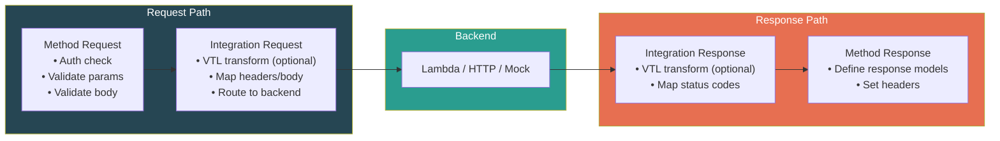
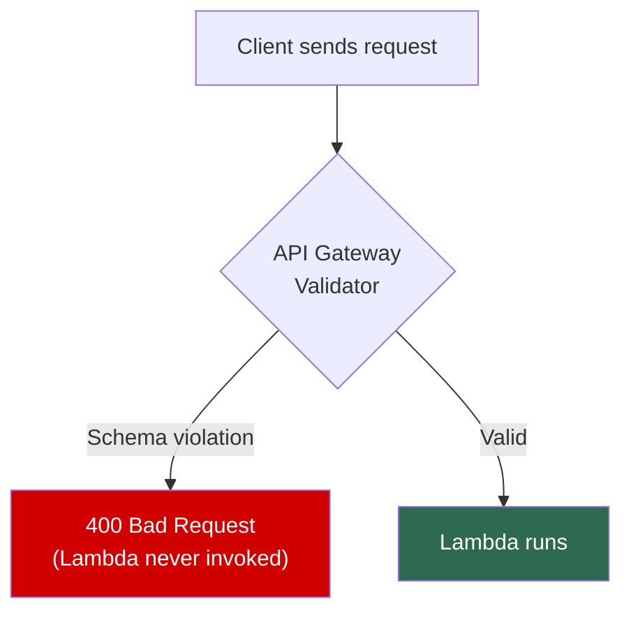
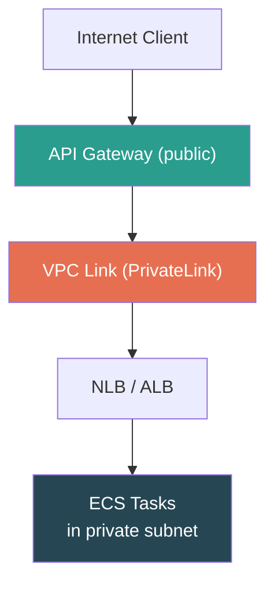

# AWS API Gateway — Integrations, Data Mapping & Endpoint Types

## Integration Types

When a request hits API Gateway, the **integration** is the backend that processes it.

| Integration Type | Code | What It Does | When To Use |
|---|---|---|---|
| **Lambda Proxy** | `AWS_PROXY` | Passes ENTIRE raw request as JSON event to Lambda | **90% of use cases. Default choice.** |
| **Lambda Custom** | `AWS` | You define what reaches Lambda via VTL mapping templates | Reshaping data before/after Lambda |
| **HTTP Proxy** | `HTTP_PROXY` | Pass-through to HTTP endpoint. No transformation. | Simple proxy to existing services |
| **HTTP Custom** | `HTTP` | HTTP proxy + VTL mapping templates | Adapting legacy API response formats |
| **Mock** | `MOCK` | Hardcoded response. No backend called. | Health checks, CORS preflight, prototyping |

### The Core Mental Model

```
PROXY  = "Pass everything through, let the backend deal with it"
CUSTOM = "I want to transform the data in transit"
```

---

## Lambda Proxy Integration (The Default)

### What Lambda Receives

```json
{
  "httpMethod": "POST",
  "path": "/orders",
  "headers": { "Authorization": "Bearer xyz", "Content-Type": "application/json" },
  "queryStringParameters": { "status": "active" },
  "pathParameters": { "userId": "123" },
  "body": "{\"item\": \"pizza\", \"qty\": 2}",
  "requestContext": { "accountId": "...", "stage": "prod", "identity": {} }
}
```

### What Lambda MUST Return

```json
{
  "statusCode": 200,
  "headers": { "Content-Type": "application/json" },
  "body": "{\"orderId\": \"abc-123\"}"
}
```

> ⚠️ **[SDE2 TRAP]** The `body` field MUST be a **string**, not a JSON object. Return `{"body": {"orderId": "abc"}}` → instant `502 Internal Server Error` with "Malformed Lambda proxy response". Fix: `JSON.stringify()` the body.

---

## The REST API Request Pipeline



> **PROXY mode** = skips the VTL transform boxes entirely. **CUSTOM mode** = you control every transform box.

---

## VTL Mapping Templates (Custom Integrations Only)

**VTL (Velocity Template Language)** — Apache's templating language repurposed by AWS. Transforms requests/responses **at the gateway layer** without touching backend code.

**Example:** Frontend sends `{"userName": "hrushi"}` but legacy backend expects `{"name": "hrushi"}`:

```velocity
{
  "name": "$input.json('$.userName')",
  "age": $input.json('$.userAge')
}
```

> **Honest take**: VTL is powerful but **painful**. Archaic syntax, terrible debugging, vague errors. Most teams avoid it. **Lambda Proxy + transformation inside Lambda** is the dominant pattern.

> ⚠️ VTL is **REST API only**. HTTP API has zero support for mapping templates.

---

## Request & Response Validation (REST API Only)

Reject bad requests **before** they hit your backend using JSON Schema models.



**JSON Schema Example:**
```json
{
  "type": "object",
  "required": ["itemId", "quantity"],
  "properties": {
    "itemId": { "type": "string" },
    "quantity": { "type": "integer", "minimum": 1 }
  }
}
```

> A request with `{"quantity": -5}` gets a `400` **before Lambda wakes up** — saves cold start time + invocation cost.

> ⚠️ **HTTP API does NOT have this feature.** This is a key reason teams choose REST API despite higher cost.

---

## Endpoint Types

Determines **how traffic reaches your API Gateway**:

| Endpoint Type | How It Works | Use When |
|---|---|---|
| **Edge-Optimized** | Request → nearest CloudFront POP → API GW region. AWS-managed CloudFront handles TLS. | Global users, want low-latency first hop. **Default.** |
| **Regional** | Request → directly to API GW in its region. No CloudFront. | Same-region users, OR you want your **own CloudFront** in front. |
| **Private** | Only accessible from VPC via VPC Interface Endpoint (PrivateLink). Zero internet exposure. | Internal microservice APIs. |

### Request Flow Comparison

```mermaid
flowchart TD
    subgraph EDGE["Edge-Optimized"]
        EC["Client (Mumbai)"] --> CF["CloudFront POP (Mumbai)\nTLS termination here\n⚠️ AWS-managed, no custom control"] --> APIGW1["API GW (us-east-1)"]
    end
    subgraph REG["Regional"]
        RC["Client (Mumbai)"] --> APIGW2["API GW (ap-south-1)\nTLS termination here"]
    end
    subgraph REG_CF["Regional + Own CloudFront (Production Pattern)"]
        RCC["Client (Mumbai)"] --> YCF["YOUR CloudFront\n✅ Your caching rules\n✅ Your WAF\n✅ Your Lambda@Edge"] --> APIGW3["API GW (ap-south-1)"]
    end
    subgraph PRIV["Private"]
        PE["EC2 in VPC"] --> VPCE["VPC Endpoint (ENI)"] --> APIGW4["API GW (same region)"]
    end

    style EDGE fill:#264653,color:#fff
    style REG fill:#2a9d8f,color:#fff
    style REG_CF fill:#2d6a4f,color:#fff
    style PRIV fill:#6a0572,color:#fff
```



> **[SDE2 TRAP]** Edge-Optimized's CloudFront is **AWS-managed** — you can't customize caching, add Lambda@Edge, or attach WAF to it. For full control: **Regional + your own CloudFront**. This is the production best practice.

> ⚠️ Edge-Optimized + your own CloudFront = **double CDN** (yours → AWS's). Always use Regional when adding your own CloudFront.

### Configuration

**Serverless Framework:**
```yaml
provider:
  name: aws
  endpointType: REGIONAL    # or EDGE or PRIVATE
```

**CloudFormation / SAM:**
```yaml
Resources:
  MyApi:
    Type: AWS::ApiGateway::RestApi
    Properties:
      EndpointConfiguration:
        Types:
          - REGIONAL
```

---

## VPC Link — Bridging Public Gateway to Private Backends

**Problem:** Public API Gateway needs to reach backends in a private VPC subnet (no public IP).

**Solution:** **VPC Link** — managed private connection via AWS PrivateLink.



| API Type | VPC Link connects to |
|---|---|
| REST API | **NLB** only |
| HTTP API | NLB, ALB, or Cloud Map — more flexible |

### VPC Link vs. VPC Endpoint — Don't Confuse!

| Concept | Direction | Used For |
|---|---|---|
| **VPC Link** | API Gateway → INTO your VPC | Public API GW reaching private backends |
| **VPC Endpoint** | FROM your VPC → INTO AWS service | Accessing Private API GW from within VPC |

> They go in **opposite directions**. This distinction is an interview favorite.

---

## CORS (Cross-Origin Resource Sharing)

When `app.example.com` calls `api.example.com`, browser sends a **preflight OPTIONS request**. If API Gateway doesn't respond correctly, the browser **blocks the actual request**.

| API Type | CORS Setup |
|---|---|
| **HTTP API** | One-click config. Specify origins, methods, headers — done. |
| **REST API** | Manual: configure OPTIONS method with Mock integration + response headers on each resource. |

> **[SDE2 TRAP]** With REST API + Lambda Proxy, enabling CORS in console only adds the OPTIONS preflight response. Your **Lambda function still needs to return CORS headers** (`Access-Control-Allow-Origin`) in its actual response. API Gateway doesn't inject them in proxy mode. This is the #1 "why is CORS broken?" issue.

---

## ⚠️ Gotchas & Edge Cases

1. **Lambda Proxy 502** — `body` must be a **string**. Raw JSON object as body → instant 502.
2. **VTL is REST API only** — HTTP API needs transformation inside Lambda code.
3. **Private APIs need resource policies** — VPC endpoint alone isn't enough. Must attach a resource policy explicitly allowing the VPC endpoint. Without it → 403.
4. **VPC Link ≠ VPC Endpoint** — Opposite directions. Link = GW→VPC. Endpoint = VPC→GW.
5. **Endpoint type change = brief disruption** — DNS records change, propagation takes minutes. Not zero-downtime.
6. **CORS double-duty in Lambda Proxy** — OPTIONS mock + Lambda response headers both needed.

---

## 📌 Interview Cheat Sheet

- **Lambda Proxy (`AWS_PROXY`)** = default, 90% of cases. Raw event in, `{statusCode, headers, body(string)}` out.
- **Custom integrations** = VTL transforms at gateway. Powerful but painful. REST API only.
- **Request validation** = JSON Schema at gateway, rejects before Lambda. REST API only. Saves cost.
- **Edge-Optimized** = default, AWS-managed CloudFront. Can't customize that CDN.
- **Regional + own CloudFront** = production best practice. Full control over caching/WAF/edge logic.
- **Private** = VPC-only via PrivateLink. Needs resource policy.
- **VPC Link** = bridge public API GW to private VPC backends. REST→NLB, HTTP→NLB/ALB/CloudMap.
- **CORS trap**: Proxy mode needs CORS headers in BOTH OPTIONS mock AND Lambda response.
