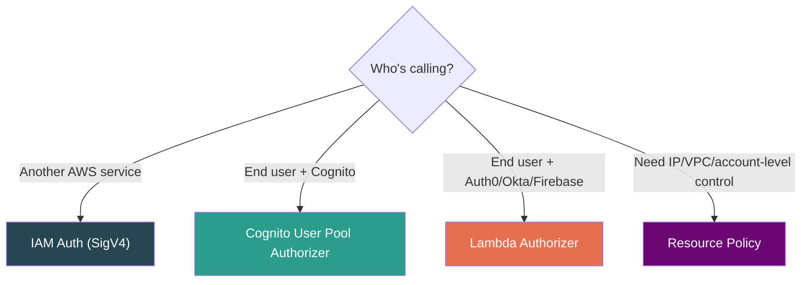
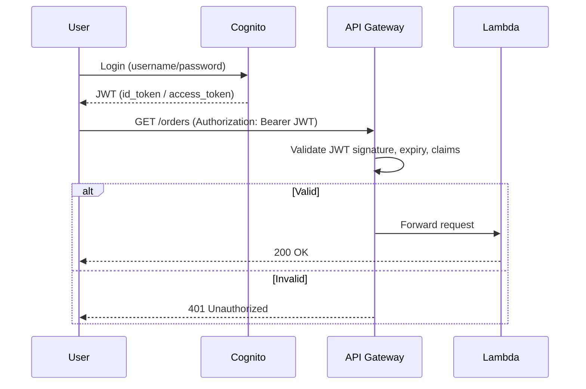
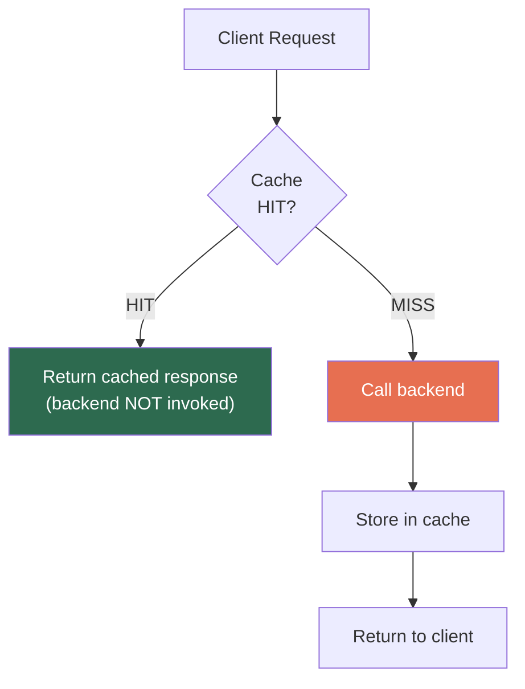
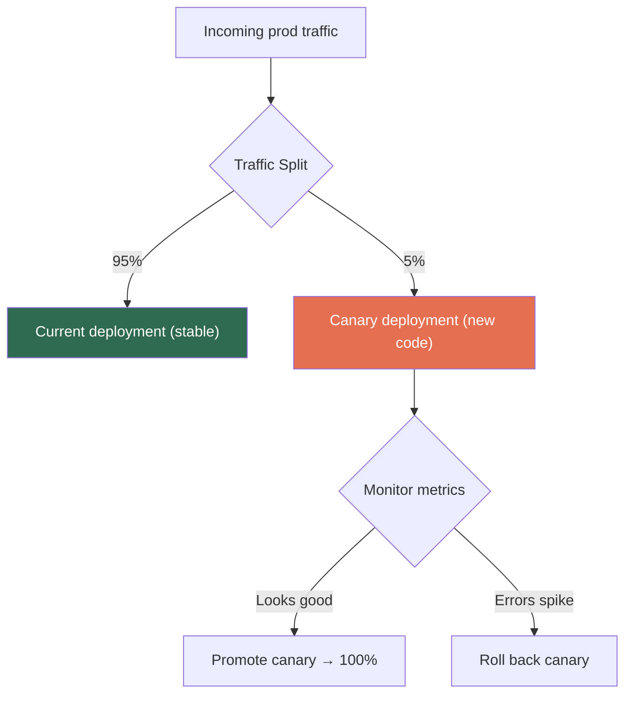

# AWS API Gateway — Security, Traffic Control, Caching, Deployment & Observability

## Part A: Security (AuthN & AuthZ)

Two questions before any request reaches backend:
1. **Authentication (AuthN):** *Who are you?*
2. **Authorization (AuthZ):** *Are you allowed to do this?*

### Security Decision Matrix



---

### 1. IAM Authorization

Request must be **signed with AWS SigV4**. API Gateway verifies against IAM policies.

```json
{
  "Effect": "Allow",
  "Action": "execute-api:Invoke",
  "Resource": "arn:aws:execute-api:us-east-1:123456:myapi/prod/GET/orders"
}
```

- Granular per **stage**, **HTTP method**, and **resource path**
- **Use for:** Service-to-service calls within AWS (EC2→API, Lambda→API, cross-account)
- **Not for:** End-user authentication (browsers can't sign with SigV4)

---

### 2. Cognito User Pool Authorizer

Client authenticates with Cognito → gets JWT → sends in `Authorization` header → API GW validates directly.



- **Use for:** Already using Cognito for user management
- **Limitation:** Only works with Cognito. Auth0/Firebase/Okta → use Lambda Authorizer instead

---

### 3. Lambda Authorizer (Custom Authorizer) — Most Flexible

You write a Lambda that receives the token/request, runs any logic, returns an IAM policy.

| Flavor | Input | Use Case |
|---|---|---|
| **Token-based** | `Authorization` header value only | JWT from any IdP |
| **Request-based** | Full request (headers, query params, path) | Multi-factor: API key + IP + custom header |

**Lambda Authorizer returns:**
```json
{
  "principalId": "user123",
  "policyDocument": {
    "Statement": [{
      "Effect": "Allow",
      "Action": "execute-api:Invoke",
      "Resource": "arn:.../*"
    }]
  }
}
```

> **[SDE2 TRAP] — Authorizer Caching:** Cached up to **3600 seconds** (1 hour). If you revoke a token, cached "Allow" policy survives until TTL expires. User keeps accessing API after revocation. **Fix:** reduce TTL, use short-lived tokens (OAuth2 best practice), or add a blocklist (Redis/DynamoDB) checked inside the authorizer.

---

### 4. Resource Policies (REST API Only)

JSON policy on the entire API — controls who can call at network/principal level.

**Use cases:**
- Allow specific **AWS accounts** (cross-account)
- Allow specific **VPC endpoints** (Private APIs)
- Allow/deny specific **IP ranges**

```json
{
  "Effect": "Allow",
  "Principal": "*",
  "Action": "execute-api:Invoke",
  "Resource": "arn:aws:execute-api:us-east-1:123456:myapi/*",
  "Condition": {
    "IpAddress": { "aws:SourceIp": ["203.0.113.0/24"] }
  }
}
```

> Resource Policy (coarse-grained) is evaluated **FIRST**, then method-level auth (IAM/Cognito/Lambda). Both must allow.

---

### 5. WAF Integration (REST API Only)

Attach AWS WAF directly to REST API Gateway for protection against:
- SQL injection, XSS
- Rate-based rules (block IPs > 2000 req/5min)
- Geo-blocking, Bot detection

> HTTP API doesn't support WAF directly. **Workaround:** CloudFront in front of HTTP API → attach WAF to CloudFront.

---

## Part B: Traffic Control

### API Keys, Usage Plans & Throttling (REST API Only)

> ⚠️ **API Keys ≠ Authentication.** They identify clients for metering/throttling. NOT secret enough for security. Always pair with real auth.

**The Hierarchy:**
```
Usage Plan
  ├── Throttle: 100 req/sec, burst 200
  ├── Quota: 50,000 req/month
  └── Attached API Keys:
       ├── Key "partner-A" → gets above limits
       └── Key "partner-B" → gets above limits
```

### Three Levels of Throttling

| Level | Scope | Default |
|---|---|---|
| **Account-level** | ALL APIs in account, per region | **10,000 req/sec, 5,000 burst** |
| **Stage-level** | Specific API + stage | Configurable |
| **Method-level** | Specific method (e.g., `POST /orders`) | Configurable |

> **[SDE2 TRAP]** The account-level 10K/sec limit is **shared across ALL APIs** in a region. One API with a traffic spike can starve others → 429 errors everywhere. **Fix:** Request quota increase (most limits are soft), set stage-level caps on high-traffic APIs, or use separate AWS accounts (multi-account strategy).

**Throttling Algorithm: Token Bucket**
```
Bucket capacity = burst limit (e.g., 5000)
Refill rate = steady-state rate (e.g., 10000/sec)
Each request takes 1 token.
Bucket empty → 429 Too Many Requests
```

---

## Part C: Caching (REST API Only)

Managed in-memory cache inside API Gateway. Subsequent identical requests get cached response — backend never called.



### Configuration

| Setting | Value |
|---|---|
| Cache size | 0.5 GB to 237 GB |
| TTL | 0 to 3600 seconds (default 300s) |
| Scope | Per-stage (e.g., only `prod`) |
| Override | Per-method (cache GET, not POST) |
| Cache key | Default: resource path. Can include headers, query strings, path params |

### Cache Invalidation

- Client sends `Cache-Control: max-age=0` → forces refresh
- ⚠️ **By default, ANY client can invalidate your cache.** Must enable "Require authorization" → only IAM-authorized callers can invalidate.
- Without this → **cache busting attack** (malicious client flushes cache repeatedly, all traffic hits backend)

### Cost

- **Not free.** Billed per hour by cache size, even when idle
- 0.5 GB ≈ $0.02/hr ≈ ~$14/month
- ⚠️ Cache on dev/staging = pure waste. Only enable on prod.

> HTTP API has no caching. Use CloudFront in front for caching.

---

## Part D: Deployment Lifecycle

### Stages

A stage = **named reference to a deployment**. Think environments.

```
API Gateway "orders-api"
  ├── dev     → https://abc123.execute-api.../dev
  ├── staging → https://abc123.execute-api.../staging
  └── prod    → https://abc123.execute-api.../prod
```

Each stage has its own: **stage variables**, cache settings, throttling, logging.

**Stage Variables** — like environment variables:
```
Integration URI: arn:aws:lambda:...:function:orders-${stageVariables.env}

dev stage:  env = "dev"  → invokes orders-dev
prod stage: env = "prod" → invokes orders-prod
```

### Canary Deployments (REST API Only)

Send a percentage of prod traffic to a new deployment:



> Canary ≠ Blue/Green. Canary = percentage-based split. Blue/Green = full stage swap via custom domain base path remapping.

### Custom Domain Names

Map `api.example.com` → API Gateway. Uses **base path mappings** to route paths to different APIs/stages. ACM certificate required.

| Endpoint Type | ACM Cert Region |
|---|---|
| Edge-Optimized | Must be in `us-east-1` |
| Regional | Must be in **same region** as API |

---

## Part E: Observability

### Two Types of Logs

| Log Type | Contents | Use Case | Prod Recommendation |
|---|---|---|---|
| **Execution Logs** | Full lifecycle: auth result, integration latency, VTL output, errors | **Debugging** individual requests | ⚠️ Disable or sample (expensive at scale) |
| **Access Logs** | One-line structured: IP, method, path, status, latency | **Analytics**, dashboards, audit | ✅ Always enable |

> ⚠️ **Execution logs in prod = cost bomb.** They log full request/response bodies. At high throughput, CloudWatch ingestion ($0.50/GB) can exceed your API GW bill.

### Key CloudWatch Metrics

| Metric | What It Tells You |
|---|---|
| `Count` | Total API requests |
| `4XXError` | Client errors (bad requests, auth failures) |
| `5XXError` | Server errors (Lambda failures, timeouts) |
| `Latency` | End-to-end (client → backend → client) |
| `IntegrationLatency` | Just the backend portion |
| `CacheHitCount` / `CacheMissCount` | Cache effectiveness |

### The Debugging Formula

```
Latency - IntegrationLatency = API Gateway overhead
```

If this difference is consistently high (>50ms):
- Slow Lambda Authorizer (check execution logs for `Authorizer latency`)
- Complex VTL mapping templates
- WAF rule evaluation (especially regex rules)
- Request validation on large bodies

### X-Ray Tracing

One toggle → distributed trace across API Gateway → Lambda → DynamoDB → etc. Essential for debugging latency in multi-service architectures.

---

## ⚠️ Combined Gotchas

1. **API Keys ≠ Auth.** Identification only. Always pair with IAM/Cognito/Lambda Authorizer.
2. **Authorizer cache + token revocation** — Cached allow survives revocation until TTL expires.
3. **10K/sec shared throttle** — All APIs in a region share this. Request quota increase first.
4. **Cache busting attack** — Enable "Require authorization" on invalidation.
5. **Execution logs at scale** — Silent cost bomb. Use access logs for prod analytics.
6. **ACM cert region matters** — Edge = us-east-1, Regional = same region as API.

---

## 📌 Interview Cheat Sheet

- **IAM Auth** → service-to-service (SigV4). **Cognito** → end users + Cognito. **Lambda Authorizer** → any IdP, most flexible
- **Resource Policy** → coarse-grained (IP/VPC/account). Evaluated BEFORE method-level auth
- **WAF** → REST API only. SQL injection, XSS, geo-block, rate rules
- **API Keys** = identification, NOT authentication. Always pair with real auth
- **Throttling**: Account (10K/sec shared) → Stage → Method. Token bucket algorithm
- **Caching**: REST API only, 0.5–237 GB, per-stage. Secure the invalidation header
- **Canary** = percentage-based split. Blue/Green = full stage swap
- **Execution logs** = debugging. **Access logs** = analytics. Don't run execution logs in prod at scale
- **Latency − IntegrationLatency** = API GW overhead → debug slow authorizers/VTL/WAF
- **X-Ray** = one-click distributed tracing
