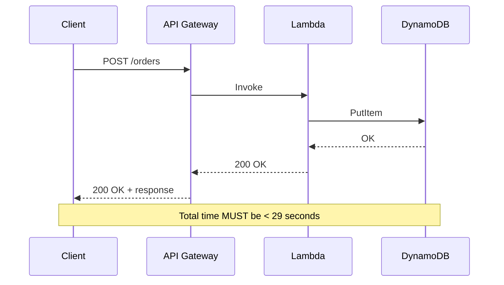
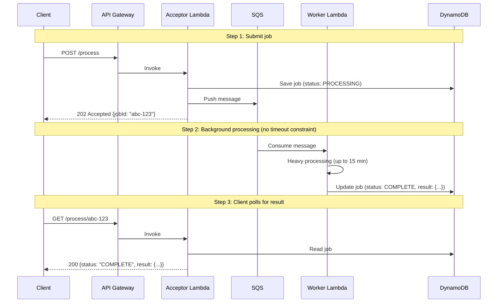
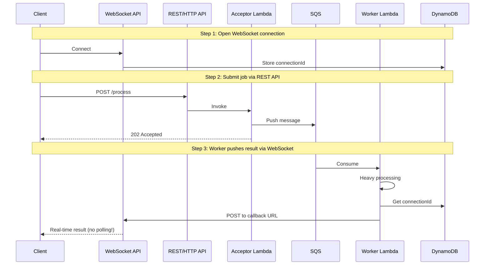
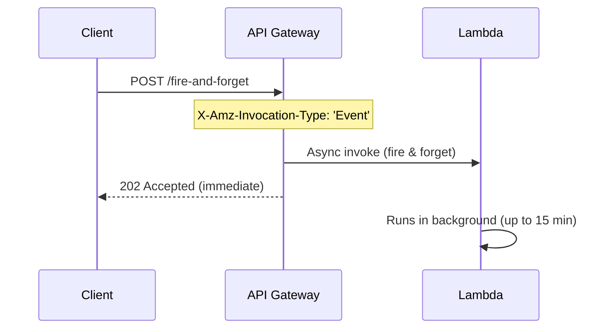
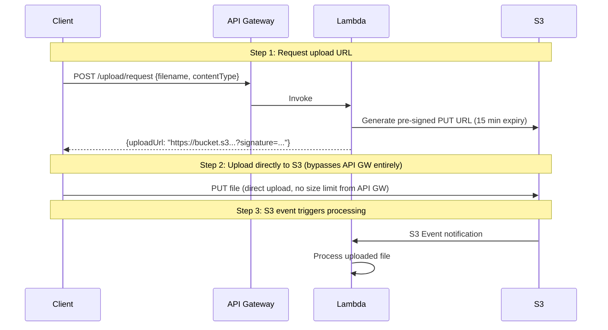
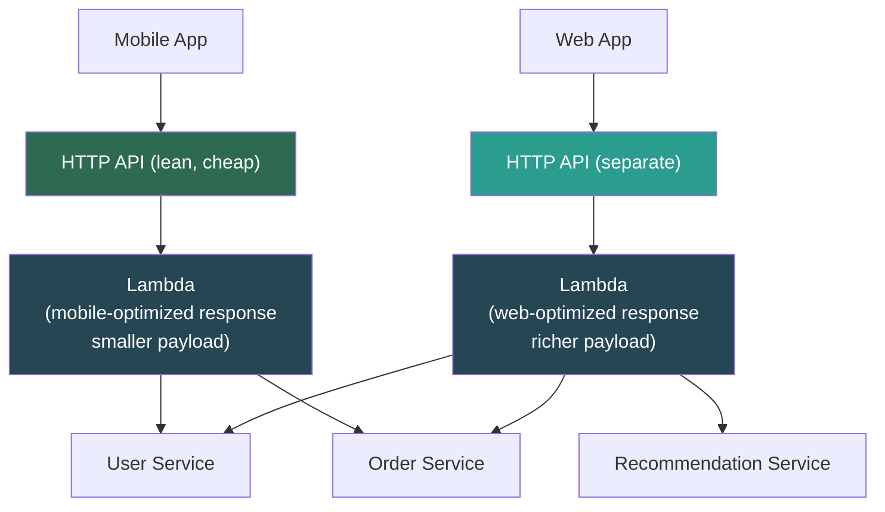
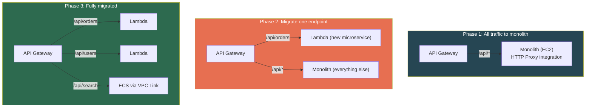

# AWS API Gateway — System Design Patterns & SDE2 Gotchas

## The Hard Limits (Non-Negotiable, Cannot Be Increased)

| Limit | Value | Impact |
|---|---|---|
| **Integration timeout** | **29 seconds** | Backend takes longer → `504 Gateway Timeout` |
| **Payload size** | **10 MB** (request & response) | Large file uploads/downloads won't work through API GW |
| **WebSocket message** | **128 KB** (frames) | Can't push large payloads through WebSocket |
| **Resource policy size** | **8 KB** | Complex IP whitelists hit this fast |

---

## The 29-Second Timeout — Most Important Constraint

Your backend has **29 seconds max** to return a response. Even if Lambda supports 15 minutes — API Gateway kills the connection at 29s.

**What breaks in production:**
- ML inference (45+ seconds)
- Report generation with complex DB queries
- Batch processing triggered via API
- PDF generation from large datasets
- Workflows with multiple sequential service calls

> **The fix: Never do heavy work synchronously through API Gateway. Use async patterns.**

---

## Sync vs Async — The Core Design Decision

### Pattern 1: Synchronous (Simple, Direct)



**Good for:** CRUD operations, reads, simple writes — anything reliably under ~15 seconds.

---

### Pattern 2: Async with Polling (The Workhorse)



**When to use:** Report generation, ML inference, video processing, any task > 10 seconds.

---

### Pattern 3: Async with WebSocket Callback



**When to use:** Real-time dashboards, live notifications, when polling latency is unacceptable.

---

### Pattern 4: Direct Lambda Async Invocation



**Setup (REST API custom integration):** Add header mapping `X-Amz-Invocation-Type: 'Event'`

**Trade-off:** No built-in way to get result back. Need separate mechanism (DynamoDB + polling, SNS, WebSocket).

---

### Pattern Decision Matrix

| Scenario | Pattern | Why |
|---|---|---|
| CRUD, reads, simple writes (<15s) | **Synchronous** | Simple, direct |
| Heavy processing (>15s) | **Async + Polling** | Decoupled, reliable, SQS retry semantics |
| Real-time result delivery needed | **Async + WebSocket** | No polling latency |
| Fire-and-forget (no result needed) | **Direct Async** | Simplest async pattern |

---

## The 10 MB Payload Limit — File Upload Patterns

### Pattern 1: Pre-signed S3 URL (The Standard)



**Why this is elegant:**
- API Gateway handles only a tiny JSON request/response
- Heavy file transfer goes **directly to S3** — bypasses API GW entirely
- Works for **downloads** too — generate a pre-signed GET URL
- No payload limit concerns from API GW perspective

### Pattern 2: Multipart Upload (>5 GB files)

API generates `uploadId` + pre-signed URLs for each part. Client uploads parts **in parallel** directly to S3. Completes with a final API call.

---

## Real-World Architecture Patterns

### Pattern: BFF (Backend for Frontend)



Different gateways for different clients. Each Lambda aggregates and shapes the response for its specific client type.

---

### Pattern: API Composition / Gateway Aggregation

```
WITHOUT aggregation (3 round trips from client):
  Client → GET /users/123
  Client → GET /users/123/orders  
  Client → GET /users/123/recommendations

WITH aggregation (1 round trip):
  Client → GET /users/123/dashboard
              └→ Lambda (aggregator)
                    ├→ User Service       (parallel)
                    ├→ Order Service      (parallel)
                    └→ Recommendation Svc (parallel)
                    └→ Combine & return single response
```

> Reduces client round-trips. Especially critical for mobile on slow networks.

---

### Pattern: Strangler Fig (Monolith Migration)



API Gateway as the routing layer for **incremental** monolith replacement without client-side changes.

---

## Cost Model & Traps

### Pricing Summary

| | REST API | HTTP API |
|---|---|---|
| Per million requests | **$3.50** (first 333M) | **$1.00** (first 300M) |
| Cache | $0.02/hr for 0.5GB (~$14/mo) | N/A (no cache) |
| Data transfer | Standard AWS rates | Standard AWS rates |

### Cost Traps

| Trap | Problem | Fix |
|---|---|---|
| **Unnecessary Lambda invocations** | Bad requests still trigger Lambda | Use request validation (reject before Lambda), caching (skip Lambda on HIT), mock (CORS preflight) |
| **Cache on dev/staging** | $14+/mo per non-prod stage for zero benefit | Only enable cache on prod |
| **Execution logs in prod** | Full req/resp bodies at 10M req/day = terabytes of CloudWatch ($0.50/GB ingestion) | Use access logs for prod. Execution logs for debugging only. |
| **REST API when HTTP API suffices** | 3.5x cost difference | If no caching/WAF/VTL/API keys needed → HTTP API |

---

## Final Gotchas Roundup

1. **Binary media types** — API Gateway doesn't handle binary (images, PDFs) by default. Must configure `binaryMediaTypes` and client must send matching `Accept` header. Otherwise binary gets base64-encoded and corrupted.

2. **Stage in URL path** — REST API URLs include stage: `/prod/orders`. Remove with custom domain + base path mapping. HTTP API with `$default` stage doesn't have this issue.

3. **Cold start amplification** — API GW → Lambda Authorizer (cold start) → Backend Lambda (cold start) = **two cold starts** per request. Worst case: 2 × 3-5s = 6+ seconds. **Fix:** Provisioned concurrency on both, or use Cognito/IAM auth to avoid authorizer Lambda.

4. **Idempotency** — API Gateway can retry failed integrations on network blips. Backend MUST be idempotent. Non-idempotent `POST /charge-card` → double charge on retry.

5. **CloudFormation limits** — REST API with 300+ resources can hit CF template size limit (51,200 bytes). Split large APIs across multiple API Gateway instances behind a custom domain.

6. **HTTP API auto-deploy** — Pushes changes immediately to stage on route modification. Convenient for dev, **dangerous for prod**. Disable on production stages.

---

## 📌 Interview Cheat Sheet

- **29s timeout is HARD.** Design around it with async patterns (SQS + polling, WebSocket callback, Lambda async invocation)
- **10 MB payload is HARD.** Use S3 pre-signed URLs for file uploads/downloads
- **Sync = simple CRUD < 29s.** **Async = anything heavy.** Know SQS+polling pattern cold
- **Pre-signed URL flow**: API GW → Lambda (generate URL) → Client uploads directly to S3 (bypasses API GW)
- **Cost**: HTTP API is 3.5x cheaper. Cache costs per hour (disable non-prod). Execution logs = silent cost bomb
- **BFF pattern**: Separate gateways per client type, tailored aggregation Lambda
- **Strangler Fig**: API Gateway as routing layer for incremental monolith migration
- **Cold start amplification**: Authorizer + backend = two cold starts. Fix: provisioned concurrency or non-Lambda auth
- **Idempotency**: Always design backends for duplicate requests
- **Binary media**: Must configure `binaryMediaTypes` explicitly
