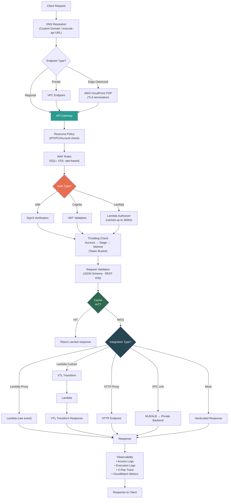
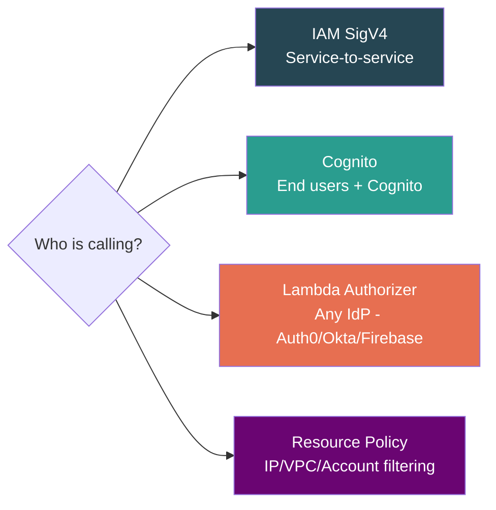

# AWS API Gateway — Master Revision Sheet

> **Quick-reference revision document.** For deep dives, see individual module files in this folder.

---

## 🗺️ Complete Request Flow



---

## ⚡ API Type Decision Matrix

| Need | REST API (v1) | HTTP API (v2) | WebSocket |
|---|:---:|:---:|:---:|
| Simple Lambda CRUD | ✅ (expensive) | ✅ **Best** | ❌ |
| B2B with API keys/quotas | ✅ **Required** | ❌ | ❌ |
| Real-time bidirectional | ❌ | ❌ | ✅ **Required** |
| Request body validation | ✅ | ❌ | ❌ |
| Caching at gateway | ✅ | ❌ (use CloudFront) | ❌ |
| WAF protection | ✅ | ❌ (use CloudFront) | ❌ |
| VTL transformation | ✅ | ❌ | ❌ |
| JWT auth (native) | ❌ (use Lambda Auth) | ✅ | ❌ |
| Cost (per M requests) | $3.50 | $1.00 | $1.00/M msgs |

> **Cannot convert between REST ↔ HTTP API.** Different services entirely.

---

## 🔐 Security Quick Reference



| Auth Method | Best For | Key Gotcha |
|---|---|---|
| **IAM (SigV4)** | AWS service-to-service | Not for browser users |
| **Cognito** | End users already on Cognito | Only works with Cognito |
| **Lambda Authorizer** | Any IdP, custom logic | Cache TTL can bypass token revocation |
| **Resource Policy** | IP/VPC/account-level control | REST API only, 8KB size limit |
| **WAF** | SQLi, XSS, rate-limiting, geo-block | REST API only (or via CloudFront) |

---

## 🚦 Hard Limits (Cannot Be Increased)

| Limit | Value | Design Pattern to Work Around |
|---|---|---|
| **Integration timeout** | **29 seconds** | Async: SQS + polling, WebSocket callback, Lambda async invocation |
| **Payload size** | **10 MB** | S3 pre-signed URLs for upload/download |
| **WebSocket message** | **128 KB** | Chunk large messages |
| **Resource policy** | **8 KB** | Consolidate IP ranges with CIDR |

---

## 🏗️ System Design Patterns Cheat Sheet

### Async with Polling (The Workhorse)
```
Client → API GW → Lambda (accept job, save to DDB, push to SQS) → 202 Accepted
SQS → Worker Lambda (heavy processing, up to 15 min) → Update DDB status
Client → API GW → Lambda (read DDB) → {status: "COMPLETE", result: {...}}
```

### Pre-signed S3 URL (File Uploads)
```
Client → API GW → Lambda (generate pre-signed URL) → {uploadUrl: "..."}
Client → S3 directly (bypasses API GW, no 10MB limit)
S3 Event → Lambda (process file)
```

### BFF (Backend for Frontend)
```
Mobile → HTTP API → Lambda (mobile-optimized, smaller payload)
Web    → HTTP API → Lambda (web-optimized, richer payload)
Both Lambdas → same backend services
```

### Strangler Fig (Monolith Migration)
```
API GW → /api/orders → Lambda (migrated)
API GW → /api/*      → HTTP Proxy → Monolith (not yet migrated)
```

---

## 💰 Cost Optimization Checklist

- [ ] Using HTTP API instead of REST API where advanced features aren't needed? (3.5x savings)
- [ ] Cache disabled on dev/staging stages? (saves ~$14+/mo per stage)
- [ ] Execution logs disabled in prod? (CloudWatch ingestion = $0.50/GB)
- [ ] Request validation enabled to reject bad requests before Lambda? (saves invocation cost)
- [ ] Mock integration for CORS preflight? (avoids Lambda invocation)
- [ ] Caching enabled for GET endpoints on prod? (reduces backend invocations)

---

## 🪤 Top SDE2 Interview Traps

| Trap | What They Expect You To Know |
|---|---|
| "REST API vs HTTP API" | Feature-cost tradeoff, not just "REST is RESTful" |
| "ALB vs API Gateway" | ALB = internal traffic. API GW = external API management. They coexist. |
| "Edge-Optimized vs Regional" | Regional + own CloudFront = production best practice |
| "VPC Link vs VPC Endpoint" | Opposite directions. Link = GW→VPC. Endpoint = VPC→GW. |
| "Lambda Proxy 502" | `body` must be a string, not JSON object |
| "Token revoked but user still has access" | Lambda Authorizer response caching |
| "API Keys for security" | API Keys ≠ Auth. Identification only. |
| "29s timeout" | Must know async patterns cold |
| "CORS broken in browser but works in Postman" | Lambda must return CORS headers too (not just OPTIONS mock) |
| "One API spiking, all APIs return 429" | Account-level 10K/sec shared throttle |
| "High Latency but IntegrationLatency is low" | `Latency - IntegrationLatency` = API GW overhead. Check: slow authorizer, VTL, WAF rules, request validation |
| "First request takes 6+ seconds" | Cold start amplification: Authorizer Lambda + Backend Lambda = 2 cold starts. Fix: provisioned concurrency or non-Lambda auth |

---

## 📂 Module Index

| File | Contents |
|---|---|
| [01_Core_Concept_and_Flavors.md](./01_Core_Concept_and_Flavors.md) | What is API GW, Reverse Proxy vs GW, REST vs HTTP vs WebSocket |
| [02_Integrations_DataMapping_Endpoints.md](./02_Integrations_DataMapping_Endpoints.md) | Lambda Proxy/Custom, VTL, Endpoint Types, VPC Link, CORS |
| [03_Security_Traffic_Caching_Deployment_Observability.md](./03_Security_Traffic_Caching_Deployment_Observability.md) | IAM/Cognito/Lambda Auth, Throttling, Caching, Stages, Canary, Logs, X-Ray |
| [04_System_Design_Patterns_and_Gotchas.md](./04_System_Design_Patterns_and_Gotchas.md) | 29s timeout, async patterns, pre-signed URLs, BFF, Strangler Fig, cost traps |
