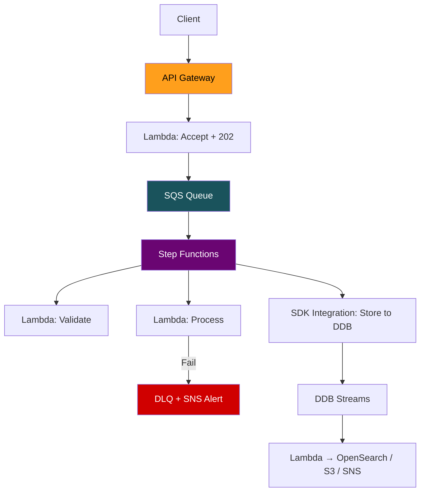

# ⚡ AWS — FAST Revision Sheet (SDE2/SDE3)

> **One-page-per-service speed run.** Ordered by learning progression: foundational → intermediate → advanced. For deep dives → individual `*_revision.md` files.

### 📚 Learning Order

```
① IAM          — Security foundation. Gates EVERYTHING.
② VPC          — Networking foundation. Where resources live.
③ S3           — Object storage. Simple model, deep features.
④ EC2/ECS/FG   — Compute spectrum. Servers → containers → serverless.
⑤ Lambda       — Serverless compute. Builds on IAM + VPC + event sources.
⑥ API Gateway  — Front door. Ties Lambda + auth + throttling together.
⑦ DynamoDB     — NoSQL database. Needs IAM, VPC, Lambda context.
⑧ SQS          — Messaging foundation. Point-to-point queue.
⑨ SNS          — Pub/sub broadcast. Builds on SQS understanding.
⑩ EventBridge  — Advanced event routing. Builds on SNS/SQS patterns.
```

---

## 🔐 ① IAM

### Policy Evaluation Engine (Memorize This Flow)
```
Request → AuthN → Explicit DENY? → SCP allows? → Resource Policy? →
Permissions Boundary? → Identity Policy allows? → ALLOW / implicit DENY
```

> **Cardinal Rule: Explicit DENY always wins.** 10 Allow + 1 Deny = DENIED.

### Identity Primitives
- **IAM User** = permanent creds (legacy/break-glass). **IAM Role** = temp creds (STS). **Always prefer Roles.**
- **Groups** are NOT identities — can't be Principal. Organize users only.

### Policy Types Quick Hit

| Type | Grants? | Restricts? | Key Behavior |
|---|---|---|---|
| Identity-based | ✅ | ✅ | "What this identity can do" |
| Resource-based | ✅ | ✅ | Enables cross-account without role switch |
| Permissions Boundary | ❌ | ✅ | **Ceiling.** Effective = Identity ∩ Boundary |
| SCP | ❌ | ✅ | Account-level ceiling. **Not on mgmt account.** |

### Cross-Account — THE #1 Tested Concept

| Scenario | Rule |
|---|---|
| Same account | IAM Allow **OR** Bucket Policy Allow |
| Cross account | IAM Allow **AND** Bucket Policy Allow (both required) |

### STS Quick Hit
- `AssumeRole` → cross-account, services (15m–12h)
- `GetCallerIdentity` → "Who am I?" — **can't be denied**
- Role chaining → max **1 hour** (hard limit)

### Top Traps
1. **Permissions Boundary + Identity** → intersection, not union
2. **SCP on mgmt account** → SCPs **don't apply** to management account
3. **`iam:PassRole`** → required when assigning roles to services
4. **Confused deputy** → fix with External ID
5. **KMS key policy** → must delegate to IAM via root principal, else IAM policies ignored
6. **`Principal: "*"` vs `"AWS": "*"`** → first = public anonymous, second = all authenticated AWS

---

## 🌐 ② VPC

### Core Mental Model
- **VPC** = your private network inside AWS. Region-scoped. You control: subnets, routes, gateways, firewalls.
- **Subnet** = subdivision of VPC CIDR, lives in **one AZ**. Public vs private determined by **route table**, not IP.

### The 5 Things to Say Instantly

| Concept | One-Liner |
|---|---|
| Public subnet | Route table has `0.0.0.0/0 → IGW` |
| Private subnet | Route table has `0.0.0.0/0 → NAT` (or no default route) |
| CIDR math | `2^(32−prefix)` = total IPs. AWS reserves **5 per subnet**. /24 = 251 usable. |
| Longest prefix match | Most specific route wins. `local` route is immutable. |
| NAT Gateway is single-AZ | One per AZ in production. ~$0.045/hr + per-GB. |

### Security — SG vs NACL (Will Be Asked)

| | Security Group | NACL |
|---|---|---|
| Scope | Instance (ENI) | Subnet |
| Stateful? | ✅ | ❌ (must define both directions) |
| Can deny? | ❌ (allow only) | ✅ |
| Eval | All rules, any match = allow | **Numbered, first match wins** |
| Killer feature | **SG referencing** (allow sg-app, not IPs) | Explicit deny (block attacker IPs) |

### Connectivity Checklist
```
VPC Peering    → 2-3 VPCs, non-transitive, no CIDR overlap
Transit GW     → 5+ VPCs, hub-and-spoke, transitive routing
Gateway EP     → S3 + DynamoDB (FREE), route table entry
Interface EP   → Everything else (PrivateLink, ENI, ~$0.01/hr)
```

### Top Gotchas
1. Primary CIDR is **permanent** — plan big
2. NAT costs explode → use **VPC Endpoints** for S3/DynamoDB/ECR
3. NACLs are stateless → forget ephemeral ports (1024-65535) outbound = **silent drops**
4. VPC peering is **non-transitive** (A↔B + B↔C ≠ A↔C)
5. EC2 never sees its public IP → IGW does 1:1 NAT transparently

---

## 📦 ③ S3

### Data Model
- **Flat key-value store** — no folders. `/` is just a character. Console fakes folders via `ListObjectsV2` + prefix/delimiter.
- Max object: **5 TB**. Single PUT: **5 GB** (use multipart above). Buckets: **100/account** (soft).

### Consistency (Post-Dec 2020)
- **Strong read-after-write for ALL operations.** No more eventual consistency.
- But: **no multi-object transactions**, **last writer wins** (timestamp), conditional writes for conflict detection.

### Storage Classes — Decision Tree
```
Constant access    → Standard
Monthly access     → Standard-IA (3-AZ) / One Zone-IA (reproducible data only)
Quarterly or less  → Glacier Instant (ms retrieval) / Glacier Flexible (hours)
Compliance vault   → Deep Archive (~$1/TB/mo, 12-48h retrieval)
Unpredictable      → Intelligent-Tiering (auto-moves, no retrieval fees)
```
> **All classes: 11 nines durability.** Durability ≠ Availability.

### Security — 4 Layers
```
Block Public Access (kill switch) → Explicit DENY → Explicit ALLOW → Implicit DENY
```
- **SSE-S3** = default (zero effort, no audit). **SSE-KMS** = production standard (CloudTrail, key control, crypto-shredding).
- **S3 Bucket Keys** = reduces KMS calls by **99%**. Essential for SSE-KMS at scale.

### Performance
- **3,500 writes / 5,500 reads per prefix per second.** Auto-partitions since 2018.
- **Multipart**: required >5 GB, recommended >100 MB. Max 10,000 parts.
- **Transfer Acceleration**: CloudFront edge → AWS backbone. Cross-continent only.

### Key Patterns
- **Pre-signed URLs** for upload/download (server never touches bytes)
- **CRR/SRR** for replication. Versioning required. Doesn't backfill (use Batch Replication).
- **EventBridge** for complex routing. Native triggers for low-latency single consumer.

### Top Gotchas
1. **Abandoned multipart parts** bill forever (invisible in listings) → lifecycle rule mandatory
2. **Pre-signed URL from Lambda** → expires with STS session, NOT ExpiresIn
3. **128 KB minimum billing** for IA classes → tiny files = waste
4. **Lifecycle min 30 days** between tier transitions
5. **Cross-account = intersection rule** (IAM + Bucket Policy both must allow)
6. **Replication doesn't chain** (A→B→C needs explicit A→C)
7. **Permanent version deletes never replicate** (prevents cross-region wipe by design)

---

## 🖥️ ④ Compute (EC2 / ECS / Fargate)

### The Decision Flow
```
Event-driven, <15 min           → Lambda
Long-running, no GPU, variable  → Fargate
Long-running, no GPU, steady    → ECS on EC2 (RI + bin-packing)
Stateful / GPU / kernel access  → EC2
Always propose HYBRID in interviews
```

### Cost Crossover Points

| Transition | Approx. Crossover |
|---|---|
| Lambda → Fargate cheaper | ~1M requests/day |
| Fargate → ECS on EC2 | Cluster utilization >70% |
| On-Demand → Savings Plans | Any workload >8 hours/day |

### EC2 Essentials
- Instance types: General (M), Compute (C), Memory (R), Storage (I), GPU (P/G)
- **Graviton (ARM)**: 20% cheaper, ~20% faster. One config flip.
- Pricing: On-Demand → Savings Plans (72% off) → Spot (90% off, 2-min reclaim)

### ECS on EC2 vs Fargate

| | ECS on EC2 | Fargate |
|---|---|---|
| Server mgmt | You manage fleet | None |
| Pricing | Per-instance (even idle) | Per-task (vCPU-sec + GB-sec) |
| GPU | ✅ | ❌ |
| Startup | Fast (existing host) | 30-60s |
| Max resources | Instance-limited | 16 vCPU / 120 GB |
| Storage | EBS, instance store | **EFS only** (ephemeral default) |
| Cost at scale | ✅ Cheaper (bin-packing) | More expensive |
| Cost variable load | More expensive | ✅ Cheaper |

### Top Traps
1. **"Just use Lambda for everything"** = red flag. Know Lambda limits.
2. **"Just use Kubernetes"** = red flag unless justified (multi-cloud, K8s ecosystem).
3. **Fargate cold start = 30-60s** → keep images small (<200 MB).
4. **Compute Savings Plans > Reserved Instances** → applies to EC2 + Fargate + Lambda.
5. **Never run stateful workloads on Spot** — 2-min termination notice.

---

## ⚡ ⑤ Lambda

### Execution Lifecycle
```
INIT (cold start only) → INVOKE (every request) → IDLE → SHUTDOWN or WARM reuse
```
- Cold start: ~100ms (Python/Node) to ~2-10s (Java). VPC adds ~200-500ms (post-2019 Hyperplane).
- **Global scope = init-once, reuse-many** → #1 optimization pattern.

### Key Limits (Memorize)

| Limit | Value |
|---|---|
| Max timeout | **15 minutes** |
| Max memory | **10,240 MB** |
| 1 full vCPU | **1,769 MB** (the magic number) |
| ZIP package | 250 MB unzipped |
| Container image | 10 GB |
| Layers | 5 max, 250 MB total |
| /tmp storage | 512 MB default, up to 10 GB |

### Three Invocation Models

| Model | Retry | Examples |
|---|---|---|
| **Sync** | Caller handles | API GW, ALB, SDK Invoke |
| **Async** | 2 retries → DLQ/Destination | S3, SNS, EventBridge |
| **Stream/Poll** | Retries until data expires (blocks shard) | SQS, Kinesis, DDB Streams |

### Concurrency
- **1,000 per region** (default, adjustable). Burst: 3,000 (us-east-1).
- **Reserved** = floor AND ceiling. Set to 0 = **kill switch**.
- **Provisioned** = pre-warmed, zero cold starts. Costs 24/7. Must target version/alias.

### Top Traps
1. **SQS visibility timeout ≥ 6× Lambda timeout** — or messages get duplicated
2. **No DLQ on async = silent event loss** — Destinations are non-negotiable
3. **Kinesis poison pill** → blocks entire shard. Fix: `BisectBatchOnFunctionError` + `MaxRetryAttempts` + failure Destination
4. **ReportBatchItemFailures** for SQS — always enable (prevents 9/10 good msgs retrying)
5. **API GW 29s hard limit** trumps Lambda timeout behind it
6. **Lambda + RDS** = 1000 concurrent = 1000 DB connections → use **RDS Proxy**
7. **Cost crossover**: sustained 50 req/s → Lambda ~$13K/mo vs Fargate ~$711/mo

---

## 🚪 ⑥ API Gateway

### API Type Decision

| Need | REST (v1) | HTTP (v2) | WebSocket |
|---|:---:|:---:|:---:|
| Simple Lambda CRUD | ✅ | ✅ **Best** | ❌ |
| API keys / quotas | ✅ **Required** | ❌ | ❌ |
| Request validation | ✅ | ❌ | ❌ |
| Caching / WAF | ✅ | ❌ (use CF) | ❌ |
| JWT auth (native) | ❌ | ✅ | ❌ |
| Cost per M req | $3.50 | **$1.00** | $1.00/M msgs |

> **Cannot convert REST ↔ HTTP API.** Different services.

### Auth Decision
```
AWS service-to-service  → IAM SigV4
End users on Cognito    → Cognito authorizer
Any IdP (Auth0/Okta)    → Lambda Authorizer (cache TTL can bypass revocation!)
IP/VPC/account filter   → Resource Policy (REST only)
```

### Hard Limits (Cannot Increase)

| Limit | Value | Workaround |
|---|---|---|
| Integration timeout | **29 seconds** | Async: SQS + polling, WebSocket callback |
| Payload size | **10 MB** | S3 pre-signed URLs |
| WebSocket message | **128 KB** | Chunk messages |

### System Design Patterns
```
Async polling   → API GW → Lambda (accept, return 202) → SQS → Worker → DDB status → Client polls
Pre-signed S3   → API GW → Lambda (generate URL) → Client uploads to S3 directly (bypasses 10MB limit)
Strangler Fig   → API GW → /api/orders → Lambda (migrated) | /api/* → HTTP Proxy → Monolith
```

### Top Traps
1. **Lambda Proxy 502** → `body` must be a string, not JSON object
2. **CORS broken in browser but works in Postman** → Lambda must return CORS headers too
3. **One API spiking → all APIs return 429** → account-level 10K/sec shared throttle
4. **First request 6+ sec** → cold start amplification (Authorizer Lambda + Backend Lambda = 2 cold starts)
5. **API Keys ≠ Auth** → identification only, never security

---

## 🗄️ ⑦ DynamoDB

### Core Model
- **Tables → Items (max 400 KB) → Attributes.** PK determines partition, SK determines sort.
- **Query** = one partition (fast, cheap). **Scan** = entire table (slow, expensive).
- **Filters** = applied AFTER read. Save bandwidth, **NOT RCU**. Cosmetic only.

### RCU/WCU Math Card

| Operation | Unit | Cost |
|---|---|---|
| Read (eventual) | 4 KB | 0.5 RCU |
| Read (strong) | 4 KB | 1 RCU |
| Read (transactional) | 4 KB | 2 RCU |
| Write (standard) | 1 KB | 1 WCU |
| Write (transactional) | 1 KB | 2 WCU |

**Per-partition limits:** 3,000 RCU + 1,000 WCU + 10 GB

### GSI vs LSI

| | GSI | LSI |
|---|---|---|
| Different PK? | ✅ | ❌ (same PK, different SK) |
| When to add | Anytime | **Table creation only** |
| Consistency | **Eventually consistent ONLY** | Supports strong |
| Throughput | Separate | Shares base table |
| Partition limit | None | **10 GB per PK** |

### Key Design Patterns
```
Overloaded Keys     → PK/SK with entity prefixes (USER#, ORDER#)
Adjacency List      → Both directions (or inverted GSI) for M:N
Composite Sort Key  → STATUS#DATE#REGION for hierarchical filtering
Sparse Index        → GSI on optional attribute = auto-filtered
Inverted Index      → GSI PK=SK, SK=PK for reverse lookups
```

### Concurrency — Pick Cheapest Mechanism
```
Atomic increment           → SET counter = counter + 1         (1 WCU)
Prevent overwrite          → attribute_not_exists(PK)          (1 WCU)
Read-modify-write (single) → Optimistic locking (version attr) (1 WCU + retry)
Multi-item atomicity       → TransactWriteItems                (2 WCU/item)
```

### Top Traps
1. **Filter expressions DON'T save cost** → full RCU consumed, filter is post-read
2. **Strong consistency on GSI** → **impossible**. GSIs are eventually consistent only.
3. **On-demand isn't infinite** → starts ~4K WCU, scales on prior peak
4. **DAX query cache is NOT write-through** → TTL-only, can serve stale
5. **BatchWriteItem is NOT atomic** → partial failures possible, check `UnprocessedItems`
6. **TTL deletes take up to 48h** → filter expired items in app code
7. **Global Table conflicts** → last-writer-wins (LWW), not configurable

---

## 📨 ⑧ SQS

### Core Model
- **Point-to-point queue.** Pull-based. One message → one consumer. Persists up to **14 days**.
- **Message lifecycle:** Visible → ReceiveMessage → Invisible (visibility timeout) → DeleteMessage ✅ or timeout → Visible again.

### Standard vs FIFO

| | Standard | FIFO |
|---|---|---|
| Ordering | Best-effort | Strict per `MessageGroupId` |
| Delivery | At-least-once | Exactly-once |
| Throughput | Nearly unlimited | 300/s (3K batching, 70K high-throughput) |
| Dedup | None | Content-based or explicit ID (5-min window) |

> **FIFO ordering is per MessageGroupId, NOT global.** `groupId = orderId` = parallel across orders.

### Key Settings
```
VisibilityTimeout         = 6× Lambda timeout (CRITICAL)
ReceiveMessageWaitTimeSeconds = 20 (ALWAYS long poll)
MaxReceiveCount           → after N fails → DLQ
ReportBatchItemFailures   → ALWAYS enable for Lambda
maxConcurrency            → protects downstream from thundering herd
```

### Patterns
- **Load leveling**: SQS absorbs spike, consumers drain at safe rate
- **Claim-check**: payload >256 KB → S3 + pointer in SQS
- **Backpressure**: `maxConcurrency` caps Lambda invocations per queue

---

## 📢 ⑨ SNS

### Core Model
- **Pub/sub broadcast.** Push-based. One message → ALL subscribers. **No persistence** — pair with SQS.

### SNS + SQS Fan-Out = THE #1 AWS Pattern
```
Service → SNS Topic → SQS Queue A → Lambda A (own DLQ, own retry, own scaling)
                     → SQS Queue B → Lambda B (fully isolated)
                     → SQS Queue C → Lambda C
```
> Each consumer is isolated. Adding consumer = subscribe new queue. **Zero publisher code changes.**

### Why Not SNS → Lambda Direct?
- Lambda throttled → SNS retries only **3 times** → message **permanently lost**
- SQS in between absorbs spikes and retries indefinitely

### Message Filtering
- Filters inside SNS (not subscriber). Attribute-based or payload-based.
- Exact match, prefix, numeric ranges, exists/not-exists.
- Max 5 attributes, 150 values. For more complex → EventBridge.

---

## 🚌 ⑩ EventBridge

### Core Model
- **Serverless event bus with content-based routing.** NOT "better SNS" — fundamentally different.
- SNS = mailing list. EventBridge = smart mail room that reads each letter and routes.

### Unique Features (SNS/SQS Can't Do)
1. **Deep nested JSON filtering** (suffix, wildcard, IP, $or across keys)
2. **Archive & Replay** — time travel for debugging/backfill
3. **Schema Registry** — auto-discovers schemas, generates code bindings
4. **Scheduler** — one-time delayed actions at scale (millions concurrent)
5. **Input Transformers** — reshape events before delivery
6. **Cross-account bus-to-bus** routing

### Event Routing Decision
```
Single consumer, low latency  → Native S3/SNS trigger
Simple fan-out, >10K/sec      → SNS → SQS
Complex routing, growing      → EventBridge
Need replay or schema         → EventBridge
AWS service events             → EventBridge (default bus)
```

### Top Gotchas
- **10,000 events/sec soft limit** — for higher throughput use SNS/SQS or Kinesis
- **24-hour retry window** — no DLQ = events lost after 24h
- **At-least-once, NO dedup** — consumers must be idempotent

---

## 🧠 Decision Frameworks

### Messaging: SQS vs SNS vs EventBridge

```
ONE consumer, task processing     → SQS (Standard or FIFO)
MULTIPLE consumers, simple fan    → SNS → SQS
MULTIPLE, complex routing         → EventBridge
AWS service events                → EventBridge
>10K events/sec                   → SQS or Kinesis
Need replay/archive               → EventBridge
Scheduled one-time actions        → EventBridge Scheduler
```

**Magic phrase:** *"EventBridge for routing, SNS for fan-out, SQS for durability and throttling."*

### Compute: Lambda vs Fargate vs ECS vs EC2

```
Event-driven, <15 min, spiky         → Lambda
Containerized, variable traffic       → Fargate
Large steady fleet, cost-optimized    → ECS on EC2 + RI
Stateful / GPU / kernel access        → EC2
ALWAYS propose HYBRID in system design
```

**Magic phrase:** *"Match compute to workload — hybrid architectures win interviews."*

---

## 🔥 Cross-Service Gotchas — Rapid Fire

| # | Gotcha |
|---|---|
| 1 | **Cross-account access = intersection** — IAM Allow AND Resource Policy Allow (both required) |
| 2 | **Pre-signed URL from Lambda** → expires with STS session, NOT ExpiresIn parameter |
| 3 | **SQS visibility timeout ≥ 6× Lambda timeout** — or messages get reprocessed |
| 4 | **NAT Gateway costs** → use VPC Endpoints for S3/DynamoDB/ECR |
| 5 | **Lambda 15-min limit** + **API GW 29-sec limit** — know async patterns cold |
| 6 | **No DLQ on async Lambda = silent event loss** — Destinations are mandatory |
| 7 | **SNS → Lambda direct = 3 retries then lost** — always put SQS in between |
| 8 | **Filter expressions (DDB) DON'T save RCU** — post-read, cosmetic only |
| 9 | **GSIs are eventually consistent ONLY** — no strong consistency option |
| 10 | **EventBridge 10K/sec limit** — use SNS/SQS for higher throughput |
| 11 | **S3 has no folders** — flat namespace, prefix+delimiter illusion |
| 12 | **Replication doesn't backfill** existing objects — use S3 Batch Replication |
| 13 | **Lambda + RDS** = 1K concurrent = 1K DB connections → **RDS Proxy** |
| 14 | **Abandoned multipart uploads bill forever** — lifecycle rule is mandatory |
| 15 | **KMS key policy** must delegate to IAM or IAM policies are completely ignored |

---

## 🎯 System Design Template (Serverless)



### Every Design Must Address

1. **Idempotency** — dedup with DynamoDB/Redis using event IDs
2. **Dead Letter Queues** — on every queue and async Lambda, alert on depth >0
3. **Backpressure** — `maxConcurrency` on SQS-Lambda, `MaxConcurrency` on Step Functions Map
4. **Monitoring** — queue depth, message age, DLQ depth, `IteratorAge`, error rates, P99 latency
5. **Retry strategy** — exponential backoff, `maxReceiveCount` before DLQ
6. **Cost modeling** — run the numbers for your traffic pattern. Never assume.

---

> **Last words before the interview:** "It depends" is always the right opening. Follow with: traffic pattern, team size, hard constraints, and then justify each choice.
