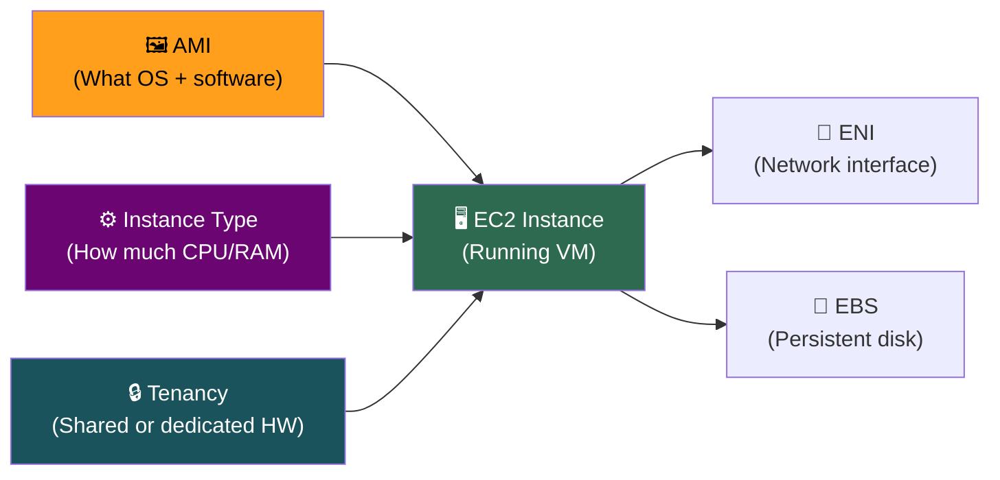
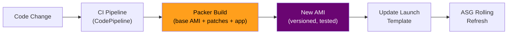
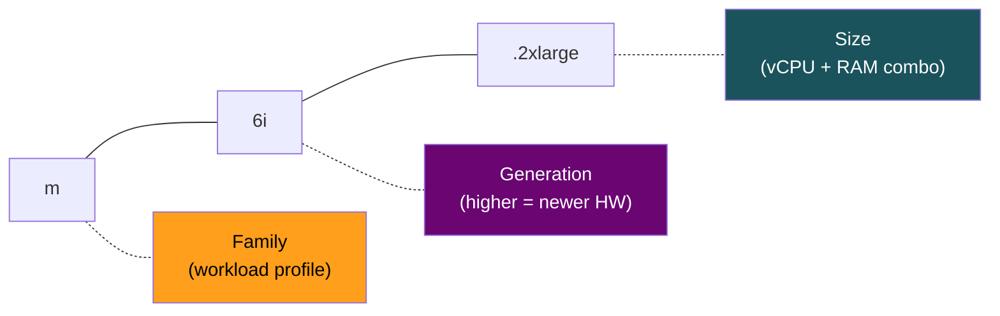
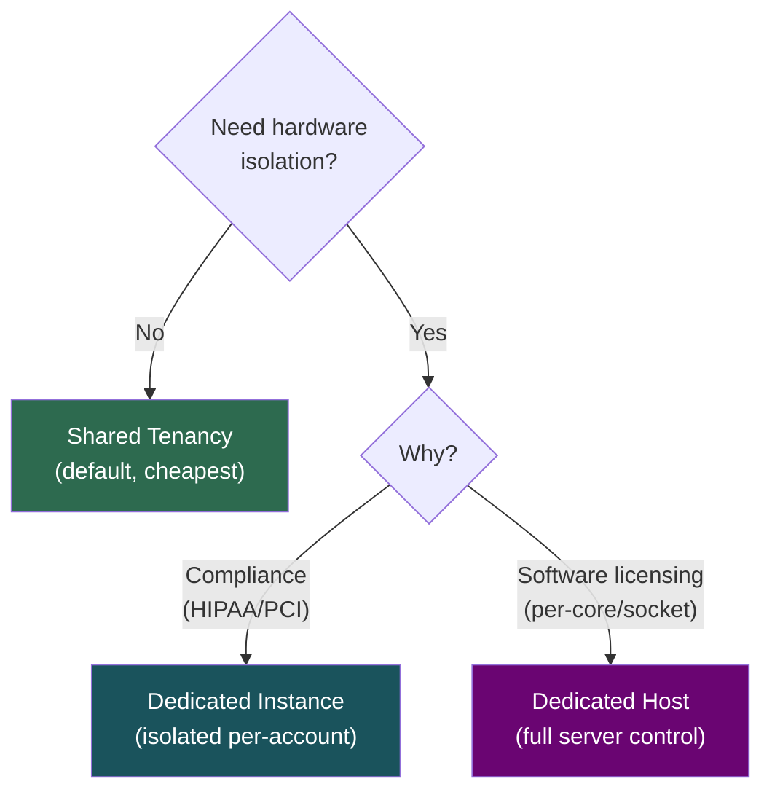
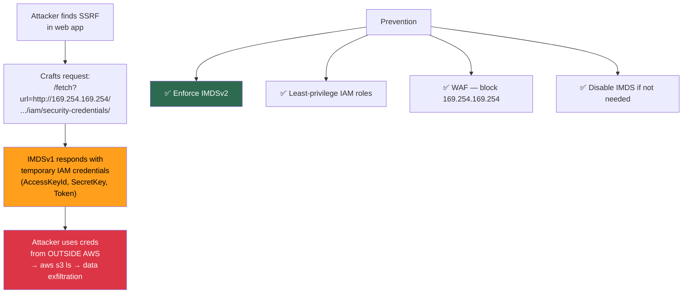

# EC2 Fundamentals — AMIs, Instance Types, Tenancy & Security

## What is EC2?

EC2 = **Elastic Compute Cloud** = Virtual Machine on AWS's physical hosts via the **Nitro Hypervisor**.

> EC2 = IaaS. You own the OS and everything above. AWS owns hypervisor and below.

---

## The Three Pillars of an EC2 Instance

---

## 1. AMI (Amazon Machine Image)

**Analogy:** AMI is a class, Instance is an object. AMI = frozen snapshot of OS + software + config.

| AMI Type | What It Is | When To Use |
|----------|-----------|-------------|
| **Public** | Amazon Linux 2023, Ubuntu, Windows Server | Quick starts, dev/test |
| **Marketplace** | Pre-built stacks (WordPress, Deep Learning AMI) | Vendor solutions |
| **Custom** | You bake from a running instance | **Production — always use custom AMIs** |

### Key Properties

| Property | Detail |
|----------|--------|
| **Scope** | Regional — `ami-abc` in `us-east-1` doesn't exist in `eu-west-1` |
| **Sharing** | Cross-account within same region ✅ |
| **Copy** | Cross-region via `CopyImage` API (copies underlying EBS snapshots) |
| **Encryption** | Can encrypt during copy with a KMS key in the target region |
| **Immutability** | Cannot be modified — create a new AMI for changes |

> **[SDE2 TRAP]** AMI ≠ backup. AMIs don't capture in-flight RAM or running processes. For true backup: EBS snapshots + application-level consistency (`fsfreeze`).

### AMI Baking Pipeline (Production Pattern)

---

## 2. Instance Type

**Format:** `<family><generation>.<size>` → e.g., `m6i.2xlarge`

### Key Families — Must Know

| Family | Optimized For | Use Case | Example |
|--------|--------------|----------|---------|
| **t3/t3a** | Burstable CPU | Dev/test, low-traffic sites | `t3.micro` |
| **m5/m6i/m7i** | General purpose | App servers, mid-tier APIs | `m6i.xlarge` |
| **c5/c6i/c7i** | Compute | Video encoding, ML inference, batch | `c6i.2xlarge` |
| **r5/r6i/r7i** | Memory | Redis, Memcached, in-memory analytics | `r6i.xlarge` |
| **i3/i4i** | Storage I/O | Cassandra, Elasticsearch, HDFS | `i3.2xlarge` |
| **p4/p5** | GPU (training) | ML training, HPC | `p4d.24xlarge` |
| **g5** | GPU (graphics) | Game streaming, video transcoding | `g5.xlarge` |

### Burstable Instances (t-family) — Deep Dive

| Concept | Detail |
|---------|--------|
| **CPU Credits** | Earn when idle, spend when bursting above baseline |
| **Baseline** | `t3.micro` = 10%, `t3.small` = 20%, `t3.medium` = 20%, `t3.large` = 30% |
| **Credit exhaustion** | Throttled to baseline — severe perf degradation |
| **Unlimited mode** | Can burst beyond credits but **pay per extra vCPU-minute** (surprise bills!) |

> **[SDE2 TRAP]** Never use T-series for sustained production CPU loads. If your app uses >baseline% consistently, use M-family. The SDE2 answer: *"It depends on CPU profile — I'd benchmark first, but for sustained workloads, M-family is safer."*

### Suffix Modifiers

| Suffix | Meaning | Example |
|--------|---------|---------|
| **a** | AMD processor (cheaper) | `m6a.large` |
| **g** | Graviton (ARM — best price/perf) | `m7g.large` |
| **i** | Intel processor | `m6i.large` |
| **d** | Local NVMe instance store included | `m5d.large` |
| **n** | Enhanced networking | `m5n.large` |
| **metal** | Bare metal (no hypervisor) | `m5.metal` |

---

## 3. Tenancy

| Model | What It Means | When To Use | Cost |
|-------|--------------|-------------|------|
| **Shared** (default) | Your VM shares physical host with other accounts | 99% of cases | Standard |
| **Dedicated Instance** | Your instances run on hardware isolated per-account | Compliance (HIPAA, PCI) | ~2× |
| **Dedicated Host** | You own the entire physical server, control socket/core | Per-core licensing (Oracle, SQL Server) | Highest |

---

## 4. EC2 Security — IMDS

### Instance Metadata Service (IMDS)

Every EC2 instance can call `http://169.254.169.254/latest/meta-data/` to get its own instance ID, IP, IAM role credentials, etc.

| Version | How It Works | Security |
|---------|-------------|----------|
| **IMDSv1** | Simple GET request | ❌ Vulnerable to SSRF attacks |
| **IMDSv2** | Requires PUT to get session token first, hop-limit=1 | ✅ Blocks SSRF proxying |

### The Capital One Attack Pattern (2019)

> **When an interviewer says "EC2 security" → your first words should be "IMDSv2 enforcement".**

### Nitro Hypervisor

| Aspect | Detail |
|--------|--------|
| **What** | AWS's custom hypervisor replacing Xen |
| **Instances** | All modern types (t3+, m5+, c5+, r5+) |
| **Benefits** | Better performance, hardware-level security isolation, EBS-optimized by default |
| **Interview signal** | Mentioning Nitro signals depth — "EC2 runs on the Nitro hypervisor which offloads networking and storage to dedicated hardware cards" |

---

## Interview Cheat Sheet

- EC2 = IaaS. You own OS. AWS owns hypervisor and below.
- AMI = immutable, regional, shareable cross-account, copyable cross-region (re-encrypt with local KMS key).
- Instance type = `family + generation + size`. Know 5+ families and when to use each.
- Burstable (t-family) = CPU credits → baseline matters → not for sustained workloads.
- Graviton (`g` suffix) = best price/performance for compatible workloads (ARM).
- Dedicated Host vs Dedicated Instance: Host = socket control (licensing), Instance = just isolation.
- **IMDSv2** = first thing to mention for EC2 security. Capital One breach = SSRF + IMDSv1.
- Nitro = modern hypervisor. Mention it when discussing EC2 architecture.
