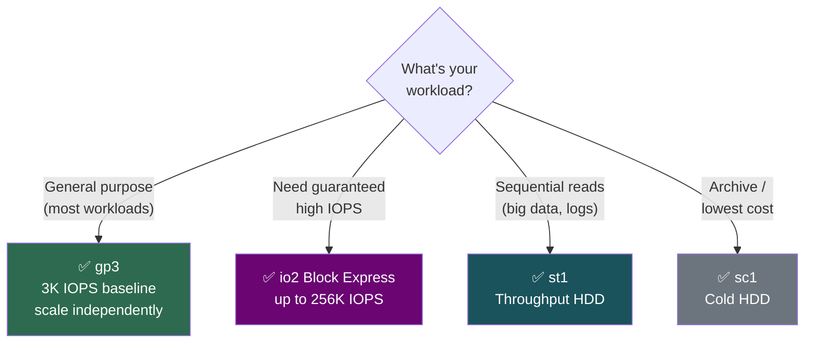
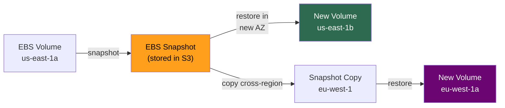
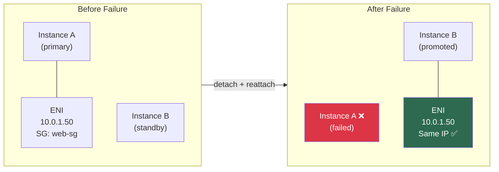
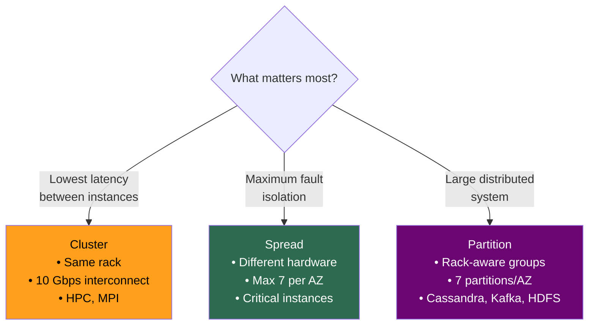

# EC2 Storage, Networking & Placement Groups

## Storage — EBS vs Instance Store

| | **EBS** | **Instance Store** |
|--|---------|-------------------|
| **Analogy** | USB drive plugged in | HDD soldered on motherboard |
| **Persistence** | ✅ Survives stop/restart | ❌ GONE on stop/terminate |
| **Attachment** | Network-attached | Physically local NVMe |
| **Latency** | Sub-ms (Nitro) | Lower, higher throughput |
| **Snapshots** | ✅ Incremental → S3 | ❌ None |
| **Max Size** | 64 TiB per volume | Fixed by instance type |
| **Scope** | **AZ-locked** | Tied to instance lifecycle |
| **Use Case** | Boot volumes, DBs | Scratch, caches, shuffle |

---

## EBS Volume Types

| Type | IOPS | Throughput | Best For |
|------|------|-----------|----------|
| **gp3** ⭐ | 3K base → 16K | 125 → 1,000 MiB/s | **Default for everything** |
| **gp2** (legacy) | Burst 3K, 3/GB | 250 MiB/s | Avoid — prefer gp3 |
| **io2 Block Express** | Up to **256K** | 4,000 MiB/s | Guaranteed IOPS (Oracle, SAP) |
| **st1** | 500 | 500 MiB/s | Big data, logs (sequential) |
| **sc1** | 250 | 250 MiB/s | Archive, lowest cost |

### EBS Volume Type Selection

> **[SDE2 TRAP]** gp2 IOPS scales with size (3/GB). 100 GB gp2 = only 300 IOPS. **gp3 decouples IOPS from size** — always 3,000 baseline. Always recommend gp3.

### EBS Key Behaviors

| Behavior | Detail |
|----------|--------|
| **AZ-locked** | Volume in `1a` can't attach to instance in `1b`. Migrate via snapshot. |
| **Snapshots** | Incremental. Deleting old snaps is safe — AWS redistributes blocks. |
| **Multi-Attach** | io2 only. NOT a shared FS — needs cluster-aware FS (GFS2) or corruption. |
| **Encryption** | AES-256 via KMS. Transparent. Encrypt at creation or during snap copy. |
| **EBS-optimized** | Nitro instances (m5+) are EBS-optimized by default, no extra cost. |

### EBS Cross-AZ / Cross-Region Migration

---

## ENI (Elastic Network Interface)

Virtual network card. Every instance has at least one.

**An ENI carries:** Private IP + Public/Elastic IP + Security Groups + MAC address

### Why ENIs Matter

| Use Case | How |
|----------|-----|
| **Failover without IP change** | Detach ENI from failed instance → attach to standby → same IP, zero DNS delay |
| **Multi-homed instances** | ENI-1 in public subnet (web), ENI-2 in private subnet (DB access) |
| **License preservation** | Software bound to MAC → ENI preserves MAC across instance replacements |

### ENI Failover Pattern

> **[SDE2 TRAP]** Security Groups attach to **ENIs**, not instances. Two ENIs on one instance can have different SGs. Common debugging pitfall.

---

## Placement Groups

| Strategy | Behavior | Limit | Use Case | Risk |
|----------|----------|-------|----------|------|
| **Cluster** | Same rack, low-latency interconnect | No limit | HPC, MPI, 10 Gbps inter-node | Rack failure = all down |
| **Spread** | Each on different hardware | **7 per AZ** | Critical instances — no shared fate | Limited count |
| **Partition** | Grouped partitions on separate racks | 7 partitions/AZ | Cassandra, Kafka, HDFS | Less granular |

### Placement Group Decision

---

## Interview Cheat Sheet

- EBS = persistent, network-attached, AZ-scoped. Instance Store = ephemeral, local, blazing fast.
- gp3 > gp2 (decoupled IOPS). io2 for guaranteed IOPS. st1/sc1 for sequential/cold.
- EBS snapshots are incremental, stored in S3, cross-region copyable.
- EBS Multi-Attach ≠ shared filesystem. Needs cluster-aware FS.
- ENI = virtual NIC (IP + SG + MAC). Movable for failover. SGs attach to ENIs, not instances.
- Placement Groups: Cluster (performance), Spread (resilience, 7/AZ), Partition (distributed DBs).
