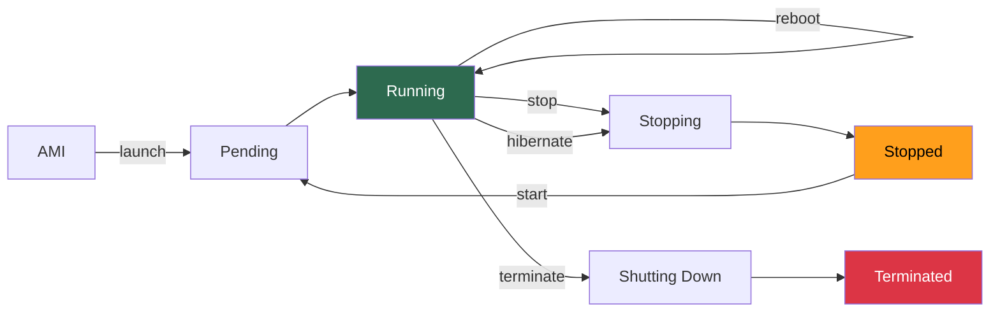
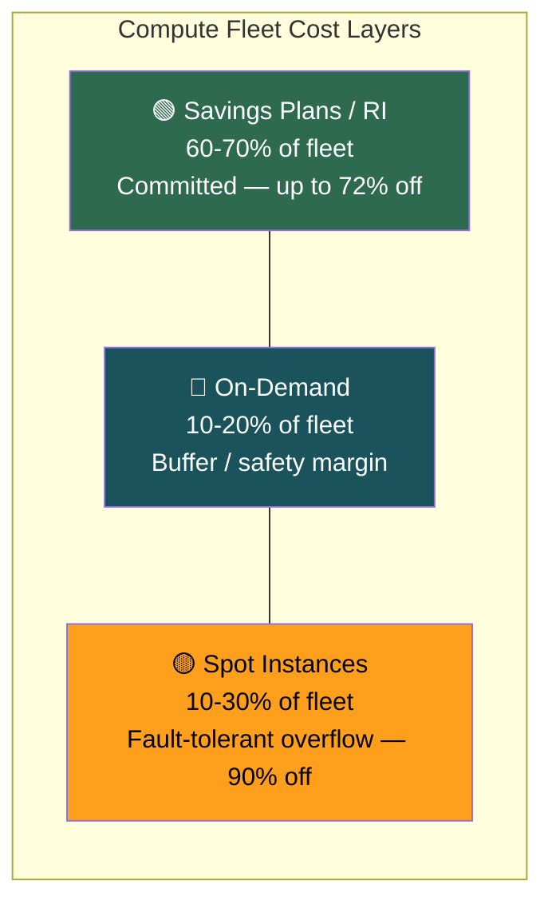
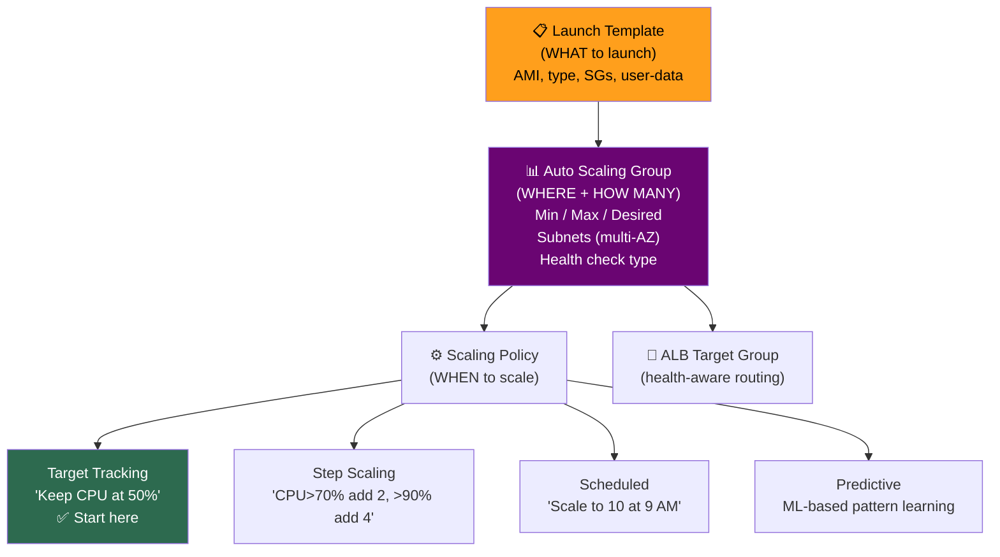
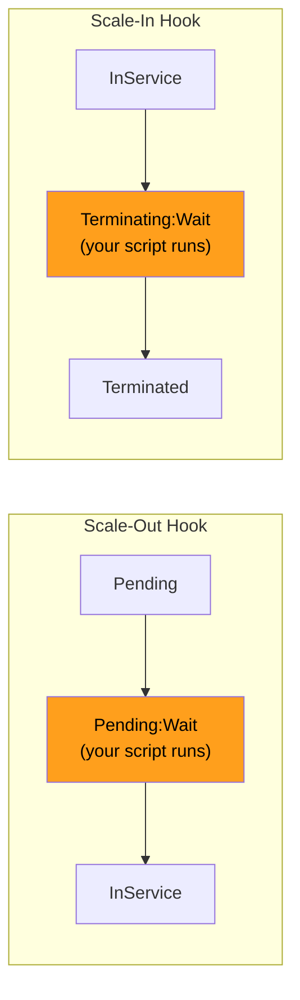

# EC2 Lifecycle, Pricing & Auto Scaling

## Instance Lifecycle

### Action Comparison

| Action | EBS Root | Public IP | Instance Store | Host |
|--------|---------|-----------|---------------|------|
| **Stop** | Preserved | Released (new on start) | **LOST** | May change |
| **Terminate** | Deleted (default) | Released | LOST | Released |
| **Reboot** | Preserved | Preserved | Preserved | Same |
| **Hibernate** | Preserved + RAM dump | Released | LOST | May change |

> **[SDE2 TRAP] Hibernate:** RAM → encrypted EBS root. Processes resume on start (no full boot). Prerequisites: encrypted EBS root, RAM ≤ 150 GB, must enable **at launch time** (can't enable later).

---

## Pricing Models

| Model | Discount | Commitment | Best For |
|-------|---------|-----------|----------|
| **On-Demand** | 0% | None | Unpredictable, short workloads |
| **Reserved Instances** | Up to 72% | 1 or 3 years | Steady-state (always-on DBs, base capacity) |
| **Savings Plans** | Up to 72% | $/hr, 1-3 years | **Flexible** — across families, regions, Fargate, Lambda |
| **Spot** | Up to 90% | None, 2-min reclaim | Fault-tolerant batch, CI/CD |
| **Dedicated Host** | Varies | Optional | Per-core licensing |

### Cost Optimization Strategy

### Savings Plans vs Reserved Instances

| | Savings Plans | Reserved Instances |
|--|--------------|-------------------|
| **Flexibility** | ✅ Across families, sizes, OS, regions | ❌ Locked to type + region (Standard) |
| **Covers** | EC2 + Fargate + Lambda | EC2 only |
| **Convertible** | Inherently flexible | Convertible RI exists but limited |
| **Recommendation** | ✅ Almost always better | Only if 100% certain of instance type |

> **[SDE2 TRAP]** *"Savings Plans are almost always better than RIs because of flexibility."* This signals modern cost optimization knowledge.

### Spot Instance Rules

| Rule | Detail |
|------|--------|
| **Savings** | Up to 90% off On-Demand |
| **Reclaim** | AWS gives **2-minute warning** via metadata or EventBridge |
| **Best practice** | Diversify across instance types + AZs to reduce interruption |
| **Allocation** | Use **capacity-optimized** (not lowest-price) for fewer interruptions |
| **Never** | Never run stateful workloads (DBs, caches) on Spot |
| **Use for** | Batch, CI/CD, data processing, training, any idempotent work |

---

## Auto Scaling

### Core Components

### Scaling Policies — When to Use Which

| Policy | Use When | Complexity |
|--------|---------|-----------|
| **Target Tracking** | Simple metric target (CPU, request count) | Low — start here |
| **Step Scaling** | Need different actions at different thresholds | Medium |
| **Scheduled** | Known traffic patterns (9-5 business hours) | Low |
| **Predictive** | Recurring patterns, ML can learn | Low (AWS managed) |

### Health Check Types

| Type | Checks | Catches | Default |
|------|--------|---------|---------|
| **EC2** | Is VM running? (HW/hypervisor) | Hardware failure | ✅ Yes |
| **ELB** | Does `/health` return 200? | App crashes, OOM, deadlocks | ❌ Must enable |

> **[SDE2 TRAP]** EC2 health check only = crashed app on running VM is "healthy." **Always use ELB health checks in production.**

### Lifecycle Hooks

| Hook | Use Cases |
|------|----------|
| **Scale-out** | Pull config from SSM, register with service discovery, warm cache |
| **Scale-in** | Drain connections, deregister from DNS, push final logs to S3 |

### Key ASG Behaviors

| Behavior | Detail |
|----------|--------|
| **Desired ≠ Running** | If instances unhealthy/pending, running < desired. ASG reconciles. |
| **AZ Rebalancing** | After AZ recovery, ASG may terminate healthy instances to rebalance. Surprises people. |
| **Cooldown** | Default 300s after scale event. Target Tracking manages automatically. |
| **Scale-in protection** | Protect specific instances (long batch jobs). Can prevent all scale-in if overused. |
| **Launch Template > Launch Config** | LC is legacy, immutable, no versioning. **Always say Launch Template.** |

---

## Interview Cheat Sheet

- Stop = EBS preserved, public IP lost, instance store lost. Terminate = gone (unless `DeleteOnTermination=false`).
- Hibernate = RAM → encrypted EBS. Fast resume. Must enable at launch.
- Cost: RI/Savings Plans (base) + On-Demand (buffer) + Spot (burst). **Savings Plans > RIs** for flexibility.
- Spot = 90% off, 2-min warning, diversify types/AZs, capacity-optimized allocation, never stateful.
- ASG = Launch Template + scaling policy + multi-AZ + **ELB health checks** (always).
- Target Tracking = simplest scaling. Start here. Step for finer control.
- Lifecycle hooks for bootstrap (scale-out) and graceful drain (scale-in).
- Launch Template > Launch Configuration. Always.
