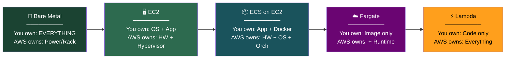
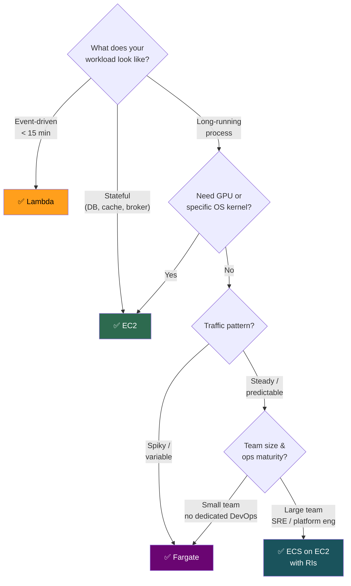
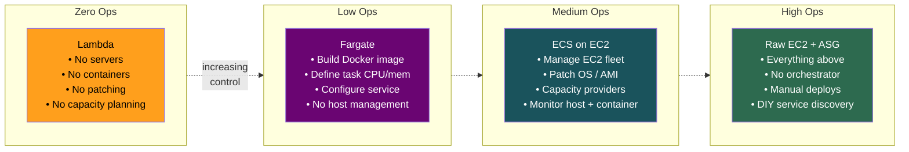
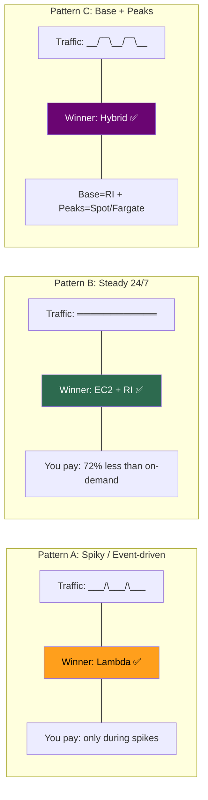
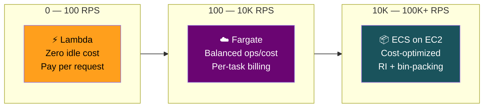
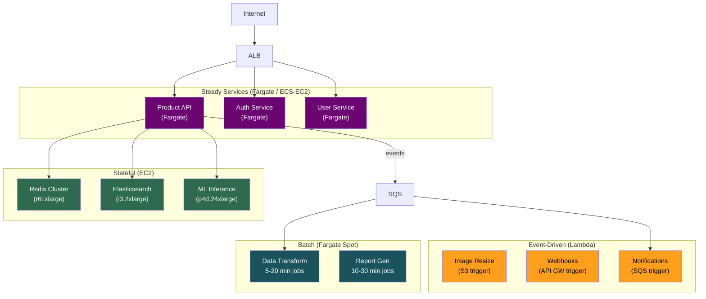
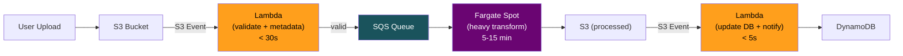
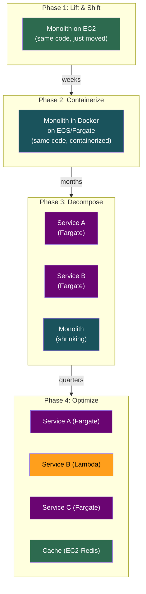
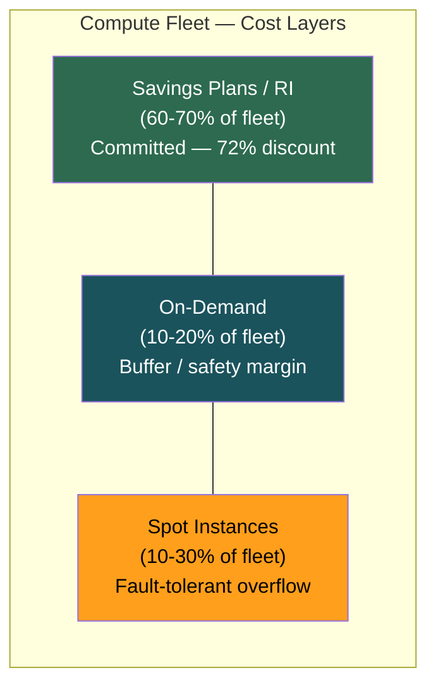
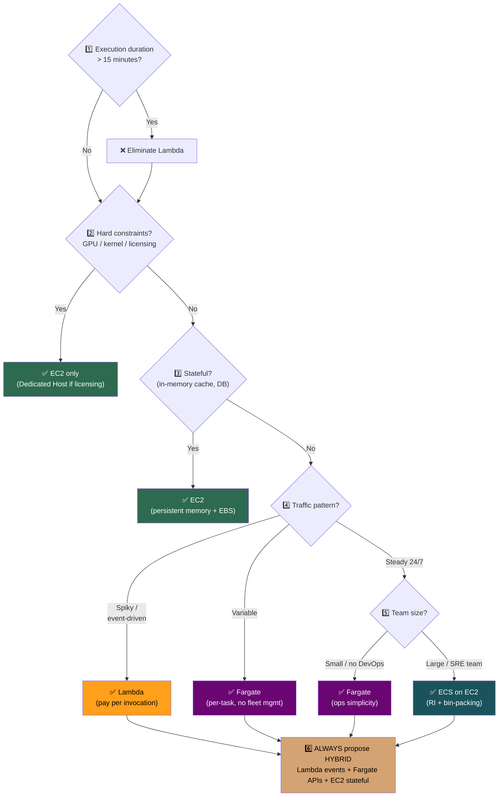

# EC2 vs ECS vs Fargate vs Lambda — Decision Framework & Architecture Patterns

## The Compute Spectrum

> ◄ **MORE CONTROL** ─────────────────── **MORE ABSTRACTION** ►

**Magic phrase:** "Match compute to workload — hybrid architectures win interviews."

---

## The Decision Matrix

| Scenario | Use This | Why |
|----------|----------|-----|
| Short event-driven task (<15 min) | **Lambda** | Pay per invocation, native triggers (S3, SQS, DynamoDB) |
| 24/7 API server, steady traffic | **ECS/Fargate** or **EC2** | Lambda per-ms billing too expensive at sustained RPS |
| Stateful process (in-memory cache, DB) | **EC2** | Persistent memory, local NVMe, full OS control |
| GPU workload (ML training/inference) | **EC2** (p/g family) | Fargate & Lambda have zero GPU support |
| Batch job, 5-60 min, fault-tolerant | **Fargate Spot** | Cheaper than Lambda, handles interruption via SQS redrive |
| Batch job, <15 min, embarrassingly parallel | **Lambda** | Massive parallelism, zero idle cost |
| Cron / Scheduled job, <15 min | **Lambda** + EventBridge rule | Simplest, zero infra |
| Cron / Scheduled job, >15 min | **Fargate** (ECS scheduled task) | No timeout limit |
| Microservices, small team (<10 devs) | **Fargate** | Zero infra management, per-task billing |
| Microservices, large fleet, steady load | **ECS on EC2** | Cost-optimized with RIs + bin-packing |
| Legacy monolith (8 GB+, slow boot) | **EC2** or **ECS on EC2** | Too heavy for Fargate/Lambda limits |
| Multi-cloud portability required | **EKS** (Kubernetes) | K8s is cloud-agnostic orchestration |
| Per-core licensed software (Oracle) | **EC2 Dedicated Host** | Socket/core placement control for licensing |
| HIPAA/PCI dedicated hardware | **EC2 Dedicated Instance** | Hardware isolation per-account |
| Real-time WebSocket / persistent conn | **ECS/Fargate** or **EC2** | Lambda max 15 min, no persistent connections |
| Ultra-low latency (<10ms p99) | **EC2** or **ECS on EC2** | No cold starts, kernel tuning possible |

---

## The Quick Decision Flow

---

## The Five Decision Axes (Deep Dive)

### Axis 1 — Workload Profile

| Characteristic | Lambda | Fargate | ECS on EC2 | EC2 |
|---------------|--------|---------|-----------|-----|
| Max execution time | 15 min | Unlimited | Unlimited | Unlimited |
| Max memory | 10 GB | 120 GB | Instance-limited | Instance-limited |
| Max vCPU | 6 | 16 | Instance-limited | Instance-limited |
| GPU support | ❌ | ❌ | ✅ | ✅ |
| Persistent state | ❌ | ❌ (ephemeral disk) | ✅ (EBS) | ✅ (EBS + instance store) |
| Custom kernel / OS | ❌ | ❌ | ✅ | ✅ |
| Docker socket access | ❌ | ❌ | ✅ | ✅ |
| Windows support | ❌ | ⚠️ Limited | ✅ | ✅ |

> **[SDE2 TRAP]** Fargate ephemeral storage = 20 GB default (expandable to 200 GB), but it's wiped when the task stops. For persistent container storage, mount **EFS** — it's the only option on Fargate. On ECS/EC2, you can use EBS directly.

### Axis 2 — Operational Burden

**The interview line:** *"We chose Fargate because our team is 6 engineers. Managing EC2 fleet patching, AMI pipelines, and capacity planning would consume ~30% of one engineer's time — more expensive than the Fargate pricing premium."*

### Axis 3 — Cost Structure

#### Traffic Pattern Determines Winner

#### Cost Comparison — 1000 RPS Sustained API (24/7)

| Compute | Config | Approx. Monthly Cost |
|---------|--------|---------------------|
| **Lambda** | 128 MB, 100ms avg, 1K RPS | ~$5,400 |
| **Fargate** | 0.5 vCPU + 1 GB × 4 tasks | ~$120 |
| **EC2 On-Demand** | m6i.large × 2 | ~$140 |
| **EC2 1-yr RI** | m6i.large × 2 | ~$85 |

> ⚠️ Lambda at sustained high RPS is **40-60× more expensive** than EC2/Fargate. But at 10 RPS avg with spikes to 200 RPS? Lambda wins massively because EC2 pays for idle.

#### Cost Crossover Points

| Transition | Approx. Crossover |
|-----------|-------------------|
| Lambda → Fargate is cheaper | ~**1M requests/day** (varies by memory + duration) |
| Fargate → ECS on EC2 is cheaper | Cluster utilization consistently **>70%** |
| On-Demand → Savings Plans worth it | Any workload running **>8 hours/day** |
| Spot worth the complexity | Fault-tolerant workloads with **>30% cost sensitivity** |

> **[SDE2 TRAP]** An interviewer asks: *"Which is cheaper, Lambda or Fargate?"* If you answer without asking about **traffic volume and pattern first**, you've already failed. The correct response is always: *"It depends — what's the request rate and traffic pattern?"*

### Axis 4 — Scaling Behavior

| Dimension | Lambda | Fargate | ECS on EC2 | EC2 ASG |
|-----------|--------|---------|-----------|---------|
| **Scale unit** | Single invocation | One task | One task (may need new instance) | One instance |
| **Scale speed** | Milliseconds | 30-60s | Seconds (capacity exists) → minutes (new instance) | 2-5 minutes |
| **Scale to zero** | ✅ Native | ✅ (desired=0) | ❌ Needs ≥1 instance | ❌ Slow restart from 0 |
| **Cold start** | 100ms-10s | 30-60s | Negligible (on existing host) | 2-5 min (full boot) |
| **Max concurrency** | 1000 default (increasable) | Account vCPU quota | Fleet size | Fleet size |
| **Granularity** | Per-request | 0.25 vCPU increments | Per-task | Per-instance |

> **[SDE2 TRAP]** Lambda has a **per-region concurrency limit** (default 1000). If Service A eats 900 concurrency during a spike, Service B (in the same account/region) is starved to 100. Solution: **Reserved Concurrency** per function — you already covered this in your Lambda modules. Fargate doesn't have this shared-limit problem.

### Axis 5 — Hard Constraints (Eliminators)

These are non-negotiable. If any apply, options are immediately eliminated:

| Hard Constraint | ❌ Eliminated |
|----------------|--------------|
| Needs GPU | Lambda, Fargate |
| Execution > 15 minutes | Lambda |
| Specific OS kernel / kernel module | Lambda, Fargate |
| HIPAA/PCI dedicated hardware | Lambda, Fargate → EC2 Dedicated |
| Must scale to zero (zero idle cost) | ECS on EC2 (practically) |
| Docker socket / privileged mode | Lambda, Fargate |
| Per-core software licensing | Lambda, Fargate → EC2 Dedicated Host |
| Windows containers | Lambda, Fargate (limited) |
| Sub-ms latency to VPC resources | Lambda (ENI attach adds latency on cold start) |

---

## Architecture Patterns

### Pattern 1: The Hybrid (The Answer Interviewers Want)

**Why this works:** Each workload is on its optimal compute type. Interviewers want to see you **justify each choice**, not put everything on one platform.

### Pattern 2: Image/Video Processing Pipeline

- **Lambda** for short validation/notification (event-driven, <1 min)
- **Fargate Spot** for heavy transform (too long for Lambda, fault-tolerant via SQS redrive, 70% cheaper than on-demand)
- **SQS** between them for buffering and retry

### Pattern 3: Monolith → Microservices Migration Path

> **[SDE2 TRAP]** If an interviewer says "migrate this monolith to Lambda," the correct answer is: *"I wouldn't go directly to Lambda. The realistic path is: EC2 → containerize → decompose into services → selectively move event-driven pieces to Lambda."* Jumping straight to serverless from a monolith = rewrite, not migration.

### Pattern 4: Cost-Optimized Steady Fleet

**Key rules:**
- **Base capacity** → Savings Plans (flexible across instance families, regions, even Fargate/Lambda)
- **Buffer** → On-Demand (no commitment, absorbs unexpected load)
- **Burst/batch** → Spot (90% savings, only for interruptible work)
- **Never run stateful workloads on Spot** — 2-minute termination notice isn't enough for DB flush

---

## Pricing Model Comparison

| Model | Discount | Commitment | Applies To |
|-------|---------|-----------|------------|
| **On-Demand** | 0% | None | EC2, Fargate, Lambda |
| **Savings Plans (Compute)** | Up to 72% | $/hr for 1 or 3 years | EC2 + Fargate + Lambda (all!) |
| **Savings Plans (EC2 Instance)** | Up to 72% | Locked to family + region | EC2 only |
| **Reserved Instances** | Up to 72% | 1 or 3 years, locked to type | EC2 only |
| **Spot** | Up to 90% | None, 2-min reclaim | EC2, Fargate Spot |

> **[SDE2 TRAP]** Compute Savings Plans are almost always better than RIs now because they apply across EC2, Fargate, AND Lambda. RIs only make sense if you're 100% locked into a specific instance type. Say this in interviews — it signals you understand modern cost optimization.

---

## ECS on EC2 vs Fargate — The Detailed Comparison

| Dimension | ECS on EC2 | Fargate |
|-----------|-----------|---------|
| Server management | You manage EC2 fleet | None — AWS manages |
| Pricing | Per-instance (even if idle) | Per-task (vCPU-sec + GB-sec) |
| Scaling | Scale instances + tasks separately | Just scale tasks |
| Startup time | Fast (task on existing host) | 30-60s (Firecracker microVM) |
| GPU support | ✅ | ❌ |
| Max resources | Limited by instance type | 16 vCPU / 120 GB |
| Networking | awsvpc, bridge, host modes | awsvpc only |
| Isolation | Process-level (shared kernel) | VM-level (Firecracker) |
| SSH / Debug | SSH into host, docker exec | ECS Exec (via SSM) |
| Persistent storage | EBS, instance store | EFS only (ephemeral default) |
| OS patching | You do it | AWS does it |
| Cost at scale | ✅ Cheaper (bin-packing + RIs) | More expensive |
| Cost at variable load | More expensive (idle capacity) | ✅ Cheaper (per-task) |

**Decision rule:** If utilization > 70% consistently → EC2 launch type. Below that → Fargate.

---

## Lambda vs Fargate — When to Pick Which

| Scenario | Lambda | Fargate |
|----------|--------|---------|
| Runtime < 15 min | ✅ | ✅ |
| Runtime > 15 min | ❌ | ✅ |
| Need > 10 GB RAM | ❌ | ✅ (up to 120 GB) |
| Need Docker ecosystem | ⚠️ (container images supported but limited) | ✅ Full Docker |
| Event-driven (S3, SQS, DynamoDB triggers) | ✅ Native triggers | ⚠️ Needs polling |
| HTTP API | ✅ via API Gateway / Function URLs | ✅ via ALB |
| Scale to zero | ✅ Native | ✅ (desired=0) |
| Cold start sensitivity | ⚠️ 100ms-10s | ⚠️ 30-60s |
| Sustained 1K+ RPS | ❌ Expensive | ✅ |
| Sidecar containers | ✅ (Lambda extensions, limited) | ✅ Full sidecar support |
| Complex deployment (blue/green, canary) | ⚠️ Lambda aliases + CodeDeploy | ✅ Full CodeDeploy |

---

## The Compute Decision Checklist (Use in System Design)

Before picking compute in any system design interview, walk through this flowchart:

---

## Senior-Level Gotchas

1. **"Just use Lambda for everything"** is a red flag. Interviewers want you to recognize Lambda's limits: 15-min timeout, cold starts, 10 GB memory cap, no GPU, expensive at sustained high RPS, hard to debug.

2. **"Just use Kubernetes"** is also a red flag unless justified. EKS has massive operational overhead. If you don't need multi-cloud portability or K8s-specific features (custom CRDs, Istio, Argo), ECS is simpler.

3. **Cost analysis without traffic pattern is meaningless.** "Lambda is cheaper" or "EC2 is cheaper" — both are wrong without context. Always ask about volume and pattern first.

4. **Fargate cold start is real.** ~30-60s to spin up (image pull + Firecracker boot). Keep images small (<200 MB), use ECR in the same region, and pre-provision tasks if latency-sensitive.

5. **Don't forget ECS Anywhere / Fargate on Outposts.** If asked about hybrid cloud (on-prem + AWS), ECS Anywhere runs ECS tasks on your own hardware. Niche but signals depth.

6. **Lambda@Edge / CloudFront Functions** exist for edge compute. If the workload is "transform HTTP requests at the CDN layer" or "A/B testing at the edge," this is the answer — not EC2 or Fargate.

7. **Savings Plans cover Lambda too.** Most candidates don't know this. Compute Savings Plans discount applies to Lambda duration charges. If you're running high-volume Lambda, this matters.

8. **The migration trap.** Never suggest rewriting a monolith to Lambda. The realistic path: EC2 → containerize (ECS) → decompose → selectively move event-driven pieces to Lambda over quarters, not weeks.

---

## Interview Cheat Sheet

- **Never answer "which compute?" without asking about traffic pattern, team size, and hard constraints first.**
- **Five axes:** workload profile, ops burden, cost structure, scaling behavior, hard constraints.
- **Lambda:** event-driven, <15 min, spiky/low traffic, scale-to-zero. Expensive at sustained high RPS.
- **Fargate:** containerized workloads, variable traffic, small teams, no GPU. Sweet spot for most microservices.
- **ECS on EC2:** large steady fleets, cost-optimized with RIs, GPU needs, maximum control.
- **Raw EC2:** stateful workloads (databases, caches), licensed software, kernel-level access.
- **Always propose a hybrid** in system design: Lambda for events + Fargate for APIs + EC2 for stateful.
- **Cost crossover:** Lambda → Fargate around ~1M req/day. Fargate → EC2 around >70% sustained utilization.
- **Migration path:** Monolith on EC2 → Containerize → Microservices → Selective Lambda.
- **EKS only when:** multi-cloud needed, K8s expertise exists on team, need K8s ecosystem (Istio, Argo, custom operators).
- **Savings Plans > Reserved Instances** for flexibility (applies to EC2 + Fargate + Lambda).
- **Spot Instances:** up to 90% off, 2-min reclaim, diversify across types/AZs, never for stateful workloads.

---

## Every System Design Must Address These 5 Compute Concerns

1. **Scaling strategy** — "Base on Savings Plans, buffer on On-Demand, burst on Spot/Fargate"
2. **Fault tolerance** — "Multi-AZ, health checks at every layer, circuit breakers on deploys"
3. **Cold start mitigation** — "Provisioned concurrency for Lambda, pre-provisioned tasks for Fargate, warm pools for EC2 ASGs"
4. **Cost optimization** — "Right-size instances, Savings Plans for base, Spot for batch, kill idle resources"
5. **Deployment safety** — "Blue/green via CodeDeploy, canary traffic shifting, automatic rollback on error rate spike"
