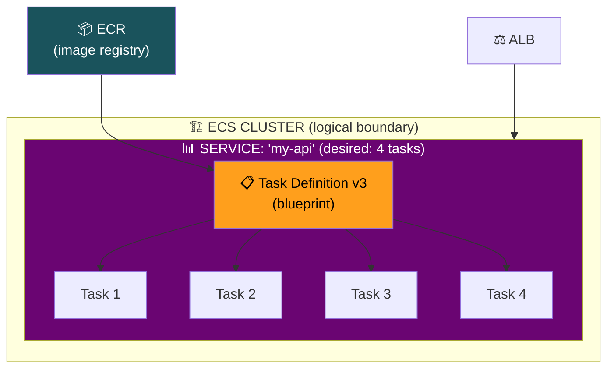
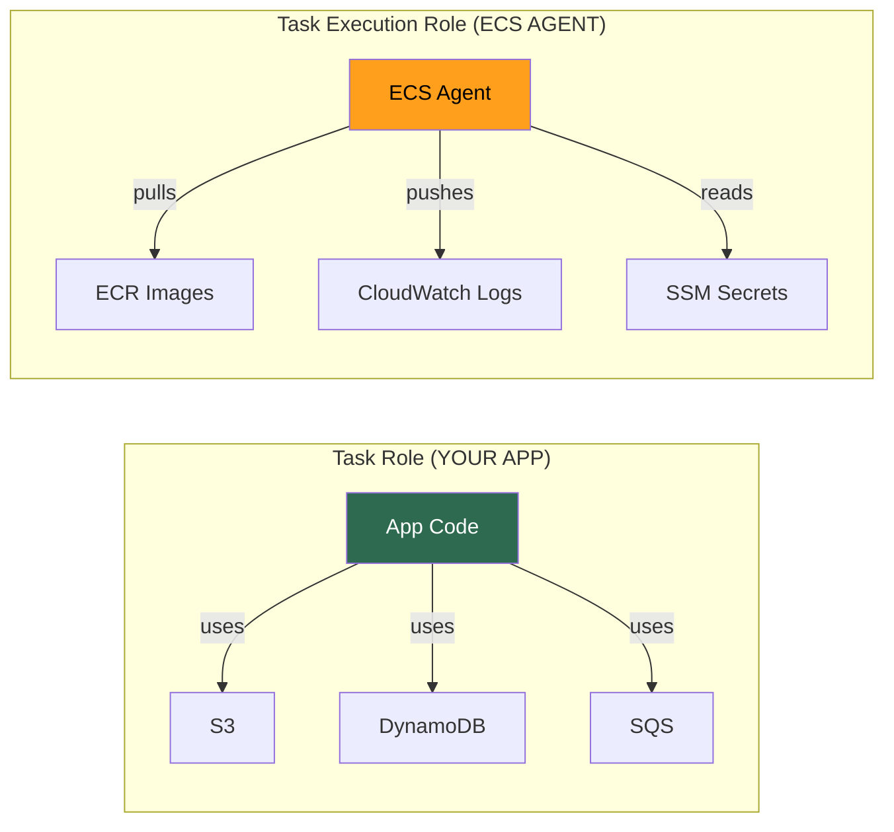
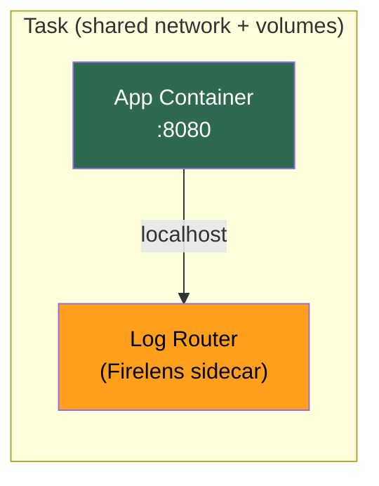

# ECS Architecture — Containers, ECR & Core Abstractions

## Why Containers Over VMs?

| | VM (EC2 + AMI) | Container (Docker) |
|--|---------------|-------------------|
| **Artifact** | AMI (~8 GB) | Docker image (~200 MB) |
| **Build time** | 5-15 min (bake AMI) | 30s-2 min |
| **Boot time** | 30-60s | < 1 second |
| **Isolation** | Hardware-level (hypervisor) | Process-level (shared kernel) |
| **Deploy cycle** | 15-35 min total | 3-7 min total |
| **Density** | 1 app per instance (typical) | Many containers per instance |

> **[SDE2 TRAP]** Containers share the host kernel → kernel exploit in one container can compromise all. This is why **Fargate uses Firecracker microVMs** for VM-level isolation at container speed.

---

## ECR (Elastic Container Registry)

AWS's private Docker Hub. Key points:

| Feature | Detail |
|---------|--------|
| **Access** | Private by default, IAM-integrated (no Docker Hub creds) |
| **Scanning** | Automatic CVE detection on push |
| **Lifecycle policies** | Auto-delete old/untagged images (cost savings) |
| **Cross-region replication** | Push once → replicate to other regions |
| **Immutable tags** | Optional — prevent overwriting `:latest` (enforce unique tags) |

---

## ECS Core Abstractions

### 1. Cluster

- **Logical boundary** — just a namespace, no infrastructure by itself
- Can hold multiple services or one per cluster — organizational choice

### 2. Task Definition

Immutable blueprint (like Docker Compose). Defines:

| Field | What It Is |
|-------|-----------|
| **Image** | Which container image (ECR URI + tag) |
| **CPU / Memory** | Resources per container (CPU in units: 1024 = 1 vCPU) |
| **Port mappings** | Container port → host/network port |
| **Environment vars** | Static config (non-sensitive) |
| **Secrets** | `valueFrom` → SSM Parameter Store or Secrets Manager |
| **Task Role** | IAM role for **your app code** (S3, DynamoDB access) |
| **Task Execution Role** | IAM role for **ECS agent** (pull ECR image, push logs) |
| **Log config** | CloudWatch Logs, Firelens |
| **Volumes** | Bind mounts, EFS, ephemeral |

> Every change creates a new **revision** (v1, v2, v3...). Cannot edit in place.

### Task Role vs Task Execution Role

| | Task Role | Task Execution Role |
|--|-----------|-------------------|
| **Who uses it** | Your application code | ECS agent / platform |
| **For what** | Calling S3, DynamoDB, SQS | Pulling ECR images, pushing CloudWatch logs |
| **Analogy** | Employee's access badge | HR system that onboards employee |

> **[SDE2 TRAP]** Interviewers love asking this distinction. Mixing them up = red flag.

### 3. Task

Running instance of a Task Definition (class → object).

**Multi-container tasks (sidecar pattern):**

Containers in same task share: **network** (localhost), **storage** (volumes), **lifecycle** (start/stop together).

### 4. Service

Long-running controller = **ASG for containers**.

| What It Does | Detail |
|-------------|--------|
| Maintains desired count | Ensures N tasks always running |
| ALB integration | Auto-registers/deregisters tasks from target group |
| Rolling deploys | Updates tasks to new task definition revision |
| Restarts crashes | Replaces failed tasks automatically |

**Service vs Standalone Task:**

| | Service | Standalone Task |
|--|---------|----------------|
| **Lifetime** | Long-lived (always running) | Run and exit |
| **Use** | Web servers, APIs, workers | Batch jobs, migrations, cron |
| **Restart** | Auto-replaced on crash | No restart |

---

## Key Gotchas

1. **Task Def is immutable** — new change = new revision. Update service to use new revision.
2. **CPU/Memory units matter** — CPU in units (1024=1 vCPU), memory in MiB. Wrong values = `RESOURCE:MEMORY` placement errors.
3. **Service ≠ Task Def** — creating revision v5 doesn't update the service. Must explicitly update service to use v5.
4. **Never put secrets in env vars directly** — visible in console. Use `valueFrom` with SSM/Secrets Manager.

---

## Interview Cheat Sheet

- Container = process isolation, shared kernel, MB-size, sub-second boot.
- ECR = private registry, IAM auth, image scanning, lifecycle policies, cross-region replication.
- ECS hierarchy: **Cluster → Service → Task → Container(s)**.
- Task Definition = immutable blueprint with revisions. CPU in units (1024=1 vCPU).
- Task Role (app permissions) vs Task Execution Role (ECS agent permissions) — **know the difference**.
- Service = "keep N tasks running" + ALB + rolling deploy. Like an ASG for containers.
- Multi-container tasks = sidecar pattern. Share network (localhost) and volumes.
- Standalone tasks for batch/cron. Services for long-running workloads.
