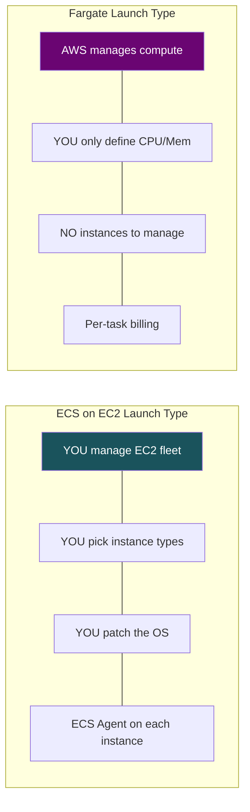
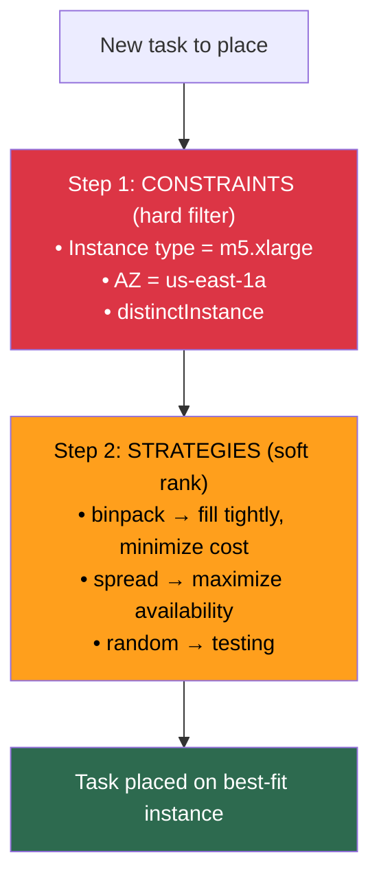
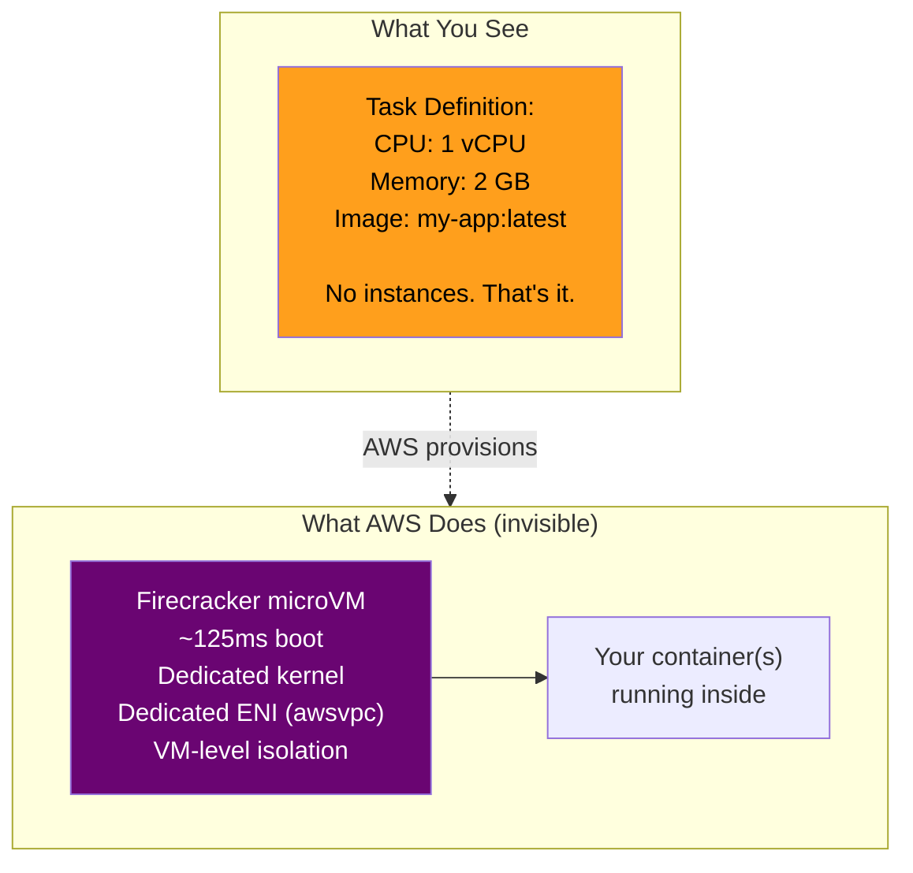

# ECS Launch Types — EC2 vs Fargate

## The Two Modes

---

## ECS on EC2 — Key Concepts

### Task Placement

**Production pattern:** Spread across AZs + binpack within each AZ = best balance of availability and cost.

### Capacity Providers

Modern way to auto-scale the EC2 fleet for ECS:

| Concept | Detail |
|---------|--------|
| **What** | Links ASG to ECS cluster. ECS tells ASG how many instances it needs. |
| **Target capacity %** | 100% = tight packing. 80% = headroom for burst. |
| **Managed scaling** | ECS auto-scales the ASG based on task demand |
| **Managed termination protection** | Won't terminate instances with running tasks |

---

## Fargate — Key Concepts

### Under the Hood

**Firecracker** = AWS open-source lightweight VMM. Each Fargate task = its own microVM with dedicated kernel. Same tech as Lambda. VM-level isolation, container-level speed.

### Resource Allocation (fixed combos)

| vCPU | Memory Options |
|------|---------------|
| 0.25 | 0.5, 1, 2 GB |
| 0.5 | 1–4 GB |
| 1 | 2–8 GB |
| 2 | 4–16 GB |
| 4 | 8–30 GB |
| 8 | 16–60 GB |
| 16 | 32–120 GB |

> App needs 3 vCPU? You pay for 4. Not arbitrary sizing.

---

## Head-to-Head Comparison

| Dimension | ECS on EC2 | Fargate |
|-----------|-----------|---------|
| Server management | You manage fleet | None |
| Pricing | Per-instance (even if idle) | Per-task (vCPU-sec + GB-sec) |
| Scaling | Scale instances + tasks | Just scale tasks |
| Startup | Fast (on existing host) | 30-60s (microVM boot) |
| GPU | ✅ | ❌ |
| Max resources/task | Instance-limited | 16 vCPU / 120 GB |
| Networking | awsvpc, bridge, host | awsvpc only |
| Isolation | Process-level (shared kernel) | VM-level (Firecracker) |
| Debug | SSH + docker exec | ECS Exec (SSM) |
| Storage | EBS, instance store | Ephemeral (20-200 GB) + EFS |
| OS patching | You | AWS |
| Cost at steady scale | ✅ Cheaper (binpack + RIs) | More expensive |
| Cost at variable load | Expensive (idle) | ✅ Cheaper (per-task) |

**Decision rule:** Utilization >70% consistently → EC2. Below that → Fargate.

---

## Real-World Patterns

**Startup (5 engineers, 12 microservices):**
- Fargate for everything. No time for fleet management.
- ~30% more expensive, but engineer time saved >> cost premium.

**Enterprise (50 engineers, 200 microservices):**
- **EC2 launch type** for core steady services (RI-eligible, binpacked)
- **Fargate** for cron, async processors, dev/staging (bursty, variable)
- **Fargate Spot** for batch (70% off, SQS handles interruptions)

---

## Key Gotchas

1. **Fargate cold start:** ~30-60s. Keep images small (<200 MB), use ECR same region.
2. **Fargate ephemeral storage:** 20 GB default (expandable 200 GB). Gone on task stop. Use EFS for persistent.
3. **Fargate limitations:** No privileged mode, no docker exec (use ECS Exec), no host networking, no custom runtime.
4. **EC2: ECS Agent can die.** Tasks keep running but can't be managed. Use ECS-optimized AMI.
5. **Fargate Spot:** 2-min SIGTERM before interruption. Handle graceful shutdown.

---

## Interview Cheat Sheet

- EC2 launch type: you manage fleet, patch, scale instances. Use Capacity Providers.
- Fargate: serverless containers. Firecracker microVMs. Per-task billing. No GPU.
- Task placement: constraints (filter) → strategies (rank). **Spread AZs + binpack within.**
- Fargate = **VM-level isolation** (Firecracker), not process-level. Same tech as Lambda.
- Cost crossover: EC2 wins at >70% utilization with RIs. Fargate wins for variable/bursty.
- Fargate Spot = 70% off, 2-min SIGTERM. Use for fault-tolerant batch.
