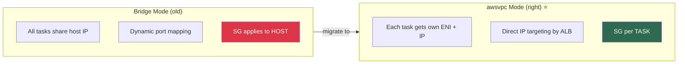
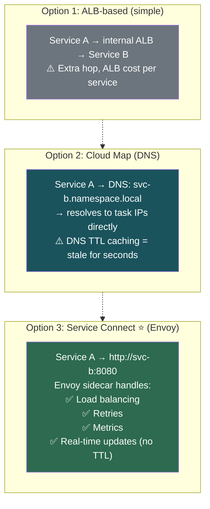
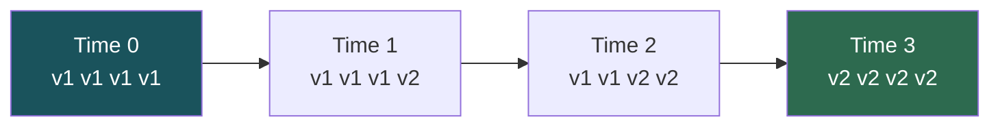
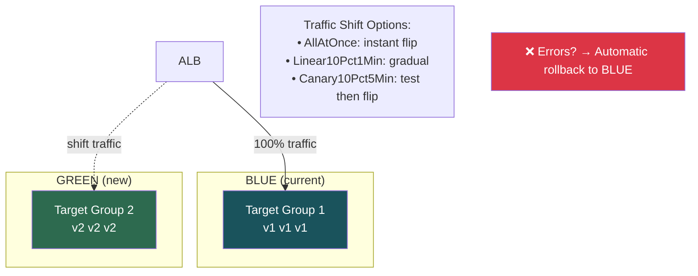
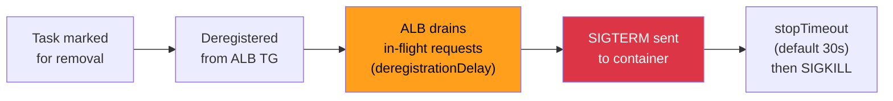

# Container Ops — Networking, Deployments & Reliability

## Networking Modes

| Mode | IP Per... | SG Per... | Fargate? | Use |
|------|----------|----------|----------|-----|
| **awsvpc** ⭐ | Task (own ENI) | Task | ✅ Required | **Default — use this** |
| **bridge** | Host (mapped ports) | Host | ❌ | Legacy EC2 setups |
| **host** | Host (direct) | Host | ❌ | Ultra-low latency |

### Why awsvpc Wins



> **[SDE2 TRAP] ENI limits:** Each instance type has max ENI count (e.g., `m5.large` = 3 ENIs → only 2 awsvpc tasks). **Enable ENI trunking** (`ECS_ENABLE_TASK_ENI_TRUNKING`) to get ~120 ENIs per Nitro instance.

---

## Load Balancer Integration

| Feature | Detail |
|---------|--------|
| **Dynamic registration** | ECS auto-registers/deregisters tasks from target group |
| **Health checks** | ALB pings `/health` → unhealthy → ECS replaces task |
| **Deregistration delay** | Drains connections for N seconds before killing task (default 300s) |
| **Multiple TGs** | One service can register with internal + external ALBs |

### ALB vs NLB

| | ALB | NLB |
|--|-----|-----|
| **Layer** | 7 (HTTP/HTTPS) | 4 (TCP/UDP) |
| **Path routing** | ✅ `/api/*` → service A | ❌ |
| **gRPC** | ✅ (HTTP/2) | ✅ (TCP passthrough) |
| **Static IP** | ❌ | ✅ |
| **Latency** | ~ms higher | Ultra-low |
| **Use** | 90% of microservices | gRPC, IoT, gaming, static IP |

---

## Service Discovery — How Services Find Each Other



> **[SDE2 TRAP]** Service Connect is the modern answer for "how do ECS services talk?" It uses Envoy proxy sidecars injected automatically. Zero app code changes, built-in metrics, no DNS staleness.

### Service Connect vs Cloud Map vs ALB

| | Service Connect ⭐ | Cloud Map | ALB |
|--|-------------------|-----------|-----|
| Mechanism | Envoy sidecar proxy | DNS (Route 53) | Load balancer |
| Staleness | Real-time | DNS TTL (seconds) | Real-time |
| Load balancing | Client-side (round-robin, least-conn) | Random (DNS) | Server-side |
| Metrics | Built-in (CloudWatch) | None | ALB metrics |
| Cost | Included | Route 53 pricing | ALB hourly + LCU |
| App changes | None | None | None |
| Retries | Automatic | App must implement | App must implement |

---

## Deployment Strategies

### 1. Rolling Update (ECS Default)



| Parameter | What It Controls | Production Setting |
|-----------|-----------------|-------------------|
| **minimumHealthyPercent** | How many old tasks must stay alive | 100% (no capacity loss) |
| **maximumPercent** | How many total tasks (old + new) | 200% (double during deploy) |

> min=100% + max=200% = launch all new tasks first, then drain old. Zero capacity loss. Costs 2× temporarily.

> ⚠️ min=100% + max=100% = **deadlock** — can't start new (at max) and can't kill old (at min). Nothing happens.

### 2. Blue/Green (via CodeDeploy)



**Blue/Green advantages over Rolling:**
- **Instant rollback** — flip ALB back to blue target group
- **Canary testing** — 10% traffic to new, monitor, then proceed
- **No mixed versions** serving simultaneously

> **[SDE2 TRAP]** Blue/Green requires **CodeDeploy** integration. ECS service must use `CODE_DEPLOY` deployment controller. Needs `appspec.yml` + 2 pre-configured target groups on ALB.

---

## Reliability

### Health Checks — Three Layers

| Layer | What | Catches |
|-------|------|---------|
| **Container** | `HEALTHCHECK` in Dockerfile (curl /health) | App-level: OOM, deadlock |
| **ELB** | ALB pings `/health` on task IP | Network issues, port binding |
| **Service** | ECS ensures desired count | Crashed/missing tasks |

> Use ALL three layers. Set `startPeriod` (container HC grace) + `healthCheckGracePeriodSeconds` (ECS service) to avoid false positives during slow boot.

### Circuit Breaker (Deployment Protection)

| | Without Circuit Breaker | With Circuit Breaker |
|--|------------------------|---------------------|
| Bad deploy | Task crashes → ECS replaces → crashes → infinite loop | Task crashes → threshold hit → **auto-rollback** |
| Cost | Burning money, filling logs | Minimal — reverts quickly |

```json
"deploymentCircuitBreaker": {
    "enable": true,
    "rollback": true
}
```

> **[SDE2 TRAP]** This is the **deployment** circuit breaker (>50% task failures → rollback). Don't confuse with app-level circuit breakers (Hystrix/Resilience4j).

### Connection Draining Sequence



**Production settings:**
- `deregistrationDelay` = match longest request (60s for APIs, 300s for long-polling)
- `stopTimeout` ≥ 15s for graceful shutdown (flush logs, close DB conns)
- **Handle SIGTERM in your app** — don't ignore it

---

## Key Gotchas

1. **ENI trunking must be opted-in** per account. Without it, awsvpc tasks are severely limited by instance ENI count.
2. **Blue/Green needs TWO target groups** pre-configured on ALB. Missing = hours wasted debugging.
3. **Service Connect + ALB are complementary** — ALB for external traffic, Service Connect for internal service-to-service.
4. **Health check race condition** — app takes 30s to boot but ALB checks immediately → false unhealthy. Set `healthCheckGracePeriodSeconds`.
5. **Rolling with min=100% max=100%** = deadlock. Need `max > 100%` OR `min < 100%`.

---

## Interview Cheat Sheet

- **awsvpc** = one ENI per task = per-task SG + IP. Required for Fargate. Enable ENI trunking on EC2.
- ALB for HTTP (90%). NLB for TCP/UDP, gRPC, static IP.
- Service-to-service: **Service Connect** (Envoy, real-time) > Cloud Map (DNS, TTL) > ALB (extra hop/cost).
- Rolling: min/max % controls. **min=100% max=200%** for zero-downtime. Blue/Green: instant rollback, canary, needs CodeDeploy + 2 TGs.
- Circuit breaker: auto-rollback on >50% failure. Don't confuse with app-level circuit breakers.
- Health checks at 3 layers: container + ELB + service. Set grace periods to avoid false positives.
- Connection draining: `deregistrationDelay` + SIGTERM handling + `stopTimeout`.
