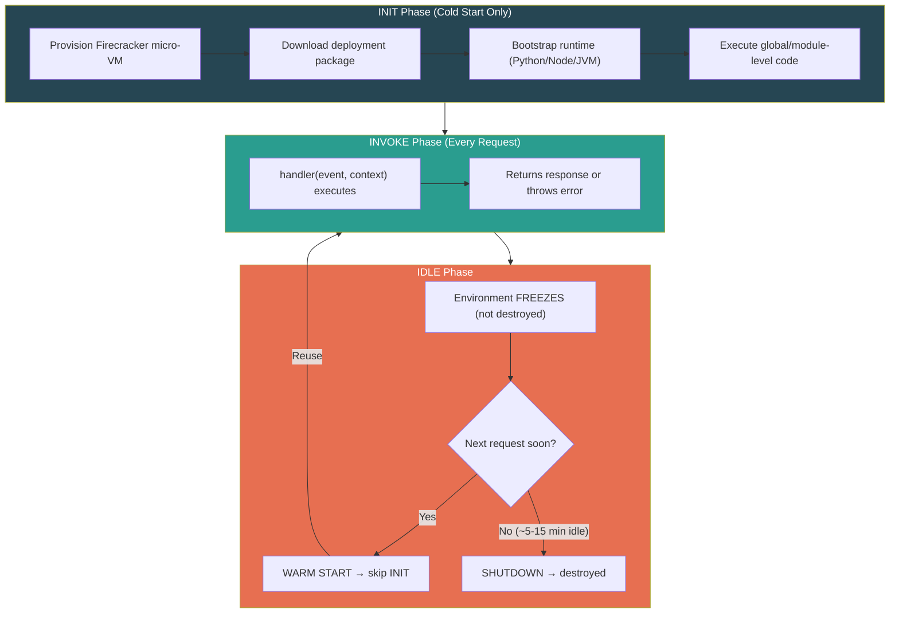
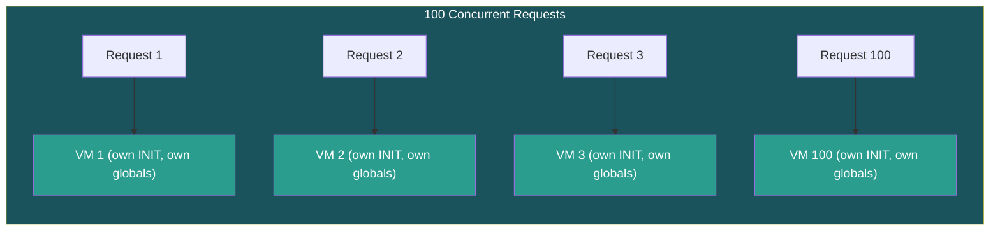

# AWS Lambda — Serverless & Execution Model

## What is Serverless?

Serverless = **you don't manage servers.** AWS handles provisioning, patching, scaling, retirement. You deploy code + trigger.

| Flavor | Meaning | Examples |
|--------|---------|----------|
| **BaaS** | Managed services you consume | DynamoDB, S3, Cognito |
| **FaaS** | Deploy a function, runs per event | **AWS Lambda** |

> **Key mental shift:** Stop thinking in servers. Think in **events → functions → outputs.**

### Responsibility Spectrum

| Layer | EC2 | ECS/Fargate | Lambda |
|-------|-----|-------------|--------|
| Hardware | AWS | AWS | AWS |
| OS / Patching | **You** | AWS | AWS |
| Runtime | **You** | **You** | AWS |
| Scaling | **You** | Semi-auto | AWS |
| Code | **You** | **You** | **You** |

---

## Lambda Execution Lifecycle

Lambda runs inside **Firecracker micro-VMs** (same tech behind Fargate).



---

## Cold Start vs Warm Start

| | Cold Start | Warm Start |
|--|-----------|------------|
| **When** | First request, scale-up, or after idle timeout | Subsequent request to an existing environment |
| **Phases** | INIT + INVOKE | INVOKE only |
| **Latency** | ~100ms (Python/Node) to ~2-10s (Java/.NET) | ~ms (handler only) |
| **Global scope** | Runs (imports, clients, connections) | **Skipped — reuses cached values** |

### The Golden Rule

> **Anything in global scope (outside the handler) runs ONCE during INIT and gets reused across warm invocations.**

```python
import boto3                          # ← Runs during INIT (once)
s3 = boto3.client('s3')              # ← SDK client reused across invocations
http_session = requests.Session()     # ← Connection pool reused

def handler(event, context):          # ← Runs every invocation
    paper_url = event['url']
    pdf = http_session.get(paper_url)
    s3.put_object(Bucket='papers', Key=f"{event['id']}.pdf", Body=pdf.content)
    return {'status': 'downloaded'}
```

---

## The `event` and `context` Objects

| Argument | What it is | Key attributes |
|----------|-----------|----------------|
| `event` | Trigger payload (JSON dict). **Shape varies per event source.** | S3 event ≠ API GW event ≠ SQS event |
| `context` | Runtime metadata injected by AWS | `function_name`, `memory_limit_in_mb`, `aws_request_id`, `get_remaining_time_in_millis()` |

---

## Concurrency = Separate Environments



> ⚠️ **Warm reuse is sequential only.** 100 concurrent requests = 100 separate environments, each with its own INIT. DB connection pool in global scope? That's 100 separate pools. This is why **RDS Proxy** exists.

---

## ⚠️ Gotchas & Edge Cases

1. **Global state is SHARED across warm invocations.** Mutating a global list → next invocation sees the mutation. Treat globals as **read-only caches**, not mutable state.
2. **`/tmp` persists between warm invocations.** 512MB default (up to 10GB). Leftover files from previous invocations will be there.
3. **Firecracker micro-VM ≠ container.** Even container image deployments run inside Firecracker VMs. Container image is just a packaging format.
4. **`context.get_remaining_time_in_millis()`** — Check before expensive operations to avoid hard timeout kills mid-write.
5. **Environment reuse is non-deterministic.** Never rely on it for correctness, only for performance.

> **[SDE2 TRAP]** "Is Lambda stateless?" — The *invocation* is stateless, but the *execution environment* is stateful (global vars, /tmp, connections). Use statefulness for performance optimization, never for correctness.

---

## 📌 Interview Cheat Sheet

- Lambda = FaaS on **Firecracker micro-VMs** (not containers, not EC2)
- Three phases: **INIT → INVOKE → SHUTDOWN**
- Cold start: ~100ms (Python/Node) to ~2-10s (Java/.NET)
- **Global scope = init-once, reuse-many** — #1 optimization pattern
- Max timeout: **15 minutes** (hard limit)
- Max memory: **10,240 MB**
- Each concurrent request = separate environment = separate everything
- Warm reuse is **non-deterministic** — never rely on it for correctness
