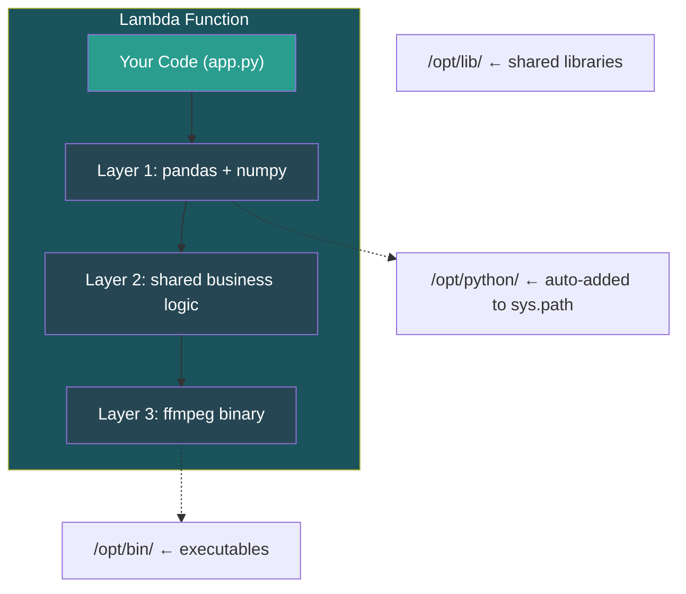
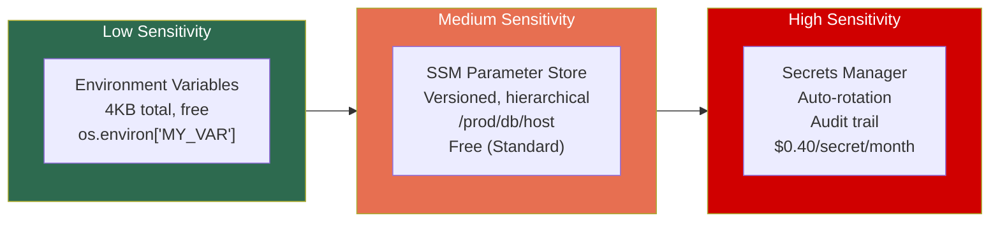

# AWS Lambda — Runtime, Packaging & Configuration

## The Handler — Lambda's Entry Point

Every Lambda has a handler — the function AWS invokes. Configured as `filename.function_name`.

```python
# File: app.py  |  Handler config: app.handler
def handler(event, context):
    return {"statusCode": 200, "body": "Hello"}
```

> **[SDE2 TRAP]** `event` has no universal schema. Every event source sends a different structure. Always validate/parse the event immediately (Pydantic, schema library). Blindly accessing `event['Records'][0]` causes outages.

---

## Runtimes

| Category | What | Examples |
|----------|------|----------|
| **AWS-Managed** | AWS patches & updates runtime layer | Python 3.9–3.13, Node 18–22, Java 17/21, .NET 8, Ruby 3.3 |
| **Custom Runtime** (`provided.al2023`) | Bring ANY language | Rust, Go, C++, Bash |

**Custom Runtime contract:** Your binary implements a polling loop that calls `http://${AWS_LAMBDA_RUNTIME_API}/2018-06-01/runtime/invocation/next` for events.

> Go and Rust are popular custom runtimes — tiny binaries, near-zero cold starts.

---

## Three Ways to Ship Code

### Option 1: ZIP Package

```
my-function.zip
├── app.py              ← handler
├── utils/              ← your modules
└── requests/           ← bundled dependencies
```

- Direct upload ≤ 50MB, via S3 ≤ **250MB unzipped** (hard ceiling)
- Simple, fast deploys

### Option 2: Container Image

```dockerfile
FROM public.ecr.aws/lambda/python:3.12
COPY app.py requirements.txt ./
RUN pip install -r requirements.txt
CMD ["app.handler"]
```

- Push to **ECR**, point Lambda at image
- Up to **10GB** image size
- Uses Lambda's **Runtime Interface Client (RIC)** — still runs in Firecracker VM
- Great for: ML models, heavy native deps, Docker-native teams

### Option 3: Lambda Layers



- Max **5 layers** per function, **250MB total** (layers + function combined)
- Shared across functions — deploy once, reuse everywhere
- **Versioned and immutable** — each publish creates a new version number

### Decision Matrix

| Scenario | Use |
|----------|-----|
| Simple function, few deps | **ZIP** |
| Heavy deps, ML models, >250MB | **Container Image** |
| Shared deps across many functions | **Layers** |
| Non-standard language (Rust, Go) | **Custom runtime** on `provided.al2023` |

---

## Configuration — Env Vars, Secrets & Parameters



### Tier Comparison

| Feature | Env Vars | SSM Parameter Store | Secrets Manager |
|---------|----------|-------------------|-----------------|
| **Cost** | Free | Free (Standard) / Paid (Advanced) | $0.40/secret/mo + API calls |
| **Size** | 4KB total all vars | 4KB (Std) / 8KB (Adv) | 64KB |
| **Rotation** | Manual redeploy | Manual | **Auto-rotation** (RDS, Redshift) |
| **Audit** | Limited | CloudTrail | **Full CloudTrail** |
| **Visibility** | Plaintext in console | Encrypted | Encrypted + ACL |
| **Best for** | Stage, log level, flags | DB host, config values | DB passwords, API keys, tokens |

### Production Pattern — Fetch at INIT, Cache Globally

```python
import boto3, os

# ✅ INIT: Fetch once, reuse across invocations
ssm = boto3.client('ssm')
db_host = ssm.get_parameter(Name='/prod/db/host')['Parameter']['Value']

secrets = boto3.client('secretsmanager')
db_creds = secrets.get_secret_value(SecretId='prod/db/creds')

def handler(event, context):
    # ✅ Uses cached values — no API calls per invocation
    connect_to_db(db_host, db_creds)
```

> **[SDE2 TRAP]** "Why not put DB password in env var?" — Env vars show up in **plaintext** in the Lambda console to anyone with `lambda:GetFunctionConfiguration` permission. Secrets Manager adds access control, audit trails, and rotation. Env vars for prod secrets = security smell.

---

## ⚠️ Gotchas & Edge Cases

1. **Layer order matters.** Two layers with same file path → **last layer wins.** Silent dependency version conflicts.
2. **Container image cold starts ~2-3x slower than ZIP.** AWS caches aggressively, but initial ECR pull is heavier. Use provisioned concurrency if latency matters.
3. **`/opt/python` must match runtime.** Layer built on Python 3.11 with C extensions will segfault on 3.13. Build in matching Amazon Linux environment.
4. **Secrets Manager caching.** If secret rotates mid-execution, cached value is stale. Use `aws-secretsmanager-caching` library (TTL-based refresh, default 1 hour).
5. **4KB env var limit is TOTAL**, not per variable. Large JSON blobs silently fail at deploy.

---

## 📌 Interview Cheat Sheet

- Handler = `filename.function_name`, receives `event` + `context`
- ZIP ≤ 250MB unzipped, Container ≤ 10GB, max 5 layers
- Container images still run in **Firecracker**, not Docker — packaging format only
- Custom runtime = implement **Lambda Runtime API** polling loop
- Env vars: 4KB total, visible in console → **never put production secrets here**
- SSM for config, Secrets Manager for secrets — both fetched at INIT, cached globally
- Secrets Manager differentiator: **automatic rotation** + CloudTrail audit
- Layers are **immutable & versioned** — publish creates new version, old functions pin to old versions
