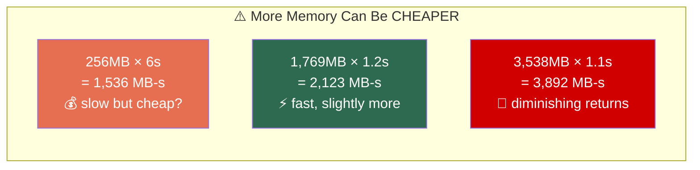
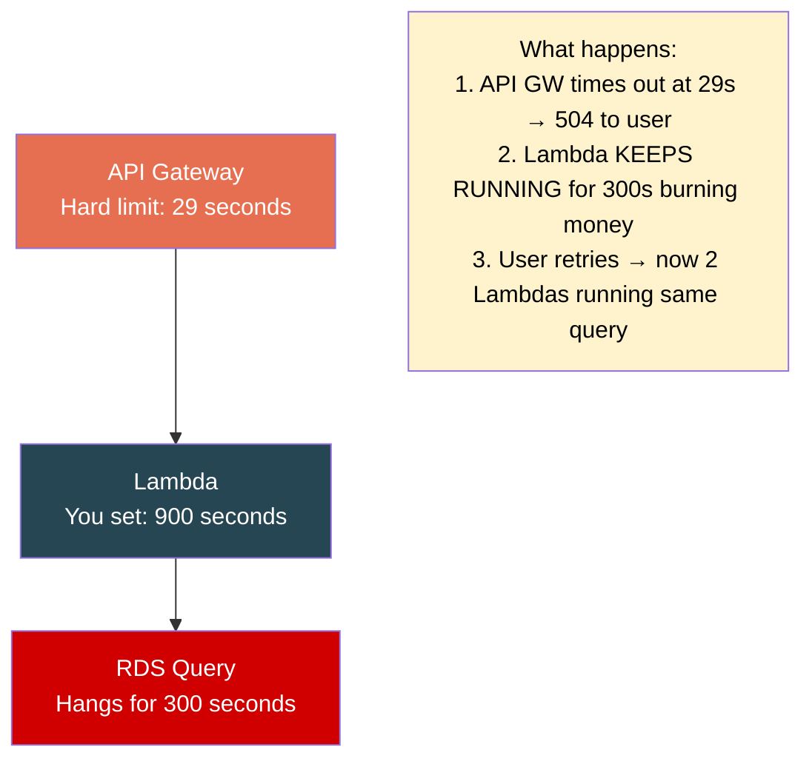
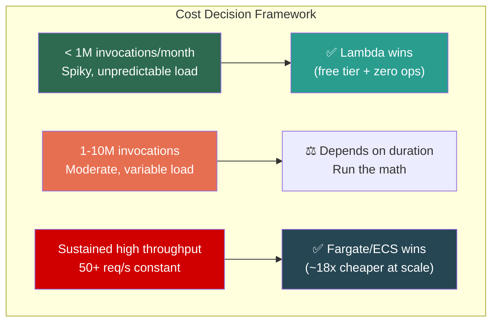

# AWS Lambda — Memory, CPU, Timeout & Cost

## The Memory-CPU Coupling

In Lambda, you **only configure memory**. CPU is coupled linearly:

| Memory | vCPUs | Multi-thread benefit? |
|--------|-------|----------------------|
| 128 MB | ~1/10th vCPU | ❌ |
| 512 MB | ~1/3 vCPU | ❌ |
| **1,769 MB** | **1 full vCPU** | ❌ (single core) |
| 3,538 MB | 2 vCPUs | ✅ parallel threads work |
| 5,307 MB | 3 vCPUs | ✅ |
| 10,240 MB | 6 vCPUs | ✅ |

> ⚠️ **1,769 MB = 1 full vCPU** — the magic number. Memorize it.

### The Non-Obvious Cost Optimization



> **[SDE2 TRAP]** "More memory = more expensive" is WRONG for CPU-bound functions. Cost = Memory × Time. If time drops faster than memory rises, **total cost decreases.**

### Network Bandwidth Also Scales with Memory

At 128MB you get terrible network throughput. Bumping memory improves download speed even if you don't need the RAM or CPU.

---

## Timeout Strategy

| Setting | Value |
|---------|-------|
| Minimum | 1 second |
| Maximum | **15 minutes (900s)** — hard limit, no exceptions |
| Default | 3 seconds |

### How to Set Timeout Correctly

```
Ideal timeout = P99 execution time × 2-3x safety margin
Example: P99 is 4 seconds → set timeout to 10-12 seconds
```

### The Timeout Hierarchy Trap



> ⚠️ **Never set timeout to 900s "just to be safe."** Stuck functions burn money. Downstream callers have their own timeouts. Set tight, not max.

### Timeout ≠ Graceful Shutdown

When Lambda times out, your code is **killed mid-execution.** No `finally` blocks, no cleanup. Use `context.get_remaining_time_in_millis()` to self-terminate gracefully.

---

## Cost Model

### Three Pricing Components

| Component | Rate | Notes |
|-----------|------|-------|
| **Requests** | $0.20 per 1M invocations | Flat per-request charge |
| **Duration** | $0.0000166667 per GB-second | Billed per **1ms** granularity |
| **Provisioned Concurrency** | $0.0000041667 per GB-second | For pre-warmed environments (24/7) |

**Free tier (permanent):** 1M requests + 400,000 GB-seconds per month.

### Real Cost Calculation

```
Function: 512MB, avg 200ms, 10M invocations/month

Requests:  10M × $0.20/M                        = $2.00
Duration:  10M × 0.2s × 0.5GB × $0.0000166667   = $16.67
                                          TOTAL  = $18.67/month
```

### When Lambda Gets Expensive

```
Function: 3GB, avg 10s, 5M invocations/month

Duration: 5M × 10s × 3GB × $0.0000166667 = $2,500/month  ← bill shock
```

> Long duration + high memory + high volume = **Lambda bill shock.** This is where containers win.

### The Cost Crossover



**Example at scale (50 req/s, 24/7, 2GB, 3s avg):**

| Platform | Monthly Cost |
|----------|-------------|
| Lambda | ~$12,986 |
| Fargate (10 tasks) | ~$711 |
| EC2 Reserved (3x c6g.xlarge) | ~$300 |

---

## Graviton (ARM) — Free Performance

| | x86_64 | arm64 (Graviton2) |
|--|--------|-------------------|
| Price | Baseline | **20% cheaper** |
| Performance | Baseline | **~15-25% faster** |
| Compatibility | Everything | Most things (watch C extensions) |

> Switch is **one config change.** Pure Python/Node/Java with no native binaries → zero reason not to use Graviton.

---

## Lambda Power Tuning

AWS open-source tool that runs your function at every memory setting and produces:

| Memory (MB) | Duration (ms) | Cost ($) | Verdict |
|-------------|---------------|----------|---------|
| 128 | 3200 | 0.0000068 | Too slow |
| 256 | 1700 | 0.0000072 | Still slow |
| 512 | 900 | 0.0000076 | Improving |
| 1024 | 480 | 0.0000082 | Good |
| **1769** | **310** | **0.0000091** | **⭐ Sweet spot** |
| 3008 | 290 | 0.0000145 | Diminishing returns |
| 10240 | 285 | 0.0000485 | Wasting money |

> **Sweet spot = where cost curve flattens while duration is acceptable.** Never guess — always power tune.

---

## ⚠️ Gotchas & Edge Cases

1. **1ms billing granularity.** Pre-2020 was 100ms (rounded up). Many old blog posts still reference 100ms. Use current 1ms numbers.
2. **Timeout ≠ billing input.** AWS charges for **actual execution time**, NOT the configured timeout. But oversized memory inflates every invocation's cost.
3. **Provisioned concurrency cost is 24/7.** 10 instances at 1GB = ~$108/month just for keeping warm, before any invocations.
4. **Ephemeral storage (`/tmp`) costs above 512MB.** Default 512MB free. Up to 10GB at $0.0000000309 per GB-second.
5. **Multi-threading only useful above 1,769 MB.** Below = single vCPU = parallel threads gain nothing.

---

## 📌 Interview Cheat Sheet

- Memory range: **128 MB to 10,240 MB** (1 MB increments)
- **1,769 MB = 1 full vCPU** — the magic number
- CPU scales **linearly** with memory — no separate CPU config
- Max timeout: **15 minutes / 900 seconds** — hard, non-negotiable
- Billing: per **1ms** granularity, measured as **GB-seconds**
- **Cost = Memory × Actual Execution Time** (NOT timeout)
- Graviton/ARM: **20% cheaper, ~20% faster** — one config flip
- Use **Lambda Power Tuning** to find optimal memory — never guess
- API Gateway hard limit: **29 seconds** — trumps Lambda timeout behind it
- Cost crossover: sustained high-throughput → **Fargate/ECS dramatically cheaper**
