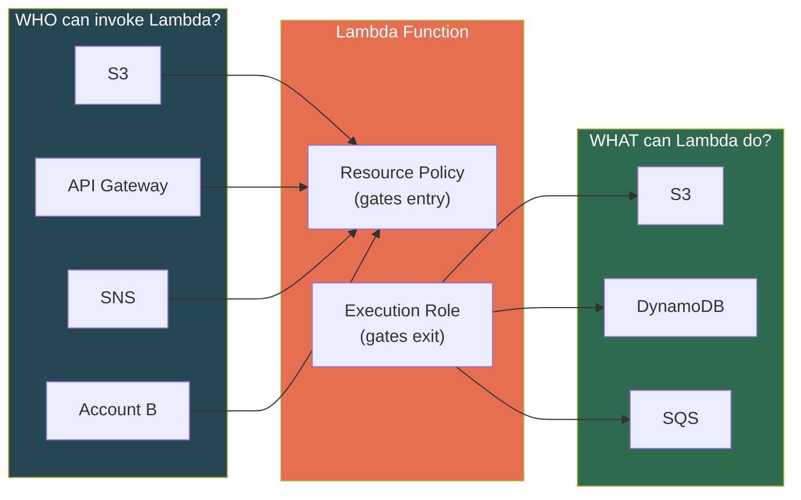
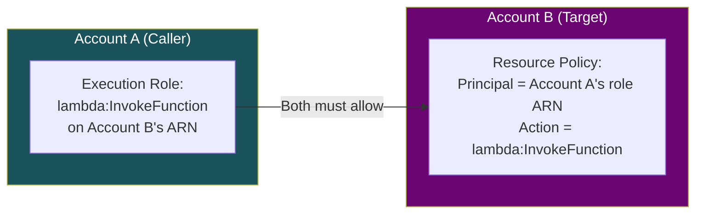
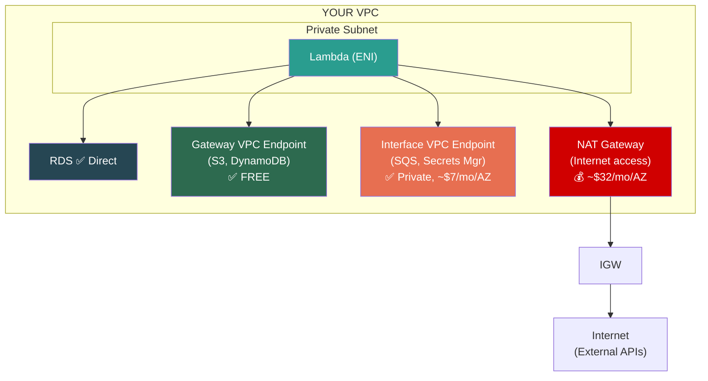
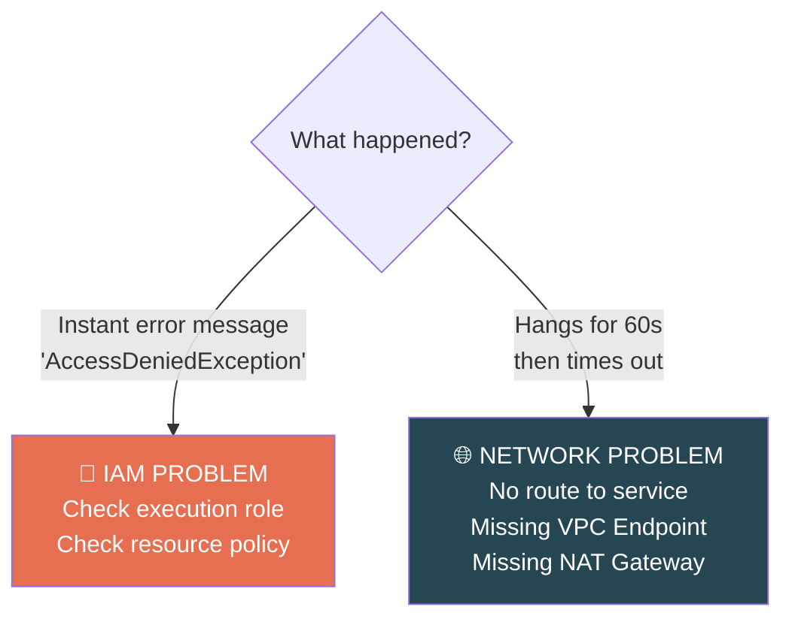

# AWS Lambda — IAM, Networking & Security

## Two Sides of Lambda IAM

Lambda has **two completely separate** IAM mechanisms. Most people conflate them.



### Execution Role (What Lambda CAN DO)

IAM role Lambda **assumes** at INIT. Defines which AWS services your function can talk to.

```json
{
  "Effect": "Allow",
  "Action": ["s3:GetObject", "dynamodb:PutItem", "sqs:SendMessage"],
  "Resource": "arn:aws:s3:::my-bucket/*"
}
```

- Every Lambda **must** have an execution role
- Lambda calls `sts:AssumeRole` → temporary creds injected as env vars
- SDK clients auto-discover these — why `boto3.client('s3')` works without explicit credentials

### Resource Policy (Who Can INVOKE Lambda)

Policy attached to the Lambda function itself. Controls who/what can call it.

```json
{
  "Effect": "Allow",
  "Principal": { "Service": "s3.amazonaws.com" },
  "Action": "lambda:InvokeFunction",
  "Resource": "arn:aws:lambda:us-east-1:123456:function:my-func",
  "Condition": { "ArnLike": { "AWS:SourceArn": "arn:aws:s3:::my-bucket" } }
}
```

- Without this, trigger services get `AccessDeniedException`
- SAM/CDK add these automatically when you define event sources

---

## Cross-Account Invocation

> **[SDE2 TRAP]** "Can Lambda in Account A invoke Lambda in Account B?" — Yes, but you need **BOTH doors open:**



> Scope principal to **specific role ARN**, not entire account. `"AWS": "arn:aws:iam::ACCOUNT_A:root"` allows ANY role in Account A — too broad.

---

## Least Privilege — Production Standard

```json
// 🐛 TERRIBLE — "just make it work"
{ "Effect": "Allow", "Action": "s3:*", "Resource": "*" }

// ✅ PRODUCTION — scoped to exact actions and resources
{
  "Effect": "Allow",
  "Action": ["s3:GetObject", "s3:PutObject"],
  "Resource": "arn:aws:s3:::papers-bucket/raw/*"
}
```

**Checklist:**
- Scope **actions** to exact API calls (not `s3:*`)
- Scope **resources** to exact ARNs (not `*`)
- Use **conditions** where possible (`aws:SourceAccount`, `s3:prefix`)
- **Separate roles per function** — download function shouldn't have DynamoDB write access

---

## Lambda in a VPC — When and Why

### Default vs VPC Mode

| | Default (No VPC) | In Your VPC |
|--|-----------------|-------------|
| Internet access | ✅ Yes | ❌ Lost |
| AWS API access (S3, DDB) | ✅ Yes | ❌ Lost |
| Private resources (RDS) | ❌ No | ✅ Yes |
| Complexity | Low | Higher |

> **Only put Lambda in VPC when accessing private resources** (RDS, ElastiCache, OpenSearch). Every unnecessary VPC Lambda = added complexity + NAT cost.

### Restoring Connectivity from VPC



| Target | Solution | Cost |
|--------|----------|------|
| S3, DynamoDB | **Gateway VPC Endpoint** | **Free** |
| SQS, Secrets Manager, SSM | **Interface VPC Endpoint (PrivateLink)** | ~$7/mo per endpoint per AZ |
| External APIs (Stripe, GitHub) | **NAT Gateway** | ~$32/mo per AZ + data processing |

---

## ENIs and Cold Start History

| Era | Behavior | Cold Start Penalty |
|-----|----------|-------------------|
| **Pre-2019** | New ENI created per environment | **10-30 seconds** |
| **Post-2019 (Hyperplane)** | Shared ENI pool managed by AWS | **~200-500ms** |

> **[SDE2 TRAP]** "VPC Lambda cold starts are terrible" — WAS true pre-2019. Post-Hyperplane, VPC adds ~200-500ms, not 10-30s. But DO mention subnet IP capacity needs.

### Subnet IP Planning

Each Lambda environment consumes **one IP** from the subnet.

```
1,000 concurrent Lambdas = 1,000 IPs needed
/24 subnet = 251 usable IPs → NOT ENOUGH
/20 subnet = 4,091 usable IPs → Safe
```

Always configure Lambda with subnets in **at least 2 AZs** for HA.

---

## Debugging Rule — Error vs Timeout



> ⚠️ **Memorize this.** "Access Denied" = IAM. "Timeout/Hang" = Network. Solves 80% of VPC Lambda issues.

---

## ⚠️ Gotchas & Edge Cases

1. **Security Groups on Lambda.** Yes, VPC Lambda gets SGs. Missing outbound rule = **silent timeout**, no error message.
2. **ENI limits per account.** Default ~5,000 per region. Lambda shares this with EC2, ECS. High-concurrency Lambda can exhaust quota.
3. **Multi-AZ required.** Always configure subnets in ≥2 AZs. If one AZ fails, Lambda needs alternatives.
4. **VPC Endpoint policies.** Gateway endpoints for S3 support resource policies — restrict Lambda to specific buckets beyond execution role. Defense in depth.
5. **Subnet IP exhaustion.** `/24` = 251 usable IPs. High-concurrency Lambda needs `/20` or larger.

---

## 📌 Interview Cheat Sheet

- **Execution Role** = what Lambda can do (outbound permissions)
- **Resource Policy** = who can invoke Lambda (inbound permissions)
- Cross-account needs **both** — execution role on caller + resource policy on target
- Default Lambda has internet. **VPC Lambda loses it** — restore with NAT GW or VPC Endpoints
- **Gateway Endpoints** (S3, DynamoDB) = free. **Interface Endpoints** = ~$7/mo/AZ
- Post-2019 Hyperplane: VPC cold start penalty is **~200-500ms**, not 10-30s
- Put Lambda in VPC **only** when accessing private resources
- Subnet sizing: plan for **peak concurrent executions = IPs needed**
- Debugging: error message = IAM problem, timeout = network problem
