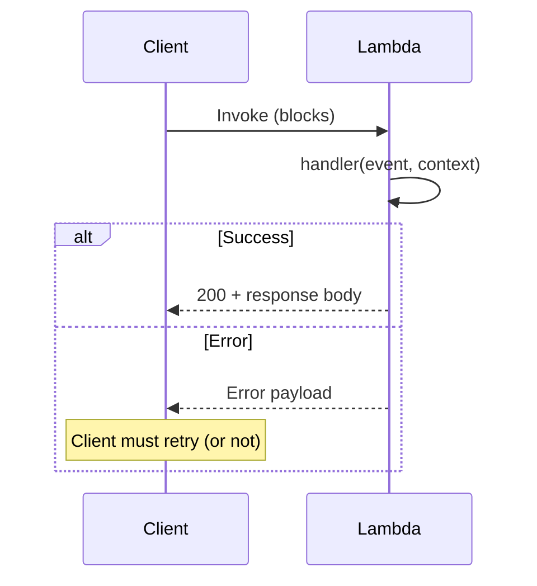
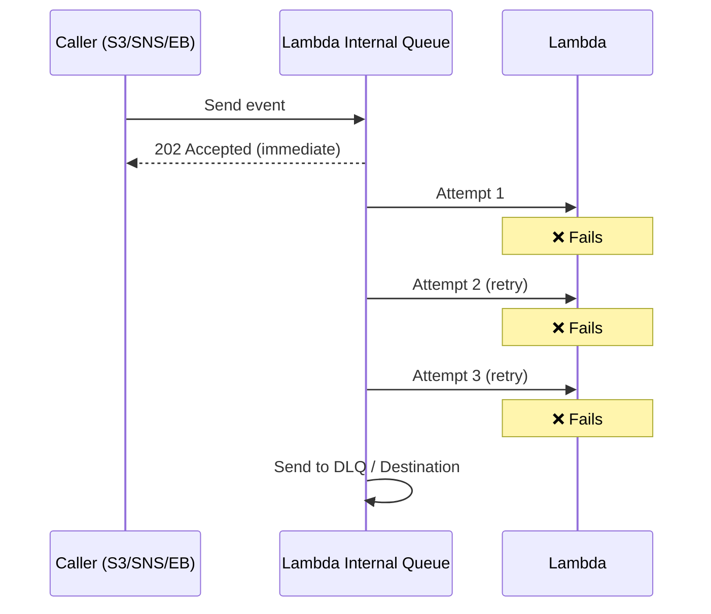
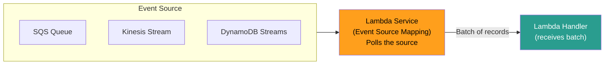
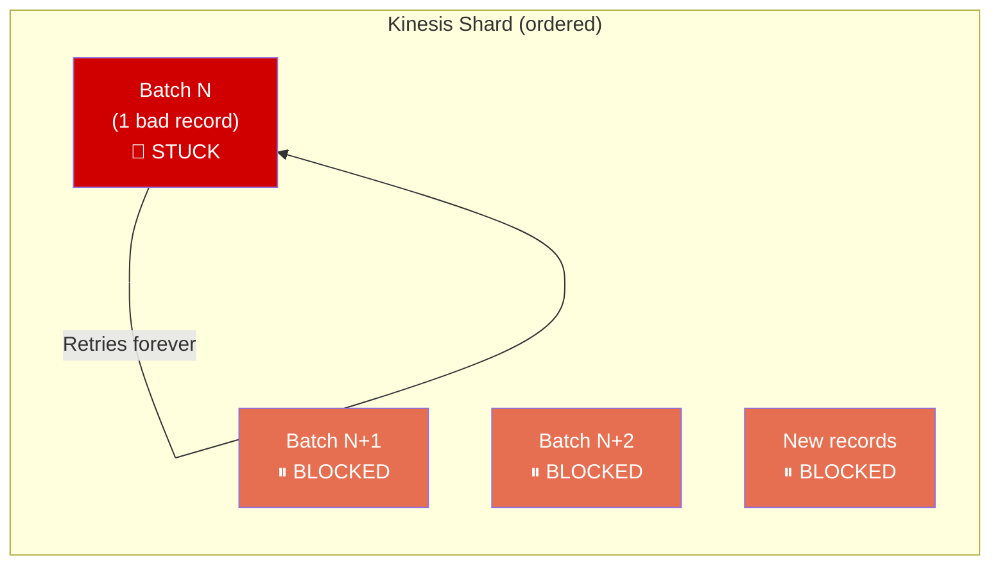

# AWS Lambda — Event Sources & Invocation Models

## The Three Invocation Models

This is the **backbone of every Lambda architecture decision.** Everything — retries, error handling, scaling — flows from which model your trigger uses.

| Model | Who waits? | Retry behavior | Examples |
|-------|-----------|----------------|----------|
| **Synchronous** | Caller blocks for response | **No built-in retry** — caller handles | API Gateway, ALB, CloudFront, `Invoke(RequestResponse)` |
| **Asynchronous** | Caller fires and forgets (gets 202) | **2 automatic retries** by Lambda | S3, SNS, EventBridge, CloudWatch Events, SES |
| **Stream/Polling** | Lambda polls the source | **Retries until data expires** (blocks shard) | SQS, Kinesis, DynamoDB Streams, Kafka |

---

## Synchronous Invocation



- Client gets the error **directly** — must handle retries itself
- **No DLQ, no destinations.** You own error handling.
- API Gateway, ALB, SDK `Invoke()` with `RequestResponse`

---

## Asynchronous Invocation



- Lambda manages an **internal queue** between caller and function
- **3 total attempts** (1 original + 2 retries)
- Configurable: `MaximumRetryAttempts` (0, 1, or 2) and `MaximumEventAgeSeconds` (60s–6hrs)
- Failed events → **DLQ** (SQS/SNS) or **Destinations** (EventBridge, SQS, SNS, Lambda)

> ⚠️ If no DLQ or Destination configured, failed events are **silently dropped.** Gone forever. No alarm, no log. **Destinations are non-negotiable for async Lambda in production.**

---

## Stream/Polling (Event Source Mapping)



- Lambda **polls** the source — you don't push to Lambda
- Reads in **batches** (configurable: 1–10,000)
- **SQS:** failed batch → messages return to queue (visibility timeout) → retry naturally
- **Kinesis/DDB Streams:** failed batch → **blocks the entire shard** until success or expiry

### The Kinesis Poison Pill Problem



> **[SDE2 TRAP]** One bad record blocks the ENTIRE shard. All newer records stuck. `IteratorAge` metric climbs. Pipeline backs up.

**The fix — three configs together:**

| Config | What it does |
|--------|-------------|
| `BisectBatchOnFunctionError: true` | Splits failing batch in half → isolates bad record |
| `MaximumRetryAttempts: 3` | Stops infinite retry after N attempts |
| `DestinationConfig.OnFailure` | Sends poison record to SQS/SNS for investigation |
| `MaximumRecordAgeInSeconds: 3600` | Skip records older than threshold |

---

## SQS Visibility Timeout Trap

> ⚠️ **SQS visibility timeout must be ≥ 6× your Lambda timeout.**

```
Lambda timeout: 60s
Visibility timeout: 30s (default)

Problem: Lambda processing at second 35 → message becomes visible again
         → ANOTHER Lambda picks it up → DUPLICATE processing
         
Fix: Set visibility timeout to 360s (6 × 60s)
```

---

## Event Source Mapping — Scaling Behavior

| Source | Scaling | Concurrency |
|--------|---------|-------------|
| **SQS Standard** | Up to 1,000 batches/min, scales with queue depth | Up to 1,000 concurrent Lambda instances |
| **SQS FIFO** | One Lambda per message group ID | Limited by # of message groups |
| **Kinesis** | One Lambda per shard (default) | Enable `ParallelizationFactor` (1–10) for up to 10 per shard |
| **DynamoDB Streams** | One Lambda per shard | Same as Kinesis |

---

## ⚠️ Gotchas & Edge Cases

1. **Async internal queue has 1,000,000 event limit.** Beyond that, new events throttled silently.
2. **S3 → Lambda is async.** S3 fires and forgets. If Lambda fails all 3 attempts and no DLQ → event lost.
3. **SQS → Lambda is polling (NOT async).** Common misconception. Lambda service polls SQS, not SQS pushing to Lambda.
4. **Kinesis ordering guarantee** — records within a shard are processed in order. That's WHY shard blocking exists.
5. **SNS → Lambda is async.** SNS delivers to Lambda's internal async queue, not directly.

---

## 📌 Interview Cheat Sheet

- **Sync:** caller retries, 429 on throttle. API GW, ALB, SDK invoke.
- **Async:** Lambda retries 2×, then DLQ/Destination. S3, SNS, EventBridge.
- **Stream/Poll:** batch processing, shard blocking (Kinesis/DDB), visibility timeout (SQS).
- Kinesis poison pill → `BisectBatchOnFunctionError` + `MaximumRetryAttempts` + failure Destination.
- SQS visibility timeout ≥ **6× Lambda timeout**.
- No DLQ/Destination on async = **silent event loss**.
- SQS scales to 1,000 concurrent. Kinesis = 1 per shard (×10 with parallelization factor).
