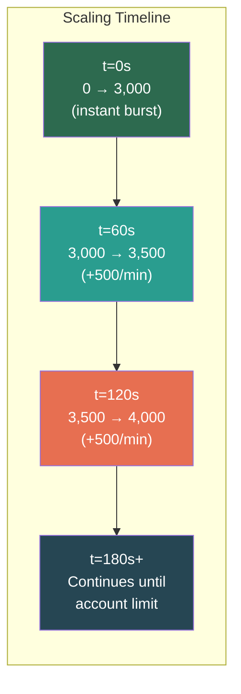
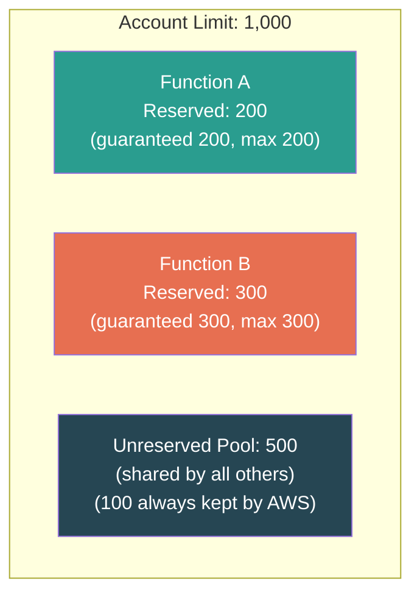
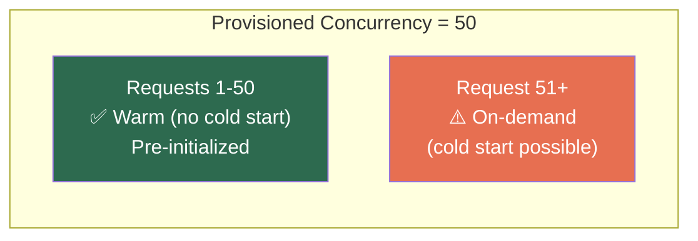
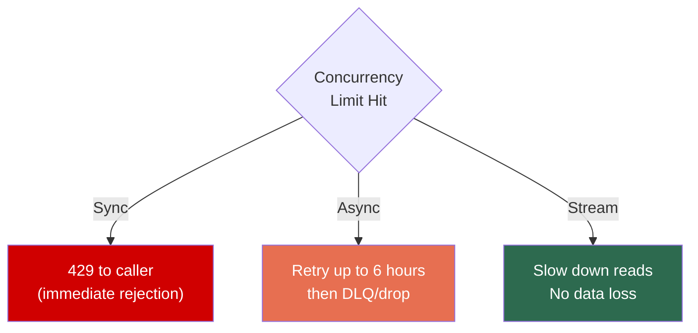

# AWS Lambda — Concurrency, Scaling & Throttling

## How Lambda Scales

Lambda scales **horizontally** by adding execution environments. Each environment handles **one request at a time.**

```
1 concurrent request   = 1 environment
100 concurrent requests = 100 environments
1000 concurrent        = 1000 environments (if within limits)
```

---

## Account-Level Limits

| Limit | Value | Adjustable? |
|-------|-------|-------------|
| **Account concurrency** | 1,000 per region (default) | Yes, request to 10K+ |
| **Burst limit** | 3,000 (us-east-1), 1,000 (most), 500 (others) | No |
| **Post-burst rate** | +500 environments/minute | No |

### Burst Behavior



---

## Three Concurrency Flavors

### 1. Unreserved (Default)

All functions share the account pool. One runaway function can **starve others.**

### 2. Reserved Concurrency

Guarantees N environments for this function. Also acts as a **hard cap.**



> **[SDE2 TRAP]** Reserved concurrency is both a **floor AND a ceiling.** Setting it to 5 means your function CANNOT exceed 5 concurrent executions — excess gets throttled (429). People set it for "guarantee" and accidentally create a bottleneck.

**Special case:** Reserved concurrency = **0** effectively **disables** the function. Used as an emergency kill switch in production.

### 3. Provisioned Concurrency

Pre-warms N environments — **zero cold starts** for those N.



**Cost:** ~$0.0000041667 per GB-second, **24/7** whether invoked or not.

> ⚠️ **Provisioned counts against reserved.** If reserved = 100 and provisioned = 100, you get exactly 100 with zero cold starts but NO burst capacity above 100.

---

## Concurrency Math Example

```
Account limit: 1,000
Function A: Reserved = 400
AWS keeps: 100 unreserved (mandatory buffer)
Unreserved pool: 1,000 - 400 = 600

Function B (no reservation): 900 concurrent requests arrive
  → Max available from pool: 600
  → Served: 600
  → Throttled: 300 (429 error)
```

---

## Throttling Behavior Per Invocation Type

| Invocation Type | What Happens on Throttle |
|----------------|--------------------------|
| **Synchronous** | Returns **429 TooManyRequestsException** to caller immediately |
| **Asynchronous** | Lambda retries for up to **6 hours**, then sends to DLQ |
| **Stream/Polling** | Reduces read rate, retries. **Does not drop records.** |



---

## Scaling Anti-Patterns

### 1. No Reserved Concurrency on Critical Functions

```
Problem: Function A (batch job) spikes to 900 concurrent
         Function B (API handler) gets only 100 → users see 429s

Fix: Reserve concurrency for Function B (e.g., 200)
     Function A can only use remaining pool
```

### 2. Lambda + RDS Without Protection

```
Problem: Lambda scales to 1,000 concurrent → 1,000 DB connections
         RDS max connections ~1,000 for small instances → DB overwhelmed

Fix: RDS Proxy (connection pooling across Lambda environments)
     OR reserved concurrency to cap Lambda (e.g., 100)
```

### 3. Provisioned Without Reserved

```
Problem: Provisioned = 50 but no reserved concurrency set
         During traffic spike, Lambda scales to 500 (on-demand)
         → 450 cold starts + full account pool consumption

Fix: Set reserved = 100, provisioned = 50
     → 50 warm + 50 on-demand max + account pool protected
```

---

## ⚠️ Gotchas & Edge Cases

1. **Account-level limit is SHARED.** All Lambda functions in a region compete for the same 1,000 (default). One noisy function starves everyone.
2. **Burst limit is region-specific** and non-adjustable. us-east-1 = 3,000. ap-south-1 = 500. Plan accordingly.
3. **Reserved concurrency minimum is 0** (disables function), but AWS always holds back **100 unreserved** for other functions. Max reservable = account limit - 100.
4. **Provisioned concurrency on `$LATEST` is not allowed.** Must point to a published **version** or **alias.**
5. **Auto Scaling for provisioned concurrency** exists — scales provisioned count up/down based on utilization via Application Auto Scaling.

---

## 📌 Interview Cheat Sheet

- Default: **1,000 concurrent per region** (adjustable). Burst: **3,000** (us-east-1).
- **1 request = 1 environment.** Horizontal scaling only.
- **Reserved = floor + ceiling.** Guarantees AND caps concurrency.
- **Provisioned = pre-warmed** environments. Costs 24/7. Must target version/alias.
- Reserved = 0 → **kill switch** (function disabled).
- Throttle behavior: Sync → 429, Async → 6hr retry, Stream → slow reads.
- **100 always unreserved** — AWS prevents total starvation.
- RDS + Lambda = use **RDS Proxy** or cap with reserved concurrency.
- Post-burst scaling: **+500 environments/minute.**
