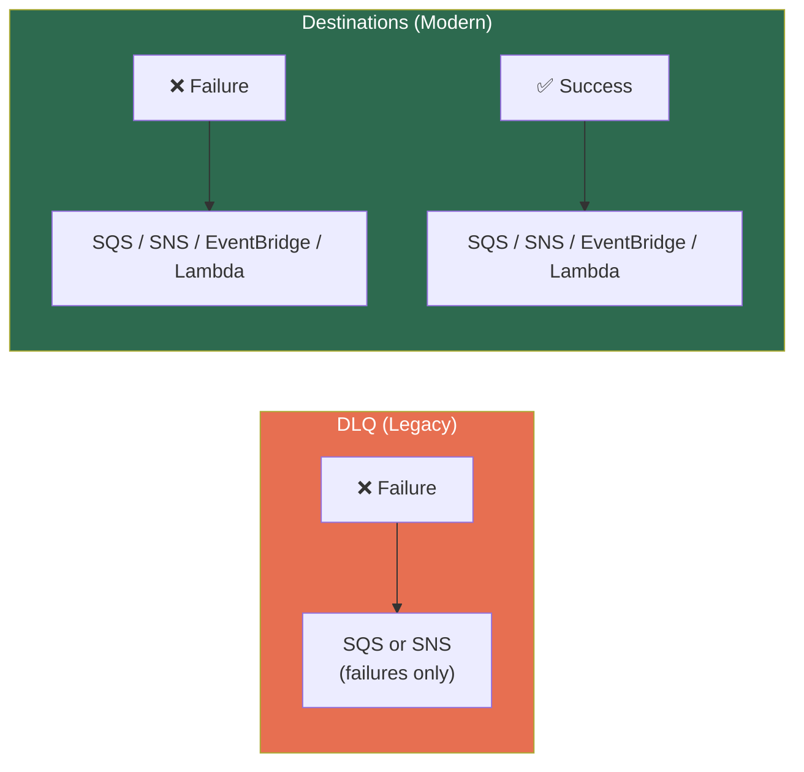
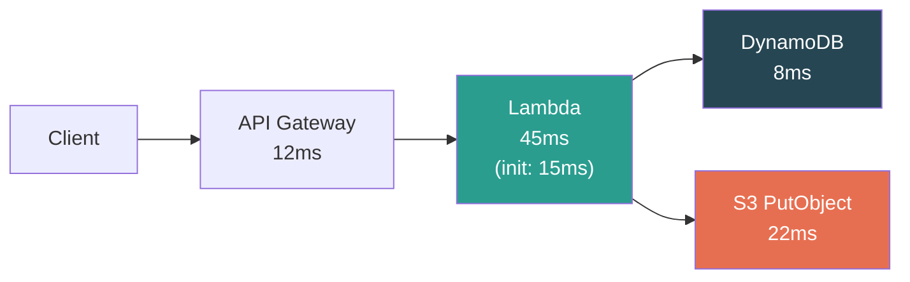

# AWS Lambda — Error Handling, Retries & Observability

## Retry Matrix — The Complete Picture

| Invocation | Who Retries | How Many | Final Failure |
|-----------|------------|----------|---------------|
| **Sync** | **Caller** (you code it) | Up to you | Caller gets error |
| **Async** | **Lambda service** | 2 retries (configurable 0–2) | DLQ or Destination |
| **SQS polling** | **SQS** (visibility timeout) | Until `maxReceiveCount` | SQS DLQ (redrive policy) |
| **Kinesis/DDB** | **Lambda** (blocks shard) | Until record expires or max retry | On-failure Destination |

---

## DLQ vs Destinations



| Feature | DLQ | Destinations |
|---------|-----|-------------|
| Captures failures | ✅ | ✅ |
| Captures **successes** | ❌ | ✅ |
| Targets | SQS, SNS only | SQS, SNS, EventBridge, Lambda |
| Metadata included | Minimal | Full (request/response context) |
| Recommendation | Legacy, backward compat | **Use for all new development** |

---

## Partial Batch Failure (SQS)

### Before (Pre-2021)

1 message in a batch of 10 fails → **all 10 return to queue** → 9 successful messages reprocessed.

### After — `ReportBatchItemFailures`

Return only failed message IDs. Only those retry.

```python
def handler(event, context):
    failures = []
    for record in event['Records']:
        try:
            process(record)
        except Exception:
            failures.append({"itemIdentifier": record["messageId"]})
    
    return {"batchItemFailures": failures}  # Only these retry
```

> ⚠️ **Always enable this.** Without it, you get duplicate processing of successful messages on every partial failure.

---

## Observability — Three Pillars

### 1. CloudWatch Logs

- Every `print()` / `console.log()` → Log Group: `/aws/lambda/function-name`
- **Log retention is infinite by default** → set a retention policy or CloudWatch bill explodes

**Structured logging with Lambda Powertools:**
```python
from aws_lambda_powertools import Logger
logger = Logger(service="download-service")

@logger.inject_lambda_context
def handler(event, context):
    logger.info("Processing paper", paper_id=event['id'])
```

### 2. CloudWatch Metrics (Built-in, Free)

| Metric | What It Tells You | Alert When |
|--------|-------------------|------------|
| `Invocations` | Total calls | Unexpected drop (broken trigger) |
| `Errors` | Unhandled exceptions | > 0 for critical functions |
| `Throttles` | 429s — concurrency limit hit | > 0 (capacity planning) |
| `Duration` | Execution time (P50/P99/Max) | P99 approaching timeout |
| `ConcurrentExecutions` | Active environments right now | Approaching account limit |
| `IteratorAge` | How far behind on stream | **Growing = consumer lag** |

> **[SDE2 TRAP]** `IteratorAge` on Kinesis/DDB Streams — if this grows, your Lambda can't keep up. This is the **#1 alarm to set** for stream-based Lambda.

### 3. X-Ray Tracing



- End-to-end request tracing across services
- Enable with one toggle: `TracingConfig: Active`
- Shows exactly where time is spent — cold start, handler, SDK calls

---

## ⚠️ Gotchas & Edge Cases

1. **CloudWatch Log Group not auto-deleted** when Lambda is deleted. Orphan log groups accumulate cost. Clean up in teardown scripts.
2. **X-Ray adds ~1-2ms overhead** per traced call. Negligible for most, but matters at sub-10ms requirements.
3. **Async retry delay is not configurable.** Lambda waits ~1 min before retry 1, ~2 min before retry 2. Can't speed it up.
4. **SQS DLQ vs Lambda DLQ** — SQS has its own DLQ (via redrive policy) separate from Lambda's DLQ. For SQS-triggered Lambda, use **SQS redrive policy**, not Lambda DLQ.
5. **`Errors` metric counts unhandled exceptions only.** Caught exceptions with graceful error responses show as successful invocations.

---

## 📌 Interview Cheat Sheet

- Sync → caller retries. Async → Lambda retries 2×. Stream → retries until expiry.
- **Destinations > DLQs** — captures both success and failure, more targets.
- `ReportBatchItemFailures` for SQS — prevents duplicate processing of successful messages.
- Key metrics: **Errors, Throttles, Duration (P99), ConcurrentExecutions, IteratorAge**
- `IteratorAge` growing = **consumer lag** on streams. #1 alarm for Kinesis Lambda.
- X-Ray: one toggle for end-to-end tracing. Shows cold start breakdown.
- Log retention default = **infinite**. Always set a retention policy.
- SQS-triggered Lambda → use **SQS redrive policy** for DLQ, not Lambda DLQ.
