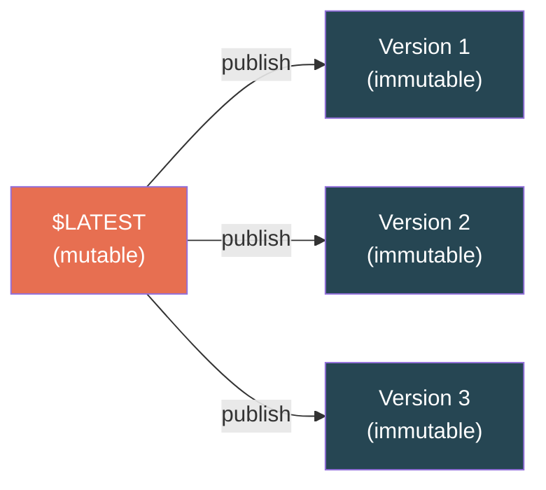
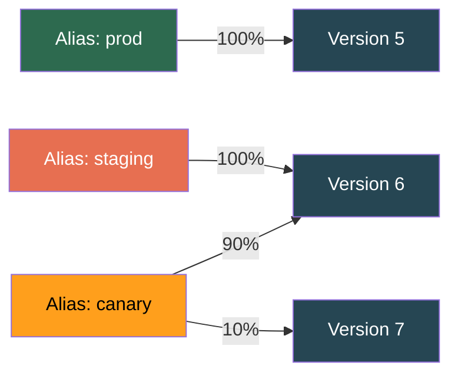
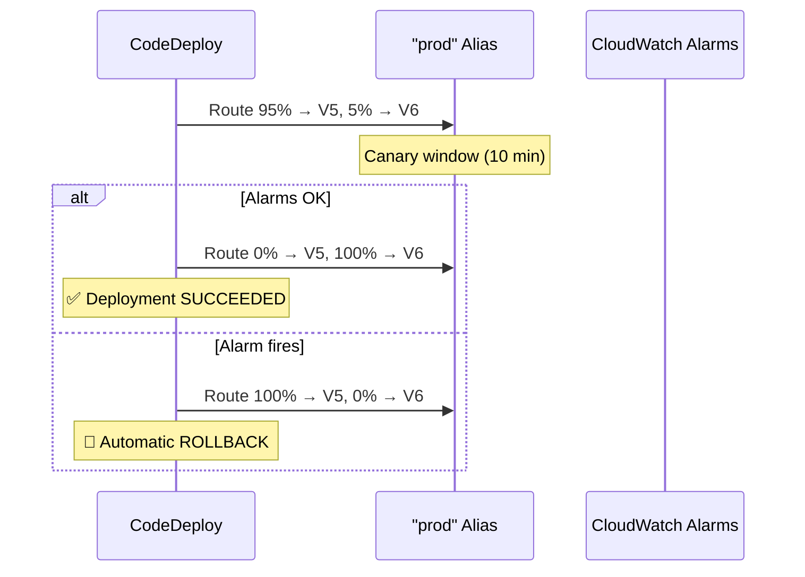

# AWS Lambda — Deployment: Versions, Aliases & Traffic Shifting

## Versions — Immutable Snapshots



- `$LATEST` is **mutable** — every deploy updates it
- Publishing creates a **numbered, immutable snapshot** (code + config frozen)
- Each version has its own ARN: `arn:aws:lambda:...:function:my-func:3`
- You **cannot** change a published version. Ever.

---

## Aliases — Named Pointers

An alias is a **named pointer** to a version. Like a DNS CNAME for Lambda.



- Alias has its own **stable ARN**: `arn:aws:lambda:...:function:my-func:prod`
- API Gateway / event sources point to the **alias**, not the version
- Shift traffic by updating alias pointer — **no downstream changes**

---

## Traffic Shifting — Safe Deployments

### Three Strategies

| Strategy | How It Works | Risk Level |
|----------|-------------|------------|
| **Canary** | X% to new for N minutes, then 100% if healthy | Low |
| **Linear** | Shift X% every N minutes incrementally | Medium |
| **All-at-once** | 0% → 100% instantly | High |

### Canary Deployment Flow



### SAM Template Example

```yaml
AutoPublishAlias: prod
DeploymentPreference:
  Type: Canary10Percent5Minutes
  Alarms:
    - !Ref ErrorsAlarm
    - !Ref LatencyAlarm
```

If `ErrorsAlarm` fires during canary window → **automatic rollback.** Zero human intervention.

### Common Deployment Types

| SAM Type | Behavior |
|----------|----------|
| `Canary10Percent5Minutes` | 10% for 5 min, then 100% |
| `Canary10Percent30Minutes` | 10% for 30 min, then 100% |
| `Linear10PercentEvery1Minute` | 10% → 20% → ... → 100% |
| `AllAtOnce` | Instant 100% (use for non-critical) |

---

## ⚠️ Gotchas & Edge Cases

1. **Aliases can't point to `$LATEST`.** Weighted aliases require two **published versions.** Trips up CI/CD pipelines that only use `$LATEST`.
2. **Provisioned concurrency targets versions/aliases**, not `$LATEST`. Your deployment pipeline must publish versions.
3. **Version is NOT deleted when you rollback.** It still exists as an immutable snapshot. Investigate, fix, redeploy as next version.
4. **Each alias can split traffic between exactly 2 versions** — not 3 or more.
5. **Event source mappings tied to an alias** automatically route to whatever the alias points to. No reconfiguration needed on deploy.

---

## 📌 Interview Cheat Sheet

- **$LATEST** = mutable. **Published versions** = immutable snapshots.
- **Aliases** = named pointers (like DNS CNAME). Point event sources to aliases, not versions.
- **Canary/Linear** via CodeDeploy + CloudWatch alarms = automated safe deployments + auto-rollback.
- Alias splits between **exactly 2 versions** (not more).
- Provisioned concurrency must target **version or alias**, not $LATEST.
- Rollback = alias shifts back to previous version. Failed version persists for investigation.
