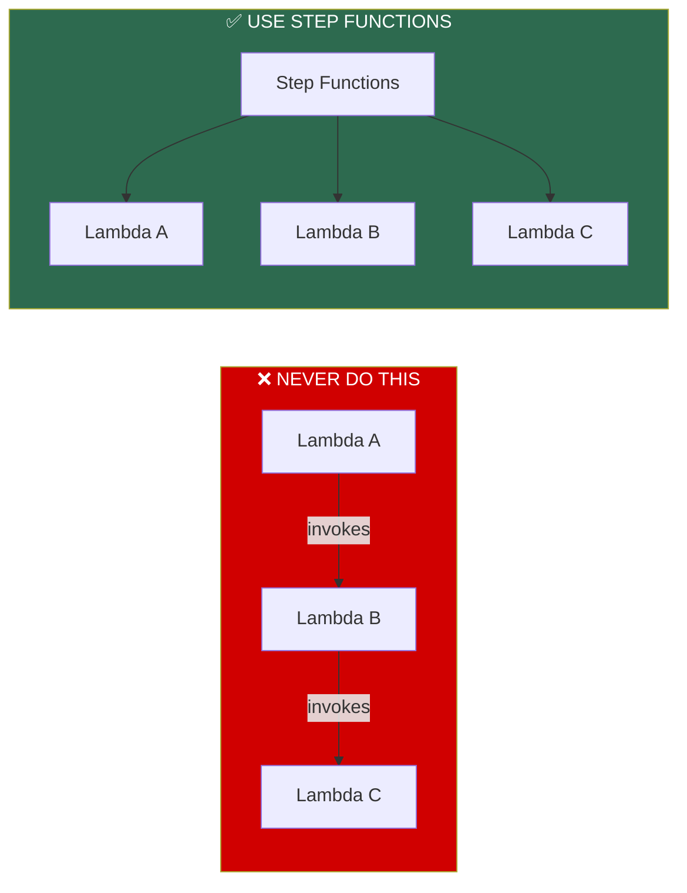
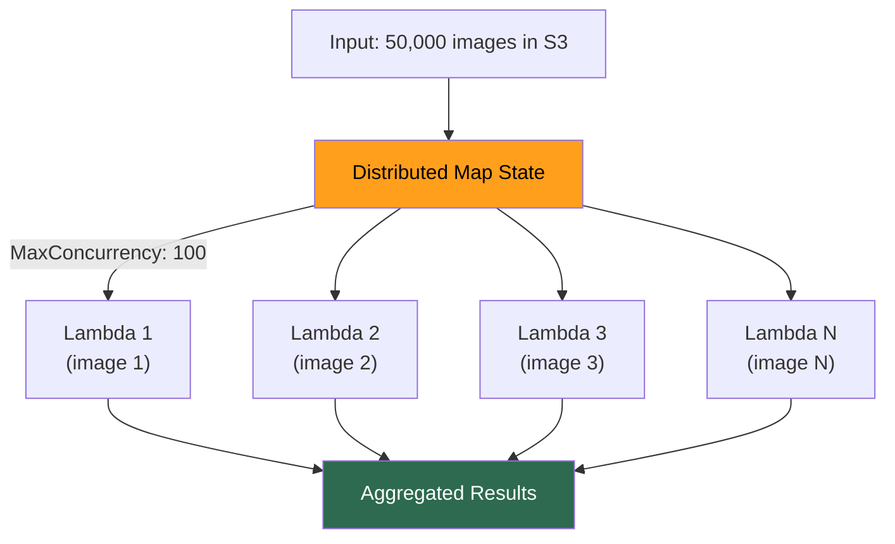
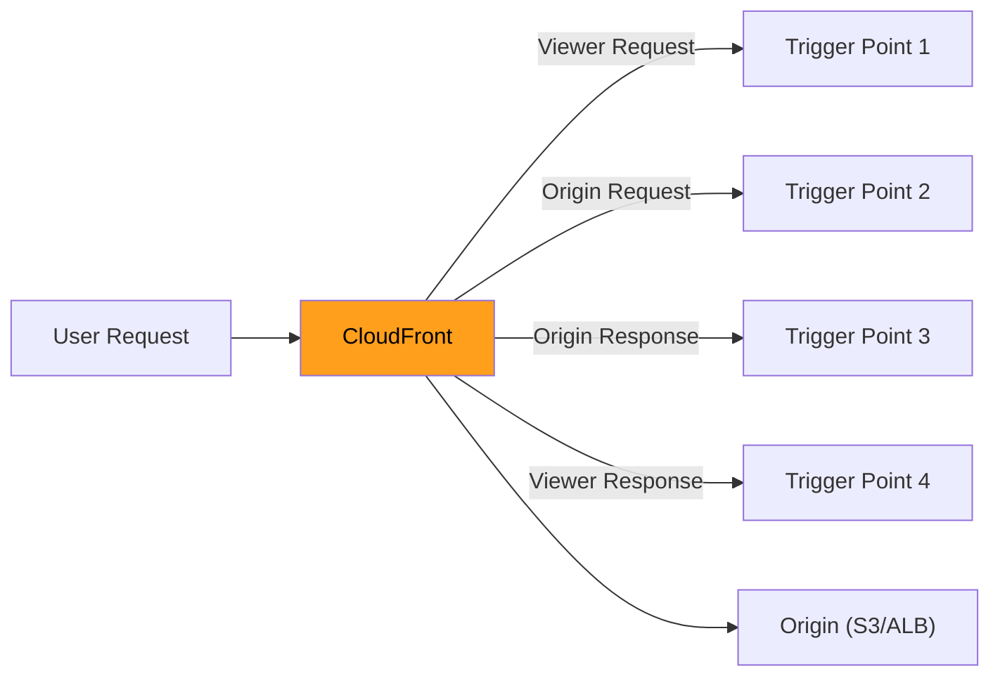

# AWS Lambda — Orchestration & Edge Compute

## The Lambda Chaining Anti-Pattern



**Why chaining is terrible:**
1. Lambda A pays for its OWN execution + waits for B + C (triple billing)
2. Total timeout = A's 15min limit (B+C must finish within A's timeout)
3. Error handling = nested try/catch nightmare
4. No visibility into where the chain broke

---

## Step Functions — Standard vs Express

| Feature | Standard | Express |
|---------|----------|---------|
| Max duration | **1 year** | **5 minutes** |
| Execution model | **Exactly-once** | **At-least-once** |
| Pricing | Per state transition ($0.025/1K) | Per execution + duration |
| State history | Full (console, 90 days) | CloudWatch Logs only |
| Max start rate | 2,000/sec | 100,000/sec |
| Use case | Long workflows, approvals | High-volume data processing |

---

## Key State Types

| State | Purpose | Example |
|-------|---------|---------|
| **Task** | Invoke Lambda, ECS, API, SDK call | Process a document |
| **Choice** | Branching logic (if/else) | Route by file type |
| **Parallel** | Run branches concurrently | Process image + metadata simultaneously |
| **Map** | Loop over collection — fan-out | Process each item in a list |
| **Wait** | Pause for N seconds or timestamp | Rate limiting |
| **Pass** | Transform data, inject values | Reshape JSON between steps |

---

## Map State — Fan-Out Done Right



| Map Type | Max Items | Source | Use When |
|----------|-----------|--------|----------|
| **Inline Map** | ~40 concurrent | Items in input JSON | Small collections |
| **Distributed Map** | Thousands concurrent | **Items in S3** | Massive scale (millions) |

> ⚠️ **Always set `MaxConcurrency`.** Without it, 50K items launches 50K Lambdas → account throttle + downstream overwhelm.

---

## SDK Integration — Skip Lambda Entirely

Step Functions can call **200+ AWS services directly:**

```
❌  Step Function → Lambda (just calls DynamoDB) → DynamoDB
✅  Step Function → DynamoDB (direct SDK integration)

Saves: Lambda cost + latency + code to maintain
```

Direct integrations: DynamoDB, SQS, SNS, S3, ECS, Glue, SageMaker, etc.

> **[SDE2 TRAP]** "When Step Functions vs SQS between Lambdas?" — SQS for simple one-hop decoupling (fire-and-forget). Step Functions for **multi-step workflows with branching, per-step error handling, retries, and visual debugging.** If you draw a flowchart → Step Functions. If it's just A→B → SQS/SNS.

---

## Lambda@Edge vs CloudFront Functions



| Feature | CloudFront Functions | Lambda@Edge |
|---------|---------------------|-------------|
| Runtime | JavaScript only | Node.js, Python |
| Max duration | **1ms** | **5–30s** |
| Max memory | **2MB** | **128–3008 MB** |
| Scale | **Millions RPS** | Thousands RPS |
| Network access | ❌ | ✅ |
| Body access | ❌ | ✅ |
| Price | 1/6th of Lambda@Edge | Per request + duration |
| Deploy region | All edges auto | **us-east-1 only**, replicated |

### Decision Framework

| Need | Use |
|------|-----|
| Modify headers, URLs, redirects | **CloudFront Functions** (cheap, fast) |
| Auth token validation, external API call | **Lambda@Edge** |
| Heavy processing | **Don't do at edge.** Do at origin. |

**Common use cases:**
- **CF Functions:** URL rewrites, header manipulation, A/B testing, cache key normalization
- **Lambda@Edge:** Auth validation, dynamic origin selection, image resize, bot detection

---

## ⚠️ Gotchas & Edge Cases

1. **Step Functions Standard charges per state transition.** 10 states × 1M executions = 10M transitions = **$250.** Minimize Pass states.
2. **Lambda@Edge deploys from us-east-1 ONLY.** CloudFormation stacks in other regions can't create Lambda@Edge.
3. **Distributed Map can launch thousands of concurrent Lambdas.** Without `MaxConcurrency`, you overwhelm downstream services.
4. **Express Step Functions** don't support all state types and have no built-in execution history.
5. **Step Functions payload limit: 256 KB.** For large data, pass S3 references, not the data itself.

---

## 📌 Interview Cheat Sheet

- **Never chain Lambda→Lambda directly.** Use Step Functions or SQS/SNS.
- Standard (1 year, exactly-once, $$) vs Express (5 min, at-least-once, high throughput).
- **Map state** for fan-out. Distributed Map for millions of items from S3.
- **SDK integrations** skip Lambda when Step Functions can call the service directly.
- CloudFront Functions: 1ms, JS, cheap, no network. Lambda@Edge: 30s, Node/Python, network.
- Lambda@Edge: **deploy from us-east-1**, replicated globally.
- Step Functions payload: **256 KB max** — pass S3 references for large data.
