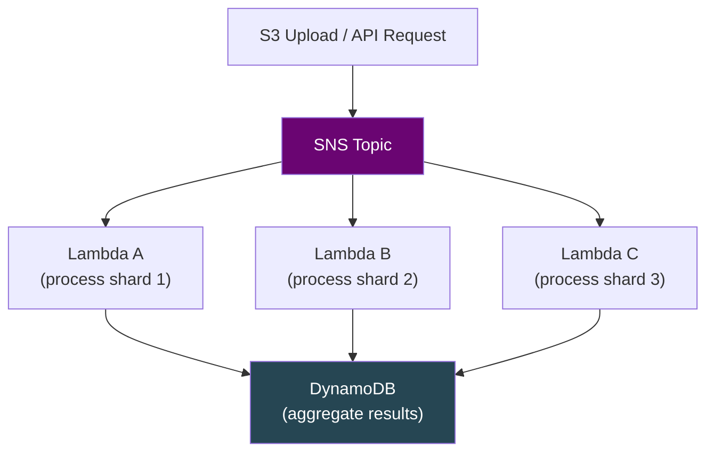
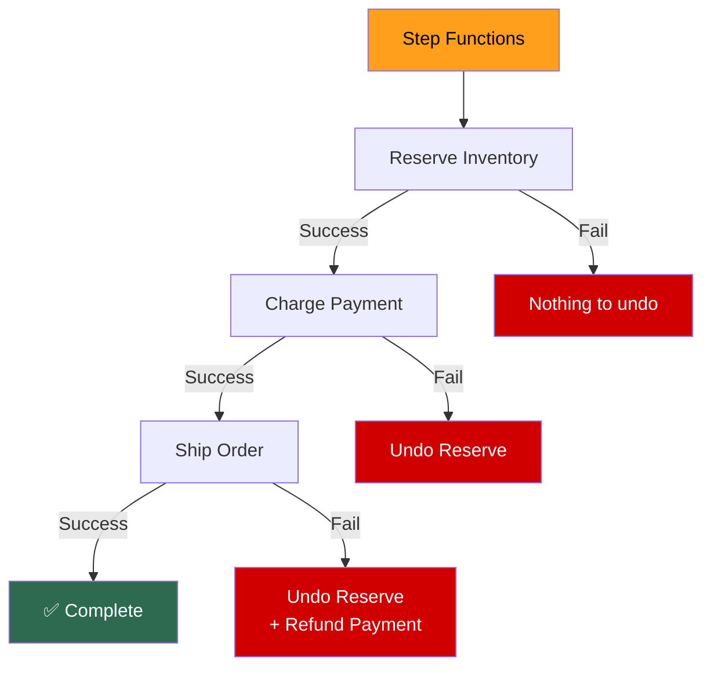
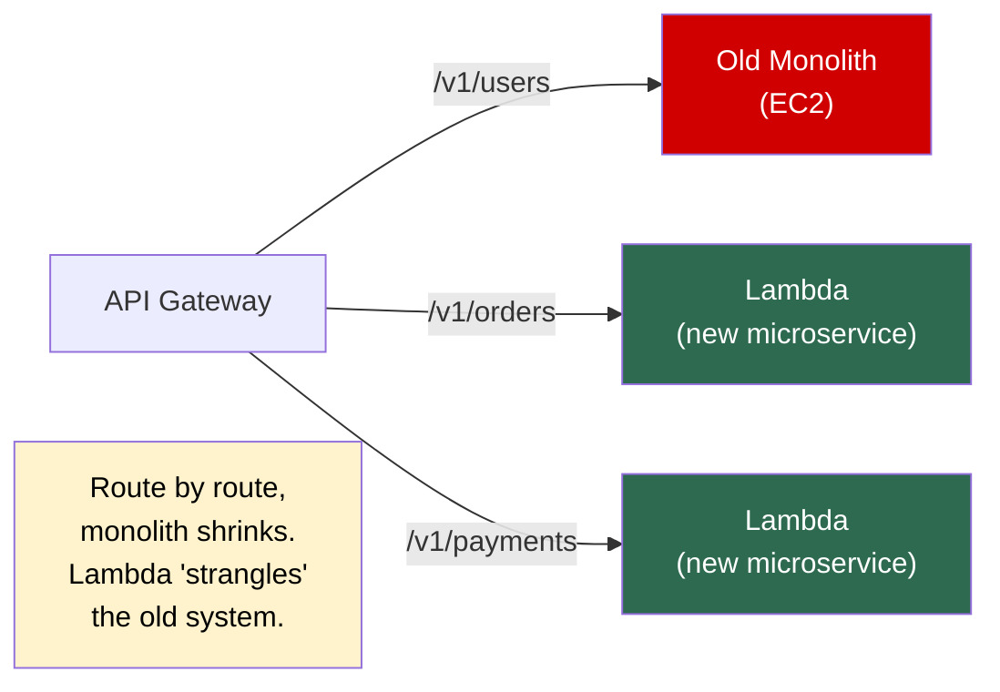
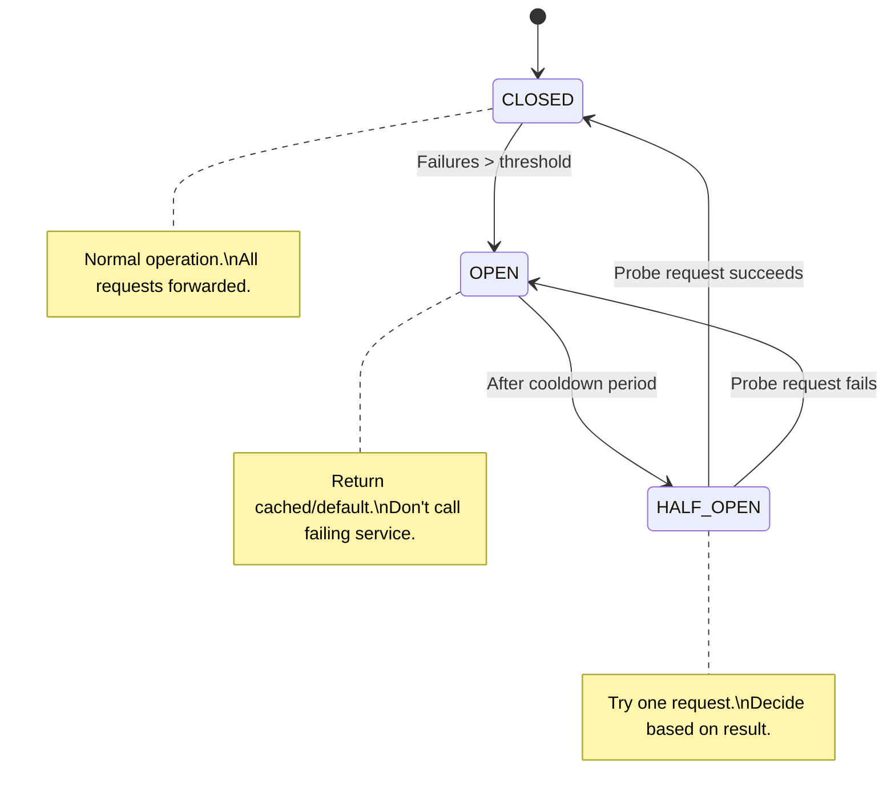
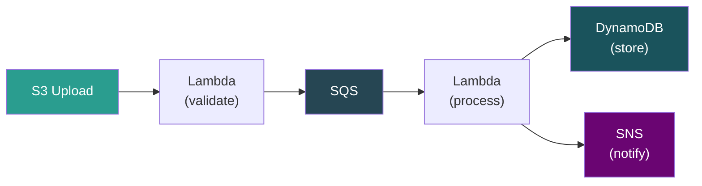
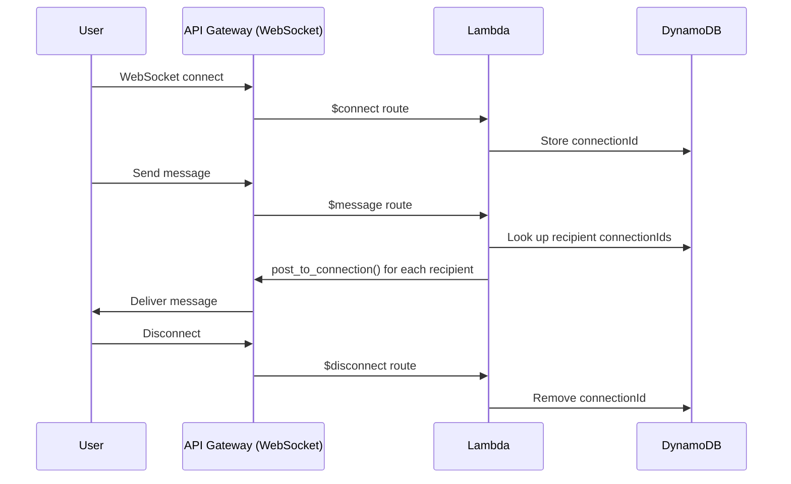
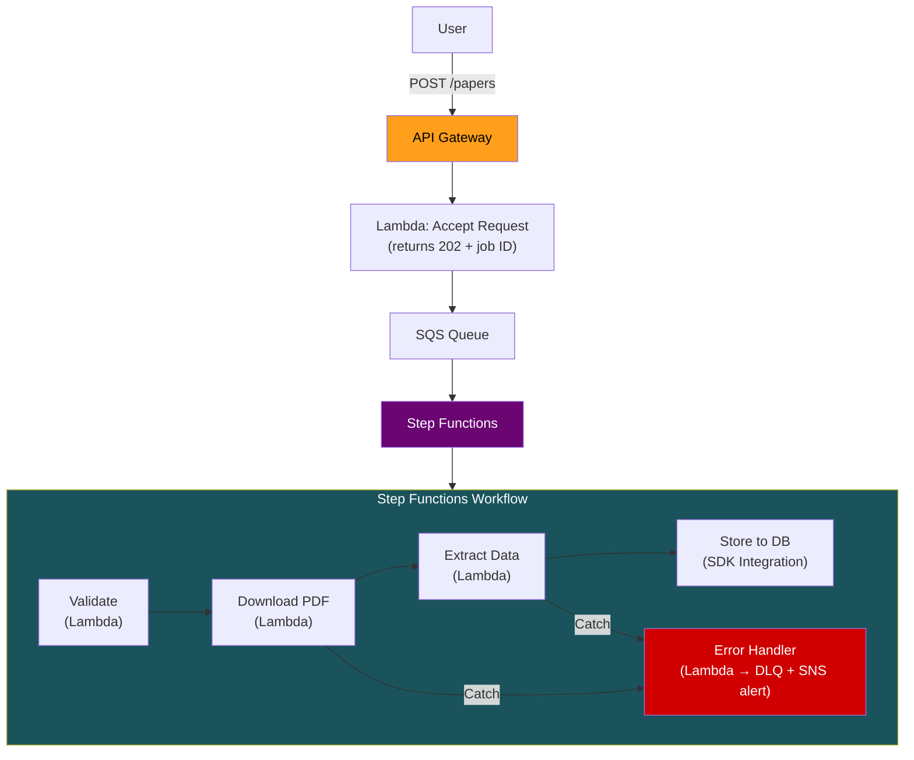
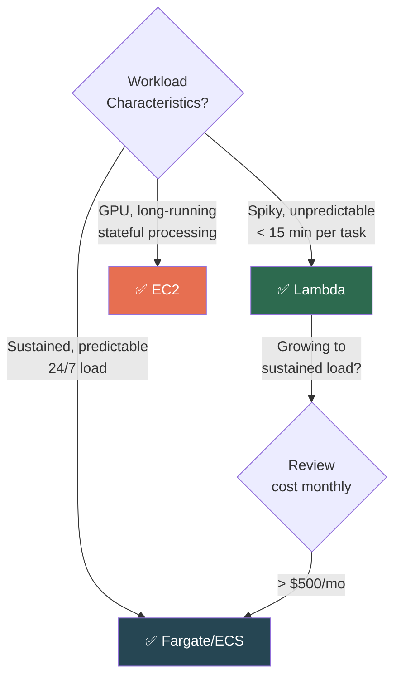

# AWS Lambda — Production Patterns & System Design

## Pattern 1: Fan-Out / Fan-In

**Use when:** Processing large datasets in parallel. SNS for fan-out, DynamoDB/S3 for aggregation. Step Functions `Map` state is the managed alternative.

---

## Pattern 2: Saga (Distributed Transactions)

Each step has a **compensating transaction.** If step N fails, run compensations for N-1 → 1 in reverse. Step Functions `Catch` blocks orchestrate this naturally.

---

## Pattern 3: Strangler Fig (Migration)

---

## Pattern 4: Circuit Breaker

Store circuit state in **DynamoDB or ElastiCache.** Lambda Powertools has built-in circuit breaker for Python.

---

## Pattern 5: Event-Driven Pipeline

Each Lambda does **ONE thing.** Services between them handle buffering, retries, and decoupling.

---

## Pattern 6: API Gateway WebSocket + Lambda

> **[SDE2 TRAP]** API Gateway manages the persistent WebSocket connection (up to 2 hours). Lambda handles **discrete events** ($connect, $message, $disconnect) as short invocations. Lambda does NOT hold the connection.

**Limits:** Connection state in DynamoDB. Broadcasting to 10K connections = 10K `post_to_connection` calls. At extreme fan-out, consider ECS/EC2.

---

## When NOT to Use Lambda

| Scenario | Why Not | Use Instead |
|----------|---------|-------------|
| **> 15 min tasks** | Hard timeout limit | Fargate, ECS, EC2 |
| **Sustained high-throughput** (millions RPS constant) | Cost exceeds containers | ECS/EKS on Fargate |
| **Persistent connections** | Lambda is request-response | API GW WebSocket (limited), ECS |
| **Heavy GPU workload** | No GPU support | SageMaker, EC2 GPU |
| **Sub-10ms latency guarantee** | Cold starts make impossible | Containers with warm pools |
| **Large stateful processing** | 10GB /tmp + memory limits | EC2, EMR, Glue |
| **Binary protocols** | Lambda is HTTP/event-based | EC2, ECS |

---

## End-to-End Architecture — Paper Extraction System

**Why this architecture:**
- **API GW + accepting Lambda** → returns 202 immediately, no timeout issues
- **SQS** → buffers requests, handles backpressure
- **Step Functions** → per-step retry, visual debugging, saga rollback
- **SDK Integration** for DB store → skips Lambda, saves cost
- **Map state** for batch: process 1000 papers in parallel with `MaxConcurrency`

---

## Lambda vs Containers — Decision Framework

### Cost Comparison at Scale (50 req/s, 24/7, 2GB, 3s avg)

| Platform | Monthly Cost | Ratio |
|----------|-------------|-------|
| **Lambda** | ~$12,986 | 43× |
| **Fargate** (10 tasks) | ~$711 | 2.4× |
| **EC2 Reserved** (3× c6g.xlarge) | ~$300 | 1× |

> Lambda wins for spiky, unpredictable, low-to-moderate volume. Containers/EC2 win for sustained, predictable, high-throughput.

---

## ⚠️ Gotchas & Edge Cases

1. **"Serverless" ≠ "zero ops."** You still own: IAM policies, concurrency limits, DLQ monitoring, cost alerts, log retention, deployment pipelines, incident response.
2. **Step Functions + Lambda + DynamoDB** is the canonical serverless stack. Know it cold for system design interviews.
3. **Fan-out without guardrails** overwhelms downstream services. Always set concurrency limits on both Lambda and Step Functions Map states.
4. **WebSocket API connection limit: 500 new connections/second.** For massive real-time apps, evaluate AppSync or dedicated WebSocket infrastructure.
5. **Cost modeling is non-negotiable.** Never assume Lambda is cheaper. Always run the numbers for your specific workload profile.

---

## 📌 Interview Cheat Sheet

**Patterns:** Fan-out (SNS/Map), Saga (Step Functions + compensations), Strangler Fig (API GW routing), Circuit Breaker (DDB state), Event Pipeline (SQS between single-purpose Lambdas)

**WebSocket:** API GW manages connection, Lambda handles discrete events. Lambda does NOT hold the connection. Store connectionIds in DynamoDB.

**When NOT Lambda:** >15min, sustained high throughput, GPU, persistent connections, sub-10ms latency, large stateful processing.

**Cost crossover:** Spiky/low volume → Lambda. Sustained/high volume → Fargate (18× cheaper). Predictable 24/7 → EC2 RI (43× cheaper).

**System design template:** API GW → Lambda (accept, 202) → SQS (buffer) → Step Functions → single-purpose Lambdas with per-step retry + error handling.

**The golden rule:** Model the cost. Always.
