# AWS Lambda — Serverless & Execution Model

## What is Serverless?

Serverless = **you don't manage servers.** AWS handles provisioning, patching, scaling, retirement. You deploy code + trigger.

| Flavor | Meaning | Examples |
|--------|---------|----------|
| **BaaS** | Managed services you consume | DynamoDB, S3, Cognito |
| **FaaS** | Deploy a function, runs per event | **AWS Lambda** |

> **Key mental shift:** Stop thinking in servers. Think in **events → functions → outputs.**

### Responsibility Spectrum

| Layer | EC2 | ECS/Fargate | Lambda |
|-------|-----|-------------|--------|
| Hardware | AWS | AWS | AWS |
| OS / Patching | **You** | AWS | AWS |
| Runtime | **You** | **You** | AWS |
| Scaling | **You** | Semi-auto | AWS |
| Code | **You** | **You** | **You** |

---

## Lambda Execution Lifecycle

Lambda runs inside **Firecracker micro-VMs** (same tech behind Fargate).

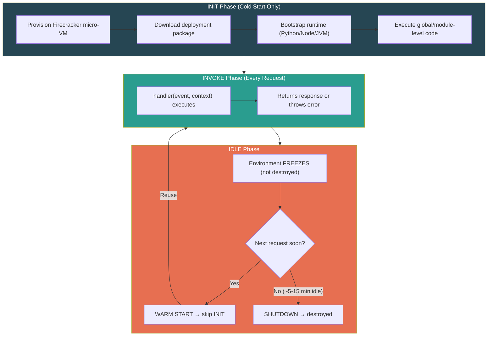
```mermaid
flowchart TD
    subgraph INIT["INIT Phase (Cold Start Only)"]
        I1["Provision Firecracker micro-VM"]
        I2["Download deployment package"]
        I3["Bootstrap runtime (Python/Node/JVM)"]
        I4["Execute global/module-level code"]
        I1 --> I2 --> I3 --> I4
    end
    subgraph INVOKE["INVOKE Phase (Every Request)"]
        H1["handler(event, context) executes"]
        H2["Returns response or throws error"]
        H1 --> H2
    end
    subgraph IDLE["IDLE Phase"]
        F1["Environment FREEZES (not destroyed)"]
        F2{"Next request soon?"}
        F3["WARM START → skip INIT"]
        F4["SHUTDOWN → destroyed"]
        F1 --> F2
        F2 -->|"Yes"| F3
        F2 -->|"No (~5-15 min idle)"| F4
    end

    INIT --> INVOKE --> IDLE
    F3 -->|"Reuse"| INVOKE

    style INIT fill:#264653,color:#fff
    style INVOKE fill:#2a9d8f,color:#fff
    style IDLE fill:#e76f51,color:#fff
```

---

## Cold Start vs Warm Start

| | Cold Start | Warm Start |
|--|-----------|------------|
| **When** | First request, scale-up, or after idle timeout | Subsequent request to an existing environment |
| **Phases** | INIT + INVOKE | INVOKE only |
| **Latency** | ~100ms (Python/Node) to ~2-10s (Java/.NET) | ~ms (handler only) |
| **Global scope** | Runs (imports, clients, connections) | **Skipped — reuses cached values** |

### The Golden Rule

> **Anything in global scope (outside the handler) runs ONCE during INIT and gets reused across warm invocations.**

```python
import boto3                          # ← Runs during INIT (once)
s3 = boto3.client('s3')              # ← SDK client reused across invocations
http_session = requests.Session()     # ← Connection pool reused

def handler(event, context):          # ← Runs every invocation
    paper_url = event['url']
    pdf = http_session.get(paper_url)
    s3.put_object(Bucket='papers', Key=f"{event['id']}.pdf", Body=pdf.content)
    return {'status': 'downloaded'}
```

---

## The `event` and `context` Objects

| Argument | What it is | Key attributes |
|----------|-----------|----------------|
| `event` | Trigger payload (JSON dict). **Shape varies per event source.** | S3 event ≠ API GW event ≠ SQS event |
| `context` | Runtime metadata injected by AWS | `function_name`, `memory_limit_in_mb`, `aws_request_id`, `get_remaining_time_in_millis()` |

---

## Concurrency = Separate Environments

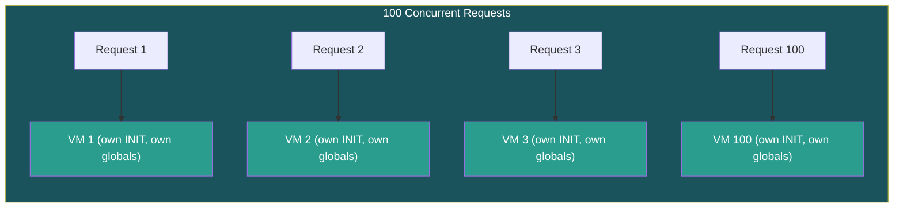
```mermaid
flowchart LR
    subgraph BURST["100 Concurrent Requests"]
        R1["Request 1"] --> VM1["VM 1 (own INIT, own globals)"]
        R2["Request 2"] --> VM2["VM 2 (own INIT, own globals)"]
        R3["Request 3"] --> VM3["VM 3 (own INIT, own globals)"]
        R100["Request 100"] --> VM100["VM 100 (own INIT, own globals)"]
    end

    style BURST fill:#1a535c,color:#fff
    style VM1 fill:#2a9d8f,color:#fff
    style VM2 fill:#2a9d8f,color:#fff
    style VM3 fill:#2a9d8f,color:#fff
    style VM100 fill:#2a9d8f,color:#fff
```

> ⚠️ **Warm reuse is sequential only.** 100 concurrent requests = 100 separate environments, each with its own INIT. DB connection pool in global scope? That's 100 separate pools. This is why **RDS Proxy** exists.

---

## ⚠️ Gotchas & Edge Cases

1. **Global state is SHARED across warm invocations.** Mutating a global list → next invocation sees the mutation. Treat globals as **read-only caches**, not mutable state.
2. **`/tmp` persists between warm invocations.** 512MB default (up to 10GB). Leftover files from previous invocations will be there.
3. **Firecracker micro-VM ≠ container.** Even container image deployments run inside Firecracker VMs. Container image is just a packaging format.
4. **`context.get_remaining_time_in_millis()`** — Check before expensive operations to avoid hard timeout kills mid-write.
5. **Environment reuse is non-deterministic.** Never rely on it for correctness, only for performance.

> **[SDE2 TRAP]** "Is Lambda stateless?" — The *invocation* is stateless, but the *execution environment* is stateful (global vars, /tmp, connections). Use statefulness for performance optimization, never for correctness.

---

## 📌 Interview Cheat Sheet

- Lambda = FaaS on **Firecracker micro-VMs** (not containers, not EC2)
- Three phases: **INIT → INVOKE → SHUTDOWN**
- Cold start: ~100ms (Python/Node) to ~2-10s (Java/.NET)
- **Global scope = init-once, reuse-many** — #1 optimization pattern
- Max timeout: **15 minutes** (hard limit)
- Max memory: **10,240 MB**
- Each concurrent request = separate environment = separate everything
- Warm reuse is **non-deterministic** — never rely on it for correctness


---

# AWS Lambda — Runtime, Packaging & Configuration

## The Handler — Lambda's Entry Point

Every Lambda has a handler — the function AWS invokes. Configured as `filename.function_name`.

```python
# File: app.py  |  Handler config: app.handler
def handler(event, context):
    return {"statusCode": 200, "body": "Hello"}
```

> **[SDE2 TRAP]** `event` has no universal schema. Every event source sends a different structure. Always validate/parse the event immediately (Pydantic, schema library). Blindly accessing `event['Records'][0]` causes outages.

---

## Runtimes

| Category | What | Examples |
|----------|------|----------|
| **AWS-Managed** | AWS patches & updates runtime layer | Python 3.9–3.13, Node 18–22, Java 17/21, .NET 8, Ruby 3.3 |
| **Custom Runtime** (`provided.al2023`) | Bring ANY language | Rust, Go, C++, Bash |

**Custom Runtime contract:** Your binary implements a polling loop that calls `http://${AWS_LAMBDA_RUNTIME_API}/2018-06-01/runtime/invocation/next` for events.

> Go and Rust are popular custom runtimes — tiny binaries, near-zero cold starts.

---

## Three Ways to Ship Code

### Option 1: ZIP Package

```
my-function.zip
├── app.py              ← handler
├── utils/              ← your modules
└── requests/           ← bundled dependencies
```

- Direct upload ≤ 50MB, via S3 ≤ **250MB unzipped** (hard ceiling)
- Simple, fast deploys

### Option 2: Container Image

```dockerfile
FROM public.ecr.aws/lambda/python:3.12
COPY app.py requirements.txt ./
RUN pip install -r requirements.txt
CMD ["app.handler"]
```

- Push to **ECR**, point Lambda at image
- Up to **10GB** image size
- Uses Lambda's **Runtime Interface Client (RIC)** — still runs in Firecracker VM
- Great for: ML models, heavy native deps, Docker-native teams

### Option 3: Lambda Layers

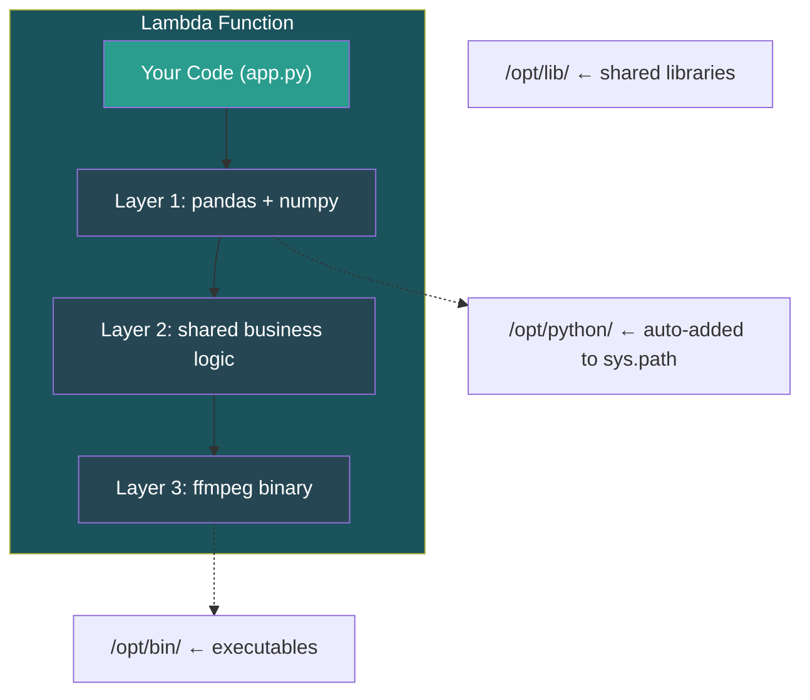
```mermaid
flowchart TD
    subgraph FUNC["Lambda Function"]
        CODE["Your Code (app.py)"]
        L1["Layer 1: pandas + numpy"]
        L2["Layer 2: shared business logic"]
        L3["Layer 3: ffmpeg binary"]
    end

    CODE --> L1
    L1 --> L2
    L2 --> L3

    OPT1["/opt/python/ ← auto-added to sys.path"]
    OPT2["/opt/bin/ ← executables"]
    OPT3["/opt/lib/ ← shared libraries"]

    L1 -.-> OPT1
    L3 -.-> OPT2

    style FUNC fill:#1a535c,color:#fff
    style CODE fill:#2a9d8f,color:#fff
    style L1 fill:#264653,color:#fff
    style L2 fill:#264653,color:#fff
    style L3 fill:#264653,color:#fff
```

- Max **5 layers** per function, **250MB total** (layers + function combined)
- Shared across functions — deploy once, reuse everywhere
- **Versioned and immutable** — each publish creates a new version number

### Decision Matrix

| Scenario | Use |
|----------|-----|
| Simple function, few deps | **ZIP** |
| Heavy deps, ML models, >250MB | **Container Image** |
| Shared deps across many functions | **Layers** |
| Non-standard language (Rust, Go) | **Custom runtime** on `provided.al2023` |

---

## Configuration — Env Vars, Secrets & Parameters

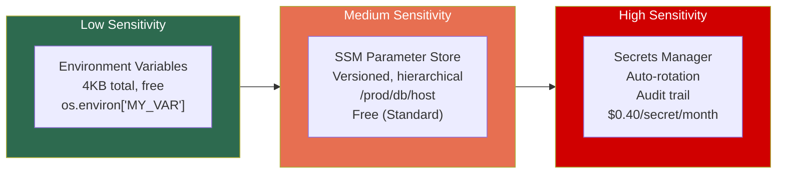
```mermaid
flowchart LR
    subgraph LOW["Low Sensitivity"]
        ENV["Environment Variables\n4KB total, free\nos.environ['MY_VAR']"]
    end
    subgraph MED["Medium Sensitivity"]
        SSM["SSM Parameter Store\nVersioned, hierarchical\n/prod/db/host\nFree (Standard)"]
    end
    subgraph HIGH["High Sensitivity"]
        SEC["Secrets Manager\nAuto-rotation\nAudit trail\n$0.40/secret/month"]
    end

    LOW --> MED --> HIGH

    style LOW fill:#2d6a4f,color:#fff
    style MED fill:#e76f51,color:#fff
    style HIGH fill:#d00000,color:#fff
```

### Tier Comparison

| Feature | Env Vars | SSM Parameter Store | Secrets Manager |
|---------|----------|-------------------|-----------------|
| **Cost** | Free | Free (Standard) / Paid (Advanced) | $0.40/secret/mo + API calls |
| **Size** | 4KB total all vars | 4KB (Std) / 8KB (Adv) | 64KB |
| **Rotation** | Manual redeploy | Manual | **Auto-rotation** (RDS, Redshift) |
| **Audit** | Limited | CloudTrail | **Full CloudTrail** |
| **Visibility** | Plaintext in console | Encrypted | Encrypted + ACL |
| **Best for** | Stage, log level, flags | DB host, config values | DB passwords, API keys, tokens |

### Production Pattern — Fetch at INIT, Cache Globally

```python
import boto3, os

# ✅ INIT: Fetch once, reuse across invocations
ssm = boto3.client('ssm')
db_host = ssm.get_parameter(Name='/prod/db/host')['Parameter']['Value']

secrets = boto3.client('secretsmanager')
db_creds = secrets.get_secret_value(SecretId='prod/db/creds')

def handler(event, context):
    # ✅ Uses cached values — no API calls per invocation
    connect_to_db(db_host, db_creds)
```

> **[SDE2 TRAP]** "Why not put DB password in env var?" — Env vars show up in **plaintext** in the Lambda console to anyone with `lambda:GetFunctionConfiguration` permission. Secrets Manager adds access control, audit trails, and rotation. Env vars for prod secrets = security smell.

---

## ⚠️ Gotchas & Edge Cases

1. **Layer order matters.** Two layers with same file path → **last layer wins.** Silent dependency version conflicts.
2. **Container image cold starts ~2-3x slower than ZIP.** AWS caches aggressively, but initial ECR pull is heavier. Use provisioned concurrency if latency matters.
3. **`/opt/python` must match runtime.** Layer built on Python 3.11 with C extensions will segfault on 3.13. Build in matching Amazon Linux environment.
4. **Secrets Manager caching.** If secret rotates mid-execution, cached value is stale. Use `aws-secretsmanager-caching` library (TTL-based refresh, default 1 hour).
5. **4KB env var limit is TOTAL**, not per variable. Large JSON blobs silently fail at deploy.

---

## 📌 Interview Cheat Sheet

- Handler = `filename.function_name`, receives `event` + `context`
- ZIP ≤ 250MB unzipped, Container ≤ 10GB, max 5 layers
- Container images still run in **Firecracker**, not Docker — packaging format only
- Custom runtime = implement **Lambda Runtime API** polling loop
- Env vars: 4KB total, visible in console → **never put production secrets here**
- SSM for config, Secrets Manager for secrets — both fetched at INIT, cached globally
- Secrets Manager differentiator: **automatic rotation** + CloudTrail audit
- Layers are **immutable & versioned** — publish creates new version, old functions pin to old versions


---

# AWS Lambda — Memory, CPU, Timeout & Cost

## The Memory-CPU Coupling

In Lambda, you **only configure memory**. CPU is coupled linearly:

| Memory | vCPUs | Multi-thread benefit? |
|--------|-------|----------------------|
| 128 MB | ~1/10th vCPU | ❌ |
| 512 MB | ~1/3 vCPU | ❌ |
| **1,769 MB** | **1 full vCPU** | ❌ (single core) |
| 3,538 MB | 2 vCPUs | ✅ parallel threads work |
| 5,307 MB | 3 vCPUs | ✅ |
| 10,240 MB | 6 vCPUs | ✅ |

> ⚠️ **1,769 MB = 1 full vCPU** — the magic number. Memorize it.

### The Non-Obvious Cost Optimization

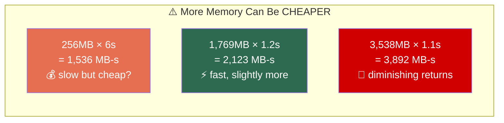
```mermaid
flowchart LR
    subgraph TRAP["⚠️ More Memory Can Be CHEAPER"]
        A["256MB × 6s\n= 1,536 MB-s\n💰 slow but cheap?"]
        B["1,769MB × 1.2s\n= 2,123 MB-s\n⚡ fast, slightly more"]
        C["3,538MB × 1.1s\n= 3,892 MB-s\n🐌 diminishing returns"]
    end

    style A fill:#e76f51,color:#fff
    style B fill:#2d6a4f,color:#fff
    style C fill:#d00000,color:#fff
```

> **[SDE2 TRAP]** "More memory = more expensive" is WRONG for CPU-bound functions. Cost = Memory × Time. If time drops faster than memory rises, **total cost decreases.**

### Network Bandwidth Also Scales with Memory

At 128MB you get terrible network throughput. Bumping memory improves download speed even if you don't need the RAM or CPU.

---

## Timeout Strategy

| Setting | Value |
|---------|-------|
| Minimum | 1 second |
| Maximum | **15 minutes (900s)** — hard limit, no exceptions |
| Default | 3 seconds |

### How to Set Timeout Correctly

```
Ideal timeout = P99 execution time × 2-3x safety margin
Example: P99 is 4 seconds → set timeout to 10-12 seconds
```

### The Timeout Hierarchy Trap

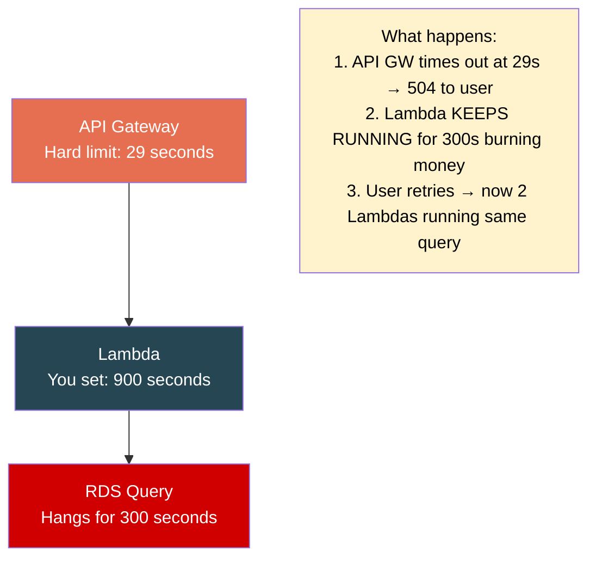
```mermaid
flowchart TD
    APIGW["API Gateway\nHard limit: 29 seconds"] --> LAMBDA["Lambda\nYou set: 900 seconds"]
    LAMBDA --> RDS["RDS Query\nHangs for 300 seconds"]

    RESULT["What happens:\n1. API GW times out at 29s → 504 to user\n2. Lambda KEEPS RUNNING for 300s burning money\n3. User retries → now 2 Lambdas running same query"]

    style APIGW fill:#e76f51,color:#fff
    style LAMBDA fill:#264653,color:#fff
    style RDS fill:#d00000,color:#fff
    style RESULT fill:#fff3cd,color:#000
```

> ⚠️ **Never set timeout to 900s "just to be safe."** Stuck functions burn money. Downstream callers have their own timeouts. Set tight, not max.

### Timeout ≠ Graceful Shutdown

When Lambda times out, your code is **killed mid-execution.** No `finally` blocks, no cleanup. Use `context.get_remaining_time_in_millis()` to self-terminate gracefully.

---

## Cost Model

### Three Pricing Components

| Component | Rate | Notes |
|-----------|------|-------|
| **Requests** | $0.20 per 1M invocations | Flat per-request charge |
| **Duration** | $0.0000166667 per GB-second | Billed per **1ms** granularity |
| **Provisioned Concurrency** | $0.0000041667 per GB-second | For pre-warmed environments (24/7) |

**Free tier (permanent):** 1M requests + 400,000 GB-seconds per month.

### Real Cost Calculation

```
Function: 512MB, avg 200ms, 10M invocations/month

Requests:  10M × $0.20/M                        = $2.00
Duration:  10M × 0.2s × 0.5GB × $0.0000166667   = $16.67
                                          TOTAL  = $18.67/month
```

### When Lambda Gets Expensive

```
Function: 3GB, avg 10s, 5M invocations/month

Duration: 5M × 10s × 3GB × $0.0000166667 = $2,500/month  ← bill shock
```

> Long duration + high memory + high volume = **Lambda bill shock.** This is where containers win.

### The Cost Crossover

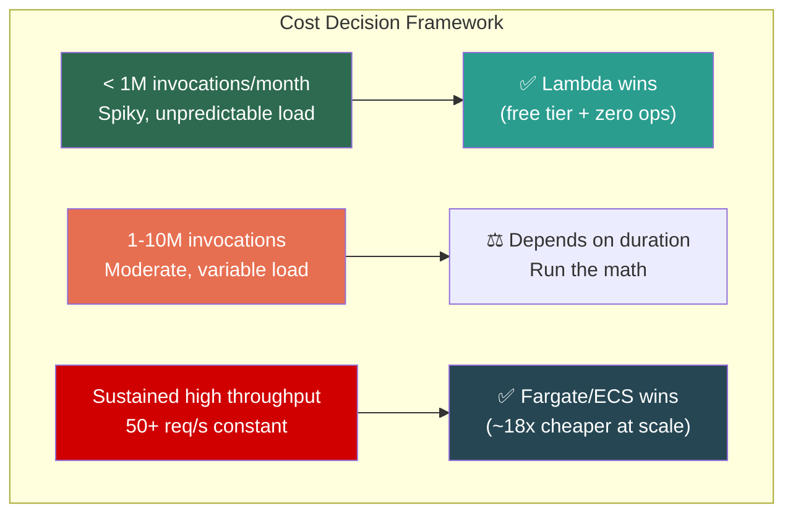
```mermaid
flowchart TD
    subgraph DECISION["Cost Decision Framework"]
        LOW["< 1M invocations/month\nSpiky, unpredictable load"]
        MED["1-10M invocations\nModerate, variable load"]
        HIGH["Sustained high throughput\n50+ req/s constant"]

        LOW --> LAMBDA["✅ Lambda wins\n(free tier + zero ops)"]
        MED --> DEPENDS["⚖️ Depends on duration\nRun the math"]
        HIGH --> CONTAINER["✅ Fargate/ECS wins\n(~18x cheaper at scale)"]
    end

    style LOW fill:#2d6a4f,color:#fff
    style MED fill:#e76f51,color:#fff
    style HIGH fill:#d00000,color:#fff
    style LAMBDA fill:#2a9d8f,color:#fff
    style CONTAINER fill:#264653,color:#fff
```

**Example at scale (50 req/s, 24/7, 2GB, 3s avg):**

| Platform | Monthly Cost |
|----------|-------------|
| Lambda | ~$12,986 |
| Fargate (10 tasks) | ~$711 |
| EC2 Reserved (3x c6g.xlarge) | ~$300 |

---

## Graviton (ARM) — Free Performance

| | x86_64 | arm64 (Graviton2) |
|--|--------|-------------------|
| Price | Baseline | **20% cheaper** |
| Performance | Baseline | **~15-25% faster** |
| Compatibility | Everything | Most things (watch C extensions) |

> Switch is **one config change.** Pure Python/Node/Java with no native binaries → zero reason not to use Graviton.

---

## Lambda Power Tuning

AWS open-source tool that runs your function at every memory setting and produces:

| Memory (MB) | Duration (ms) | Cost ($) | Verdict |
|-------------|---------------|----------|---------|
| 128 | 3200 | 0.0000068 | Too slow |
| 256 | 1700 | 0.0000072 | Still slow |
| 512 | 900 | 0.0000076 | Improving |
| 1024 | 480 | 0.0000082 | Good |
| **1769** | **310** | **0.0000091** | **⭐ Sweet spot** |
| 3008 | 290 | 0.0000145 | Diminishing returns |
| 10240 | 285 | 0.0000485 | Wasting money |

> **Sweet spot = where cost curve flattens while duration is acceptable.** Never guess — always power tune.

---

## ⚠️ Gotchas & Edge Cases

1. **1ms billing granularity.** Pre-2020 was 100ms (rounded up). Many old blog posts still reference 100ms. Use current 1ms numbers.
2. **Timeout ≠ billing input.** AWS charges for **actual execution time**, NOT the configured timeout. But oversized memory inflates every invocation's cost.
3. **Provisioned concurrency cost is 24/7.** 10 instances at 1GB = ~$108/month just for keeping warm, before any invocations.
4. **Ephemeral storage (`/tmp`) costs above 512MB.** Default 512MB free. Up to 10GB at $0.0000000309 per GB-second.
5. **Multi-threading only useful above 1,769 MB.** Below = single vCPU = parallel threads gain nothing.

---

## 📌 Interview Cheat Sheet

- Memory range: **128 MB to 10,240 MB** (1 MB increments)
- **1,769 MB = 1 full vCPU** — the magic number
- CPU scales **linearly** with memory — no separate CPU config
- Max timeout: **15 minutes / 900 seconds** — hard, non-negotiable
- Billing: per **1ms** granularity, measured as **GB-seconds**
- **Cost = Memory × Actual Execution Time** (NOT timeout)
- Graviton/ARM: **20% cheaper, ~20% faster** — one config flip
- Use **Lambda Power Tuning** to find optimal memory — never guess
- API Gateway hard limit: **29 seconds** — trumps Lambda timeout behind it
- Cost crossover: sustained high-throughput → **Fargate/ECS dramatically cheaper**


---

# AWS Lambda — IAM, Networking & Security

## Two Sides of Lambda IAM

Lambda has **two completely separate** IAM mechanisms. Most people conflate them.

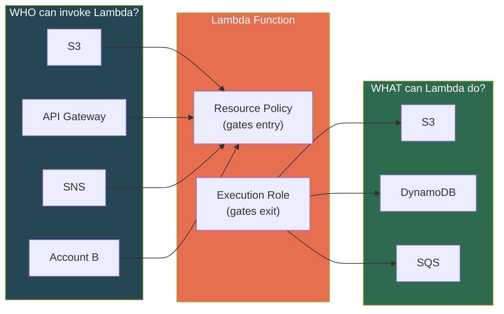
```mermaid
flowchart LR
    subgraph INBOUND["WHO can invoke Lambda?"]
        S3["S3"]
        APIGW["API Gateway"]
        SNS["SNS"]
        ACCB["Account B"]
    end
    subgraph LAMBDA["Lambda Function"]
        RP["Resource Policy\n(gates entry)"]
        ER["Execution Role\n(gates exit)"]
    end
    subgraph OUTBOUND["WHAT can Lambda do?"]
        S3O["S3"]
        DDB["DynamoDB"]
        SQS["SQS"]
    end

    S3 --> RP
    APIGW --> RP
    SNS --> RP
    ACCB --> RP
    ER --> S3O
    ER --> DDB
    ER --> SQS

    style INBOUND fill:#264653,color:#fff
    style LAMBDA fill:#e76f51,color:#fff
    style OUTBOUND fill:#2d6a4f,color:#fff
```

### Execution Role (What Lambda CAN DO)

IAM role Lambda **assumes** at INIT. Defines which AWS services your function can talk to.

```json
{
  "Effect": "Allow",
  "Action": ["s3:GetObject", "dynamodb:PutItem", "sqs:SendMessage"],
  "Resource": "arn:aws:s3:::my-bucket/*"
}
```

- Every Lambda **must** have an execution role
- Lambda calls `sts:AssumeRole` → temporary creds injected as env vars
- SDK clients auto-discover these — why `boto3.client('s3')` works without explicit credentials

### Resource Policy (Who Can INVOKE Lambda)

Policy attached to the Lambda function itself. Controls who/what can call it.

```json
{
  "Effect": "Allow",
  "Principal": { "Service": "s3.amazonaws.com" },
  "Action": "lambda:InvokeFunction",
  "Resource": "arn:aws:lambda:us-east-1:123456:function:my-func",
  "Condition": { "ArnLike": { "AWS:SourceArn": "arn:aws:s3:::my-bucket" } }
}
```

- Without this, trigger services get `AccessDeniedException`
- SAM/CDK add these automatically when you define event sources

---

## Cross-Account Invocation

> **[SDE2 TRAP]** "Can Lambda in Account A invoke Lambda in Account B?" — Yes, but you need **BOTH doors open:**

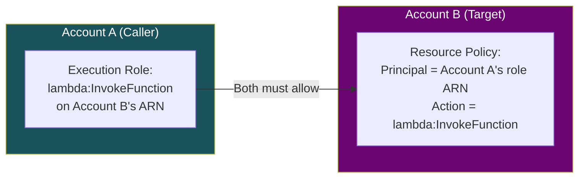
```mermaid
flowchart LR
    subgraph ACCA["Account A (Caller)"]
        ROLE_A["Execution Role:\nlambda:InvokeFunction\non Account B's ARN"]
    end
    subgraph ACCB["Account B (Target)"]
        RP_B["Resource Policy:\nPrincipal = Account A's role ARN\nAction = lambda:InvokeFunction"]
    end

    ROLE_A -->|"Both must allow"| RP_B

    style ACCA fill:#1a535c,color:#fff
    style ACCB fill:#6a0572,color:#fff
```

> Scope principal to **specific role ARN**, not entire account. `"AWS": "arn:aws:iam::ACCOUNT_A:root"` allows ANY role in Account A — too broad.

---

## Least Privilege — Production Standard

```json
// 🐛 TERRIBLE — "just make it work"
{ "Effect": "Allow", "Action": "s3:*", "Resource": "*" }

// ✅ PRODUCTION — scoped to exact actions and resources
{
  "Effect": "Allow",
  "Action": ["s3:GetObject", "s3:PutObject"],
  "Resource": "arn:aws:s3:::papers-bucket/raw/*"
}
```

**Checklist:**
- Scope **actions** to exact API calls (not `s3:*`)
- Scope **resources** to exact ARNs (not `*`)
- Use **conditions** where possible (`aws:SourceAccount`, `s3:prefix`)
- **Separate roles per function** — download function shouldn't have DynamoDB write access

---

## Lambda in a VPC — When and Why

### Default vs VPC Mode

| | Default (No VPC) | In Your VPC |
|--|-----------------|-------------|
| Internet access | ✅ Yes | ❌ Lost |
| AWS API access (S3, DDB) | ✅ Yes | ❌ Lost |
| Private resources (RDS) | ❌ No | ✅ Yes |
| Complexity | Low | Higher |

> **Only put Lambda in VPC when accessing private resources** (RDS, ElastiCache, OpenSearch). Every unnecessary VPC Lambda = added complexity + NAT cost.

### Restoring Connectivity from VPC

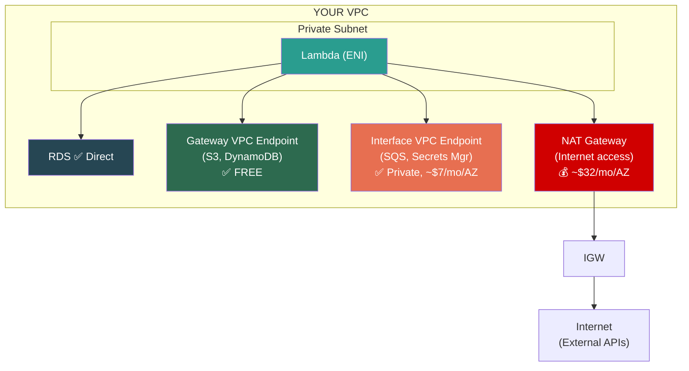
```mermaid
flowchart TD
    subgraph VPC["YOUR VPC"]
        subgraph PRIV["Private Subnet"]
            LAMBDA["Lambda (ENI)"]
        end
        RDS["RDS ✅ Direct"]
        GW_EP["Gateway VPC Endpoint\n(S3, DynamoDB)\n✅ FREE"]
        IF_EP["Interface VPC Endpoint\n(SQS, Secrets Mgr)\n✅ Private, ~$7/mo/AZ"]
        NAT["NAT Gateway\n(Internet access)\n💰 ~$32/mo/AZ"]
    end

    LAMBDA --> RDS
    LAMBDA --> GW_EP
    LAMBDA --> IF_EP
    LAMBDA --> NAT
    NAT --> IGW["IGW"] --> INET["Internet\n(External APIs)"]

    style LAMBDA fill:#2a9d8f,color:#fff
    style RDS fill:#264653,color:#fff
    style GW_EP fill:#2d6a4f,color:#fff
    style IF_EP fill:#e76f51,color:#fff
    style NAT fill:#d00000,color:#fff
```

| Target | Solution | Cost |
|--------|----------|------|
| S3, DynamoDB | **Gateway VPC Endpoint** | **Free** |
| SQS, Secrets Manager, SSM | **Interface VPC Endpoint (PrivateLink)** | ~$7/mo per endpoint per AZ |
| External APIs (Stripe, GitHub) | **NAT Gateway** | ~$32/mo per AZ + data processing |

---

## ENIs and Cold Start History

| Era | Behavior | Cold Start Penalty |
|-----|----------|-------------------|
| **Pre-2019** | New ENI created per environment | **10-30 seconds** |
| **Post-2019 (Hyperplane)** | Shared ENI pool managed by AWS | **~200-500ms** |

> **[SDE2 TRAP]** "VPC Lambda cold starts are terrible" — WAS true pre-2019. Post-Hyperplane, VPC adds ~200-500ms, not 10-30s. But DO mention subnet IP capacity needs.

### Subnet IP Planning

Each Lambda environment consumes **one IP** from the subnet.

```
1,000 concurrent Lambdas = 1,000 IPs needed
/24 subnet = 251 usable IPs → NOT ENOUGH
/20 subnet = 4,091 usable IPs → Safe
```

Always configure Lambda with subnets in **at least 2 AZs** for HA.

---

## Debugging Rule — Error vs Timeout

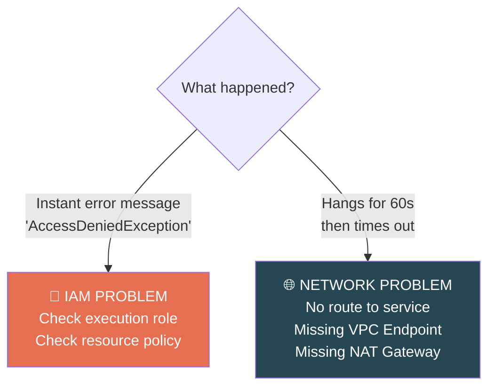
```mermaid
flowchart TD
    SYMPTOM{"What happened?"}
    SYMPTOM -->|"Instant error message\n'AccessDeniedException'"| IAM["🔑 IAM PROBLEM\nCheck execution role\nCheck resource policy"]
    SYMPTOM -->|"Hangs for 60s\nthen times out"| NET["🌐 NETWORK PROBLEM\nNo route to service\nMissing VPC Endpoint\nMissing NAT Gateway"]

    style IAM fill:#e76f51,color:#fff
    style NET fill:#264653,color:#fff
```

> ⚠️ **Memorize this.** "Access Denied" = IAM. "Timeout/Hang" = Network. Solves 80% of VPC Lambda issues.

---

## ⚠️ Gotchas & Edge Cases

1. **Security Groups on Lambda.** Yes, VPC Lambda gets SGs. Missing outbound rule = **silent timeout**, no error message.
2. **ENI limits per account.** Default ~5,000 per region. Lambda shares this with EC2, ECS. High-concurrency Lambda can exhaust quota.
3. **Multi-AZ required.** Always configure subnets in ≥2 AZs. If one AZ fails, Lambda needs alternatives.
4. **VPC Endpoint policies.** Gateway endpoints for S3 support resource policies — restrict Lambda to specific buckets beyond execution role. Defense in depth.
5. **Subnet IP exhaustion.** `/24` = 251 usable IPs. High-concurrency Lambda needs `/20` or larger.

---

## 📌 Interview Cheat Sheet

- **Execution Role** = what Lambda can do (outbound permissions)
- **Resource Policy** = who can invoke Lambda (inbound permissions)
- Cross-account needs **both** — execution role on caller + resource policy on target
- Default Lambda has internet. **VPC Lambda loses it** — restore with NAT GW or VPC Endpoints
- **Gateway Endpoints** (S3, DynamoDB) = free. **Interface Endpoints** = ~$7/mo/AZ
- Post-2019 Hyperplane: VPC cold start penalty is **~200-500ms**, not 10-30s
- Put Lambda in VPC **only** when accessing private resources
- Subnet sizing: plan for **peak concurrent executions = IPs needed**
- Debugging: error message = IAM problem, timeout = network problem


---

# AWS Lambda — Event Sources & Invocation Models

## The Three Invocation Models

This is the **backbone of every Lambda architecture decision.** Everything — retries, error handling, scaling — flows from which model your trigger uses.

| Model | Who waits? | Retry behavior | Examples |
|-------|-----------|----------------|----------|
| **Synchronous** | Caller blocks for response | **No built-in retry** — caller handles | API Gateway, ALB, CloudFront, `Invoke(RequestResponse)` |
| **Asynchronous** | Caller fires and forgets (gets 202) | **2 automatic retries** by Lambda | S3, SNS, EventBridge, CloudWatch Events, SES |
| **Stream/Polling** | Lambda polls the source | **Retries until data expires** (blocks shard) | SQS, Kinesis, DynamoDB Streams, Kafka |

---

## Synchronous Invocation

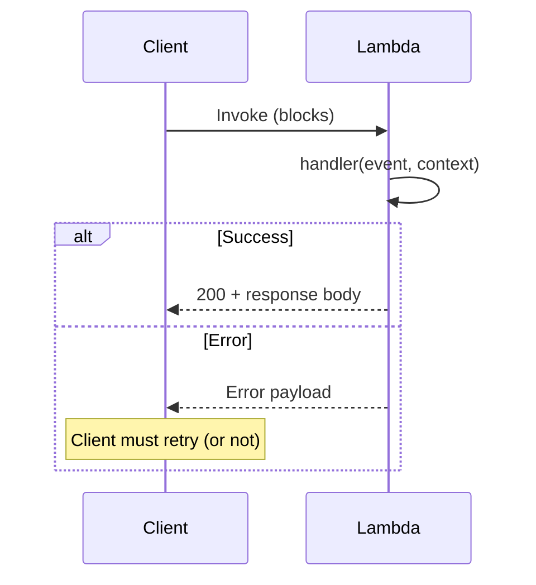
```mermaid
sequenceDiagram
    participant Client
    participant Lambda

    Client->>Lambda: Invoke (blocks)
    Lambda->>Lambda: handler(event, context)
    alt Success
        Lambda-->>Client: 200 + response body
    else Error
        Lambda-->>Client: Error payload
        Note over Client: Client must retry (or not)
    end
```

- Client gets the error **directly** — must handle retries itself
- **No DLQ, no destinations.** You own error handling.
- API Gateway, ALB, SDK `Invoke()` with `RequestResponse`

---

## Asynchronous Invocation

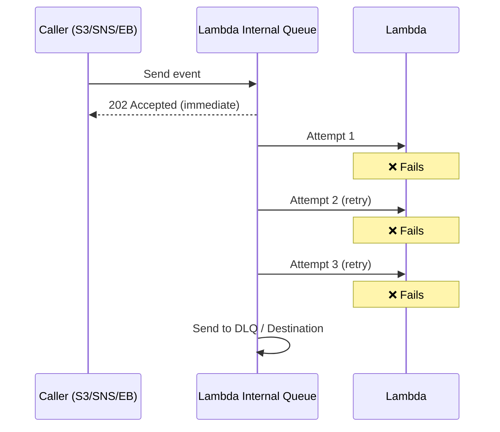
```mermaid
sequenceDiagram
    participant Caller as Caller (S3/SNS/EB)
    participant Queue as Lambda Internal Queue
    participant Lambda

    Caller->>Queue: Send event
    Queue-->>Caller: 202 Accepted (immediate)
    
    Queue->>Lambda: Attempt 1
    Note over Lambda: ❌ Fails
    Queue->>Lambda: Attempt 2 (retry)
    Note over Lambda: ❌ Fails
    Queue->>Lambda: Attempt 3 (retry)
    Note over Lambda: ❌ Fails
    Queue->>Queue: Send to DLQ / Destination
```

- Lambda manages an **internal queue** between caller and function
- **3 total attempts** (1 original + 2 retries)
- Configurable: `MaximumRetryAttempts` (0, 1, or 2) and `MaximumEventAgeSeconds` (60s–6hrs)
- Failed events → **DLQ** (SQS/SNS) or **Destinations** (EventBridge, SQS, SNS, Lambda)

> ⚠️ If no DLQ or Destination configured, failed events are **silently dropped.** Gone forever. No alarm, no log. **Destinations are non-negotiable for async Lambda in production.**

---

## Stream/Polling (Event Source Mapping)

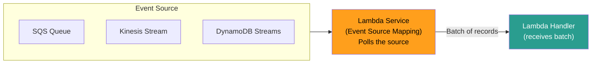
```mermaid
flowchart LR
    subgraph SOURCE["Event Source"]
        SQS["SQS Queue"]
        KIN["Kinesis Stream"]
        DDB["DynamoDB Streams"]
    end
    ESM["Lambda Service\n(Event Source Mapping)\nPolls the source"] 
    LAMBDA["Lambda Handler\n(receives batch)"]

    SOURCE --> ESM -->|"Batch of records"| LAMBDA

    style ESM fill:#ff9f1c,color:#000
    style LAMBDA fill:#2a9d8f,color:#fff
```

- Lambda **polls** the source — you don't push to Lambda
- Reads in **batches** (configurable: 1–10,000)
- **SQS:** failed batch → messages return to queue (visibility timeout) → retry naturally
- **Kinesis/DDB Streams:** failed batch → **blocks the entire shard** until success or expiry

### The Kinesis Poison Pill Problem

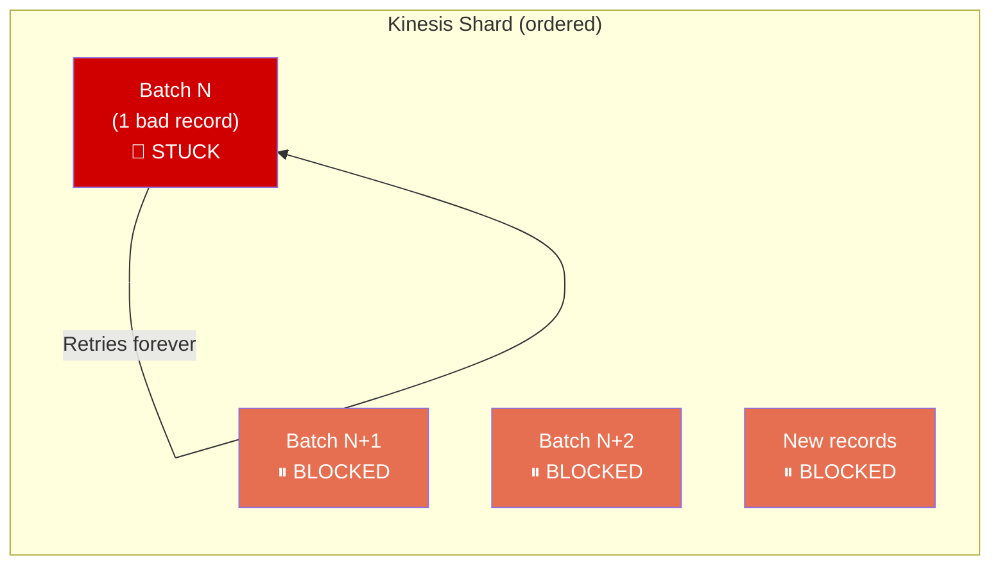
```mermaid
flowchart LR
    subgraph SHARD["Kinesis Shard (ordered)"]
        B1["Batch N\n(1 bad record)\n🔴 STUCK"]
        B2["Batch N+1\n⏸ BLOCKED"]
        B3["Batch N+2\n⏸ BLOCKED"]
        B4["New records\n⏸ BLOCKED"]
    end

    B1 -->|"Retries forever"| B1
    
    style B1 fill:#d00000,color:#fff
    style B2 fill:#e76f51,color:#fff
    style B3 fill:#e76f51,color:#fff
    style B4 fill:#e76f51,color:#fff
```

> **[SDE2 TRAP]** One bad record blocks the ENTIRE shard. All newer records stuck. `IteratorAge` metric climbs. Pipeline backs up.

**The fix — three configs together:**

| Config | What it does |
|--------|-------------|
| `BisectBatchOnFunctionError: true` | Splits failing batch in half → isolates bad record |
| `MaximumRetryAttempts: 3` | Stops infinite retry after N attempts |
| `DestinationConfig.OnFailure` | Sends poison record to SQS/SNS for investigation |
| `MaximumRecordAgeInSeconds: 3600` | Skip records older than threshold |

---

## SQS Visibility Timeout Trap

> ⚠️ **SQS visibility timeout must be ≥ 6× your Lambda timeout.**

```
Lambda timeout: 60s
Visibility timeout: 30s (default)

Problem: Lambda processing at second 35 → message becomes visible again
         → ANOTHER Lambda picks it up → DUPLICATE processing
         
Fix: Set visibility timeout to 360s (6 × 60s)
```

---

## Event Source Mapping — Scaling Behavior

| Source | Scaling | Concurrency |
|--------|---------|-------------|
| **SQS Standard** | Up to 1,000 batches/min, scales with queue depth | Up to 1,000 concurrent Lambda instances |
| **SQS FIFO** | One Lambda per message group ID | Limited by # of message groups |
| **Kinesis** | One Lambda per shard (default) | Enable `ParallelizationFactor` (1–10) for up to 10 per shard |
| **DynamoDB Streams** | One Lambda per shard | Same as Kinesis |

---

## ⚠️ Gotchas & Edge Cases

1. **Async internal queue has 1,000,000 event limit.** Beyond that, new events throttled silently.
2. **S3 → Lambda is async.** S3 fires and forgets. If Lambda fails all 3 attempts and no DLQ → event lost.
3. **SQS → Lambda is polling (NOT async).** Common misconception. Lambda service polls SQS, not SQS pushing to Lambda.
4. **Kinesis ordering guarantee** — records within a shard are processed in order. That's WHY shard blocking exists.
5. **SNS → Lambda is async.** SNS delivers to Lambda's internal async queue, not directly.

---

## 📌 Interview Cheat Sheet

- **Sync:** caller retries, 429 on throttle. API GW, ALB, SDK invoke.
- **Async:** Lambda retries 2×, then DLQ/Destination. S3, SNS, EventBridge.
- **Stream/Poll:** batch processing, shard blocking (Kinesis/DDB), visibility timeout (SQS).
- Kinesis poison pill → `BisectBatchOnFunctionError` + `MaximumRetryAttempts` + failure Destination.
- SQS visibility timeout ≥ **6× Lambda timeout**.
- No DLQ/Destination on async = **silent event loss**.
- SQS scales to 1,000 concurrent. Kinesis = 1 per shard (×10 with parallelization factor).


---

# AWS Lambda — Concurrency, Scaling & Throttling

## How Lambda Scales

Lambda scales **horizontally** by adding execution environments. Each environment handles **one request at a time.**

```
1 concurrent request   = 1 environment
100 concurrent requests = 100 environments
1000 concurrent        = 1000 environments (if within limits)
```

---

## Account-Level Limits

| Limit | Value | Adjustable? |
|-------|-------|-------------|
| **Account concurrency** | 1,000 per region (default) | Yes, request to 10K+ |
| **Burst limit** | 3,000 (us-east-1), 1,000 (most), 500 (others) | No |
| **Post-burst rate** | +500 environments/minute | No |

### Burst Behavior

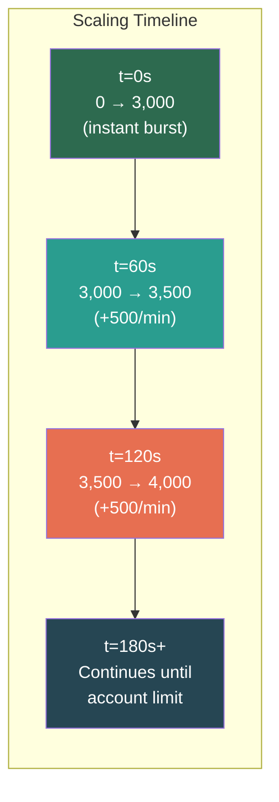
```mermaid
flowchart LR
    subgraph BURST["Scaling Timeline"]
        T0["t=0s\n0 → 3,000\n(instant burst)"]
        T1["t=60s\n3,000 → 3,500\n(+500/min)"]
        T2["t=120s\n3,500 → 4,000\n(+500/min)"]
        T3["t=180s+\nContinues until\naccount limit"]
    end

    T0 --> T1 --> T2 --> T3

    style T0 fill:#2d6a4f,color:#fff
    style T1 fill:#2a9d8f,color:#fff
    style T2 fill:#e76f51,color:#fff
    style T3 fill:#264653,color:#fff
```

---

## Three Concurrency Flavors

### 1. Unreserved (Default)

All functions share the account pool. One runaway function can **starve others.**

### 2. Reserved Concurrency

Guarantees N environments for this function. Also acts as a **hard cap.**

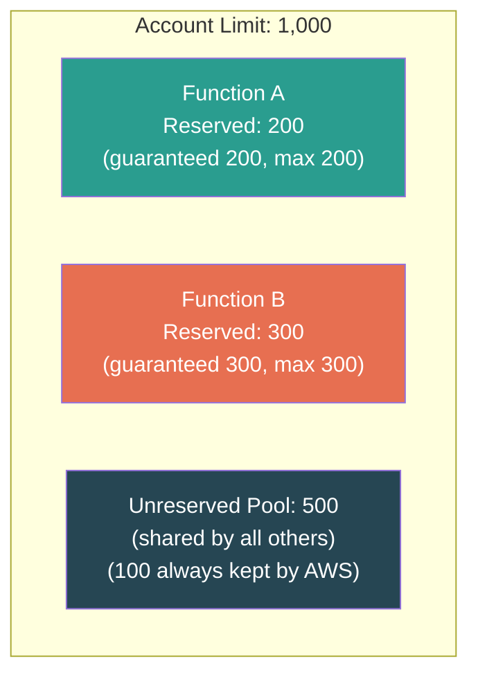
```mermaid
flowchart TD
    subgraph ACCOUNT["Account Limit: 1,000"]
        FA["Function A\nReserved: 200\n(guaranteed 200, max 200)"]
        FB["Function B\nReserved: 300\n(guaranteed 300, max 300)"]
        POOL["Unreserved Pool: 500\n(shared by all others)\n(100 always kept by AWS)"]
    end

    style FA fill:#2a9d8f,color:#fff
    style FB fill:#e76f51,color:#fff
    style POOL fill:#264653,color:#fff
```

> **[SDE2 TRAP]** Reserved concurrency is both a **floor AND a ceiling.** Setting it to 5 means your function CANNOT exceed 5 concurrent executions — excess gets throttled (429). People set it for "guarantee" and accidentally create a bottleneck.

**Special case:** Reserved concurrency = **0** effectively **disables** the function. Used as an emergency kill switch in production.

### 3. Provisioned Concurrency

Pre-warms N environments — **zero cold starts** for those N.

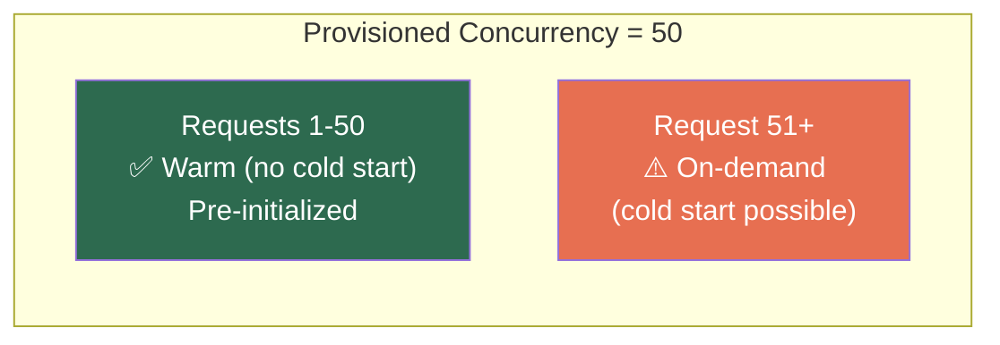
```mermaid
flowchart LR
    subgraph PC["Provisioned Concurrency = 50"]
        WARM["Requests 1-50\n✅ Warm (no cold start)\nPre-initialized"]
        COLD["Request 51+\n⚠️ On-demand\n(cold start possible)"]
    end

    style WARM fill:#2d6a4f,color:#fff
    style COLD fill:#e76f51,color:#fff
```

**Cost:** ~$0.0000041667 per GB-second, **24/7** whether invoked or not.

> ⚠️ **Provisioned counts against reserved.** If reserved = 100 and provisioned = 100, you get exactly 100 with zero cold starts but NO burst capacity above 100.

---

## Concurrency Math Example

```
Account limit: 1,000
Function A: Reserved = 400
AWS keeps: 100 unreserved (mandatory buffer)
Unreserved pool: 1,000 - 400 = 600

Function B (no reservation): 900 concurrent requests arrive
  → Max available from pool: 600
  → Served: 600
  → Throttled: 300 (429 error)
```

---

## Throttling Behavior Per Invocation Type

| Invocation Type | What Happens on Throttle |
|----------------|--------------------------|
| **Synchronous** | Returns **429 TooManyRequestsException** to caller immediately |
| **Asynchronous** | Lambda retries for up to **6 hours**, then sends to DLQ |
| **Stream/Polling** | Reduces read rate, retries. **Does not drop records.** |

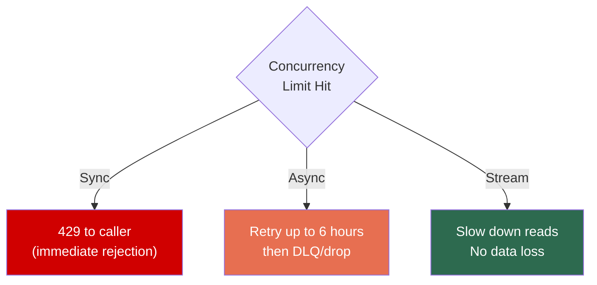
```mermaid
flowchart TD
    THROTTLE{"Concurrency\nLimit Hit"}
    THROTTLE -->|"Sync"| SYNC["429 to caller\n(immediate rejection)"]
    THROTTLE -->|"Async"| ASYNC["Retry up to 6 hours\nthen DLQ/drop"]
    THROTTLE -->|"Stream"| STREAM["Slow down reads\nNo data loss"]

    style SYNC fill:#d00000,color:#fff
    style ASYNC fill:#e76f51,color:#fff
    style STREAM fill:#2d6a4f,color:#fff
```

---

## Scaling Anti-Patterns

### 1. No Reserved Concurrency on Critical Functions

```
Problem: Function A (batch job) spikes to 900 concurrent
         Function B (API handler) gets only 100 → users see 429s

Fix: Reserve concurrency for Function B (e.g., 200)
     Function A can only use remaining pool
```

### 2. Lambda + RDS Without Protection

```
Problem: Lambda scales to 1,000 concurrent → 1,000 DB connections
         RDS max connections ~1,000 for small instances → DB overwhelmed

Fix: RDS Proxy (connection pooling across Lambda environments)
     OR reserved concurrency to cap Lambda (e.g., 100)
```

### 3. Provisioned Without Reserved

```
Problem: Provisioned = 50 but no reserved concurrency set
         During traffic spike, Lambda scales to 500 (on-demand)
         → 450 cold starts + full account pool consumption

Fix: Set reserved = 100, provisioned = 50
     → 50 warm + 50 on-demand max + account pool protected
```

---

## ⚠️ Gotchas & Edge Cases

1. **Account-level limit is SHARED.** All Lambda functions in a region compete for the same 1,000 (default). One noisy function starves everyone.
2. **Burst limit is region-specific** and non-adjustable. us-east-1 = 3,000. ap-south-1 = 500. Plan accordingly.
3. **Reserved concurrency minimum is 0** (disables function), but AWS always holds back **100 unreserved** for other functions. Max reservable = account limit - 100.
4. **Provisioned concurrency on `$LATEST` is not allowed.** Must point to a published **version** or **alias.**
5. **Auto Scaling for provisioned concurrency** exists — scales provisioned count up/down based on utilization via Application Auto Scaling.

---

## 📌 Interview Cheat Sheet

- Default: **1,000 concurrent per region** (adjustable). Burst: **3,000** (us-east-1).
- **1 request = 1 environment.** Horizontal scaling only.
- **Reserved = floor + ceiling.** Guarantees AND caps concurrency.
- **Provisioned = pre-warmed** environments. Costs 24/7. Must target version/alias.
- Reserved = 0 → **kill switch** (function disabled).
- Throttle behavior: Sync → 429, Async → 6hr retry, Stream → slow reads.
- **100 always unreserved** — AWS prevents total starvation.
- RDS + Lambda = use **RDS Proxy** or cap with reserved concurrency.
- Post-burst scaling: **+500 environments/minute.**


---

# AWS Lambda — Error Handling, Retries & Observability

## Retry Matrix — The Complete Picture

| Invocation | Who Retries | How Many | Final Failure |
|-----------|------------|----------|---------------|
| **Sync** | **Caller** (you code it) | Up to you | Caller gets error |
| **Async** | **Lambda service** | 2 retries (configurable 0–2) | DLQ or Destination |
| **SQS polling** | **SQS** (visibility timeout) | Until `maxReceiveCount` | SQS DLQ (redrive policy) |
| **Kinesis/DDB** | **Lambda** (blocks shard) | Until record expires or max retry | On-failure Destination |

---

## DLQ vs Destinations

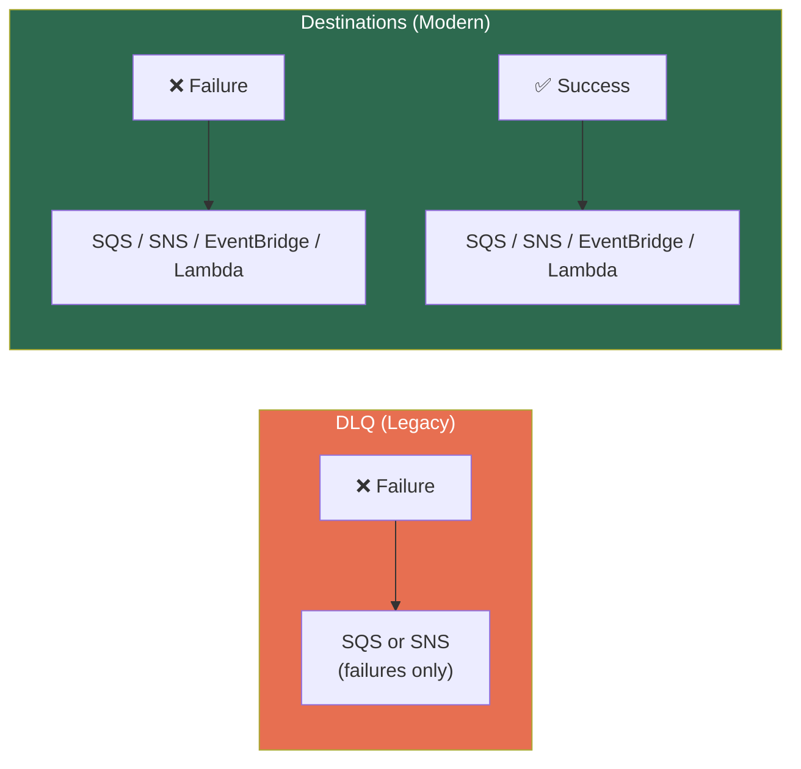
```mermaid
flowchart LR
    subgraph DLQ_PATH["DLQ (Legacy)"]
        FAIL1["❌ Failure"] --> DLQ["SQS or SNS\n(failures only)"]
    end
    subgraph DEST_PATH["Destinations (Modern)"]
        FAIL2["❌ Failure"] --> DEST_F["SQS / SNS / EventBridge / Lambda"]
        SUCC["✅ Success"] --> DEST_S["SQS / SNS / EventBridge / Lambda"]
    end

    style DLQ_PATH fill:#e76f51,color:#fff
    style DEST_PATH fill:#2d6a4f,color:#fff
```

| Feature | DLQ | Destinations |
|---------|-----|-------------|
| Captures failures | ✅ | ✅ |
| Captures **successes** | ❌ | ✅ |
| Targets | SQS, SNS only | SQS, SNS, EventBridge, Lambda |
| Metadata included | Minimal | Full (request/response context) |
| Recommendation | Legacy, backward compat | **Use for all new development** |

---

## Partial Batch Failure (SQS)

### Before (Pre-2021)

1 message in a batch of 10 fails → **all 10 return to queue** → 9 successful messages reprocessed.

### After — `ReportBatchItemFailures`

Return only failed message IDs. Only those retry.

```python
def handler(event, context):
    failures = []
    for record in event['Records']:
        try:
            process(record)
        except Exception:
            failures.append({"itemIdentifier": record["messageId"]})
    
    return {"batchItemFailures": failures}  # Only these retry
```

> ⚠️ **Always enable this.** Without it, you get duplicate processing of successful messages on every partial failure.

---

## Observability — Three Pillars

### 1. CloudWatch Logs

- Every `print()` / `console.log()` → Log Group: `/aws/lambda/function-name`
- **Log retention is infinite by default** → set a retention policy or CloudWatch bill explodes

**Structured logging with Lambda Powertools:**
```python
from aws_lambda_powertools import Logger
logger = Logger(service="download-service")

@logger.inject_lambda_context
def handler(event, context):
    logger.info("Processing paper", paper_id=event['id'])
```

### 2. CloudWatch Metrics (Built-in, Free)

| Metric | What It Tells You | Alert When |
|--------|-------------------|------------|
| `Invocations` | Total calls | Unexpected drop (broken trigger) |
| `Errors` | Unhandled exceptions | > 0 for critical functions |
| `Throttles` | 429s — concurrency limit hit | > 0 (capacity planning) |
| `Duration` | Execution time (P50/P99/Max) | P99 approaching timeout |
| `ConcurrentExecutions` | Active environments right now | Approaching account limit |
| `IteratorAge` | How far behind on stream | **Growing = consumer lag** |

> **[SDE2 TRAP]** `IteratorAge` on Kinesis/DDB Streams — if this grows, your Lambda can't keep up. This is the **#1 alarm to set** for stream-based Lambda.

### 3. X-Ray Tracing

```mermaid
flowchart LR
    CLIENT["Client"] --> APIGW["API Gateway\n12ms"]
    APIGW --> LAMBDA["Lambda\n45ms\n(init: 15ms)"]
    LAMBDA --> DDB["DynamoDB\n8ms"]
    LAMBDA --> S3["S3 PutObject\n22ms"]

    style LAMBDA fill:#2a9d8f,color:#fff
    style DDB fill:#264653,color:#fff
    style S3 fill:#e76f51,color:#fff
```

- End-to-end request tracing across services
- Enable with one toggle: `TracingConfig: Active`
- Shows exactly where time is spent — cold start, handler, SDK calls

---

## ⚠️ Gotchas & Edge Cases

1. **CloudWatch Log Group not auto-deleted** when Lambda is deleted. Orphan log groups accumulate cost. Clean up in teardown scripts.
2. **X-Ray adds ~1-2ms overhead** per traced call. Negligible for most, but matters at sub-10ms requirements.
3. **Async retry delay is not configurable.** Lambda waits ~1 min before retry 1, ~2 min before retry 2. Can't speed it up.
4. **SQS DLQ vs Lambda DLQ** — SQS has its own DLQ (via redrive policy) separate from Lambda's DLQ. For SQS-triggered Lambda, use **SQS redrive policy**, not Lambda DLQ.
5. **`Errors` metric counts unhandled exceptions only.** Caught exceptions with graceful error responses show as successful invocations.

---

## 📌 Interview Cheat Sheet

- Sync → caller retries. Async → Lambda retries 2×. Stream → retries until expiry.
- **Destinations > DLQs** — captures both success and failure, more targets.
- `ReportBatchItemFailures` for SQS — prevents duplicate processing of successful messages.
- Key metrics: **Errors, Throttles, Duration (P99), ConcurrentExecutions, IteratorAge**
- `IteratorAge` growing = **consumer lag** on streams. #1 alarm for Kinesis Lambda.
- X-Ray: one toggle for end-to-end tracing. Shows cold start breakdown.
- Log retention default = **infinite**. Always set a retention policy.
- SQS-triggered Lambda → use **SQS redrive policy** for DLQ, not Lambda DLQ.


---

# AWS Lambda — Deployment: Versions, Aliases & Traffic Shifting

## Versions — Immutable Snapshots

```mermaid
flowchart LR
    LATEST["$LATEST\n(mutable)"] -->|"publish"| V1["Version 1\n(immutable)"]
    LATEST -->|"publish"| V2["Version 2\n(immutable)"]
    LATEST -->|"publish"| V3["Version 3\n(immutable)"]

    style LATEST fill:#e76f51,color:#fff
    style V1 fill:#264653,color:#fff
    style V2 fill:#264653,color:#fff
    style V3 fill:#264653,color:#fff
```

- `$LATEST` is **mutable** — every deploy updates it
- Publishing creates a **numbered, immutable snapshot** (code + config frozen)
- Each version has its own ARN: `arn:aws:lambda:...:function:my-func:3`
- You **cannot** change a published version. Ever.

---

## Aliases — Named Pointers

An alias is a **named pointer** to a version. Like a DNS CNAME for Lambda.

```mermaid
flowchart LR
    PROD["Alias: prod"] -->|"100%"| V5["Version 5"]
    STAGING["Alias: staging"] -->|"100%"| V6["Version 6"]
    CANARY["Alias: canary"] -->|"90%"| V6
    CANARY -->|"10%"| V7["Version 7"]

    style PROD fill:#2d6a4f,color:#fff
    style STAGING fill:#e76f51,color:#fff
    style CANARY fill:#ff9f1c,color:#000
    style V5 fill:#264653,color:#fff
    style V6 fill:#264653,color:#fff
    style V7 fill:#264653,color:#fff
```

- Alias has its own **stable ARN**: `arn:aws:lambda:...:function:my-func:prod`
- API Gateway / event sources point to the **alias**, not the version
- Shift traffic by updating alias pointer — **no downstream changes**

---

## Traffic Shifting — Safe Deployments

### Three Strategies

| Strategy | How It Works | Risk Level |
|----------|-------------|------------|
| **Canary** | X% to new for N minutes, then 100% if healthy | Low |
| **Linear** | Shift X% every N minutes incrementally | Medium |
| **All-at-once** | 0% → 100% instantly | High |

### Canary Deployment Flow

```mermaid
sequenceDiagram
    participant Deploy as CodeDeploy
    participant Alias as "prod" Alias
    participant CW as CloudWatch Alarms

    Deploy->>Alias: Route 95% → V5, 5% → V6
    Note over Alias: Canary window (10 min)
    
    alt Alarms OK
        Deploy->>Alias: Route 0% → V5, 100% → V6
        Note over Deploy: ✅ Deployment SUCCEEDED
    else Alarm fires
        Deploy->>Alias: Route 100% → V5, 0% → V6
        Note over Deploy: 🔴 Automatic ROLLBACK
    end
```

### SAM Template Example

```yaml
AutoPublishAlias: prod
DeploymentPreference:
  Type: Canary10Percent5Minutes
  Alarms:
    - !Ref ErrorsAlarm
    - !Ref LatencyAlarm
```

If `ErrorsAlarm` fires during canary window → **automatic rollback.** Zero human intervention.

### Common Deployment Types

| SAM Type | Behavior |
|----------|----------|
| `Canary10Percent5Minutes` | 10% for 5 min, then 100% |
| `Canary10Percent30Minutes` | 10% for 30 min, then 100% |
| `Linear10PercentEvery1Minute` | 10% → 20% → ... → 100% |
| `AllAtOnce` | Instant 100% (use for non-critical) |

---

## ⚠️ Gotchas & Edge Cases

1. **Aliases can't point to `$LATEST`.** Weighted aliases require two **published versions.** Trips up CI/CD pipelines that only use `$LATEST`.
2. **Provisioned concurrency targets versions/aliases**, not `$LATEST`. Your deployment pipeline must publish versions.
3. **Version is NOT deleted when you rollback.** It still exists as an immutable snapshot. Investigate, fix, redeploy as next version.
4. **Each alias can split traffic between exactly 2 versions** — not 3 or more.
5. **Event source mappings tied to an alias** automatically route to whatever the alias points to. No reconfiguration needed on deploy.

---

## 📌 Interview Cheat Sheet

- **$LATEST** = mutable. **Published versions** = immutable snapshots.
- **Aliases** = named pointers (like DNS CNAME). Point event sources to aliases, not versions.
- **Canary/Linear** via CodeDeploy + CloudWatch alarms = automated safe deployments + auto-rollback.
- Alias splits between **exactly 2 versions** (not more).
- Provisioned concurrency must target **version or alias**, not $LATEST.
- Rollback = alias shifts back to previous version. Failed version persists for investigation.


---

# AWS Lambda — Orchestration & Edge Compute

## The Lambda Chaining Anti-Pattern

```mermaid
flowchart LR
    subgraph BAD["❌ NEVER DO THIS"]
        LA["Lambda A"] -->|"invokes"| LB["Lambda B"] -->|"invokes"| LC["Lambda C"]
    end
    subgraph GOOD["✅ USE STEP FUNCTIONS"]
        SF["Step Functions"] --> LA2["Lambda A"]
        SF --> LB2["Lambda B"]
        SF --> LC2["Lambda C"]
    end

    style BAD fill:#d00000,color:#fff
    style GOOD fill:#2d6a4f,color:#fff
```

**Why chaining is terrible:**
1. Lambda A pays for its OWN execution + waits for B + C (triple billing)
2. Total timeout = A's 15min limit (B+C must finish within A's timeout)
3. Error handling = nested try/catch nightmare
4. No visibility into where the chain broke

---

## Step Functions — Standard vs Express

| Feature | Standard | Express |
|---------|----------|---------|
| Max duration | **1 year** | **5 minutes** |
| Execution model | **Exactly-once** | **At-least-once** |
| Pricing | Per state transition ($0.025/1K) | Per execution + duration |
| State history | Full (console, 90 days) | CloudWatch Logs only |
| Max start rate | 2,000/sec | 100,000/sec |
| Use case | Long workflows, approvals | High-volume data processing |

---

## Key State Types

| State | Purpose | Example |
|-------|---------|---------|
| **Task** | Invoke Lambda, ECS, API, SDK call | Process a document |
| **Choice** | Branching logic (if/else) | Route by file type |
| **Parallel** | Run branches concurrently | Process image + metadata simultaneously |
| **Map** | Loop over collection — fan-out | Process each item in a list |
| **Wait** | Pause for N seconds or timestamp | Rate limiting |
| **Pass** | Transform data, inject values | Reshape JSON between steps |

---

## Map State — Fan-Out Done Right

```mermaid
flowchart TD
    INPUT["Input: 50,000 images in S3"] --> MAP["Distributed Map State"]
    MAP -->|"MaxConcurrency: 100"| L1["Lambda 1\n(image 1)"]
    MAP --> L2["Lambda 2\n(image 2)"]
    MAP --> L3["Lambda 3\n(image 3)"]
    MAP --> LN["Lambda N\n(image N)"]
    L1 --> AGG["Aggregated Results"]
    L2 --> AGG
    L3 --> AGG
    LN --> AGG

    style MAP fill:#ff9f1c,color:#000
    style AGG fill:#2d6a4f,color:#fff
```

| Map Type | Max Items | Source | Use When |
|----------|-----------|--------|----------|
| **Inline Map** | ~40 concurrent | Items in input JSON | Small collections |
| **Distributed Map** | Thousands concurrent | **Items in S3** | Massive scale (millions) |

> ⚠️ **Always set `MaxConcurrency`.** Without it, 50K items launches 50K Lambdas → account throttle + downstream overwhelm.

---

## SDK Integration — Skip Lambda Entirely

Step Functions can call **200+ AWS services directly:**

```
❌  Step Function → Lambda (just calls DynamoDB) → DynamoDB
✅  Step Function → DynamoDB (direct SDK integration)

Saves: Lambda cost + latency + code to maintain
```

Direct integrations: DynamoDB, SQS, SNS, S3, ECS, Glue, SageMaker, etc.

> **[SDE2 TRAP]** "When Step Functions vs SQS between Lambdas?" — SQS for simple one-hop decoupling (fire-and-forget). Step Functions for **multi-step workflows with branching, per-step error handling, retries, and visual debugging.** If you draw a flowchart → Step Functions. If it's just A→B → SQS/SNS.

---

## Lambda@Edge vs CloudFront Functions

```mermaid
flowchart LR
    USER["User Request"] --> CF["CloudFront"]
    CF -->|"Viewer Request"| VR["Trigger Point 1"]
    CF -->|"Origin Request"| OR["Trigger Point 2"]
    CF -->|"Origin Response"| ORS["Trigger Point 3"]
    CF -->|"Viewer Response"| VRS["Trigger Point 4"]
    CF --> ORIGIN["Origin (S3/ALB)"]

    style CF fill:#ff9f1c,color:#000
```

| Feature | CloudFront Functions | Lambda@Edge |
|---------|---------------------|-------------|
| Runtime | JavaScript only | Node.js, Python |
| Max duration | **1ms** | **5–30s** |
| Max memory | **2MB** | **128–3008 MB** |
| Scale | **Millions RPS** | Thousands RPS |
| Network access | ❌ | ✅ |
| Body access | ❌ | ✅ |
| Price | 1/6th of Lambda@Edge | Per request + duration |
| Deploy region | All edges auto | **us-east-1 only**, replicated |

### Decision Framework

| Need | Use |
|------|-----|
| Modify headers, URLs, redirects | **CloudFront Functions** (cheap, fast) |
| Auth token validation, external API call | **Lambda@Edge** |
| Heavy processing | **Don't do at edge.** Do at origin. |

**Common use cases:**
- **CF Functions:** URL rewrites, header manipulation, A/B testing, cache key normalization
- **Lambda@Edge:** Auth validation, dynamic origin selection, image resize, bot detection

---

## ⚠️ Gotchas & Edge Cases

1. **Step Functions Standard charges per state transition.** 10 states × 1M executions = 10M transitions = **$250.** Minimize Pass states.
2. **Lambda@Edge deploys from us-east-1 ONLY.** CloudFormation stacks in other regions can't create Lambda@Edge.
3. **Distributed Map can launch thousands of concurrent Lambdas.** Without `MaxConcurrency`, you overwhelm downstream services.
4. **Express Step Functions** don't support all state types and have no built-in execution history.
5. **Step Functions payload limit: 256 KB.** For large data, pass S3 references, not the data itself.

---

## 📌 Interview Cheat Sheet

- **Never chain Lambda→Lambda directly.** Use Step Functions or SQS/SNS.
- Standard (1 year, exactly-once, $$) vs Express (5 min, at-least-once, high throughput).
- **Map state** for fan-out. Distributed Map for millions of items from S3.
- **SDK integrations** skip Lambda when Step Functions can call the service directly.
- CloudFront Functions: 1ms, JS, cheap, no network. Lambda@Edge: 30s, Node/Python, network.
- Lambda@Edge: **deploy from us-east-1**, replicated globally.
- Step Functions payload: **256 KB max** — pass S3 references for large data.


---

# AWS Lambda — Production Patterns & System Design

## Pattern 1: Fan-Out / Fan-In

```mermaid
flowchart TD
    TRIGGER["S3 Upload / API Request"] --> SNS["SNS Topic"]
    SNS --> LA["Lambda A\n(process shard 1)"]
    SNS --> LB["Lambda B\n(process shard 2)"]
    SNS --> LC["Lambda C\n(process shard 3)"]
    LA --> DDB["DynamoDB\n(aggregate results)"]
    LB --> DDB
    LC --> DDB

    style SNS fill:#6a0572,color:#fff
    style DDB fill:#264653,color:#fff
```

**Use when:** Processing large datasets in parallel. SNS for fan-out, DynamoDB/S3 for aggregation. Step Functions `Map` state is the managed alternative.

---

## Pattern 2: Saga (Distributed Transactions)

```mermaid
flowchart TD
    SF["Step Functions"] --> RESERVE["Reserve Inventory"]
    RESERVE -->|"Success"| CHARGE["Charge Payment"]
    CHARGE -->|"Success"| SHIP["Ship Order"]
    SHIP -->|"Success"| DONE["✅ Complete"]

    SHIP -->|"Fail"| COMP3["Undo Reserve\n+ Refund Payment"]
    CHARGE -->|"Fail"| COMP2["Undo Reserve"]
    RESERVE -->|"Fail"| COMP1["Nothing to undo"]

    style SF fill:#ff9f1c,color:#000
    style DONE fill:#2d6a4f,color:#fff
    style COMP1 fill:#d00000,color:#fff
    style COMP2 fill:#d00000,color:#fff
    style COMP3 fill:#d00000,color:#fff
```

Each step has a **compensating transaction.** If step N fails, run compensations for N-1 → 1 in reverse. Step Functions `Catch` blocks orchestrate this naturally.

---

## Pattern 3: Strangler Fig (Migration)

```mermaid
flowchart LR
    APIGW["API Gateway"] -->|"/v1/users"| MONO["Old Monolith\n(EC2)"]
    APIGW -->|"/v1/orders"| L1["Lambda\n(new microservice)"]
    APIGW -->|"/v1/payments"| L2["Lambda\n(new microservice)"]

    NOTE["Route by route,\nmonolith shrinks.\nLambda 'strangles'\nthe old system."]

    style MONO fill:#d00000,color:#fff
    style L1 fill:#2d6a4f,color:#fff
    style L2 fill:#2d6a4f,color:#fff
    style NOTE fill:#fff3cd,color:#000
```

---

## Pattern 4: Circuit Breaker

```mermaid
stateDiagram-v2
    [*] --> CLOSED
    CLOSED --> OPEN: Failures > threshold
    OPEN --> HALF_OPEN: After cooldown period
    HALF_OPEN --> CLOSED: Probe request succeeds
    HALF_OPEN --> OPEN: Probe request fails

    note right of CLOSED: Normal operation.\nAll requests forwarded.
    note right of OPEN: Return cached/default.\nDon't call failing service.
    note right of HALF_OPEN: Try one request.\nDecide based on result.
```

Store circuit state in **DynamoDB or ElastiCache.** Lambda Powertools has built-in circuit breaker for Python.

---

## Pattern 5: Event-Driven Pipeline

```mermaid
flowchart LR
    S3["S3 Upload"] --> L1["Lambda\n(validate)"]
    L1 --> SQS["SQS"]
    SQS --> L2["Lambda\n(process)"]
    L2 --> DDB["DynamoDB\n(store)"]
    L2 --> SNS["SNS\n(notify)"]

    style S3 fill:#2a9d8f,color:#fff
    style SQS fill:#264653,color:#fff
    style DDB fill:#1a535c,color:#fff
    style SNS fill:#6a0572,color:#fff
```

Each Lambda does **ONE thing.** Services between them handle buffering, retries, and decoupling.

---

## Pattern 6: API Gateway WebSocket + Lambda

```mermaid
sequenceDiagram
    participant User
    participant APIGW as API Gateway (WebSocket)
    participant Lambda
    participant DDB as DynamoDB

    User->>APIGW: WebSocket connect
    APIGW->>Lambda: $connect route
    Lambda->>DDB: Store connectionId
    
    User->>APIGW: Send message
    APIGW->>Lambda: $message route
    Lambda->>DDB: Look up recipient connectionIds
    Lambda->>APIGW: post_to_connection() for each recipient
    APIGW->>User: Deliver message

    User->>APIGW: Disconnect
    APIGW->>Lambda: $disconnect route
    Lambda->>DDB: Remove connectionId
```

> **[SDE2 TRAP]** API Gateway manages the persistent WebSocket connection (up to 2 hours). Lambda handles **discrete events** ($connect, $message, $disconnect) as short invocations. Lambda does NOT hold the connection.

**Limits:** Connection state in DynamoDB. Broadcasting to 10K connections = 10K `post_to_connection` calls. At extreme fan-out, consider ECS/EC2.

---

## When NOT to Use Lambda

| Scenario | Why Not | Use Instead |
|----------|---------|-------------|
| **> 15 min tasks** | Hard timeout limit | Fargate, ECS, EC2 |
| **Sustained high-throughput** (millions RPS constant) | Cost exceeds containers | ECS/EKS on Fargate |
| **Persistent connections** | Lambda is request-response | API GW WebSocket (limited), ECS |
| **Heavy GPU workload** | No GPU support | SageMaker, EC2 GPU |
| **Sub-10ms latency guarantee** | Cold starts make impossible | Containers with warm pools |
| **Large stateful processing** | 10GB /tmp + memory limits | EC2, EMR, Glue |
| **Binary protocols** | Lambda is HTTP/event-based | EC2, ECS |

---

## End-to-End Architecture — Paper Extraction System

```mermaid
flowchart TD
    USER["User"] -->|"POST /papers"| APIGW["API Gateway"]
    APIGW --> L_ACCEPT["Lambda: Accept Request\n(returns 202 + job ID)"]
    L_ACCEPT --> SQS["SQS Queue"]
    SQS --> SF["Step Functions"]
    
    subgraph PIPELINE["Step Functions Workflow"]
        VALIDATE["Validate\n(Lambda)"]
        DOWNLOAD["Download PDF\n(Lambda)"]
        EXTRACT["Extract Data\n(Lambda)"]
        STORE["Store to DB\n(SDK Integration)"]
        
        VALIDATE --> DOWNLOAD --> EXTRACT --> STORE
        
        DOWNLOAD -->|"Catch"| ERR["Error Handler\n(Lambda → DLQ + SNS alert)"]
        EXTRACT -->|"Catch"| ERR
    end
    
    SF --> PIPELINE

    style APIGW fill:#ff9f1c,color:#000
    style SF fill:#6a0572,color:#fff
    style PIPELINE fill:#1a535c,color:#fff
    style ERR fill:#d00000,color:#fff
```

**Why this architecture:**
- **API GW + accepting Lambda** → returns 202 immediately, no timeout issues
- **SQS** → buffers requests, handles backpressure
- **Step Functions** → per-step retry, visual debugging, saga rollback
- **SDK Integration** for DB store → skips Lambda, saves cost
- **Map state** for batch: process 1000 papers in parallel with `MaxConcurrency`

---

## Lambda vs Containers — Decision Framework

```mermaid
flowchart TD
    START{"Workload\nCharacteristics?"}
    START -->|"Spiky, unpredictable\n< 15 min per task"| LAMBDA["✅ Lambda"]
    START -->|"Sustained, predictable\n24/7 load"| FARGATE["✅ Fargate/ECS"]
    START -->|"GPU, long-running\nstateful processing"| EC2["✅ EC2"]

    LAMBDA -->|"Growing to\nsustained load?"| REVIEW{"Review\ncost monthly"}
    REVIEW -->|"> $500/mo"| FARGATE

    style LAMBDA fill:#2d6a4f,color:#fff
    style FARGATE fill:#264653,color:#fff
    style EC2 fill:#e76f51,color:#fff
```

### Cost Comparison at Scale (50 req/s, 24/7, 2GB, 3s avg)

| Platform | Monthly Cost | Ratio |
|----------|-------------|-------|
| **Lambda** | ~$12,986 | 43× |
| **Fargate** (10 tasks) | ~$711 | 2.4× |
| **EC2 Reserved** (3× c6g.xlarge) | ~$300 | 1× |

> Lambda wins for spiky, unpredictable, low-to-moderate volume. Containers/EC2 win for sustained, predictable, high-throughput.

---

## ⚠️ Gotchas & Edge Cases

1. **"Serverless" ≠ "zero ops."** You still own: IAM policies, concurrency limits, DLQ monitoring, cost alerts, log retention, deployment pipelines, incident response.
2. **Step Functions + Lambda + DynamoDB** is the canonical serverless stack. Know it cold for system design interviews.
3. **Fan-out without guardrails** overwhelms downstream services. Always set concurrency limits on both Lambda and Step Functions Map states.
4. **WebSocket API connection limit: 500 new connections/second.** For massive real-time apps, evaluate AppSync or dedicated WebSocket infrastructure.
5. **Cost modeling is non-negotiable.** Never assume Lambda is cheaper. Always run the numbers for your specific workload profile.

---

## 📌 Interview Cheat Sheet

**Patterns:** Fan-out (SNS/Map), Saga (Step Functions + compensations), Strangler Fig (API GW routing), Circuit Breaker (DDB state), Event Pipeline (SQS between single-purpose Lambdas)

**WebSocket:** API GW manages connection, Lambda handles discrete events. Lambda does NOT hold the connection. Store connectionIds in DynamoDB.

**When NOT Lambda:** >15min, sustained high throughput, GPU, persistent connections, sub-10ms latency, large stateful processing.

**Cost crossover:** Spiky/low volume → Lambda. Sustained/high volume → Fargate (18× cheaper). Predictable 24/7 → EC2 RI (43× cheaper).

**System design template:** API GW → Lambda (accept, 202) → SQS (buffer) → Step Functions → single-purpose Lambdas with per-step retry + error handling.

**The golden rule:** Model the cost. Always.


---

