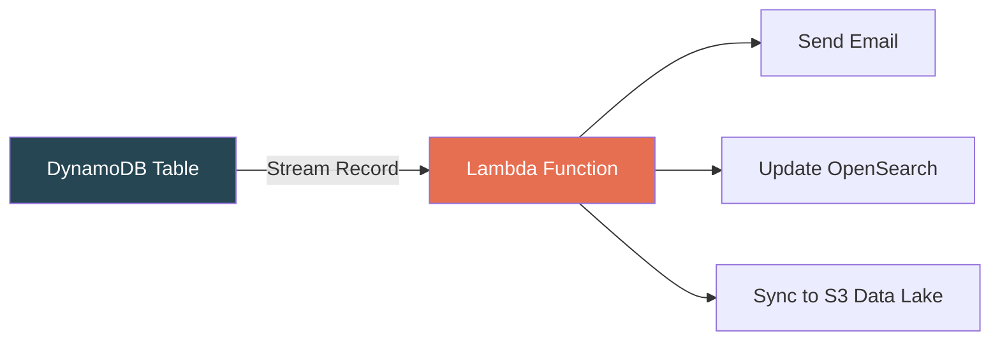
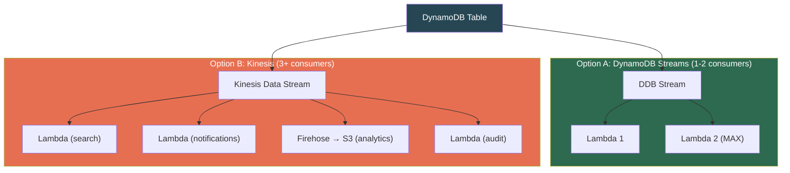

# AWS DynamoDB — Streams, TTL & Data Lifecycle

## DynamoDB Streams — Change Data Capture

Every item mutation (create/update/delete) can be captured as a **stream record** — an ordered, durable log of changes.

### Stream View Types

| View Type | Captured | Use Case |
|---|---|---|
| `KEYS_ONLY` | PK + SK only | Trigger logic that only needs to know *which* item changed |
| `NEW_IMAGE` | Full item **after** change | Replicate new state somewhere |
| `OLD_IMAGE` | Full item **before** change | Audit trails, detect what was lost |
| `NEW_AND_OLD_IMAGES` | Both before and after | Diff detection, compute deltas, full audit |

### Stream Properties

- Ordered **per-item** (same PK+SK changes are in order). Cross-item ordering NOT guaranteed.
- Retained for **24 hours**, then auto-deleted.
- Delivered **exactly once** within the 24-hour window.

---

## Streams + Lambda — The Event-Driven Pattern



### Key Behaviors

- Lambda polls the stream via **event source mapping** (you don't configure polling)
- Records arrive in **batches** (1–10,000 records per batch)
- If Lambda **fails**, it retries the **same batch** indefinitely until success or 24h expiry
- This creates the **poison pill problem** — one bad record blocks the entire shard

### Production-Grade Failure Handling

```yaml
EventSourceMapping:
  MaximumRetryAttempts: 3
  BisectBatchOnFunctionError: true    # Splits batch in half to isolate bad record
  DestinationConfig:
    OnFailure: arn:aws:sqs:...:dead-letter-queue
```

> **[SDE2 TRAP]** Without `MaximumRetryAttempts` + DLQ, a single malformed record blocks ALL newer records on that shard for 24 hours. Always configure failure handling in production.

---

## DynamoDB Streams vs Kinesis Data Streams

| Feature | DynamoDB Streams | Kinesis Data Streams |
|---|---|---|
| Retention | 24 hours (fixed) | Up to **365 days** |
| Consumers | **Max 2** concurrent | **Unlimited** (enhanced fan-out) |
| Throughput | Scales with table partitions | You control shard count |
| Use when | Simple Lambda triggers (1-2 consumers) | Multiple consumers, long retention, complex processing |



---

## TTL — Automatic Item Expiry

Designate one attribute as TTL. DynamoDB **auto-deletes** items whose TTL value (Unix epoch seconds) is in the past.

```
PK            SK              data            ttl_expires
────────────────────────────────────────────────────────────
SESSION#abc   USER#alice      {cart: [...]}   1714700000    ← auto-deletes after this time
SESSION#def   USER#bob        {cart: [...]}   1714786400
```

### TTL Properties

| Property | Detail |
|---|---|
| **Deletion timing** | Within **48 hours** of expiry — NOT instant |
| **Cost** | **Free** — no WCU consumed |
| **Stream records** | TTL deletes generate stream records (marked `system delete`) |
| **Attribute type** | Must be top-level **Number** (Unix epoch in seconds) |
| **Visibility** | Expired items **may still appear in reads** until physically deleted |

> **[SDE2 TRAP]** TTL is NOT real-time. Your app MUST filter: `WHERE ttl_expires > current_time`. Never rely on TTL for security (e.g., expired auth tokens must be checked in app code).

> **Cannot be nested.** TTL attribute must be top-level — not inside a Map. And String timestamps like `"2024-05-03T10:00:00Z"` won't work — must be epoch Number.

---

## Backups & Recovery

### On-Demand Backups
- Manual snapshots, stored until deleted
- No performance impact
- Restore to a **new table** (not in-place)

### Point-in-Time Recovery (PITR)
- Continuous backups with **per-second granularity**
- Restore to any point in the **last 35 days**
- Must be explicitly enabled (off by default)
- Restore creates a **new table** — GSIs, auto-scaling, TTL, Streams are NOT restored

### Export to S3
- Full table export in DynamoDB JSON or Amazon Ion
- Uses PITR data — **no RCU consumed**, no table impact
- Perfect for: export → Athena → SQL analytics

---

## Real-World Patterns

### Session Store with Auto-Cleanup + Analytics

```
1. User logs in → PutItem(PK="SESSION#token", ttl=now()+3600)
   → Session auto-expires in 1 hour via TTL. Zero maintenance.

2. TTL deletes session → Stream record (REMOVE, system delete)
   → Lambda: logs session duration to CloudWatch metrics

3. PITR enabled → compliance: audit any session state from last 35 days

4. Nightly Export to S3 → Athena:
   "Average session duration by region last 30 days"
   No RCU consumed, no table impact.
```

### Search Index Sync

```
DynamoDB (source of truth)
     │ Streams (NEW_IMAGE)
     ▼
   Lambda
     │
     ▼
  OpenSearch (search index)

Every item change → auto-syncs to search.
Stream 24h retention → replay if search recovers from downtime.
```

---

## ⚠️ Gotchas & Edge Cases

1. **Stream Lambda retries block the shard.** Always configure `MaximumRetryAttempts` + `BisectBatchOnFunctionError` + DLQ.
2. **Max 2 consumers** on DynamoDB Streams. Third consumer → switch to Kinesis Data Streams.
3. **PITR restores to NEW table.** GSIs, auto-scaling, TTL, Stream settings are NOT restored — reconfigure manually.
4. **TTL attribute must be top-level Number (epoch seconds).** Nested attributes and ISO strings won't work.
5. **Export to S3 uses PITR under the hood.** Must have PITR enabled for zero-RCU exports.
6. **TTL deletes still appear in reads.** Always filter in application code.

---

## 📌 Interview Cheat Sheet

- **Streams** = ordered per-item CDC log, 24h retention, max 2 consumers
- **4 view types:** KEYS_ONLY, NEW_IMAGE, OLD_IMAGE, NEW_AND_OLD_IMAGES
- Streams + Lambda = primary event-driven pattern. Always mention **DLQ + BisectBatchOnFunctionError**.
- **Kinesis Data Streams** when >2 consumers, longer retention, higher throughput
- **TTL:** free deletes, up to 48h delay, top-level Number (epoch seconds), generates stream records
- **PITR:** per-second granularity, 35-day window, restores to NEW table, off by default
- **Export to S3:** zero RCU, uses PITR data, perfect for analytics
- "How to keep DynamoDB and OpenSearch in sync?" → Streams + Lambda → ES. Mention ordering, failure handling, idempotent writes.
