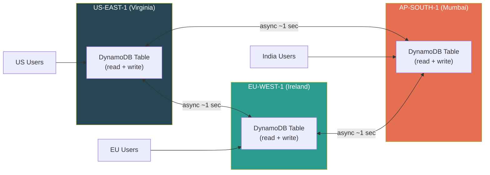
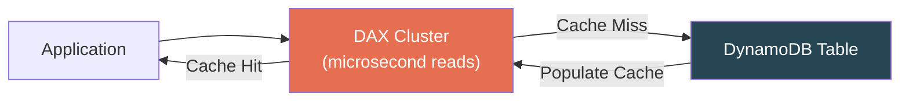
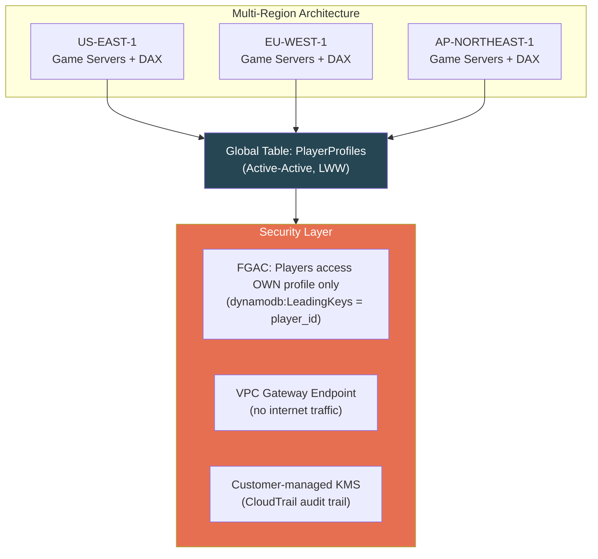

# AWS DynamoDB — Global Tables, DAX & Security

## Global Tables — Multi-Region Active-Active

Replicates your table across **multiple AWS regions.** Unlike read-replicas, this is **active-active** — every region accepts reads AND writes.



### Conflict Resolution: Last Writer Wins (LWW)

Two regions write to the same item simultaneously → **later timestamp wins.** No merge logic, no notification. The earlier write silently disappears.

```
Region A: SET name="Alice Smith"    at T=100
Region B: SET name="Alice Jones"    at T=101
Result:   name = "Alice Jones" (T=101 wins, Region A's write is LOST)
```

> **NOT configurable.** If you need custom conflict resolution → CRDTs or application-level merging, not Global Tables.

### Requirements & Constraints

| Requirement | Detail |
|---|---|
| Capacity mode | On-demand or provisioned with **auto-scaling enabled** |
| Streams | Must be enabled with `NEW_AND_OLD_IMAGES` (used internally for replication) |
| Schema changes | Apply to **all replicas** — cannot add GSI to just one region |
| Transactions | **Single-region only** — no cross-region transactions |
| Deletes | Replicate to all regions — no region can "keep" a deleted item |

---

## DAX — DynamoDB Accelerator

In-memory, fully managed cache between your app and DynamoDB. **API-compatible** — swap DynamoDB client for DAX client, zero code changes.



### Two Caches Inside DAX

| Cache | What It Caches | Populated By | Invalidation |
|---|---|---|---|
| **Item Cache** | Individual items (by PK+SK) | `GetItem`, `BatchGetItem` | **Write-through** — updated on writes |
| **Query Cache** | Full Query/Scan result sets (by exact params) | `Query`, `Scan` | **TTL only** — NOT invalidated by writes |

> **[SDE2 TRAP]** The query cache is NOT invalidated when underlying data changes. Write item → immediately repeat same Query through DAX → get stale cached result. Only item cache is updated on writes.

### When DAX Helps vs Hurts

| ✅ DAX Helps | ❌ DAX Hurts / Useless |
|---|---|
| Read-heavy with repeated reads on same keys | Write-heavy workloads (writes pass through, no benefit) |
| Microsecond latency requirements | Strongly consistent reads (bypass cache, go to DDB) |
| Leaderboards, catalogs, config lookups | Infrequently accessed data (low hit rate) |
| Reducing RCU consumption | Unique-key access patterns (every read = cache miss) |

### DAX Architecture

- Runs inside your **VPC** (not publicly accessible)
- Cluster: 1 primary + up to 10 read replicas
- You choose instance type (memory/CPU sizing)
- **Write-through:** writes go to DAX AND DynamoDB simultaneously

### DAX Query Cache Staleness — The Fix

```
Problem: User updates profile → refreshes page (Query) → sees old data

Why: Query cache still has the old result set (keyed by exact query params)

Fixes (ranked):
1. Use GetItem through DAX instead of Query (hits item cache, which IS updated)
2. Bypass DAX for post-update read (go direct to DDB with ConsistentRead=true)
3. Lower query cache TTL (affects ALL queries, not just this scenario)
```

---

## Security

### IAM Policies — Table/Index Level

```json
{
    "Effect": "Allow",
    "Action": ["dynamodb:GetItem", "dynamodb:Query"],
    "Resource": "arn:aws:dynamodb:us-east-1:123456:table/Orders/index/StatusIndex"
}
```

Restrict to specific tables, indexes, and API actions.

### Fine-Grained Access Control (FGAC) — Item Level

```json
{
    "Effect": "Allow",
    "Action": ["dynamodb:GetItem", "dynamodb:PutItem"],
    "Resource": "arn:aws:dynamodb:*:*:table/UserData",
    "Condition": {
        "ForAllValues:StringEquals": {
            "dynamodb:LeadingKeys": ["${cognito-identity.amazonaws.com:sub}"]
        }
    }
}
```

> Users can ONLY access items where PK matches their Cognito identity. Perfect for multi-tenant apps.

### Encryption

| Type | Detail |
|---|---|
| **At rest** | Always enabled. Three key options: AWS-owned (free), AWS-managed KMS, Customer-managed KMS (CMK — full control + CloudTrail audit) |
| **In transit** | All API calls use HTTPS (TLS). Always encrypted. |

### VPC Endpoints

| Feature | Detail |
|---|---|
| Type | **Gateway Endpoint** (not Interface) |
| Cost | **Free** — no data processing charges |
| How it works | Added to route tables, not as ENI. No security group. |
| Why needed | Keeps DynamoDB traffic within AWS private network. Essential for Lambda in VPC. |

---

## Real-World Example: Global Gaming Platform



- **Global Table:** Players read/write to nearest region (low latency). LWW acceptable for profile updates.
- **DAX in each region:** Caches leaderboard queries (100K reads/sec, updated every 30s). NOT used for write-heavy inventory.
- **FGAC:** Players can only read/write their OWN profile.
- **VPC endpoint:** Game servers access DynamoDB without internet.
- **CMK:** Compliance requires audit trail on encryption key usage.

---

## ⚠️ Gotchas & Edge Cases

1. **Global Tables LWW silently loses writes.** No error, no notification. Route writes for same item to one region, or use conflict-free attribute patterns.
2. **DAX query cache staleness.** Write → Query through DAX → old result. Item cache IS updated; query cache relies on TTL only.
3. **DAX doesn't help strongly consistent reads.** Bypasses cache entirely → adds cost + latency without benefit.
4. **Global Tables + Streams:** Replicated writes trigger streams in EVERY region. Filter by `aws:rep:updateregion` to process only local writes.
5. **VPC endpoint is Gateway type** (route table entry, not ENI). Controlled via endpoint policies, not security groups.
6. **Global Tables use one of your 2 Stream consumer slots.** If you also have a Lambda trigger, that's both slots used.

---

## 📌 Interview Cheat Sheet

- **Global Tables:** Active-active, multi-region, async (~1 sec), **LWW conflict resolution**, no cross-region transactions
- **DAX:** In-memory cache, microsecond reads, **item cache = write-through, query cache = TTL-only**
- **DAX anti-patterns:** write-heavy, strongly consistent reads, low repeat-read workloads
- **FGAC:** `dynamodb:LeadingKeys` = per-user item isolation (with Cognito). Multi-tenant pattern.
- **Encryption:** Always on at rest (3 key options), always TLS in transit. CMK for audit trail.
- **VPC Gateway Endpoint:** Free, keeps traffic private. Essential for VPC-based Lambda.
- "How to handle Global Table conflicts?" → LWW, not configurable. Custom resolution = app-level logic.
- "Replicated writes triggering Lambda twice?" → Filter by `aws:rep:updateregion` attribute.
