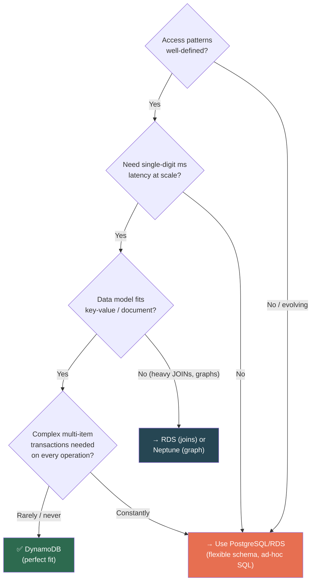
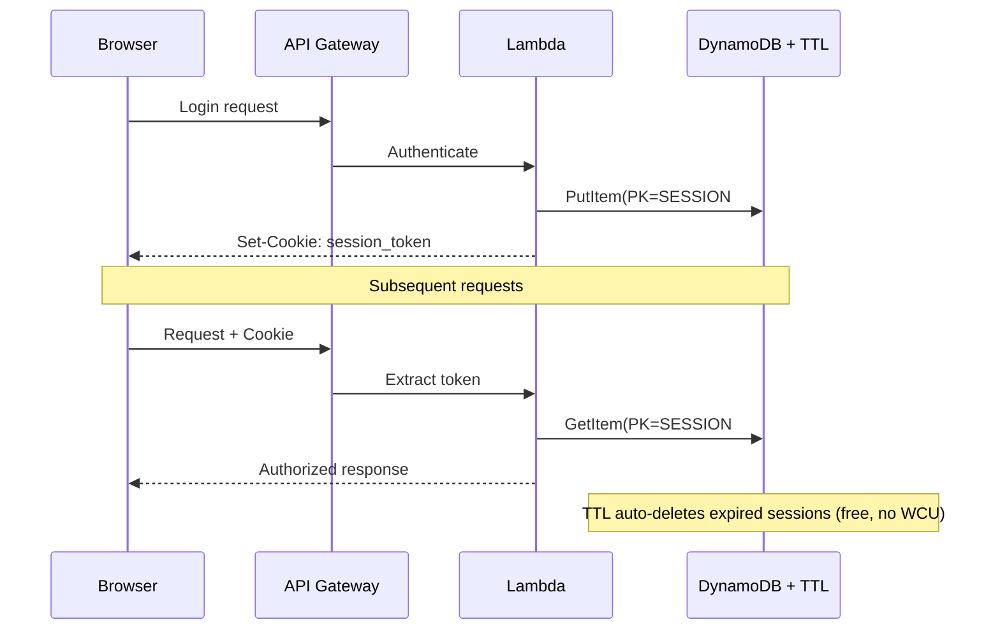
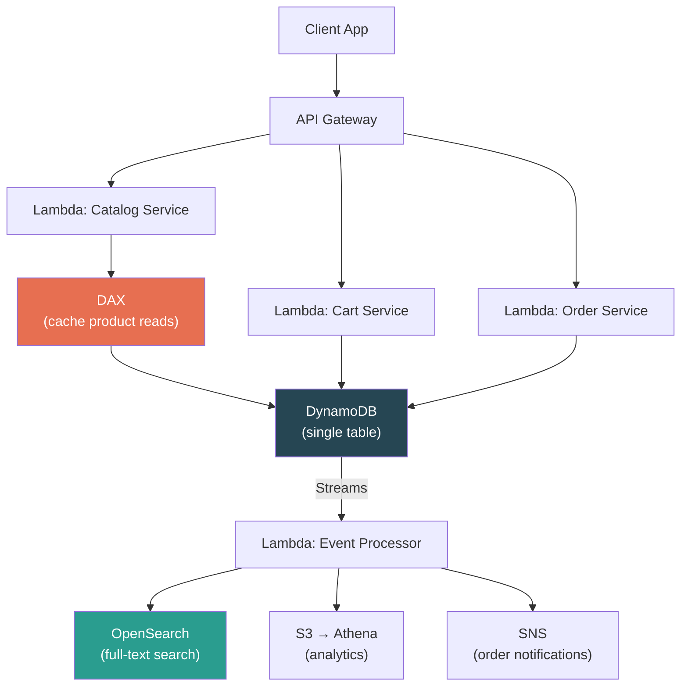
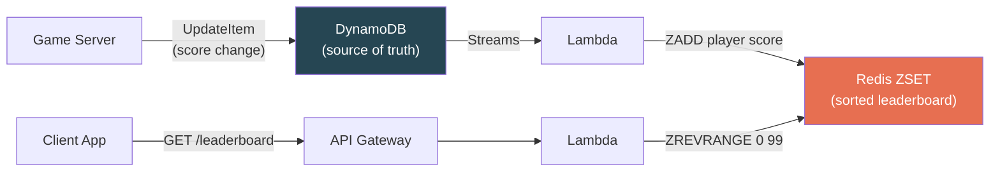
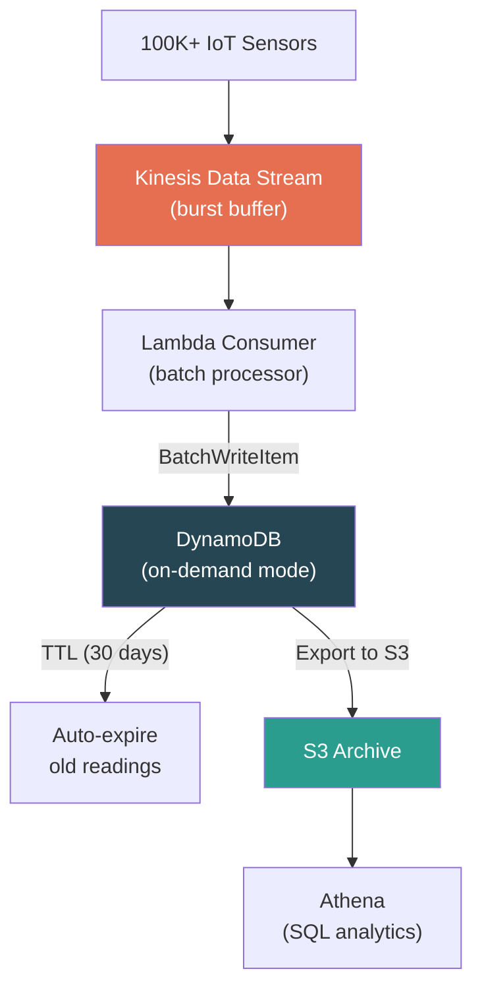
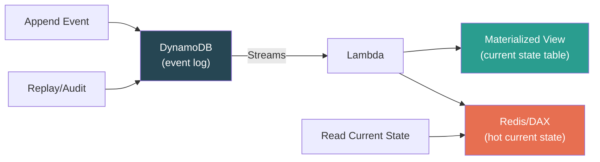
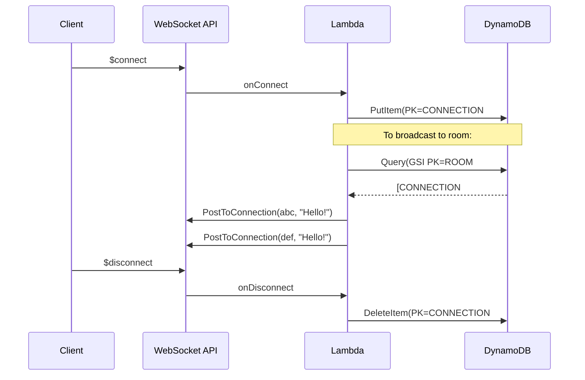

# AWS DynamoDB — System Design Patterns, Anti-Patterns & Cost Optimization

> **The capstone module.** Knowing DynamoDB APIs is table stakes. Knowing *when* to use it, *how* to architect around it, and *when to walk away* — that's what separates SDE2 from SDE3.

---

## The DynamoDB Decision Framework

### When to Reach for DynamoDB



### DynamoDB Sweet Spots vs Anti-Patterns

| ✅ Use DynamoDB | ❌ Avoid DynamoDB |
|---|---|
| Well-defined access patterns | Ad-hoc queries / analyst SQL |
| Single-digit ms latency at any scale | Complex JOINs / relational integrity |
| Serverless-first (Lambda + API GW + DDB) | Unknown / rapidly evolving access patterns |
| Key-value or document patterns | Full-text search (use OpenSearch) |
| Zero-ops requirement | Large objects >400 KB (use S3 + pointer) |
| Seamless 0 → millions req/sec scaling | Every operation needs multi-item ACID |

---

## Pattern 1: Session Store



**Key Design Decisions:**
- **PK = session token** (UUID/random) → high cardinality, perfect partition distribution
- **TTL = login_time + session_duration** → auto-cleanup, zero maintenance
- **On-demand mode** → unpredictable login spikes (Black Friday)
- **DAX optional** → if session reads are extremely hot
- **No SK needed** → simple key, one item per session

> **Why DynamoDB:** Sub-ms reads, auto-expiry (free), scales with user count, no session affinity needed, HTTP API works naturally with Lambda.

---

## Pattern 2: E-Commerce Catalog + Cart + Orders

### Single-Table Design

```
PK                    SK                      Attributes
─────────────────────────────────────────────────────────────
PRODUCT#prod_42       METADATA                {name, price, category, stock}
PRODUCT#prod_42       REVIEW#user_alice       {stars: 5, text: "..."}
PRODUCT#prod_42       REVIEW#user_bob         {stars: 3, text: "..."}
USER#alice            CART#prod_42            {qty: 2, added_at: "..."}
USER#alice            CART#prod_99            {qty: 1, added_at: "..."}
USER#alice            ORDER#2024-05-01       {total: 120, status: "shipped"}
```

### GSIs for Secondary Access Patterns

```
GSI1:  PK = category,     SK = price       → "All electronics under $50"
GSI2:  PK = order_status,  SK = order_date  → "All pending orders sorted by date"
```

### Access Patterns Mapped

| Pattern | Operation |
|---|---|
| Product details | `GetItem(PRODUCT#42, METADATA)` |
| Product reviews | `Query(PK=PRODUCT#42, SK begins_with REVIEW#)` |
| User's cart | `Query(PK=USER#alice, SK begins_with CART#)` |
| Browse by category+price | `Query GSI1(PK=electronics, SK < 50)` |
| Checkout | `TransactWriteItems(decrement stock + create order + clear cart)` |

### Architecture Flow



> **DAX for catalog reads** (high repeat reads, rarely changes). **NOT for cart writes** (write-heavy, unique per user).

---

## Pattern 3: Real-Time Leaderboard

> **[SDE2 TRAP]** DynamoDB alone is NOT ideal for leaderboards. This is a trick pattern — interviewers test whether you recognize the limitation.

**The Problem:** "Get top 100 players globally" requires cross-partition sorting. DynamoDB **can't sort across partitions.**

### The Correct Architecture



**Why not DynamoDB alone?**
- GSI with `PK = game_id, SK = score` → scores change constantly = massive GSI write churn
- `ScanIndexForward=false, Limit=100` only works within ONE partition
- Need cross-partition global sort = Scan (catastrophic at scale)

**DynamoDB = source of truth.** Redis ZSET = sorted view. Streams keep sync. Redis dies → rebuild from DynamoDB scan.

> **Key insight:** Not every problem is solved by key design. Recognizing when to **complement DynamoDB with Redis/OpenSearch** is a senior-level signal.

---

## Pattern 4: IoT Telemetry Ingestion



### Key Design

```
PK = DEVICE#<device_id>       ← high cardinality (100K devices = great distribution)
SK = TS#<timestamp>           ← range queries on time
TTL = now() + 30 days         ← auto-cleanup of hot storage
```

**Why Kinesis in front?** Sensors burst at millions/sec. Kinesis absorbs the spike. Lambda processes in batches. DynamoDB gets steady writes. Without Kinesis → need massive provisioned WCU for peak seconds.

**Data lifecycle:** Hot data (30 days) in DynamoDB → auto-expire via TTL → archived in S3 → query via Athena.

---

## Pattern 5: Event Sourcing / Audit Log

```
PK = ENTITY#order_123
SK = EVENT#2024-05-01T10:00:00#evt_uuid

EVENT#2024-05-01T10:00:00#evt1  → {type: "CREATED",    by: "alice"}
EVENT#2024-05-01T10:05:00#evt2  → {type: "ITEM_ADDED",  by: "alice"}
EVENT#2024-05-01T11:00:00#evt3  → {type: "PAID",        by: "system"}
EVENT#2024-05-01T11:30:00#evt4  → {type: "SHIPPED",     by: "warehouse"}
```

**Properties:**
- Events are **append-only** — never update or delete
- Replay full history: `Query(PK=ENTITY#order_123, ScanIndexForward=true)`
- DynamoDB's append-friendly model + unlimited table size = ideal

**Combined with Streams:** Every new event triggers Lambda → updates **materialized view** (current state) in a separate table or cache.



---

## Pattern 6: WebSocket Connection Store

For WebSocket APIs (API Gateway), **you manage connection state yourself:**

```
PK = CONNECTION#<connection_id>
SK = METADATA
Attributes: user_id, connected_at, ttl (auto-cleanup on stale connections)

GSI: PK = ROOM#<room_id>, SK = CONNECTION#<id>
→ "All connections in a chat room" for broadcast
```



---

## Anti-Patterns — What NOT to Do

### 1. Using DynamoDB as a Relational Database

Forcing normalized tables + client-side JOINs across 5 tables. If you need relational semantics, use RDS.

### 2. Scan-Based Access Patterns in Production

If your API endpoint runs a `Scan` on every request → your data model is wrong. Redesign keys or add a GSI.

### 3. Unbounded List Growth Inside Items

```
BAD:  Post item with comments: [list that grows to 400 KB → CRASH]
GOOD: Each comment = separate item: PK=POST#123, SK=COMMENT#<timestamp>
```

### 4. Using DynamoDB for Analytics

Running SUM, AVG, GROUP BY directly on DynamoDB = scanning everything. Export to S3 → Athena/Redshift for analytics.

### 5. Ignoring GSI Write Amplification

10 GSIs "just in case" → 11 writes per item. Write costs triple. Storage multiplied by 10.

### 6. Not Counting Items Properly

DynamoDB has **no efficient COUNT.** `Scan(Select=COUNT)` reads the entire table. For counts, maintain a separate counter item updated atomically via `UpdateItem SET count = count + 1`.

---

## Cost Optimization Patterns

| Strategy | How | Savings |
|---|---|---|
| **Right-size capacity mode** | Steady → provisioned + auto-scaling. Spiky → on-demand. | Up to 5x |
| **Reserved capacity** | 1-year or 3-year commit on provisioned RCU/WCU | Up to **77%** |
| **TTL for hot/cold tiering** | 30 days in DynamoDB, archive to S3 | Massive storage savings |
| **Smaller items** | Compress large attributes, use short attribute names | 10-30% (DynamoDB charges per byte — names included!) |
| **GSI projection discipline** | `KEYS_ONLY` or `INCLUDE` instead of `ALL` | Reduces GSI storage + write cost |
| **Eventually consistent reads** | Default unless correctness demands strong | **50% RCU savings** |
| **DAX for read-heavy** | Cache absorbs repeated reads | **90%+ RCU savings** on cached patterns |
| **Export to S3 for analytics** | Query archived data via Athena, not DynamoDB | Eliminates Scan costs |

> **[SDE2 TRAP]** Attribute names count toward item size. In billions of items, renaming `customer_shipping_address` to `csa` saves real money. DynamoDB charges per byte — names AND values.

---

## Complete Architecture Decision Matrix

| Use Case | Primary Store | Complement With | Why |
|---|---|---|---|
| **Session store** | DynamoDB + TTL | DAX (if ultra-hot reads) | Auto-expiry, sub-ms reads, scales with users |
| **E-commerce catalog** | DynamoDB (single-table) | OpenSearch (search), DAX (catalog cache) | Structured access patterns, transactional checkout |
| **Leaderboard** | DynamoDB (source of truth) | **Redis ZSET** (sorted view) | DynamoDB can't cross-partition sort efficiently |
| **IoT telemetry** | DynamoDB + TTL | Kinesis (burst buffer), S3+Athena (archive) | High-cardinality keys, auto-cleanup, analytics offload |
| **Event sourcing** | DynamoDB (event log) | Redis/DAX (materialized view cache) | Append-only, unlimited size, Streams for projections |
| **Full-text search** | DynamoDB (source of truth) | **OpenSearch** (search index) | DynamoDB has zero search capability |
| **Social graph** | **Neptune** (primary) | DynamoDB (user profiles) | Multi-hop traversals = graph DB problem |
| **Analytics/reporting** | **Redshift/Athena** (primary) | DynamoDB → S3 export (data source) | Aggregations, GROUP BY, ad-hoc SQL |

---

## The Interview Answer Frameworks

### "Why DynamoDB?" (30-second answer)

> "I'd use DynamoDB because we have **well-defined access patterns**, need **single-digit ms latency at scale**, and want **zero operational overhead.** The data model fits key-value with [specific PK/SK design]. For [secondary pattern], I'd add a GSI. For cost, I'd use [on-demand/provisioned] and TTL for data lifecycle. The tradeoff is losing ad-hoc query flexibility, which we'd handle by exporting to S3 + Athena."

### "Why NOT DynamoDB?" (30-second answer)

> "DynamoDB isn't right when access patterns are unknown, when we need complex JOINs or multi-hop graph traversals, when items exceed 400 KB, when every operation needs multi-item ACID at scale, or when the primary workload is analytics (aggregations, GROUP BY)."

### "How would you model X in DynamoDB?" (Framework)

```
1. List ALL access patterns (not entities)
2. Choose PK ("who's asking?") and SK ("what are they asking for?")
3. Map each access pattern to Query/GetItem
4. Identify patterns base table can't serve → add GSIs
5. Consider: TTL for lifecycle, Streams for CDC, DAX for caching
6. Call out tradeoffs: data duplication, GSI write amplification, eventual consistency
```

---

## ⚠️ Final Gotchas Roundup

| Gotcha | Impact | Fix |
|---|---|---|
| **400 KB item limit** | Hard wall, no workaround | Split items or store blobs in S3 |
| **Hot partitions look like random throttling** | CloudWatch table metrics show headroom | Enable **Contributor Insights** |
| **On-demand day-one ceiling** | New tables start at ~4K WCU | Pre-warm with provisioned before launch |
| **No built-in item count** | `Scan(COUNT)` reads entire table | Maintain atomic counter item |
| **GSI projection immutable** | Wrong projection = delete + recreate GSI | Design projections carefully upfront |
| **TTL not real-time** | Expired items visible up to 48h | Filter in application code |
| **DAX query cache staleness** | Writes don't invalidate query cache | Use GetItem (item cache) or bypass DAX |
| **Global Table LWW silent data loss** | No error on conflict | Route same-item writes to one region |

---

## 📌 Master Interview Cheat Sheet

### Data Model
- **Access patterns FIRST**, then key design. Entity-first = RDBMS mindset = red flag.
- PK = "who's asking?", SK = "what they're asking for?"
- Single-table with overloaded keys for co-accessed entities
- Adjacency list for many-to-many. Inverted GSI for reverse lookups.
- Composite SK for hierarchical filtering (left-to-right only)

### Operations
- Query = one partition (fast). Scan = full table (last resort). Filters are cosmetic.
- PutItem replaces. UpdateItem merges. Atomic counter = `SET x = x + 1`.
- Conditional expressions for optimistic concurrency.
- Transactions: 100 items, serializable isolation, 2x cost. Use cheapest mechanism.

### Infrastructure
- RCU: ⌈item/4KB⌉. WCU: ⌈item/1KB⌉. Eventual = half. Transactional = double.
- Per partition: 3,000 RCU + 1,000 WCU + 10 GB.
- "Throttled but capacity available" = hot partition. Use Contributor Insights.

### Indexes
- GSI: new key, anytime, eventually consistent, separate throughput, write amplification.
- LSI: same PK, different SK, table creation only, supports strong consistency, 10 GB limit.
- Projections are immutable. Sparse indexes for natural filtering.

### Lifecycle & Events
- Streams: 24h retention, max 2 consumers, ordered per-item. Kinesis for 3+.
- TTL: free deletes, up to 48h delay, epoch seconds Number. Filter in app.
- PITR: per-second, 35 days, restores to NEW table. Export to S3: zero RCU.

### Global & Caching
- Global Tables: active-active, LWW conflicts, async ~1 sec, no cross-region transactions.
- DAX: item cache (write-through) + query cache (TTL-only). Anti-patterns: write-heavy, strong reads.

### System Design
- DynamoDB + Lambda + API Gateway = canonical serverless stack.
- Complement with: Redis (leaderboards), OpenSearch (search), S3+Athena (analytics).
- Cost levers: capacity mode, reserved capacity, TTL, GSI projections, DAX, attribute name length.
