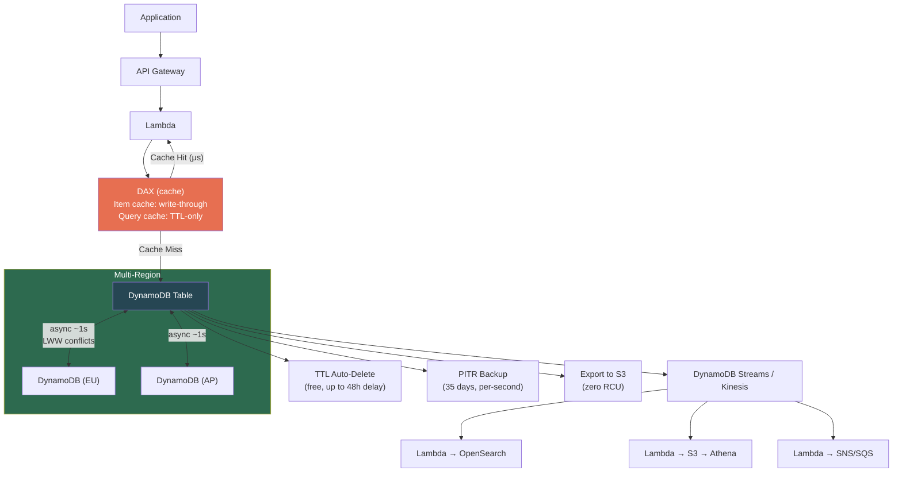
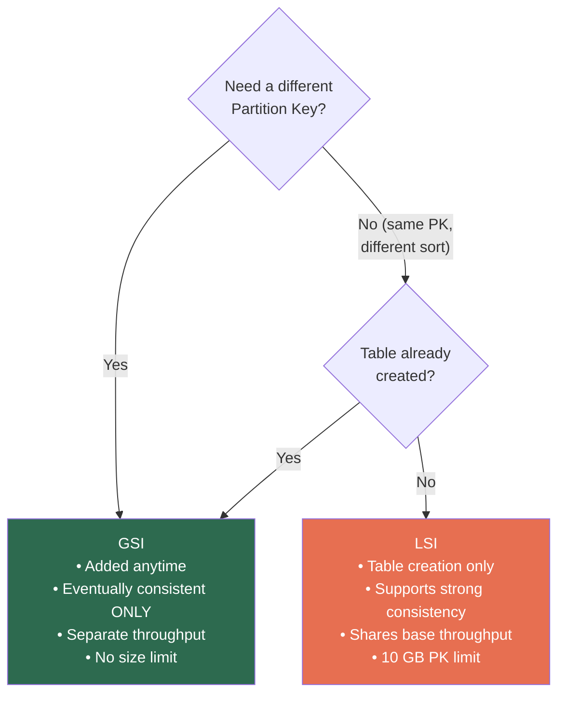

# AWS DynamoDB — Master Revision Sheet

> **Quick-reference revision document.** For deep dives, see individual module files in this folder.

---

## 🗺️ DynamoDB Mental Model — Complete Picture



---

## ⚡ Core Concept Quick Reference

| Concept | Key Facts |
|---|---|
| **Data Model** | Tables → Items (max 400 KB) → Attributes. PK determines partition. SK determines sort order. |
| **Primary Key** | Simple (PK only) or Composite (PK + SK). Combination must be unique. |
| **Consistency** | Eventually consistent (default, 0.5 RCU) or Strongly consistent (opt-in, 1 RCU). Strong = base table only. |
| **Query vs Scan** | Query = one partition (fast, cheap). Scan = entire table (slow, expensive). |
| **Filters** | Applied AFTER read. Save bandwidth, NOT RCU. Cosmetic only. |

---

## 📐 RCU / WCU Math Card

| Operation | Unit Size | Cost |
|---|---|---|
| Read (eventual) | 4 KB | **0.5 RCU** |
| Read (strong) | 4 KB | **1 RCU** |
| Read (transactional) | 4 KB | **2 RCU** |
| Write (standard) | 1 KB | **1 WCU** |
| Write (transactional) | 1 KB | **2 WCU** |

**Formula:** `⌈item_size / unit_size⌉ × operations_per_second × cost_multiplier`

**Per-partition limits:** 3,000 RCU + 1,000 WCU + 10 GB

---

## 🔑 Key Design Patterns

### Single-Table Design Rules

```
1. List ALL access patterns first (not entities)
2. PK = "who's asking?"  SK = "what are they asking for?"
3. Use prefixes: USER#, ORDER#, PRODUCT# to mix entity types
4. Map each access pattern to Query/GetItem
5. GSIs for patterns base table can't serve
```

### Common Patterns

| Pattern | Structure | Use Case |
|---|---|---|
| **Overloaded Keys** | PK/SK with entity prefixes | Single-table, multiple entity types |
| **Adjacency List** | Both directions stored (or inverted GSI) | Many-to-many relationships |
| **Composite Sort Key** | `STATUS#DATE#REGION` | Hierarchical filtering (left-to-right only) |
| **Sparse Index** | GSI on optional attribute | Auto-filtered index |
| **GSI Overloading** | Multiple entity types reuse one GSI | Reduce GSI count |
| **Inverted Index** | GSI PK=SK, SK=PK | Reverse lookups |

---

## 🗂️ GSI vs LSI Decision



---

## 🔐 Security Quick Reference

| Layer | Feature | Detail |
|---|---|---|
| **Table-level** | IAM Policies | Restrict actions + resources (tables, indexes) |
| **Item-level** | FGAC (`dynamodb:LeadingKeys`) | Users access only items matching their identity |
| **Network** | VPC Gateway Endpoint | Free, keeps traffic off public internet |
| **Encryption (rest)** | AWS-owned / AWS-managed / **Customer-managed KMS** | CMK for CloudTrail audit trail |
| **Encryption (transit)** | TLS | Always on, all API calls |

---

## 🔄 Concurrency Control Hierarchy

**Always pick the cheapest mechanism:**

| Scenario | Mechanism | Cost |
|---|---|---|
| Atomic increment | `SET counter = counter + 1` | 1 WCU |
| Prevent overwrite | `attribute_not_exists(PK)` | 1 WCU |
| Read-modify-write (single item) | Optimistic locking (version attribute) | 1 WCU + retry |
| Multi-item atomicity | `TransactWriteItems` | 2 WCU/item |

---

## 🏗️ System Design Patterns

### When to Use What

| Use Case | Primary | Complement With |
|---|---|---|
| Session store | DynamoDB + TTL | DAX (hot reads) |
| E-commerce | DynamoDB (single-table) | OpenSearch (search), DAX (catalog) |
| Leaderboard | DynamoDB (truth) | **Redis ZSET** (sorted view) |
| IoT telemetry | DynamoDB + TTL | Kinesis (buffer), S3+Athena (archive) |
| Event sourcing | DynamoDB (log) | Redis/DAX (materialized view) |
| Full-text search | DynamoDB (truth) | **OpenSearch** (index) |
| Social graph | **Neptune** | DynamoDB (profiles) |
| Analytics | **Redshift/Athena** | DynamoDB → S3 export |

### Async Pattern (Streams)

```
DynamoDB → Streams → Lambda → {OpenSearch, S3, SNS, SQS, analytics}
                              Configure: MaxRetry + BisectBatch + DLQ
```

---

## 💰 Cost Optimization Checklist

- [ ] Right capacity mode? (Steady → provisioned + auto-scaling. Spiky → on-demand)
- [ ] Reserved capacity for stable workloads? (up to 77% savings)
- [ ] TTL for data lifecycle? (hot in DDB, cold in S3)
- [ ] Eventually consistent reads as default? (50% RCU savings)
- [ ] GSI projections minimized? (`KEYS_ONLY` / `INCLUDE`, not `ALL`)
- [ ] DAX for read-heavy patterns? (90%+ RCU savings on cached data)
- [ ] Short attribute names? (DDB charges per byte, names included)
- [ ] Export to S3 for analytics? (zero RCU vs Scan costs)

---

## 🪤 Top SDE2/SDE3 Interview Traps

| Trap | What They Expect |
|---|---|
| "PutItem vs UpdateItem" | PutItem REPLACES entire item. UpdateItem merges. |
| "Filter expressions save cost" | NO — filters are post-read. Full RCU still consumed. |
| "Table has capacity but throttling" | Hot partition. Diagnose with Contributor Insights. |
| "Strong consistency on GSI" | Impossible. GSIs are eventually consistent only. |
| "GSI projection change" | Immutable. Must delete + recreate GSI. |
| "On-demand is infinite" | No — starts at ~4K WCU, scales on prior peak. |
| "DAX solves everything" | Not for writes, strong reads, or unique-key patterns. |
| "DAX query cache is consistent" | NO — query cache is TTL-only, not write-through. |
| "Global Table conflict resolution" | LWW (last-writer-wins), not configurable. |
| "DynamoDB for leaderboards" | Can't cross-partition sort. Use Redis ZSET. |
| "Transactions for single-item concurrency" | Overkill. Use conditional expression or atomic counter (1 WCU vs 2 WCU). |
| "BatchWriteItem is atomic" | NO — partial failures possible. Check UnprocessedItems. |
| "TTL deletes instantly" | No — up to 48h delay. Filter in app code. |
| "Replicated writes triggering Lambda twice" | Check `aws:rep:updateregion` to filter. |
| "How to count items" | No efficient way. Maintain atomic counter item. |

---

## 🚀 Hard Limits (Non-Negotiable)

| Limit | Value | Workaround |
|---|---|---|
| Item size | **400 KB** | Split items or S3 + pointer |
| Transaction items | **100** | BatchWriteItem + app compensation |
| Transaction size | **4 MB** | Smaller batches |
| GSIs per table | **20** (soft) | Request increase / redesign |
| LSIs per table | **5** (hard) | Use GSIs instead |
| LSI partition size | **10 GB** | Monitor item collection size |
| Partition throughput | **3K RCU + 1K WCU** | Better key distribution |

---

## 📂 Module Index

| File | Contents |
|---|---|
| [01_NoSQL_Foundations_and_Data_Model.md](./01_NoSQL_Foundations_and_Data_Model.md) | CAP theorem, tables/items/attributes, PK/SK, primary key strategies |
| [02_Read_Write_Operations_and_Consistency.md](./02_Read_Write_Operations_and_Consistency.md) | Get/Put/Update/Delete, Query vs Scan, consistency, conditional writes |
| [03_Secondary_Indexes_GSI_and_LSI.md](./03_Secondary_Indexes_GSI_and_LSI.md) | GSI vs LSI, projections, inverted/sparse indexes |
| [04_Capacity_Throughput_and_Partitions.md](./04_Capacity_Throughput_and_Partitions.md) | RCU/WCU math, on-demand vs provisioned, partition internals, hot keys |
| [05_Single_Table_Design_and_Query_Patterns.md](./05_Single_Table_Design_and_Query_Patterns.md) | Overloaded keys, adjacency lists, composite SK, GSI overloading |
| [06_Transactions_and_Concurrency.md](./06_Transactions_and_Concurrency.md) | TransactWriteItems, ACID, optimistic locking, idempotency |
| [07_Streams_TTL_and_Data_Lifecycle.md](./07_Streams_TTL_and_Data_Lifecycle.md) | Streams + Lambda, TTL, backups, PITR, export to S3 |
| [08_Global_Tables_DAX_and_Security.md](./08_Global_Tables_DAX_and_Security.md) | Multi-region, DAX caching, IAM, FGAC, encryption, VPC endpoints |
| [09_System_Design_Patterns_and_Cost_Optimization.md](./09_System_Design_Patterns_and_Cost_Optimization.md) | Real-world architectures, anti-patterns, cost optimization, decision frameworks |
