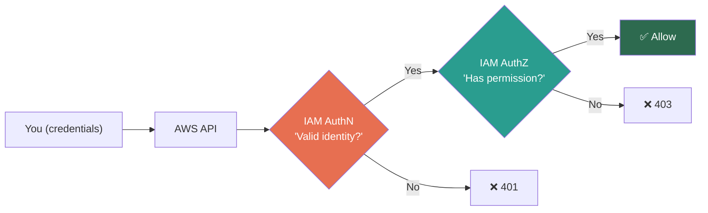
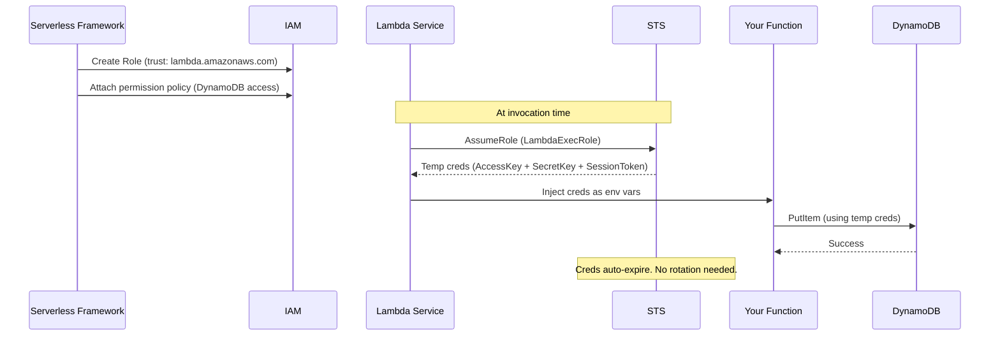
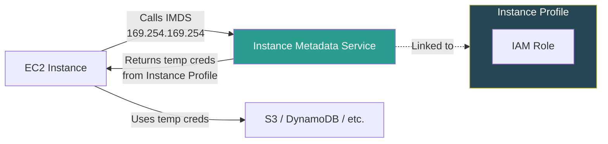

# AWS IAM — Foundations & Identity Primitives

## Authentication vs Authorization — The Two Pillars

These are **two completely separate questions** that happen to sit next to each other:

| | Authentication (AuthN) | Authorization (AuthZ) |
|---|---|---|
| **Question** | "**Who** are you?" | "**What** can you do?" |
| **Mechanism** | Credentials (password, access key, MFA token, certificate) | Policies (JSON documents attached to identities) |
| **Happens** | First | Second — only after AuthN succeeds |
| **Failure** | `401 Unauthorized` | `403 Forbidden` |

> **SDE2 Trap:** The HTTP spec got the naming wrong. `401` means "not authenticated", `403` means "not authorized." Interviewers love testing this distinction.

> **Analogy:** AuthN = showing your company badge at the office entrance. AuthZ = whether your badge gives you access to the server room. Different checks, different systems.

---

## AWS IAM — The Global Gatekeeper

IAM is a **global service** (not regional). Every single AWS API call — Console, CLI, SDK, or inter-service — passes through IAM for AuthN + AuthZ. No exceptions.



---

## The Three Identity Primitives

### 1. IAM Users — Long-Lived Credentials

- Has **permanent** credentials: password (console) + access key pair (programmatic)
- Belongs to **one AWS account**
- Hard limit: **5,000 users per account**
- **When to use:** Almost never in production anymore. Legacy pattern.
- **Real danger:** Long-lived credentials = leaked on GitHub = your account mines crypto overnight

### 2. IAM Groups — Bulk Policy Assignment

- **NOT an identity** — you cannot authenticate as a group
- Cannot be nested (no groups inside groups — unlike Active Directory)
- A user can be in **max 10 groups**
- **Only purpose:** Attach policies to the group → all member users inherit them
- **Cannot be used as a Principal** in resource-based policies (e.g., can't say "allow this Group" on S3 bucket policy)

### 3. IAM Roles — Temporary Identity (The Modern Standard)

- **No permanent credentials** — issues temp creds via STS
- Can be assumed by: Users, AWS Services (EC2, Lambda), external identities, cross-account entities
- Has two policy types: **Trust Policy** (who can assume) + **Permission Policy** (what they can do)
- **When to use: Almost always.** This is the production pattern.

### Identity Comparison Matrix

| | IAM User | IAM Group | IAM Role |
|---|---|---|---|
| **Is an identity?** | ✅ | ❌ | ✅ |
| **Has credentials?** | Permanent (password + access key) | N/A | Temporary (STS) |
| **Can authenticate?** | ✅ | ❌ | ✅ (via AssumeRole) |
| **Policies attached?** | Directly or via Group | Yes (flows to members) | Permission + Trust policy |
| **Can be Principal?** | ✅ | ❌ | ✅ |
| **Use case** | Legacy / break-glass | Organize human users | Services, cross-account, modern default |
| **Limit** | 5,000 per account | 300 per account | 1,000 per account |

### The Root User — God Mode

```
┌──────────────────────────────────────────┐
│            ROOT USER                     │
│                                          │
│  ✅ Has powers IAM admins CANNOT get:    │
│     • Close AWS account                  │
│     • Change support plan                │
│     • Enable MFA on root                 │
│     • Restore IAM permissions            │
│                                          │
│  ⚠️  NEVER use for day-to-day ops       │
│  ⚠️  Enable hardware MFA                │
│  ⚠️  Delete root access keys            │
│  ⚠️  Monitor with CloudTrail            │
│                                          │
│  Cannot be restricted by IAM policies    │
│  Cannot be restricted by SCPs            │
│  (in management account)                 │
└──────────────────────────────────────────┘
```

---

## Real-World Example — Lambda Execution

In Serverless Framework projects:

```yaml
# serverless.yml
provider:
  name: aws
  iam:
    role:
      statements:
        - Effect: Allow
          Action:
            - dynamodb:PutItem
            - dynamodb:GetItem
          Resource: arn:aws:dynamodb:*:*:table/MyTable
```

What actually happens at runtime:



> You **never** create an IAM User for Lambda. That's an anti-pattern.

---

## Instance Profiles — How EC2 Gets IAM Credentials

EC2 instances **cannot directly assume IAM Roles**. They use an **Instance Profile** — a container (wrapper) that holds a Role.



**Key details:**
- **Console creates Instance Profiles automatically** when you assign a Role to EC2 — you never see them
- **CLI/CloudFormation require explicit creation**: `aws iam create-instance-profile` + `aws iam add-role-to-instance-profile`
- An Instance Profile can hold **only one Role** (1:1 mapping)
- Credentials are fetched via **IMDS** (Instance Metadata Service) at `http://169.254.169.254/latest/meta-data/iam/security-credentials/`
- **IMDSv2** (required in modern setups) uses session tokens to prevent SSRF attacks

> **SDE2 Trap:** "How does EC2 get IAM credentials?" The answer is NOT just "IAM Role." It's: Role → Instance Profile → IMDS → temp creds injected. If you say just "Role" — you've missed the mechanism.

---

## Service-Linked Roles vs Service Roles

| | Service Role | Service-Linked Role |
|---|---|---|
| **Created by** | You (the administrator) | AWS service automatically |
| **Modifiable** | ✅ Full control over permissions | ❌ Cannot modify permissions (AWS manages) |
| **Deletable** | ✅ Anytime | ❌ Only after removing all resources using it |
| **Trust policy** | You define it | Pre-configured by AWS |
| **Naming** | Your choice | `AWSServiceRoleFor<ServiceName>` (fixed) |
| **Example** | Lambda execution role you create | `AWSServiceRoleForElasticLoadBalancing` |
| **SCP affected?** | ✅ Yes | ❌ No — SCPs don't apply |

> **Why Service-Linked Roles exist:** Some services need permissions that you shouldn't modify (e.g., ELB managing ENIs). AWS pre-defines these to prevent you from accidentally breaking the service.

> **Interview nuance:** Service-Linked Roles **bypass SCPs**. This means even if an SCP denies `ec2:*`, the ELB service-linked role can still manage ENIs. This is by design.

---

## AWS Credential Provider Chain — SDK Resolution Order

When your code calls an AWS API (via SDK/CLI), credentials are resolved in this **exact order**:

```
1. Explicit credentials in code    ← NEVER DO THIS (hardcoded keys)
2. Environment variables            ← AWS_ACCESS_KEY_ID, AWS_SECRET_ACCESS_KEY
3. Shared credentials file          ← ~/.aws/credentials (profiles)
4. AWS config file                  ← ~/.aws/config
5. ECS container credentials        ← ECS task role (via container agent)
6. EC2 Instance Profile (IMDS)      ← Instance Metadata Service
7. SSO credentials                  ← IAM Identity Center
```

**First match wins.** The SDK stops searching once it finds credentials.

> **SDE2 Trap:** A developer's Lambda works locally but fails in AWS with `AccessDenied`. Why? Locally, the SDK uses `~/.aws/credentials` (their admin profile). In Lambda, it uses the execution role (step 6) which has different permissions. The credential chain resolved different identities.

> **Another trap:** Environment variables (#2) override Instance Profile (#6). If someone sets `AWS_ACCESS_KEY_ID` in an EC2 instance, it will use those static keys instead of the Instance Profile's temp creds — breaking the security model.

---

## ⚠️ Gotchas & Edge Cases

| Gotcha | Why It Matters |
|--------|---------------|
| **IAM is eventually consistent** | Create a policy → use it immediately → might get denied. Propagation delay of a few seconds. |
| **Root user ≠ IAM admin user** | Root has powers IAM admins can never get (close account, change support plan). |
| **Groups can't be nested** | Flat structure only. No subgroups like Active Directory. |
| **Groups can't be principals** | Cannot reference a Group in a resource-based policy or trust policy. |
| **A user without any policy = can do nothing** | IAM starts from **implicit deny**. Zero permissions by default. |
| **Service-linked roles** | AWS services auto-create roles you can't modify/delete while the service uses them. Bypass SCPs. |
| **`sts:GetCallerIdentity` always works** | The one API call that cannot be denied, even with zero policies. |
| **2 access keys per user** | Allows rotation without downtime — create new, migrate, delete old. |
| **Instance Profile ≠ Role** | EC2 needs an Instance Profile (wrapper) to use a Role. Console hides this; CLI/CFN don't. |
| **IMDS v1 vs v2** | IMDSv1 is vulnerable to SSRF attacks. IMDSv2 requires session token. Enforce IMDSv2 in production. |
| **Credential chain precedence** | Env vars override Instance Profile. Accidental `AWS_ACCESS_KEY_ID` on EC2 = uses static keys instead of role. |
| **Service-Linked Roles bypass SCPs** | They're managed by AWS. Even account-level Deny SCPs don't affect them. |

---

## 📌 Interview Cheat Sheet

- IAM is **global** — not tied to a region
- **Implicit deny** is the default. Explicit deny **always** wins over any Allow
- Users = long-lived creds (bad). Roles = temp creds (good). **Always prefer Roles**
- Groups are **not identities** — can't authenticate, can't use in trust policies, can't be principals
- Root user: **MFA on, access keys off**, used only for billing/account-level tasks
- IAM supports **2 access keys per user** (rotation without downtime)
- **5,000 users** per account hard limit — why federation exists for enterprises
- Roles have **two** policies: Trust Policy (who) + Permission Policy (what)
- `sts:GetCallerIdentity` — always works, even with zero permissions
- `401` = not authenticated. `403` = not authorized. Know the HTTP distinction.
- **Instance Profile** = wrapper around Role for EC2. Role → Instance Profile → IMDS → temp creds.
- **Credential chain**: Code → Env vars → Credentials file → Config → ECS → EC2 IMDS → SSO. First match wins.
- **Service-Linked Roles** bypass SCPs and can't be modified. Service Roles are created/managed by you.
- **IMDSv2** = enforce session tokens for IMDS. Prevents SSRF → credential theft on EC2.
