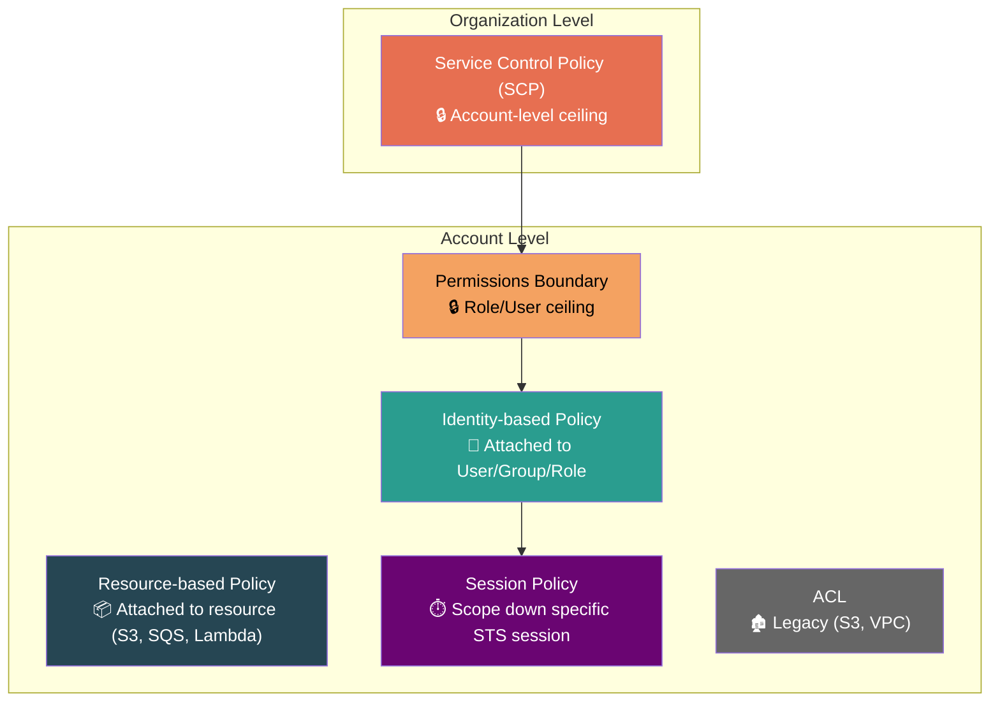
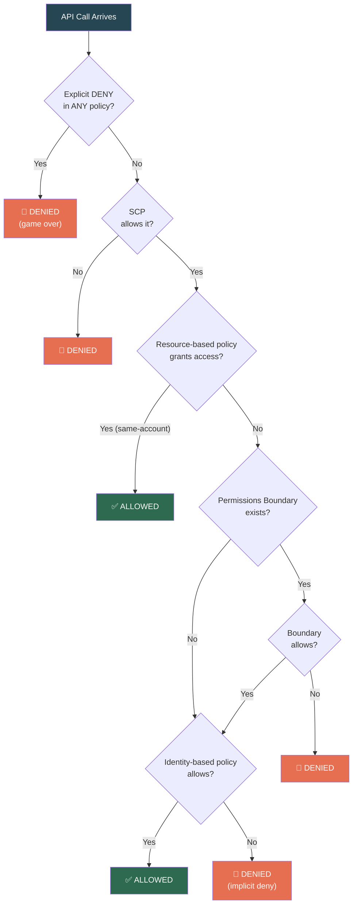
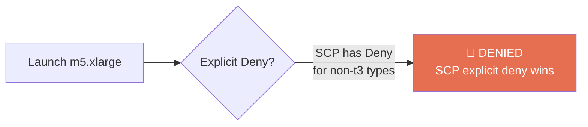

# AWS IAM — Policy Language & Evaluation Engine

## The Policy JSON Anatomy — 6 Fields to Know Cold

```json
{
  "Version": "2012-10-17",
  "Statement": [
    {
      "Sid": "AllowS3Read",
      "Effect": "Allow",
      "Action": ["s3:GetObject", "s3:ListBucket"],
      "Resource": [
        "arn:aws:s3:::my-bucket",
        "arn:aws:s3:::my-bucket/*"
      ],
      "Condition": {
        "IpAddress": {
          "aws:SourceIp": "203.0.113.0/24"
        }
      }
    }
  ]
}
```

| Field | What It Means | Gotcha |
|-------|---------------|--------|
| **Version** | Always `"2012-10-17"` | Older `"2008-10-17"` breaks `${variable}` syntax silently. Never omit. |
| **Statement** | Array of permission rules, each evaluated independently | One statement can't "override" another — all feed into the evaluation engine |
| **Sid** | Optional human-readable label | Not used in evaluation — purely for readability |
| **Effect** | `Allow` or `Deny` — nothing else | If missing, the statement is invalid |
| **Action** | Which API calls. Supports wildcards: `s3:*`, `s3:Get*` | `"Action": "*"` = every API call in AWS. Terrifying. |
| **Resource** | Which specific resources (ARN) | Bucket-level vs object-level ARNs are different — see trap below |
| **Condition** | Extra constraints (IP, time, MFA, tags) | AND across keys, OR within a key's values |

### The S3 ARN Trap — SDE2 Favorite

```
s3:ListBucket  → operates on the BUCKET  → arn:aws:s3:::my-bucket
s3:GetObject   → operates on OBJECTS     → arn:aws:s3:::my-bucket/*

✅ Both ARNs needed:
   Resource: ["arn:aws:s3:::my-bucket", "arn:aws:s3:::my-bucket/*"]

❌ Only object ARN:
   Resource: ["arn:aws:s3:::my-bucket/*"]
   → ListBucket silently fails. No error, just empty results.
```

### Condition Block — Deep Dive

```json
"Condition": {
  "StringEquals": {
    "aws:RequestedRegion": ["us-east-1", "eu-west-1"],
    "aws:PrincipalTag/Department": "Engineering"
  },
  "Bool": {
    "aws:MultiFactorAuthPresent": "true"
  }
}
```

**Evaluation logic:**
- Multiple values within one key → **OR** (us-east-1 OR eu-west-1)
- Multiple keys within one operator → **AND** (region match AND department match)
- Multiple operators → **AND** (StringEquals AND Bool must both pass)

### Common Condition Keys

| Condition Key | Use Case |
|--------------|----------|
| `aws:SourceIp` | Restrict by IP range (office network only) |
| `aws:MultiFactorAuthPresent` | Require MFA for sensitive operations |
| `aws:PrincipalTag/Key` | ABAC — match caller's tag |
| `aws:RequestedRegion` | Restrict to specific AWS regions |
| `aws:SecureTransport` | Enforce HTTPS-only (critical for S3) |
| `aws:PrincipalOrgID` | Restrict to your Organization only |
| `aws:CurrentTime` | Time-based access windows |
| `ec2:InstanceType` | Restrict allowed EC2 instance types |

### `IfExists` Condition Operators — The Silent Trap

```
StringEquals:           If the key DOESN'T EXIST in the request → NO MATCH → condition fails
StringEqualsIfExists:   If the key DOESN'T EXIST in the request → CONDITION PASSES (ignored)
```

**Why this matters:**
```json
{
  "Effect": "Deny",
  "Action": "s3:*",
  "Resource": "*",
  "Condition": {
    "StringNotEquals": {
      "aws:PrincipalTag/Department": "Engineering"
    }
  }
}
```

**Trap:** If the caller has **no** `Department` tag at all, `aws:PrincipalTag/Department` doesn't exist in the request context. `StringNotEquals` evaluates to **no match** → the Deny **doesn't fire** → untagged users bypass the restriction entirely.

**Fix:** Use `StringNotEqualsIfExists` or add a separate statement that denies when the tag is missing:
```json
"Condition": {
  "Null": { "aws:PrincipalTag/Department": "true" }
}
```

> **SDE2 Trap:** Any time you see a condition-based Deny, ask: "What happens if the condition key doesn't exist?" This catches most policy logic bugs.

---

### Policy Variables — Dynamic Values in Policies

Policy variables let you write **one policy** that adapts per-user:

| Variable | Resolves To | Use Case |
|----------|------------|----------|
| `${aws:username}` | IAM User name | Self-service: users manage only their own keys |
| `${aws:userid}` | Unique ID (e.g., `AIDAEXAMPLE`) | More reliable than username (survives renames) |
| `${aws:PrincipalTag/Key}` | Caller's tag value | ABAC patterns |
| `${aws:PrincipalAccount}` | Caller's account ID | Multi-account resource policies |
| `${aws:FederatedProvider}` | Federation provider URL | Restrict by IdP |
| `${s3:prefix}` | S3 key prefix in request | Per-user S3 folders |
| `${cognito-identity.amazonaws.com:sub}` | Cognito identity ID | Per-user mobile app storage |

**Self-service IAM key management:**
```json
{
  "Effect": "Allow",
  "Action": [
    "iam:CreateAccessKey",
    "iam:DeleteAccessKey",
    "iam:ListAccessKeys"
  ],
  "Resource": "arn:aws:iam::*:user/${aws:username}"
}
```
Each user can manage **only their own** access keys. One policy, all users.

**Per-user S3 home directory:**
```json
{
  "Effect": "Allow",
  "Action": "s3:*",
  "Resource": "arn:aws:s3:::shared-bucket/home/${aws:username}/*"
}
```

> **Gotcha:** Policy variables require `"Version": "2012-10-17"`. The old `2008-10-17` version treats `${aws:username}` as a literal string.

---

## The 6 Policy Types



| Type | Attached To | Grants? | Restricts? | Key Behavior |
|------|------------|---------|------------|-------------|
| **Identity-based** | Users, Groups, Roles | ✅ | ✅ | "What this identity can do" |
| **Resource-based** | S3, SQS, Lambda, KMS, SNS | ✅ | ✅ | "Who can access this resource" — enables cross-account without role switching |
| **Permissions Boundary** | Users, Roles | ❌ Never | ✅ Only | Ceiling. Effective = Identity ∩ Boundary |
| **SCP** | AWS Account / OU | ❌ Never | ✅ Only | Ceiling at account level. Doesn't apply to management account. |
| **Session Policy** | STS AssumeRole call | ❌ Never | ✅ Only | Scope down a specific session |
| **ACL** | S3, VPC | ✅ (limited) | ❌ | Legacy. Avoid. Pre-IAM era mechanism. |

> **Critical:** Permissions Boundaries and SCPs **never grant** permissions. They only limit. The effective permission = intersection of all applicable layers.

---

## The Evaluation Algorithm — This WILL Be Asked



### The Golden Rules

1. **Explicit Deny always wins.** Nothing overrides it. Period.
2. **Default is implicit deny.** If nothing says Allow → denied.
3. **Allow must be explicitly stated** in the applicable policy type.
4. **Cross-account:** Resource-based policies alone CAN grant access. But both sides must agree for role-based cross-account.

### Same-Account vs Cross-Account — Behavior Difference

| Scenario | What's Needed |
|----------|--------------|
| **Same-account, identity-based** | Identity policy Allow = sufficient |
| **Same-account, resource-based** | Resource policy Allow = sufficient (OR identity policy) |
| **Cross-account, role-based** | Trust policy in target + Identity policy in source (both sides) |
| **Cross-account, resource-based** | Resource policy alone can grant access (caller keeps own identity) |

---

## NotAction vs Deny — The Subtle Trap

```
"NotAction": "iam:*" + "Effect": "Allow"
  → "Allow everything EXCEPT IAM actions"
  → IAM actions fall to implicit deny (not mentioned)
  → Another policy CAN still allow IAM actions

"Action": "iam:*" + "Effect": "Deny"
  → "Explicitly DENY all IAM actions"
  → Nothing can override this
  → IAM actions are permanently blocked
```

> **NotAction + Allow ≠ Deny.** It's a "silent gap" — not a wall. Other policies can fill that gap.

---

## NotPrincipal + Deny — The Dangerous Pattern

```json
{
  "Effect": "Deny",
  "NotPrincipal": {
    "AWS": [
      "arn:aws:iam::123456789012:root",
      "arn:aws:iam::123456789012:role/AdminRole"
    ]
  },
  "Action": "s3:*",
  "Resource": "arn:aws:s3:::critical-bucket/*"
}
```

**Intent:** "Deny everyone EXCEPT root and AdminRole."

**Traps:**
- If you forget to list **root** in NotPrincipal → **you lock out root** from the bucket. Recovery requires AWS support.
- If AdminRole is **assumed** (via STS), the session principal differs from the role principal → deny can fire unexpectedly.
- **AWS recommends avoiding `NotPrincipal` with `Deny`** in most cases. Use `Condition` with `aws:PrincipalArn` instead:

```json
{
  "Effect": "Deny",
  "Principal": "*",
  "Action": "s3:*",
  "Resource": "arn:aws:s3:::critical-bucket/*",
  "Condition": {
    "StringNotLike": {
      "aws:PrincipalArn": [
        "arn:aws:iam::123456789012:root",
        "arn:aws:iam::123456789012:role/AdminRole"
      ]
    }
  }
}
```

> Safer, clearer, and handles assumed role sessions correctly.

---

## Principal Formats — Subtle But Critical Differences

| Format | Meaning | Gotcha |
|--------|---------|--------|
| `"Principal": "*"` | **Everyone** (anonymous + authenticated) | Allows unauthenticated access (public). S3 uses this for public buckets. |
| `"Principal": {"AWS": "*"}` | **All authenticated AWS identities** | No anonymous access, but any AWS account can access. |
| `"Principal": {"AWS": "arn:aws:iam::123456789012:root"}` | **Entire account** 123456789012 | Delegates authorization to IAM policies in that account. |
| `"Principal": {"Service": "lambda.amazonaws.com"}` | **Lambda service** | For trust policies on execution roles. |

> **SDE2 Trap:** `"Principal": "*"` in an S3 bucket policy = **public bucket**. This is the #1 cause of S3 data breaches. Access Analyzer flags this.

---

## AWS Managed vs Customer Managed Policies

| | AWS Managed | Customer Managed |
|---|---|---|
| **Created by** | AWS | You |
| **Updates** | AWS updates them — **without your knowledge** | Only you update them |
| **Versioning** | AWS manages versions | You manage (max 5 versions) |
| **Risk** | Permissions can **change unexpectedly** when AWS adds new actions | Full control, no surprises |
| **Use case** | Quick start, common patterns | Production workloads requiring stability |

> **Gotcha:** AWS added `s3-object-lambda:*` actions to `AmazonS3FullAccess` managed policy. If you were using it, your roles suddenly had new permissions you didn't intend. **Always use customer-managed policies for production.**

---

## Policy Size Limits

| Policy Type | Max Size |
|------------|----------|
| **Managed policy** | 6,144 characters |
| **Inline (Role)** | 2,048 characters (Role), 10,240 (User) |
| **Trust policy** | 2,048 characters |
| **Managed policies per entity** | 10 per User/Role/Group |
| **Inline policies per entity** | Unlimited (but size-capped) |

> Hit limits → restructure into multiple managed policies or consolidate actions with wildcards.

---

## Real-World Example — Layered Policy Evaluation

**Scenario:** Dev account in an AWS Organization.

```
Organization SCP:
  Deny ec2:RunInstances where InstanceType NOT IN [t3.micro, t3.small]

Developer's IAM Role:
  Allow ec2:RunInstances (AdministratorAccess)

Developer tries to launch m5.xlarge:
```



**Result:** Even with full Admin, the developer **cannot** launch anything bigger than `t3.small`. The SCP is an unbreachable ceiling.

---

## ⚠️ Gotchas & Edge Cases

| Gotcha | Detail |
|--------|--------|
| **S3 bucket-level vs object-level ARNs** | `ListBucket` needs `arn:aws:s3:::bucket`. `GetObject` needs `arn:aws:s3:::bucket/*`. Must specify both. |
| **`NotAction` ≠ Deny** | `NotAction` with Allow = "allow everything except." Does NOT deny — just doesn't allow (implicit deny). Other policies can still grant. |
| **Policy size limits hit fast** | Managed = 6,144 chars. Complex policies need restructuring. |
| **Wildcard resource matches** | `arn:aws:s3:::my-bucket*` matches `my-bucket`, `my-bucket-logs`, `my-bucket-staging`. Unintended. |
| **`aws:SecureTransport` often forgotten** | Without it, S3 API calls over HTTP succeed — data in transit unencrypted. |
| **Version field matters** | Omit or use `2008-10-17` → policy variables like `${aws:username}` break silently. |
| **Conditions are AND across operators** | Multiple condition blocks = ALL must pass. Easy to accidentally create impossible conditions. |
| **`IfExists` vs standard operators** | Missing condition key = no match (standard) vs condition passes (`IfExists`). Untagged users can bypass restrictions. |
| **`NotPrincipal` + Deny = dangerous** | Forget to list root → lock yourself out. AWS recommends Condition-based approach instead. |
| **`Principal: "*"` vs `Principal: {"AWS": "*"}`** | First allows anonymous (public). Second requires authenticated AWS identity. Critical difference. |
| **AWS Managed Policies auto-update** | AWS can add/modify actions without notice. Your permissions change silently. Use customer-managed for prod. |

---

## 📌 Interview Cheat Sheet

- Explicit **Deny always wins** — no override possible
- Evaluation order: Deny → SCP → Resource policy → Boundary → Identity policy
- Permissions Boundary = **ceiling**. Effective = Identity ∩ Boundary
- `NotAction` + `Allow` ≠ Deny. It's "allow everything else" with a gap
- Same-account: identity OR resource policy sufficient. Cross-account: both sides must agree
- S3 ARN trap: bucket-level vs object-level ARNs are different, both often needed
- Always use `"Version": "2012-10-17"` — old version breaks policy variables
- Max 10 managed policies per User/Role/Group
- Conditions: AND across keys/operators, OR within a key's values
- `aws:PrincipalOrgID` — lock resources to your Organization
- **`IfExists` operators**: Missing condition key = condition passes. Standard operators: missing key = no match.
- **`NotPrincipal` + `Deny`**: Avoid. Use `Condition` with `aws:PrincipalArn` instead. Safer and handles assumed sessions.
- `"Principal": "*"` = public (anonymous). `"Principal": {"AWS": "*"}` = all authenticated AWS users. Different!
- **AWS Managed Policies** can change without notice. Use **Customer Managed** for production stability.
- **Policy variables** (`${aws:username}`) require Version `2012-10-17`. Enable per-user self-service patterns.
