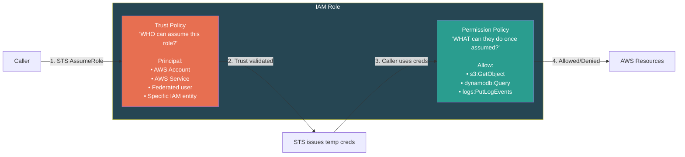
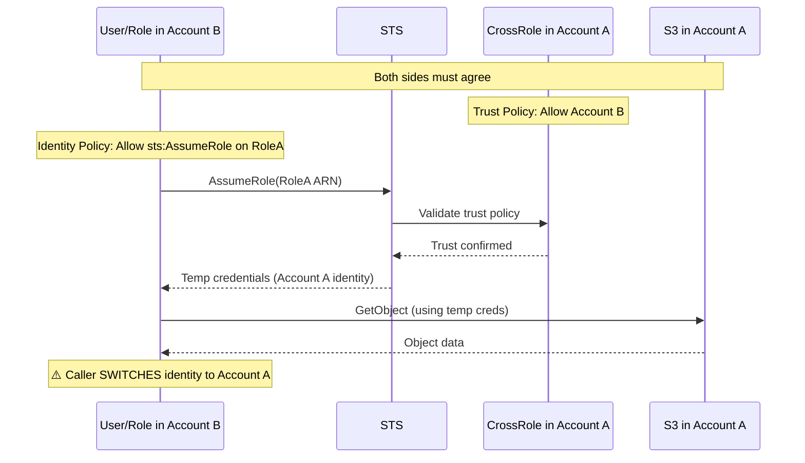
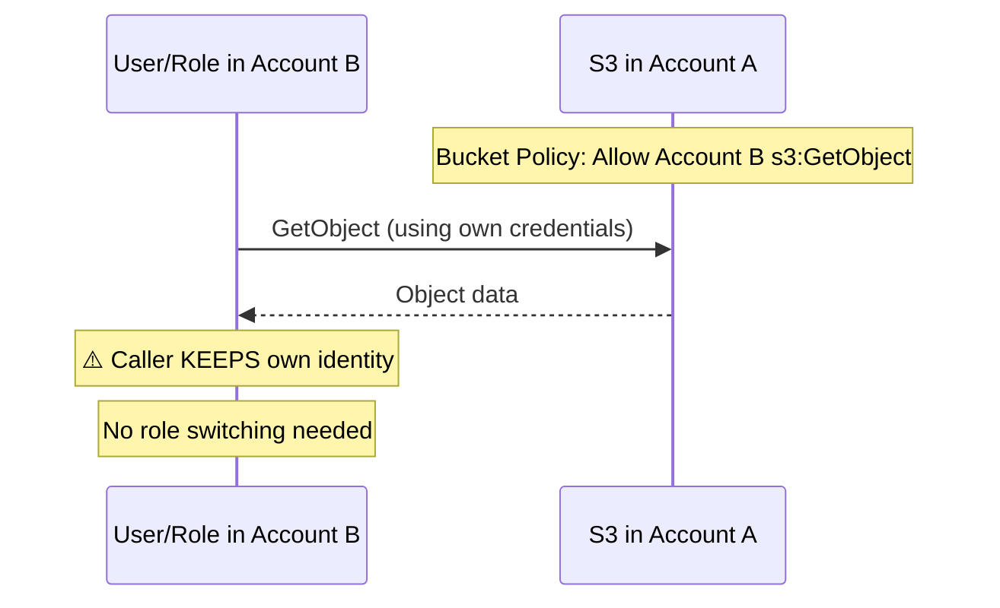
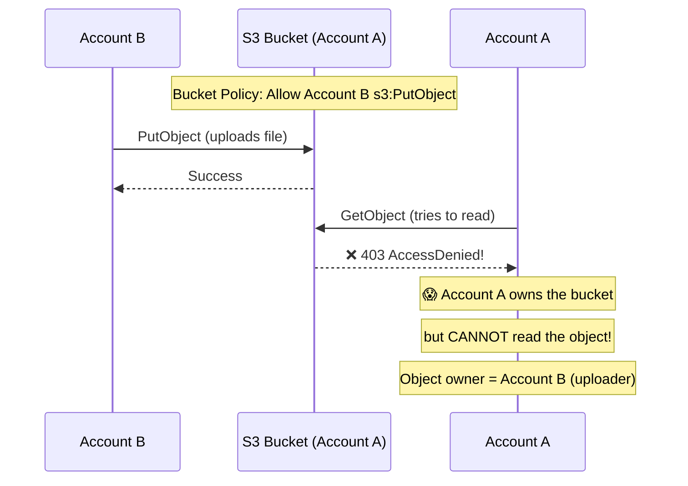
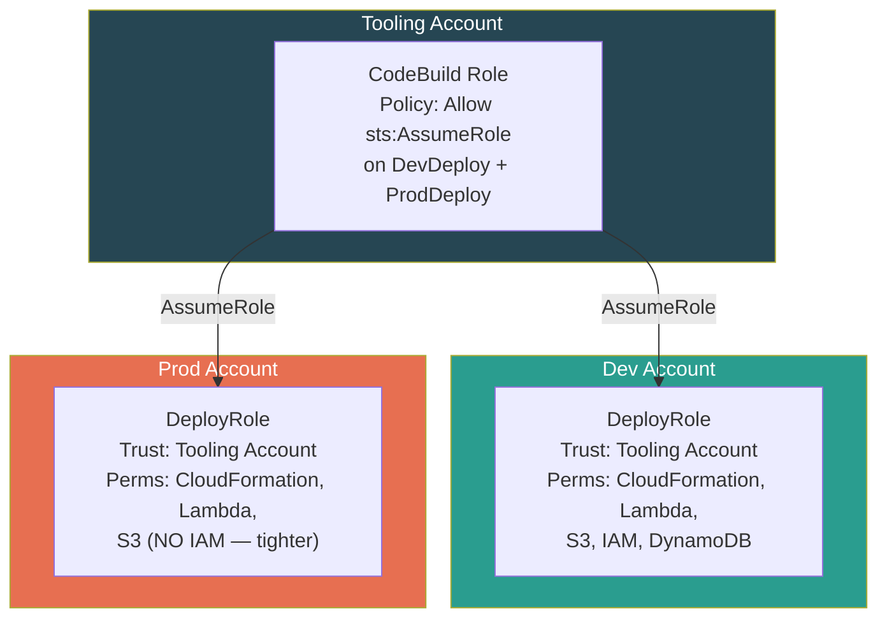

# AWS IAM — STS, Role Assumption & Cross-Account Access

## What is STS?

**Security Token Service** — the engine behind every IAM Role. When anything "assumes a role," STS issues three things:

```
┌──────────────────────────────────────┐
│    STS Temporary Credentials         │
│                                      │
│    1. AccessKeyId                    │
│    2. SecretAccessKey                │
│    3. SessionToken      ← extra!    │
│                                      │
│    + Expiration (15 min → 12 hrs)    │
│                                      │
│    Auto-expire. No rotation needed.  │
│    Leaked creds = limited blast      │
│    radius.                           │
└──────────────────────────────────────┘
```

---

## Key STS API Calls

| API | Who Uses It | Duration | Use Case |
|-----|------------|----------|----------|
| `AssumeRole` | IAM Users, Roles, AWS Services | 15 min – 12 hrs (default 1 hr) | Cross-account, service execution |
| `AssumeRoleWithSAML` | Federated users via SAML IdP | 15 min – 12 hrs | Enterprise SSO (Okta, AD FS → AWS) |
| `AssumeRoleWithWebIdentity` | OIDC-authenticated users | 15 min – 12 hrs | Mobile/web apps (prefer Cognito) |
| `GetSessionToken` | IAM Users | 15 min – 36 hrs | MFA-protected API access |
| `GetFederationToken` | IAM Users | 15 min – 36 hrs | Custom identity broker (legacy) |
| `GetCallerIdentity` | Anyone | N/A | "Who am I?" — always works, can't be denied |

---

## The Trust Policy — Gatekeeper of Every Role

Every Role has **two** policy types:



### Trust Policy Example — Cross-Account

```json
{
  "Version": "2012-10-17",
  "Statement": [{
    "Effect": "Allow",
    "Principal": {
      "AWS": "arn:aws:iam::123456789012:root"
    },
    "Action": "sts:AssumeRole",
    "Condition": {
      "StringEquals": {
        "sts:ExternalId": "UniqueSecret123"
      }
    }
  }]
}
```

### Trust Policy Example — AWS Service

```json
{
  "Version": "2012-10-17",
  "Statement": [{
    "Effect": "Allow",
    "Principal": {
      "Service": "lambda.amazonaws.com"
    },
    "Action": "sts:AssumeRole"
  }]
}
```

---

## Cross-Account Access — Two Patterns

### Pattern 1: Role-Based (Preferred)



**Characteristics:**
- Caller **switches identity** to the target account
- Requires **bidirectional agreement**: Trust policy in A + Identity policy in B
- Works for **all AWS services**
- Caller loses their original identity during the session

### Pattern 2: Resource-Based



**Characteristics:**
- Caller **keeps own identity** (no AssumeRole)
- Only needs the resource policy in Account A (unilateral)
- Only works for services that **support resource policies** (S3, SQS, Lambda, KMS, SNS, etc.)
- Simpler setup, fewer moving parts

### When to Use Which?

| Criteria | Role-Based | Resource-Based |
|----------|-----------|---------------|
| **Identity** | Caller switches to target account | Caller keeps own identity |
| **Agreement** | Both sides must agree | Resource policy alone sufficient |
| **Service support** | Works for everything | Only services with resource policies |
| **Audit trail** | CloudTrail shows assumed role | CloudTrail shows original caller |
| **Use when** | Need access to multiple resources, services without resource policies | Simple S3/SQS/Lambda access, need to preserve caller identity |

---

## The Confused Deputy Problem

```mermaid
flowchart TD
    subgraph NORMAL["Normal Flow ✅"]
        C1["Customer A"] -->|"Configures"| TP1["Third Party (Datadog)"]
        TP1 -->|"AssumeRole\n(Customer A's Role)"| AWS1["Customer A's AWS\nRead CloudWatch"]
    end

    subgraph ATTACK["Attack Without External ID ❌"]
        ATK["Attacker"] -->|"Tells Datadog:\n'Use Customer A's Role ARN'"| TP2["Third Party (Datadog)"]
        TP2 -->|"AssumeRole\n(Customer A's Role)"| AWS2["Customer A's AWS\n😱 Attacker reads data"]
    end

    subgraph FIX["Fix: External ID ✅"]
        ATK2["Attacker"] -->|"Tells Datadog:\n'Use Customer A's Role ARN'"| TP3["Third Party (Datadog)"]
        TP3 -->|"AssumeRole\n(wrong ExternalId)"| AWS3["Customer A's AWS\n🚫 DENIED"]
    end

    style ATTACK fill:#e76f51,color:#fff
    style FIX fill:#2d6a4f,color:#fff
```



**How External ID fixes it:** It's a secret shared only between Customer A and Datadog. The trust policy requires it as a condition. The attacker doesn't know the External ID, so even if they provide Customer A's Role ARN through Datadog, the assume fails.

```json
"Condition": {
  "StringEquals": {
    "sts:ExternalId": "CustomerA-Secret-12345"
  }
}
```

---

## Role Chaining

When one assumed role assumes another role:

```
User → AssumeRole(Role A) → Role A assumes Role B → Role B assumes Role C
```

**Critical constraint:** Role chaining caps session duration at **1 hour maximum**, regardless of what's configured on each role.

```
Role A config: MaxSessionDuration = 12 hours
Role B config: MaxSessionDuration = 12 hours
Role C config: MaxSessionDuration = 12 hours

Actual session for Role C = 1 hour MAX (role chaining limit)
```

---

## Cross-Account S3 Object Ownership — The Classic Trap

**Scenario:** Account B uploads an object to Account A's S3 bucket (via bucket policy). Account A tries to read the object.



**Why?** By default, the **uploader owns the object**, not the bucket owner. Account A's IAM policies only control resources they own.

**Three fixes:**

| Fix | How | Best For |
|-----|-----|----------|
| **Bucket Owner Enforced (recommended)** | Set `ObjectOwnership: BucketOwnerEnforced` on the bucket. Disables ACLs entirely. Bucket owner always owns all objects. | New buckets, modern setups |
| **Bucket Owner Full Control ACL** | Uploader includes `--acl bucket-owner-full-control` on every PutObject. Bucket policy requires this ACL. | Legacy setups where you can't change ownership |
| **Copy to self** | Account A copies the object to itself within the same bucket. The copy is owned by Account A. | One-off fixes |

**Bucket policy enforcing ACL (legacy approach):**
```json
{
  "Effect": "Deny",
  "Principal": { "AWS": "arn:aws:iam::ACCOUNT_B:root" },
  "Action": "s3:PutObject",
  "Resource": "arn:aws:s3:::my-bucket/*",
  "Condition": {
    "StringNotEquals": {
      "s3:x-amz-acl": "bucket-owner-full-control"
    }
  }
}
```

> **SDE2 Trap:** This is one of the most commonly asked S3/IAM cross-account questions. The answer is `BucketOwnerEnforced` for new setups. Know the legacy ACL approach too.

---

## Real-World Example — CI/CD Cross-Account Deployment



> Prod DeployRole has **fewer permissions** than Dev — same trust, tighter boundary. Principle of least privilege.

---

## Revoking STS Sessions

You **cannot** invalidate a specific temporary credential. But you can:

1. **Blanket revoke** by adding a Deny policy with timestamp condition:
```json
{
  "Effect": "Deny",
  "Action": "*",
  "Resource": "*",
  "Condition": {
    "DateLessThan": {
      "aws:TokenIssueTime": "2024-01-15T12:00:00Z"
    }
  }
}
```
This denies all sessions issued before the specified time.

2. **Delete/modify the Role** — but this affects all future sessions too.

---

## ⚠️ Gotchas & Edge Cases

| Gotcha | Detail |
|--------|--------|
| **Role chaining = 1 hour max** | A → B → C: session drops to 1 hour regardless of role config |
| **Both sides must agree (role-based)** | Trust policy in target + identity policy in source. Miss either → AccessDenied |
| **STS regional endpoints** | STS has global + regional endpoints. Regional = lower latency + PrivateLink support. Must be explicitly activated per region. |
| **Session tags propagation** | Tags marked "transitive" persist through role chaining. Powerful for ABAC but tricky to debug. |
| **Cannot revoke individual creds** | Only blanket revoke by timestamp. No per-session revocation. |
| **External ID is NOT a secret from AWS** | It's logged in CloudTrail. It's a secret between you and the third party, not from AWS. |
| **`iam:PassRole` hidden requirement** | Creating a Lambda and assigning it a Role requires `iam:PassRole` on that Role. Without it → confusing AccessDenied. |
| **Cross-account S3 object ownership** | Uploader owns the object, not bucket owner. Account A can't read objects uploaded by Account B. Fix: `BucketOwnerEnforced`. |

---

## 📌 Interview Cheat Sheet

- STS returns **3 values**: AccessKeyId, SecretAccessKey, SessionToken
- Role assumption requires **bidirectional trust**: trust policy (target) + identity policy (source)
- External ID prevents **confused deputy** attacks from third-party services
- Role chaining caps session at **1 hour max**
- `GetCallerIdentity` — always works, even with zero permissions, can't be denied
- Cross-account resource-based: caller **keeps own identity**, no role switch
- Cross-account role-based: caller **switches identity** to target account
- Cannot revoke individual STS creds — only blanket revoke by timestamp
- `iam:PassRole` — hidden requirement when assigning roles to services
- STS regional endpoints must be explicitly activated per region
- **Cross-account S3 object ownership**: uploader owns the object by default. Fix = `BucketOwnerEnforced`
- Cross-account S3 upload: enforce `bucket-owner-full-control` ACL via Deny condition (legacy) or use `BucketOwnerEnforced` (modern)
