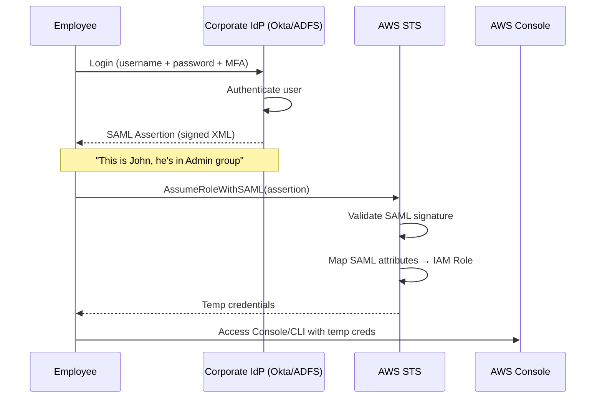
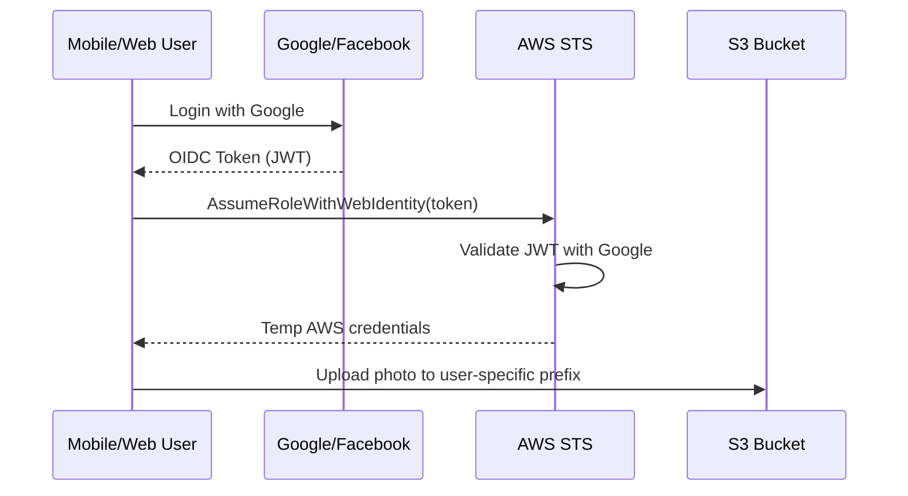
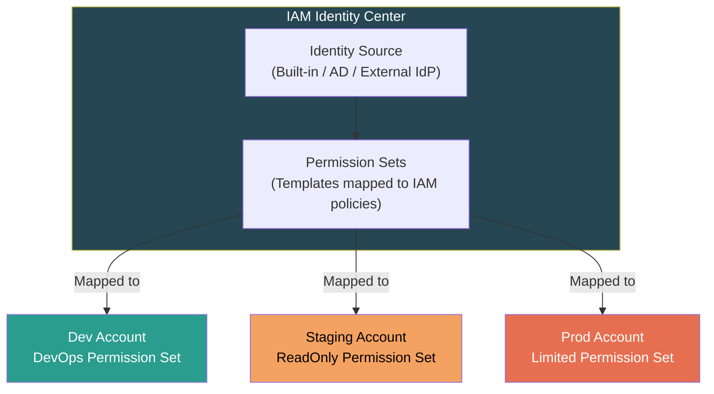
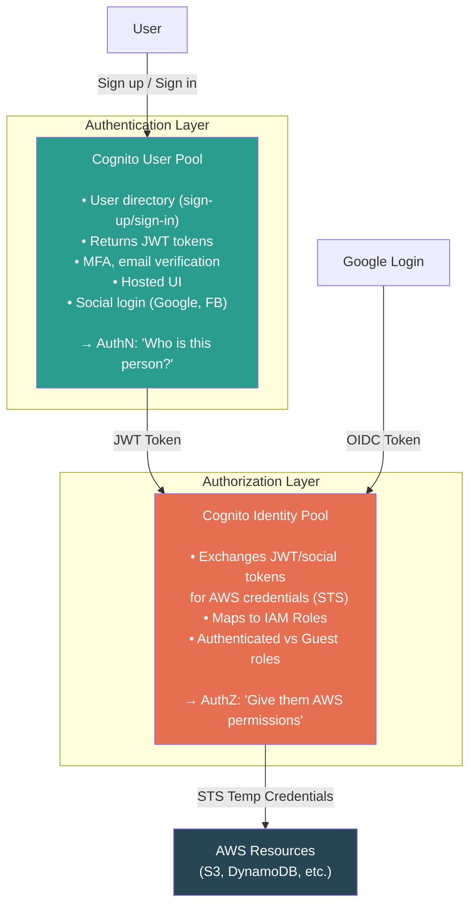
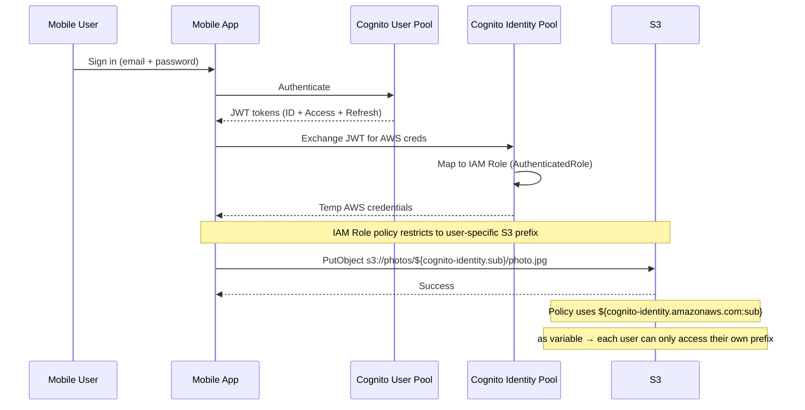

# AWS IAM — Identity Federation & SSO

## Why Federation?

Companies with 50,000 employees can't create 50,000 IAM Users (5,000 limit + credential management nightmare). Federation = authenticate **outside** AWS, still access AWS resources. No IAM Users created.


---

## The 4 Federation Mechanisms

### 1. SAML 2.0 Federation (Enterprise SSO)



**Key details:**
- Used by large enterprises with existing identity infrastructure (Active Directory, Okta, OneLogin)
- IdP sends a **signed XML assertion** proving identity + group membership
- AWS maps SAML attributes → IAM Role (e.g., Admin group → AdminRole)
- **No custom code needed** — AWS Console supports SAML natively
- Max session: **12 hours**

### 2. OIDC / Web Identity Federation (Web/Mobile Apps)



**Key details:**
- For public-facing apps where users authenticate via Google, Facebook, Apple, etc.
- **AWS recommends Cognito instead of direct OIDC** — Cognito wraps this + adds features
- Direct `AssumeRoleWithWebIdentity` is supported but considered legacy pattern

### 3. AWS IAM Identity Center (Modern Standard — formerly AWS SSO)



**Key details:**
- AWS's **built-in, recommended** SSO solution
- Centrally manage access across **all accounts** in your Organization
- Uses **Permission Sets** (templates) instead of individual roles per account
- Supports multiple identity sources: built-in store, Active Directory, external SAML/OIDC IdPs
- Provides a **user portal** — employees see all accounts they have access to
- Creates IAM Roles behind the scenes — but you manage them as Permission Sets

### 4. Custom Identity Broker (Legacy)

```
User → Your custom app → Validates against your DB → Calls STS GetFederationToken → Returns temp creds
```

- You write code to authenticate users against your own identity store
- Then call STS directly to get temp credentials
- **Avoid** — only exists for legacy systems that can't use SAML/OIDC/Cognito

---

## Cognito — The Two Pieces



### Cognito Comparison

| | User Pool | Identity Pool |
|---|---|---|
| **Purpose** | AuthN — "Who is this person?" | AuthZ — "What AWS resources can they access?" |
| **Returns** | JWT tokens (ID, Access, Refresh) | AWS temp credentials (AccessKey + SecretKey + SessionToken) |
| **Features** | Sign-up/sign-in, MFA, email verify, hosted UI, social login | Maps tokens → IAM Roles, supports authenticated + guest access |
| **Used for** | Your app's user management | Granting actual AWS API access to end users |
| **Can work alone?** | ✅ (just for app auth, no AWS access) | ✅ (accepts social tokens without User Pool) |

> **SDE2 Trap:** User Pools and Identity Pools solve **different problems**. User Pools = identity management. Identity Pools = AWS credential vending. You often use both together, but they're independent services.

---

## Federation Decision Matrix

| Scenario | Mechanism | Why |
|----------|----------|-----|
| Enterprise with Okta/AD FS, employees need AWS Console | **SAML 2.0** or **IAM Identity Center** | Standard enterprise SSO protocol |
| Multi-account org, centralized access management | **IAM Identity Center** | Built for this. Permission Sets across accounts. |
| Mobile app, users log in with Google/Facebook | **Cognito (User Pool + Identity Pool)** | Managed user directory + AWS credential vending |
| Web app, users upload to user-specific S3 prefix | **Cognito Identity Pool** | Maps authenticated user → scoped IAM Role |
| Legacy system with custom auth DB | **Custom Identity Broker** | Last resort. Calls STS directly. |

---

## Real-World Example — Mobile App with Cognito



**IAM policy for per-user S3 access:**
```json
{
  "Effect": "Allow",
  "Action": ["s3:GetObject", "s3:PutObject"],
  "Resource": "arn:aws:s3:::photo-bucket/${cognito-identity.amazonaws.com:sub}/*"
}
```

---

## ⚠️ Gotchas & Edge Cases

| Gotcha | Detail |
|--------|--------|
| **SAML ≠ OIDC** | SAML = XML-based, enterprise, older. OIDC = JSON/JWT-based, modern, web-friendly. Don't conflate. |
| **Cognito User Pools ≠ AWS credentials** | User Pools give JWTs for your app. Only Identity Pools give STS credentials for AWS access. |
| **IAM Identity Center = AWS SSO renamed** | Same service, new name. Interviewers may use either. |
| **Federation session limits** | SAML = 12 hrs max. Web Identity = 1 hr default (extendable via Cognito). |
| **Cognito has region limits** | User Pools are regional. For global apps, consider Cognito in multiple regions or use a global IdP. |
| **Token refresh** | Cognito Refresh Token = 30 days default (configurable 1 day → 10 years). Access/ID tokens = 1 hour, not configurable. |
| **Identity Pool guest access** | Identity Pools can issue credentials to unauthenticated users — useful but risky if role is too permissive. |

---

## 📌 Interview Cheat Sheet

- 50,000 employees → **Federation**, not 50,000 IAM Users
- Enterprise SSO → **SAML 2.0** or **IAM Identity Center**
- Multi-account centralized access → **IAM Identity Center** (recommended)
- Mobile/web public users → **Cognito** (User Pool + Identity Pool)
- Cognito User Pool = JWT tokens (**AuthN**). Identity Pool = AWS credentials (**AuthZ**).
- **IAM Identity Center** = recommended multi-account SSO for Organizations
- Custom Identity Broker = legacy, avoid unless forced
- Per-user S3 access → Cognito Identity Pool + policy variable `${cognito-identity.amazonaws.com:sub}`
- SAML = XML, enterprise. OIDC = JWT, modern web. Different protocols.
- Permission Sets (Identity Center) = templates mapped to IAM policies across accounts
