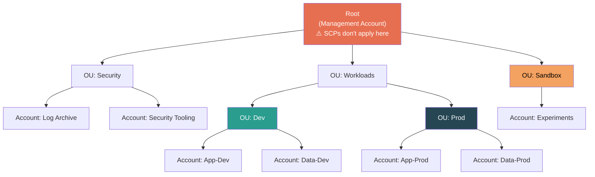
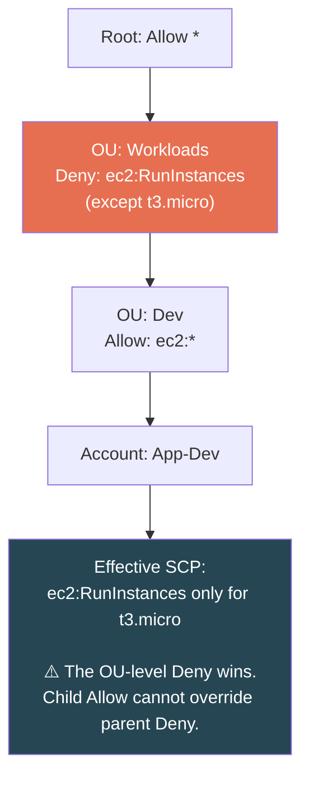
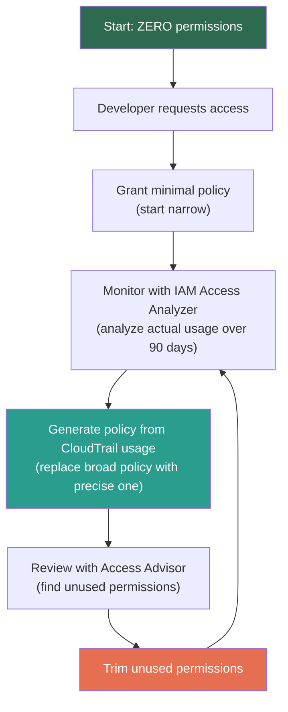

# AWS IAM — SCPs, Organizations & Security Best Practices

## AWS Organizations — The Multi-Account Hierarchy



**Why multi-account?**
- **Blast radius isolation** — compromised dev can't touch prod
- **Billing separation** — clear cost attribution per team/project
- **Regulatory compliance** — separate accounts for PCI, HIPAA workloads
- **Service limit isolation** — one account's limits don't affect others

---

## Service Control Policies (SCPs)

SCPs are **guardrails**, NOT grants. They define the **maximum** permissions available to an account.

> **Analogy:** SCP = fence around a playground. Kids can play anywhere inside, but can't go beyond the fence. The fence doesn't make them play — it just limits where they can.

### Two SCP Strategies

| Strategy | Approach | When to Use |
|----------|---------|-------------|
| **Deny-list (recommended)** | Start with implicit `Allow *`, add explicit Denies | Most common. Block specific dangerous actions. |
| **Allow-list** | Remove default `Allow *`, explicitly Allow only what's needed | Ultra-secure environments. Painful to manage at scale. |

### Deny-List Examples

**Prevent leaving the Organization:**
```json
{
  "Effect": "Deny",
  "Action": "organizations:LeaveOrganization",
  "Resource": "*"
}
```

**Restrict EC2 to approved instance types:**
```json
{
  "Effect": "Deny",
  "Action": "ec2:RunInstances",
  "Resource": "arn:aws:ec2:*:*:instance/*",
  "Condition": {
    "StringNotEquals": {
      "ec2:InstanceType": ["t3.micro", "t3.small", "t3.medium"]
    }
  }
}
```

**Prevent disabling CloudTrail:**
```json
{
  "Effect": "Deny",
  "Action": [
    "cloudtrail:StopLogging",
    "cloudtrail:DeleteTrail"
  ],
  "Resource": "*"
}
```

**Restrict to approved regions only:**
```json
{
  "Effect": "Deny",
  "NotAction": [
    "iam:*",
    "sts:*",
    "organizations:*",
    "support:*"
  ],
  "Resource": "*",
  "Condition": {
    "StringNotEquals": {
      "aws:RequestedRegion": ["us-east-1", "eu-west-1"]
    }
  }
}
```
> Note: `NotAction` excludes global services (IAM, STS, Organizations) that don't have regional endpoints.

### Critical SCP Behaviors

```
┌─────────────────────────────────────────────────────────┐
│                    SCP Rules                            │
│                                                         │
│  ✅ SCPs affect ALL users and roles in member accounts  │
│  ✅ SCPs affect the member account's ROOT user          │
│  ✅ SCP Deny CANNOT be overridden by anything inside    │
│                                                         │
│  ❌ SCPs do NOT apply to the management account         │
│  ❌ SCPs do NOT affect service-linked roles              │
│  ❌ SCPs do NOT grant permissions — only restrict        │
│                                                         │
│  Effective = SCP ∩ IAM Policy (intersection)            │
└─────────────────────────────────────────────────────────┘
```

### SCP Inheritance



SCPs are inherited top-down. A child OU/account **cannot** undo a parent's Deny.

---

## IAM Security Best Practices — The Production Checklist

### 1. Root Account Lockdown

| Action | Status |
|--------|--------|
| Enable MFA (hardware key preferred) | ✅ Required |
| Delete root access keys | ✅ Required |
| Use root ONLY for billing/account-level tasks | ✅ Required |
| Enable CloudTrail to monitor root usage | ✅ Required |
| Set up CloudWatch alarm for root login | ✅ Recommended |
| NEVER use root for day-to-day operations | ✅ Non-negotiable |

### 2. Least Privilege Workflow



### 3. Credential Hygiene

| Practice | Implementation |
|----------|---------------|
| **Rotate access keys every 90 days** | Use IAM Credential Report to audit |
| **Use IAM Roles everywhere possible** | Eliminates permanent keys entirely |
| **Enforce MFA for sensitive ops** | Condition: `aws:MultiFactorAuthPresent` |
| **IP-restrict sensitive access** | Condition: `aws:SourceIp` for office CIDR |
| **Enable CloudTrail in ALL regions** | Non-negotiable. Audit every API call. |
| **Use `aws:SecureTransport`** | Enforce HTTPS on S3 bucket policies |
| **Enforce `aws:PrincipalOrgID`** | Lock resource policies to your Org only |

### 4. Key IAM Security Tools

| Tool | What It Does | When to Use |
|------|-------------|-------------|
| **IAM Access Analyzer** | Finds resources shared with external accounts/public. Generates least-privilege policies from CloudTrail. | Continuous — run regularly to detect drift |
| **IAM Access Advisor** | Shows when each permission was last used per service | Quarterly review — find stale permissions |
| **Credential Report** | CSV of all IAM Users + credential status (last rotation, MFA, last used) | Monthly audit — find non-compliant users |
| **IAM Policy Simulator** | Test policies without applying them. "Would this policy allow X?" | Before deploying new policies |
| **AWS Config Rules** | Automated compliance checks (e.g., "all users must have MFA") | Continuous compliance monitoring |
| **CloudTrail** | Audit log of every API call across all accounts | Always on. Non-negotiable. |

### MFA Enforcement Pattern

```json
{
  "Version": "2012-10-17",
  "Statement": [
    {
      "Sid": "AllowWithMFA",
      "Effect": "Allow",
      "Action": "*",
      "Resource": "*",
      "Condition": {
        "Bool": { "aws:MultiFactorAuthPresent": "true" }
      }
    },
    {
      "Sid": "AllowMFAManagementWithoutMFA",
      "Effect": "Allow",
      "Action": [
        "iam:CreateVirtualMFADevice",
        "iam:EnableMFADevice",
        "iam:ListMFADevices",
        "iam:ResyncMFADevice"
      ],
      "Resource": "arn:aws:iam::*:user/${aws:username}"
    },
    {
      "Sid": "DenyAllWithoutMFA",
      "Effect": "Deny",
      "NotAction": [
        "iam:CreateVirtualMFADevice",
        "iam:EnableMFADevice",
        "iam:ListMFADevices",
        "iam:ResyncMFADevice",
        "sts:GetSessionToken"
      ],
      "Resource": "*",
      "Condition": {
        "BoolIfExists": { "aws:MultiFactorAuthPresent": "false" }
      }
    }
  ]
}
```

> **Key:** Users can set up their MFA without MFA, but can't do anything else until MFA is enabled.

---

## ⚠️ Gotchas & Edge Cases

| Gotcha | Detail |
|--------|--------|
| **SCPs don't affect management account** | If management account is compromised, SCPs are useless. Minimize what lives there. |
| **SCP + IAM = intersection** | Both must Allow. Either can Deny. SCP restricts the ceiling, IAM grants within it. |
| **`aws:PrincipalOrgID`** | Condition key to lock resource policies to your Org. Critical for S3, KMS. Without it → external accounts could access resources. |
| **Tag policies vs SCPs** | Tag policies enforce tagging standards (naming, required tags). SCPs enforce permission guardrails. Different tools. |
| **SCP `NotAction` for global services** | Region-restrict SCPs must exclude IAM, STS, Organizations (global services) using `NotAction`. |
| **Service-linked roles bypass SCPs** | AWS-managed roles (e.g., for ELB, RDS) are not affected by SCPs. |
| **Credential Report is account-level** | One report per account. For Org-wide audit, aggregate across all accounts. |

---

## 📌 Interview Cheat Sheet

- SCPs = **ceiling**, not a grant. Same model as Permissions Boundaries but at account level
- SCPs **don't apply to management account** or service-linked roles
- Deny-list strategy = common. Allow-list = more secure but painful to manage
- SCP inheritance: parent Deny **cannot** be overridden by child Allow
- Access Analyzer → find external exposure + generate least-privilege policies from CloudTrail
- Access Advisor → find unused permissions (per-service last-accessed)
- Credential Report → audit all users' credential status (CSV)
- **`aws:PrincipalOrgID`** = lock resource policies to your Org only
- Root account: MFA on, access keys off, CloudTrail on, CloudWatch alarm on root login
- Least privilege is a **continuous process**, not a one-time setup
- MFA enforcement policy: allow MFA setup without MFA, deny everything else until MFA enabled
