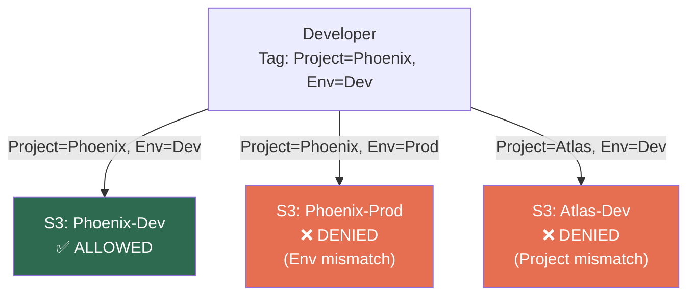
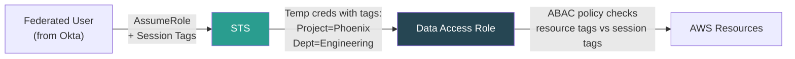
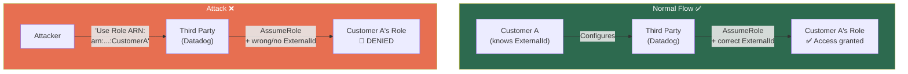
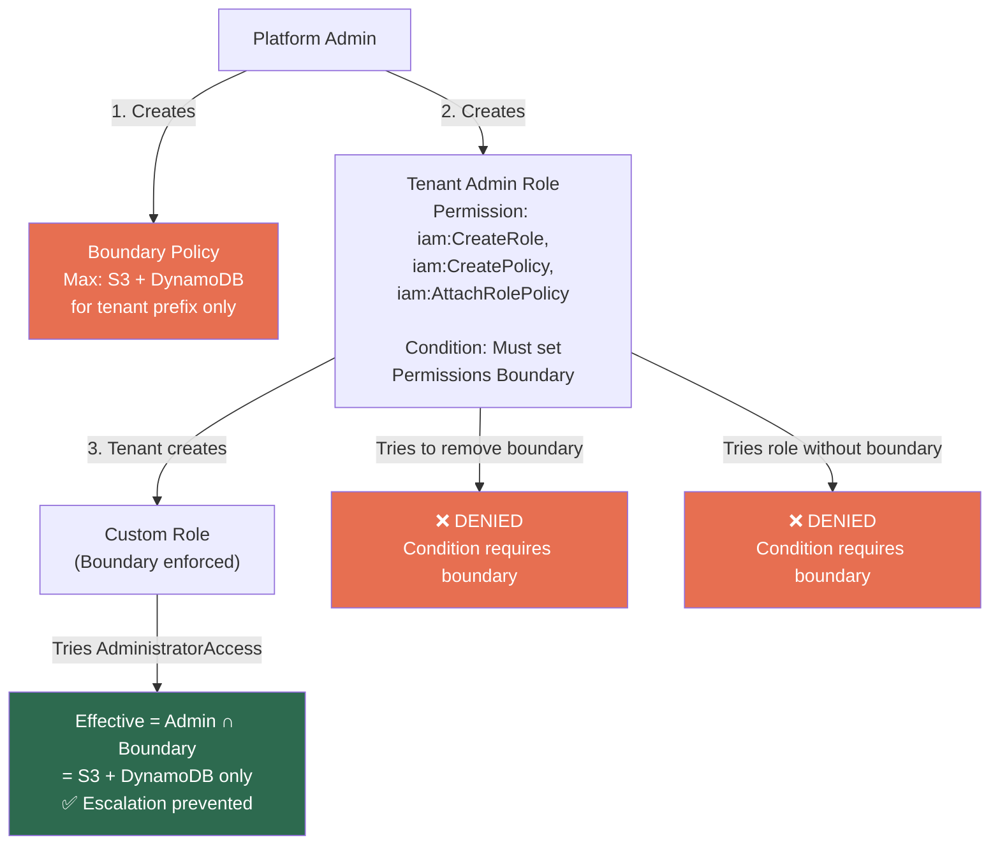
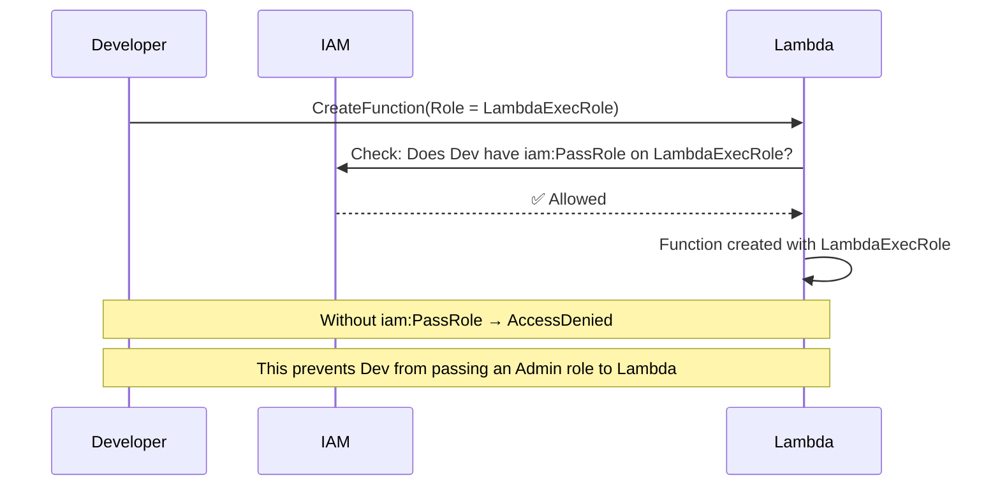
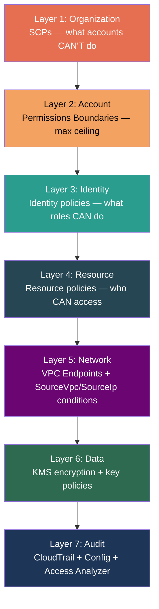
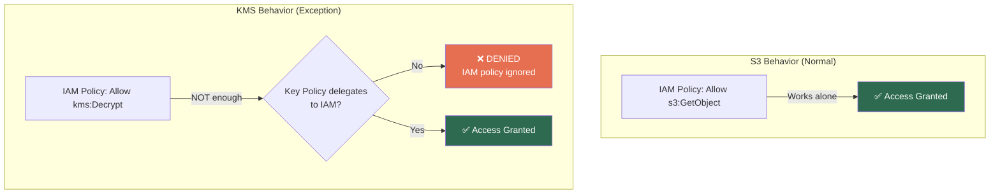

# AWS IAM — Advanced Patterns & System Design

## ABAC — Attribute-Based Access Control (Tag-Based)

### The Problem with RBAC at Scale

Traditional IAM = **RBAC** (Role-Based): Create a role per team × per resource × per environment.

```
RBAC explosion:
  Role: Dev-S3-ProjectPhoenix
  Role: Dev-S3-ProjectAtlas
  Role: Dev-DynamoDB-ProjectPhoenix
  Role: QA-S3-ProjectPhoenix
  Role: QA-S3-ProjectAtlas
  Role: Prod-S3-ProjectPhoenix
  ... hundreds of roles for every combination
```

### ABAC Solution — One Policy, Tags Do the Work

```json
{
  "Effect": "Allow",
  "Action": ["s3:GetObject", "s3:PutObject"],
  "Resource": "*",
  "Condition": {
    "StringEquals": {
      "s3:ResourceTag/Project": "${aws:PrincipalTag/Project}",
      "s3:ResourceTag/Environment": "${aws:PrincipalTag/Environment}"
    }
  }
}
```

**Translation:** "You can access S3 objects only if the resource's `Project` and `Environment` tags **match your own tags**."



### ABAC vs RBAC Comparison

| | RBAC | ABAC |
|---|---|---|
| **Scaling** | New project/env = new role | New project/env = new tag value. Zero policy changes |
| **Policy count** | Grows with combinations | Few policies, reused everywhere |
| **Onboarding** | Assign to correct role(s) | Tag the user correctly |
| **Audit** | Which roles does this user have? | What tags does this user/resource have? |
| **Dependency** | IAM admin creates roles | Consistent tagging discipline required |
| **Best for** | Small orgs, simple structures | Large orgs, many projects/teams/environments |

---

## Session Tags — ABAC for Federated Users

When assuming a role, you can pass **session tags** via STS:

```json
// AssumeRole call
{
  "RoleArn": "arn:aws:iam::123456789012:role/DataAccessRole",
  "RoleSessionName": "john.doe",
  "Tags": [
    { "Key": "Project", "Value": "Phoenix" },
    { "Key": "Department", "Value": "Engineering" },
    { "Key": "CostCenter", "Value": "CC-1234" }
  ],
  "TransitiveTagKeys": ["Project"]
}
```



**Key behaviors:**
- Session tags behave like principal tags for the duration of the session
- **Transitive tags** persist through role chaining (A → B → C, tag carries to C)
- Max **50 session tags** per session
- Key max 128 chars, value max 256 chars

---

## The Confused Deputy Problem — Deep Dive



**Fix — External ID in Trust Policy:**
```json
{
  "Effect": "Allow",
  "Principal": { "AWS": "arn:aws:iam::DATADOG_ACCOUNT:root" },
  "Action": "sts:AssumeRole",
  "Condition": {
    "StringEquals": {
      "sts:ExternalId": "CustomerA-Unique-Secret-12345"
    }
  }
}
```

> External ID is a **shared secret between you and the third party**, not a secret from AWS (it's logged in CloudTrail).

---

## Permissions Boundaries — IAM Delegation Pattern

### The Problem

You want teams to self-serve IAM (create their own roles/policies) but **prevent privilege escalation**.

### The Solution



**The condition that enforces boundary attachment:**
```json
{
  "Effect": "Allow",
  "Action": [
    "iam:CreateRole",
    "iam:AttachRolePolicy",
    "iam:PutRolePolicy"
  ],
  "Resource": "*",
  "Condition": {
    "StringEquals": {
      "iam:PermissionsBoundary": "arn:aws:iam::123456789012:policy/TenantBoundary"
    }
  }
}
```

> Without this condition, any user with `iam:CreateRole` + `iam:AttachRolePolicy` can create a role with AdministratorAccess and assume it → **full privilege escalation**.

---

## `iam:PassRole` — The Hidden Permission

When you assign a Role to an AWS service (Lambda, EC2, ECS), you need `iam:PassRole`:



**Why it exists:** Without PassRole check, a developer could create a Lambda with AdminRole → invoke it → escalate to admin through the Lambda.

```json
{
  "Effect": "Allow",
  "Action": "iam:PassRole",
  "Resource": "arn:aws:iam::123456789012:role/LambdaExecRole",
  "Condition": {
    "StringEquals": {
      "iam:PassedToService": "lambda.amazonaws.com"
    }
  }
}
```

---

## Privilege Escalation Paths — What to Watch For

| Escalation Vector | How | Prevention |
|-------------------|-----|-----------|
| `iam:CreateRole` + `iam:AttachRolePolicy` | Create admin role, assume it | Require Permissions Boundary condition |
| `iam:PutUserPolicy` | Attach inline admin policy to self | Restrict to specific policy ARNs |
| `iam:PassRole` + service creation | Pass admin role to Lambda, invoke it | Restrict PassRole to specific roles |
| `iam:CreateAccessKey` on other users | Create keys for admin user | Restrict to `${aws:username}` only |
| `lambda:UpdateFunctionCode` | Modify Lambda with privileged role | Separate deploy role from exec role |
| `iam:UpdateAssumeRolePolicy` | Add yourself to admin role's trust | Restrict to specific role ARNs |

---

## IAM in System Design — The Security Layers



### VPC-Restricted S3 Access

```json
{
  "Effect": "Deny",
  "Principal": "*",
  "Action": "s3:*",
  "Resource": ["arn:aws:s3:::sensitive-bucket", "arn:aws:s3:::sensitive-bucket/*"],
  "Condition": {
    "StringNotEquals": {
      "aws:SourceVpce": "vpce-1234567890abcdef0"
    }
  }
}
```

> Even with correct IAM permissions, access is denied unless the request comes through the specified VPC endpoint. Defense in depth.

### KMS Key Policy + IAM — The Unique Exception

KMS is the **only AWS service** where the resource policy (key policy) **must explicitly delegate to IAM** for IAM policies to work. Unlike S3/SQS where IAM policies work independently:



**The default key policy that enables IAM:**
```json
{
  "Effect": "Allow",
  "Principal": {
    "AWS": "arn:aws:iam::123456789012:root"
  },
  "Action": "kms:*",
  "Resource": "*"
}
```

This statement says: "Delegate KMS authorization to IAM policies in this account." **If you remove this statement**, no IAM policy in the account can use this key — only the key policy itself controls access.

**Cross-account KMS:**
```
Account A (key owner):  Key policy must Allow Account B
Account B (key user):   IAM policy must Allow kms:Decrypt on the key ARN

BOTH are required. Either missing = AccessDenied.
```

> **SDE2 Trap:** "Why does my Lambda get AccessDenied on KMS even though the IAM policy allows `kms:Decrypt`?" Answer: Check the key policy. If it doesn't delegate to IAM (the `root` principal statement), IAM policies are completely ignored for that key.

---

## ⚠️ Gotchas & Edge Cases

| Gotcha | Detail |
|--------|--------|
| **ABAC requires consistent tagging** | One untagged resource = open access or broken access. Use Tag Policies to enforce. |
| **Session tags max = 50** | Each key max 128 chars, value max 256 chars. |
| **`iam:PassRole` often forgotten** | Creating Lambda/EC2 with a Role requires it. Without it → confusing AccessDenied. |
| **Privilege escalation is subtle** | `iam:CreatePolicy` + `iam:AttachUserPolicy` = self-escalation to admin. Always use Boundaries. |
| **VPC Endpoint policies** | Often forgotten. Even with correct IAM, a VPC Endpoint can restrict which resources are accessible through it. |
| **Permissions Boundary on existing roles** | Adding a boundary to an existing role can **break running services**. Test in dev first. |
| **Tag-based conditions need tag propagation** | For EC2, must enable "Tag on create" + `ec2:CreateTags` permission. Tags don't auto-propagate to child resources. |
| **KMS key policy must delegate to IAM** | Unlike all other services, KMS ignores IAM policies unless the key policy explicitly delegates via the `root` principal statement. |
| **Cross-account KMS needs both sides** | Key policy must Allow the external account AND the external account's IAM policy must Allow the KMS actions. Either missing = denied. |

---

## 📌 Interview Cheat Sheet

- **ABAC > RBAC** at scale. One policy + tags vs hundreds of role combos
- **`iam:PassRole`** = required when assigning a Role to a service. Must explicitly allow
- **Confused deputy** = third party tricked into using your Role. Fix = External ID in trust policy
- **Permissions Boundary delegation** = let teams self-serve IAM safely. Enforce boundary via conditions
- **Privilege escalation**: `iam:CreateRole` + `iam:AttachRolePolicy` without boundary = admin escalation
- Security = **layers**: SCP → Boundary → Identity → Resource → Network → Encryption → Audit
- **Break-glass** = emergency role with alarming, not permanent admin access
- ABAC needs **Tag Policies** to enforce consistency — otherwise breaks silently
- `aws:SourceVpce` — restrict resource access to specific VPC endpoints
- Session tags: transitive tags persist through role chaining (ABAC for federated users)
- **KMS is unique**: key policy MUST delegate to IAM (via `root` principal). Without delegation, IAM policies are ignored.
- **Cross-account KMS**: key policy Allow + IAM policy Allow — both required. Most common cause of cross-account KMS failures.
