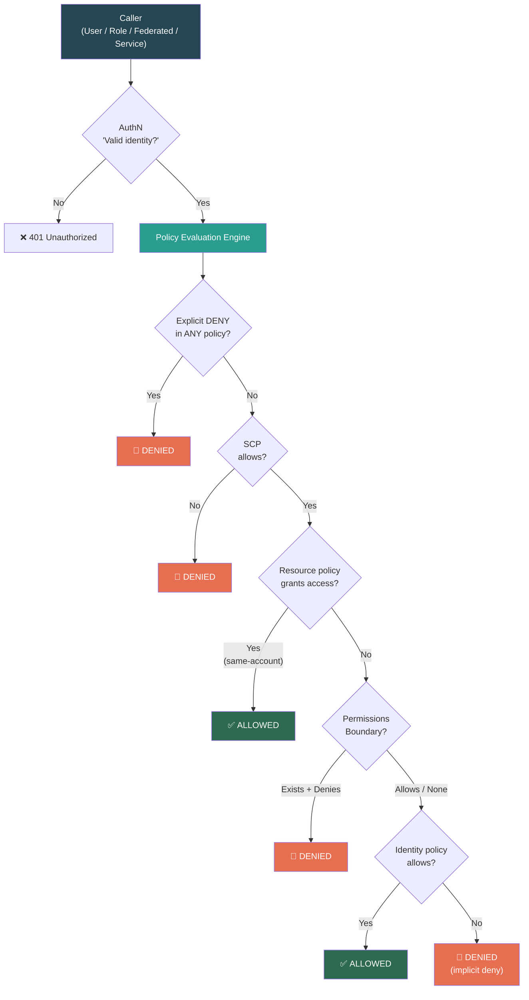
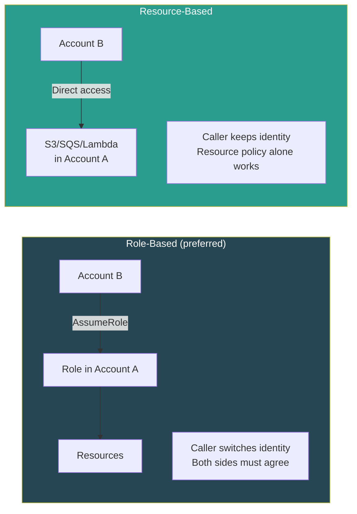

# AWS IAM — Master Revision Sheet

> **Quick-reference revision document.** For deep dives, see individual module files in this folder.

---

## 🗺️ Complete IAM Request Flow



---

## ⚡ Identity Primitives Decision Matrix

| | IAM User | IAM Group | IAM Role |
|---|---|---|---|
| **Is an identity?** | ✅ | ❌ | ✅ |
| **Credentials** | Permanent (password + access key) | N/A | Temporary (STS) |
| **Can be Principal?** | ✅ | ❌ | ✅ |
| **Use case** | Legacy / break-glass | Organize human users | Services, cross-account, **modern default** |
| **Limit** | 5,000/account | 300/account | 1,000/account |

> **Rule:** Always prefer Roles over Users. Temp creds > Permanent creds. Always.

---

## 🔐 Policy Types Quick Reference

| Type | Attached To | Grants? | Restricts? | Key Behavior |
|------|------------|---------|------------|-------------|
| **Identity-based** | Users, Groups, Roles | ✅ | ✅ | "What this identity can do" |
| **Resource-based** | S3, SQS, Lambda, KMS | ✅ | ✅ | Enables cross-account without role switch |
| **Permissions Boundary** | Users, Roles | ❌ | ✅ | Ceiling. Effective = Identity ∩ Boundary |
| **SCP** | Account / OU | ❌ | ✅ | Account-level ceiling. Not on management account. |
| **Session Policy** | STS session | ❌ | ✅ | Scope down specific session |
| **ACL** | S3 (legacy) | ✅ | ❌ | Avoid. Pre-IAM era. |

---

## 🔑 STS & Cross-Account Quick Reference

| STS API | Who Uses It | Duration | Use Case |
|---------|------------|----------|----------|
| `AssumeRole` | Users, Roles, Services | 15m–12h | Cross-account, services |
| `AssumeRoleWithSAML` | SAML-federated | 15m–12h | Enterprise SSO |
| `AssumeRoleWithWebIdentity` | OIDC users | 15m–12h | Mobile/web (prefer Cognito) |
| `GetSessionToken` | IAM Users | 15m–36h | MFA-protected API access |
| `GetCallerIdentity` | Anyone | N/A | "Who am I?" — can't be denied |

### Cross-Account Patterns



---

## 🏢 Federation Decision Matrix

| Scenario | Mechanism |
|----------|----------|
| Enterprise SSO (Okta, AD FS) | **SAML 2.0** or **IAM Identity Center** |
| Multi-account centralized access | **IAM Identity Center** (recommended) |
| Mobile app with Google/Facebook login | **Cognito (User Pool + Identity Pool)** |
| Per-user S3 access in web app | **Cognito Identity Pool** + policy variable |
| Legacy custom auth system | **Custom Identity Broker** (avoid) |

### Cognito Quick Reference

| | User Pool | Identity Pool |
|---|---|---|
| **Purpose** | AuthN — "Who is this?" | AuthZ — "What AWS access?" |
| **Returns** | JWT tokens | AWS temp credentials (STS) |
| **Use for** | App user management | Granting AWS API access |

---

## 🏗️ Security Layers for System Design

```
Layer 1: Organization  → SCPs (account-level ceiling)
Layer 2: Account       → Permissions Boundaries (role-level ceiling)
Layer 3: Identity      → Identity policies (what roles CAN do)
Layer 4: Resource      → Resource policies (who CAN access this)
Layer 5: Network       → VPC Endpoints + SourceVpc conditions
Layer 6: Data          → KMS encryption + key policies
Layer 7: Audit         → CloudTrail + Config + Access Analyzer
```

### Design Patterns Cheat Sheet

| Pattern | Implementation |
|---------|---------------|
| **Microservices** | Separate Role per service. Least privilege. No shared creds. |
| **CI/CD cross-account** | Tooling → AssumeRole into dev/prod. Prod role is tighter. |
| **Public API** | Cognito → API Gateway authorizer → Lambda with scoped Role |
| **Data lake** | ABAC with tags (Department, Classification, Project) |
| **Break-glass** | Emergency admin Role + CloudTrail alarm + MFA required |
| **Multi-tenant SaaS** | Permissions Boundaries per tenant. Self-serve IAM within ceiling. |

---

## 🚦 Hard Limits

| Limit | Value |
|-------|-------|
| IAM Users per account | 5,000 |
| Groups per account | 300 |
| Roles per account | 1,000 |
| Managed policies per entity | 10 |
| Managed policy size | 6,144 characters |
| Inline policy size (Role) | 2,048 characters |
| Groups per user | 10 |
| Access keys per user | 2 |
| Session tags | 50 per session |
| Role chaining max session | **1 hour** (hard limit) |

---

## 💰 Security Tools Quick Reference

| Tool | Purpose | Frequency |
|------|---------|-----------|
| **Access Analyzer** | Find external exposure + generate least-privilege policies | Continuous |
| **Access Advisor** | Find unused permissions (last-accessed per service) | Quarterly |
| **Credential Report** | CSV audit of all users' credential status | Monthly |
| **Policy Simulator** | Test policies without applying | Before deployment |
| **CloudTrail** | API call audit log | Always on |

---

## 🪤 Top SDE2 Interview Traps

| Trap | What They Expect You To Know |
|------|------------------------------|
| "Permissions Boundary + Identity Policy" | Effective = **intersection**, not union. Boundary never grants. |
| "NotAction + Allow" | ≠ Deny. It's a gap, not a wall. Other policies can fill it. |
| "SCP on management account" | SCPs **don't apply** to management account. Major risk if compromised. |
| "Cross-account S3 access" | Resource-based: caller keeps identity. Role-based: caller switches identity. |
| "Role chaining duration" | Max **1 hour** regardless of individual role settings. |
| "`iam:PassRole`" | Required when assigning roles to services. Without it → confusing AccessDenied. |
| "User with no policies" | Can do nothing (implicit deny). Exception: `sts:GetCallerIdentity` always works. |
| "ABAC vs RBAC" | ABAC scales. RBAC explodes with combinations. ABAC needs tagging discipline. |
| "Confused deputy" | Third party tricked into using your role. Fix = External ID. |
| "Privilege escalation" | `iam:CreateRole` + `iam:AttachRolePolicy` = self-escalation. Fix = Permissions Boundary condition. |
| "Cognito User Pool vs Identity Pool" | User Pool = JWTs (AuthN). Identity Pool = AWS credentials (AuthZ). Different. |
| "401 vs 403" | 401 = not authenticated. 403 = not authorized. HTTP spec naming is wrong. |
| "How does EC2 get credentials?" | Role → **Instance Profile** → IMDS → temp creds. Not just "Role." Console hides the Instance Profile. |
| "Cross-account S3 uploads" | Uploader owns the object, not bucket owner. Account A can't read Account B's uploads. Fix = `BucketOwnerEnforced`. |
| "KMS AccessDenied with correct IAM" | KMS key policy must **delegate to IAM** via root principal. Without it, IAM policies are completely ignored. |
| "Condition key doesn't exist" | `StringEquals` = no match (condition fails). `StringEqualsIfExists` = condition passes. Untagged users bypass restrictions. |
| "`NotPrincipal` + Deny" | Forget to list root → lock yourself out. Use `Condition` with `aws:PrincipalArn` instead. |
| `Principal: "*"` vs `Principal: {"AWS": "*"}` | First = public (anonymous). Second = all authenticated AWS. Different! First = S3 data breach. |
| "AWS Managed Policy changed" | AWS updates managed policies without notice. Production should use **customer-managed** policies. |
| "Credential provider chain" | SDK checks: Code → Env vars → ~/.aws/credentials → Config → ECS → EC2 IMDS. First match wins. |
| "Service-Linked Roles" | AWS-created, unmodifiable, **bypass SCPs**. Different from service roles you create yourself. |

---

## 📂 Module Index

| File | Contents |
|------|----------|
| [01_IAM_Foundations_and_Identity_Primitives.md](./01_IAM_Foundations_and_Identity_Primitives.md) | AuthN vs AuthZ, Users/Groups/Roles, Root, Instance Profiles, IMDS, Credential Chain, Service-Linked Roles |
| [02_Policy_Language_and_Evaluation_Engine.md](./02_Policy_Language_and_Evaluation_Engine.md) | JSON anatomy, 6 policy types, evaluation algorithm, NotAction, IfExists, NotPrincipal, Principal formats, Policy Variables, Managed vs Customer policies |
| [03_STS_Role_Assumption_and_Cross_Account.md](./03_STS_Role_Assumption_and_Cross_Account.md) | STS APIs, trust policies, cross-account patterns, confused deputy, role chaining, S3 object ownership trap |
| [04_Identity_Federation_and_SSO.md](./04_Identity_Federation_and_SSO.md) | SAML 2.0, OIDC, IAM Identity Center, Cognito User Pool vs Identity Pool |
| [05_SCPs_Organizations_and_Security.md](./05_SCPs_Organizations_and_Security.md) | Multi-account structure, SCP strategies/inheritance, security tools, MFA enforcement |
| [06_Advanced_Patterns_and_System_Design.md](./06_Advanced_Patterns_and_System_Design.md) | ABAC, session tags, Permissions Boundary delegation, iam:PassRole, privilege escalation, KMS key policy |
