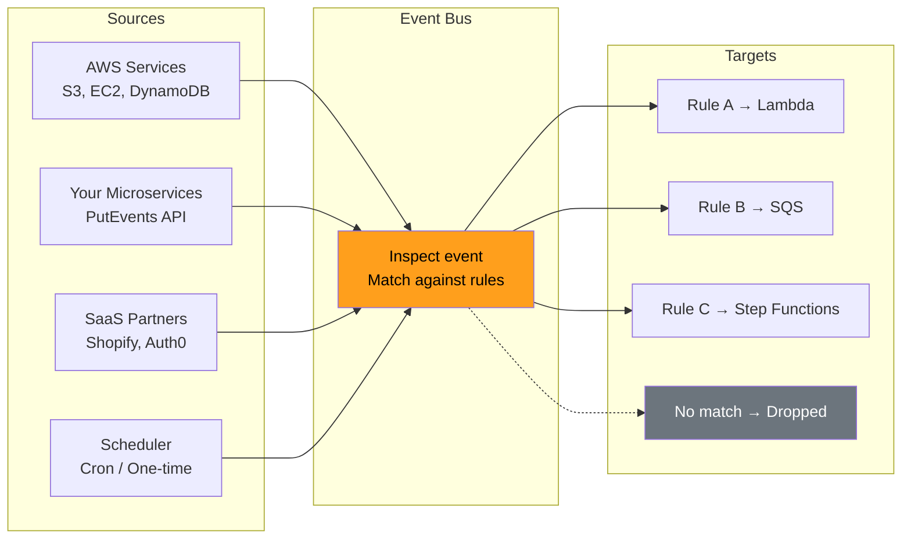
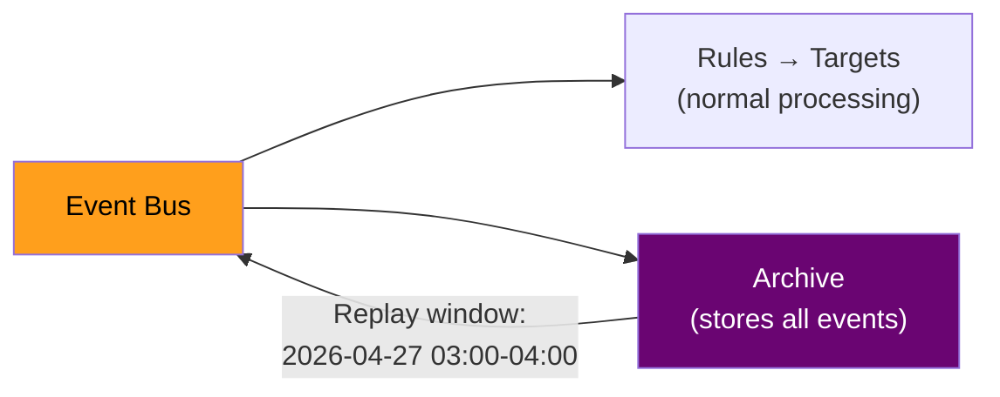
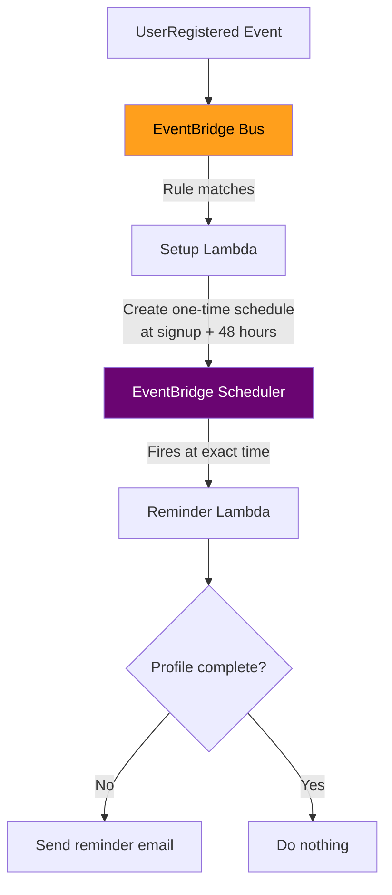
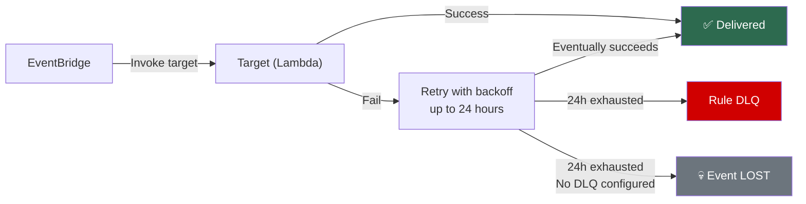

# AWS EventBridge — Interview Revision Notes

## What is EventBridge?
- Fully managed **serverless event bus** with **content-based routing**
- NOT "better SNS" — fundamentally different model
- SNS: "deliver to everyone subscribed" (subscription-based)
- EventBridge: "inspect the event, route it based on rules" (content-based)
- **Analogy:** SNS = mailing list. EventBridge = smart mail room that reads each letter and routes to the right department

---

## Core Building Blocks

### 1. Event Bus (three types)
- **Default bus** — exists in every account. AWS services emit here automatically (FREE)
- **Custom bus** — for your application events. Isolates from AWS noise
- **Partner bus** — SaaS events (Shopify, Auth0, Datadog, Zendesk)

### 2. Event Structure (mandatory JSON format)
```json
{
  "source": "com.mycompany.orders",       // WHO produced this
  "detail-type": "OrderPlaced",            // WHAT happened
  "detail": {                              // THE PAYLOAD
    "orderId": "ORD-123",
    "amount": 4999,
    "customer": { "tier": "premium" }
  },
  "account": "123456789012",
  "region": "ap-south-1",
  "time": "2026-04-27T20:00:00Z"
}
```
**`source` + `detail-type`** are the two most important fields. Every rule starts by matching these.

### 3. Rules — Pattern matching
```json
{
  "source": ["com.mycompany.orders"],
  "detail-type": ["OrderPlaced"],
  "detail": {
    "amount": [{ "numeric": [">=", 1000] }],
    "customer": { "tier": ["premium", "gold"] }
  }
}
```
AND across keys, OR within arrays. Supports deeply nested JSON.

### 4. Targets — Where matched events go
- Up to **5 targets per rule**
- Supported: Lambda, SQS, SNS, Step Functions, Kinesis, ECS, API Gateway, another EventBridge bus
- Need >5 targets? Create multiple rules with same pattern, or fan through SNS

### Complete Flow Visualization


---

## EventBridge vs SNS Filtering

| Capability | SNS | EventBridge |
|-----------|-----|-------------|
| Exact / prefix / numeric / anything-but | ✅ | ✅ |
| **Suffix match** | ❌ | ✅ |
| **Wildcard** | ❌ | ✅ |
| **IP address match** | ❌ | ✅ |
| **Nested JSON fields** | ❌ | ✅ |
| **$or across keys** | ❌ | ✅ |
| Max complexity | 5 attrs, 150 values | 300 rules/bus, deeply nested |

**Bottom line:** SNS for simple attribute matching. EventBridge for complex, nested, multi-condition routing.

---

## Unique Features (Things SNS/SQS Can't Do)

### Input Transformers
Reshape events before delivery. Target receives clean, minimal payload:
```
InputPathsMap:   { "order": "$.detail.orderId", "email": "$.detail.customer.email" }
InputTemplate:   '{"orderRef": <order>, "to": <email>}'
```
Reduces coupling — consumer doesn't need to understand full event schema.

### Archive & Replay (Time Travel)
- Archive every event passing through a bus (or matching a pattern)
- Replay events from any time window later
- Use cases: debugging (replay 3AM events), backfill (new consumer needs 30 days of history), DR
- **Unique to EventBridge** — once an SQS message is deleted or SNS delivers, it's gone



### Schema Registry & Discovery
- Auto-discovers event schemas from your bus
- Generates code bindings (TypeScript, Python, Java)
- Acts as contract between producers and consumers
- Tracks schema version history

### EventBridge Scheduler (replaces cron)
- **One-time schedules:** "invoke Lambda at exactly 2026-04-29T10:00:00Z"
  - Perfect for delayed actions (send reminder 48h after signup)
  - Scales to **millions of concurrent schedules**
- **Recurring schedules:** cron with timezone support, flexible windows, auto-retries
- Has its own DLQ for failed invocations
- **vs Scheduled Rules:** Scheduler is standalone, more powerful, supports one-time, scales better



### EventBridge Pipes
- Point-to-point: Source → Filter → Enrich → Transform → Target
- Eliminates glue Lambdas for simple ETL flows
- Sources: SQS, DynamoDB Streams, Kinesis, etc.

### Cross-Account & Cross-Region
- Bus-to-bus routing across AWS accounts (IAM permissions on both sides)
- **Global Endpoints:** active-active with Route53 health check failover

---

## Retry & Failure Handling
- EventBridge retries failed target invocations for **24 hours** with exponential backoff
- After 24 hours → event sent to rule's DLQ (if configured) or **dropped permanently**
- **ALWAYS configure a DLQ on your rules**



---

## Cost Model

| Item | Price |
|------|-------|
| Custom events published | $1.00 / million |
| AWS service events | **FREE** |
| Archive storage | $0.10 / GB |
| Replay | $0.10 / million events |
| Scheduler | $1.00 / million invocations |
| Pipes | $0.40 / million requests |

~2× more expensive than SNS per event, but saves on glue Lambdas and operational complexity.

---

## Key Gotchas

1. **256 KB event size limit** — same as SQS/SNS
2. **10,000 events/sec soft limit per region** — for higher throughput, use SNS/SQS or Kinesis
3. **At-least-once delivery, NO dedup** — unlike SQS FIFO, no built-in deduplication. Consumers must be idempotent
4. **Rule evaluation is NOT ordered** — multiple matching rules invoke targets in no guaranteed sequence
5. **5 targets per rule** — need more? multiple rules or fan through SNS
6. **24-hour retry window** — if target is down >24h, events are lost without DLQ + archive
7. **Scheduler vs Scheduled Rules** — don't confuse them. Scheduler is the newer, more powerful standalone service

---

## Interview Quick-Fire Answers
- "When EventBridge over SNS?" → **Complex routing, growing microservices, AWS service events, need archive/replay/schema registry**
- "When SNS over EventBridge?" → **Simple fan-out, >10K events/sec, need SMS/email protocol**
- "How to handle EventBridge outage?" → **DLQ on rules + Archive enabled for replay**
- "How to schedule delayed one-time action?" → **EventBridge Scheduler (NOT cron). Scales to millions**
- "Cross-account events?" → **EventBridge bus-to-bus with IAM policies on both sides**
- "New consumer needs historical data?" → **Archive + Replay from the relevant time window**
