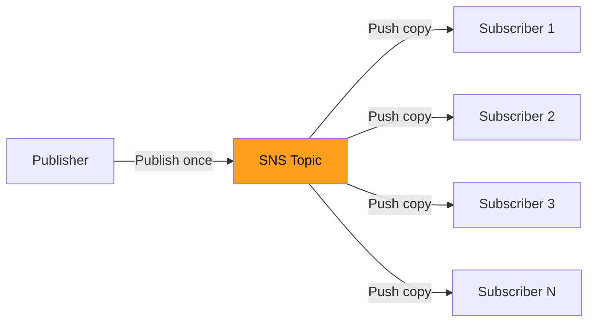
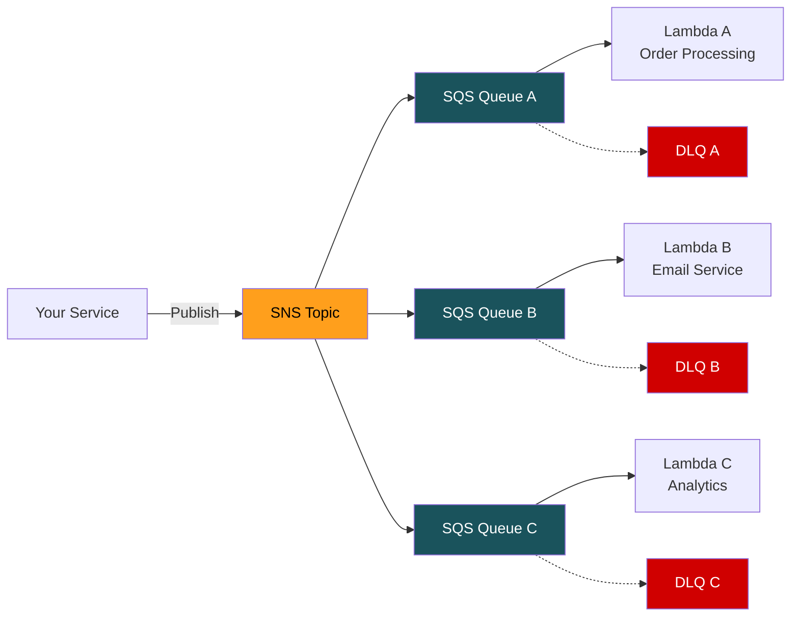
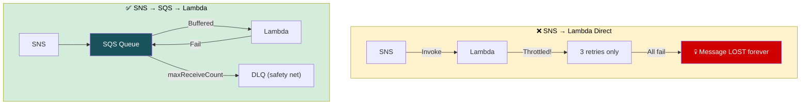
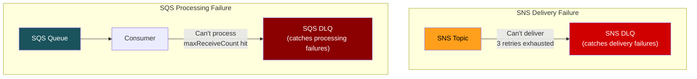

# AWS SNS — Interview Revision Notes

## What is SNS?
- Fully managed **pub/sub** messaging service
- **Push-based** — SNS delivers to subscribers (opposite of SQS pull)
- One message → **ALL subscribers** get a copy
- **No persistence** — if delivery fails and retries exhaust, message is LOST
- This is why SNS is almost always paired with SQS



---

## SNS vs SQS — Core Differences

| | SQS | SNS |
|---|---|---|
| Model | Queue (point-to-point) | Topic (pub/sub broadcast) |
| Direction | Pull (consumer polls) | Push (SNS delivers) |
| Consumers | One per message | All subscribers get copy |
| Persistence | Up to 14 days | **None** — fire and forget |
| Use case | Work queues, task processing | Fan-out, notifications, broadcasting |

---

## Subscription Protocols

| Protocol | Use Case | Key Note |
|----------|----------|----------|
| **SQS** | Reliable async processing | Most common. Adds durability SNS lacks |
| **Lambda** | Serverless event processing | 3 retries on failure, then gives up |
| **HTTP/S** | Webhooks | Must confirm subscription. Up to 100K retries over 23 days |
| **Email** | Human notifications | Requires email confirmation. Not for high throughput |
| **SMS** | Text alerts | Costs per message |
| **Kinesis Firehose** | Streaming to S3/Redshift | Analytics pipelines |

---

## Message Filtering — SNS's Killer Feature

Filtering happens **inside SNS**, not at the subscriber. Filtered messages are never delivered → saves cost + reduces noise.

### Filter Policy Example
```json
Subscriber A (Warehouse): { "event": ["placed", "returned"] }
Subscriber B (Finance):   { "amount": [{ "numeric": [">=", 10000] }] }
Subscriber C (Analytics): (no filter → receives EVERYTHING)
```

### Two Filter Modes
- **Attribute-based** (default): filters on SNS message attributes (metadata)
- **Payload-based** (`FilterPolicyScope: MessageBody`): filters on JSON body content

### Supported Operators
- Exact match, prefix, anything-but
- Numeric ranges (>=, <=, between)
- Exists / not-exists
- AND across keys, OR within a key's value array

### Limits
- Max 5 attributes per filter policy
- Max 150 values across all attributes
- For more complex filtering → use EventBridge

---

## SNS FIFO Topics
- Name must end in `.fifo`
- Strict ordering per `MessageGroupId`
- Deduplication (content-based or explicit ID)
- **Can ONLY subscribe to SQS FIFO queues** — no Lambda, no HTTP, no email
- Throughput: 300 publishes/sec (3,000 with batching)

---

## SNS + SQS Fan-Out — THE #1 AWS PATTERN



**Each consumer is fully isolated:** own queue, own DLQ, own retry policy, own scaling.

### What each service contributes:
| Capability | Provided by |
|-----------|------------|
| Fan-out (1-to-many) | SNS |
| Durability / persistence | SQS |
| Buffering under load | SQS |
| Independent retry per consumer | SQS (each has own DLQ) |
| Filtering (reduce noise) | SNS filter policies |
| Consumer scaling | SQS + Lambda concurrency |

### Why not SNS → Lambda directly?
- Lambda might be throttled during spikes (account concurrency limit)
- SNS retries only **3 times** for Lambda
- After 3 failures → message is **permanently lost** (unless SNS DLQ configured)
- SQS in between absorbs spikes and retries indefinitely



---

## SNS Delivery Retries & DLQ

| Subscriber Type | Retry Behavior |
|----------------|---------------|
| Lambda | 3 retries (immediate, 1s, 2s) |
| HTTP/S | Up to 100,015 retries over 23 days |
| SQS | Effectively guaranteed (SQS always accepts) |

### SNS DLQ vs SQS DLQ — DIFFERENT THINGS



You can attach a DLQ (SQS queue) to an SNS *subscription* to catch permanent delivery failures.

---

## Raw Message Delivery
- Default: SNS wraps your message in a JSON envelope (TopicArn, MessageId, Timestamp, etc.)
- With **Raw Message Delivery** enabled: SQS receives your original payload directly
- Benefit: cleaner consumer code, smaller message size, no unwrapping logic needed

---

## Key Gotchas

1. **No persistence** — SNS is fire-and-forget. Always pair with SQS for reliability
2. **256 KB message limit** — same as SQS. Same claim-check pattern
3. **SNS is regional** — can't subscribe a queue in another region directly
4. **Standard SNS does NOT guarantee delivery order** to subscribers
5. **Subscription confirmation** — HTTP/email need manual confirmation. SQS/Lambda in same account are auto-confirmed
6. **Message attributes vs body** — default filter operates on attributes, NOT body. Set `FilterPolicyScope: MessageBody` for body-based filtering

---

## Interview Quick-Fire Answers
- "When SNS over EventBridge?" → **Simple fan-out, high throughput (>10K/sec), need SMS/email protocol**
- "SNS alone or SNS+SQS?" → **Almost always SNS+SQS.** SNS alone = risk of message loss
- "How to add a new consumer?" → **Subscribe new SQS queue to topic. Zero publisher code changes. Zero-touch extensibility**
- "What if only 1 consumer today?" → **Still use SNS→SQS. Adding consumer #2 later without SNS means modifying publisher = tight coupling**
- "FIFO fan-out?" → **SNS FIFO → SQS FIFO. Only SQS FIFO can subscribe to SNS FIFO**
