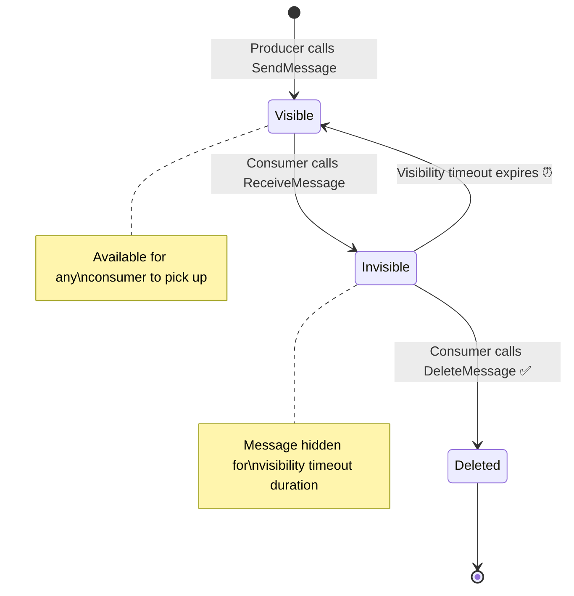
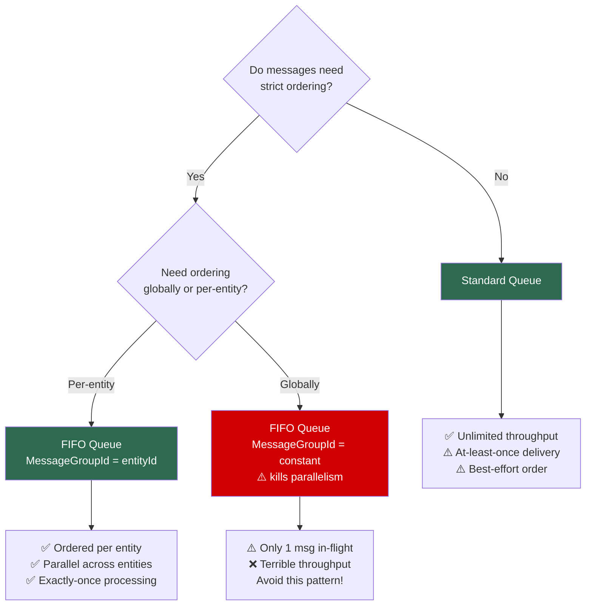
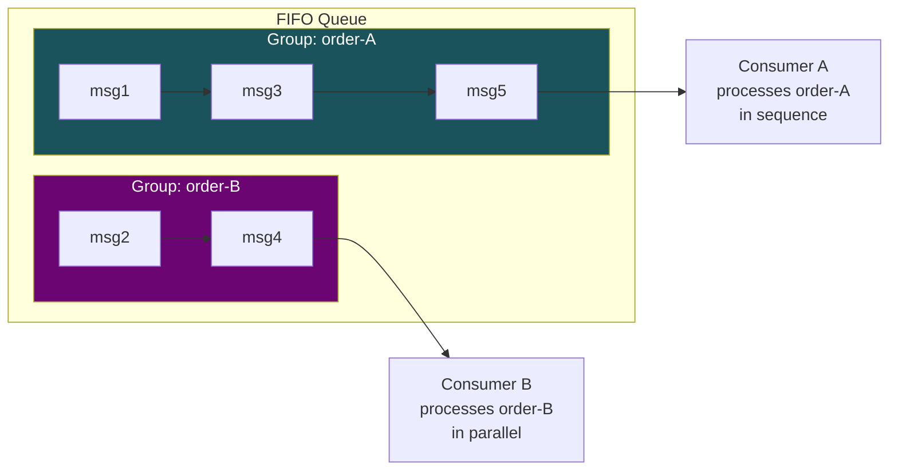
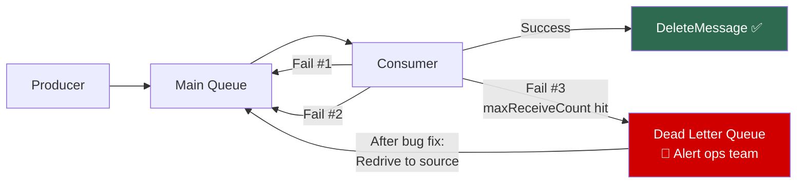
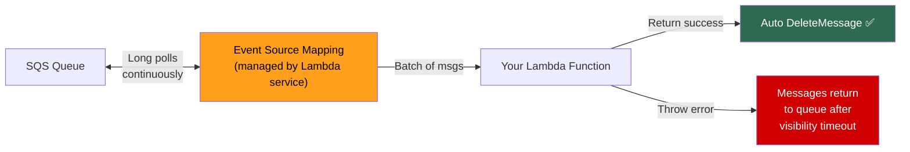
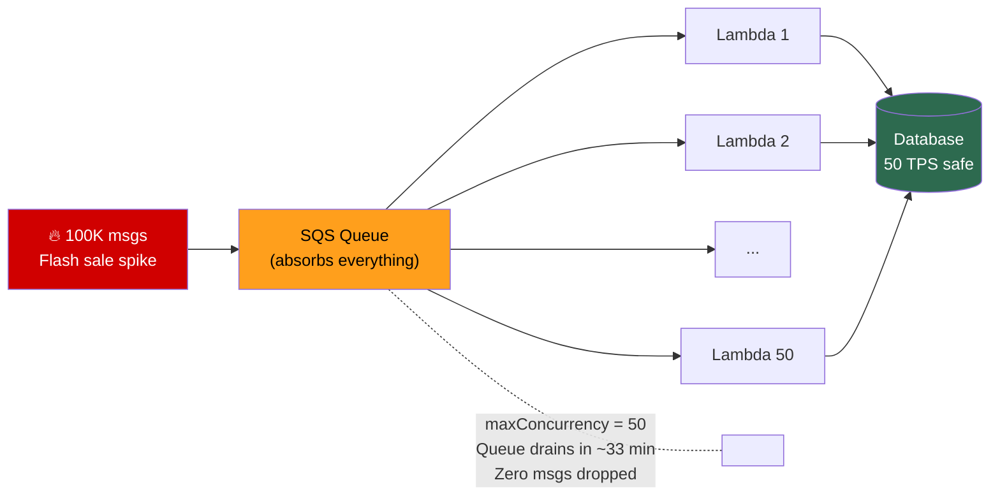

# AWS SQS — Interview Revision Notes

## What is SQS?
- Fully managed **point-to-point** message queue (oldest AWS service, 2004)
- **Pull-based** — consumers poll the queue (not push)
- One message → one consumer (unlike SNS fan-out)
- Messages persist up to **14 days** (default 4)

---

## Message Lifecycle
```
Producer → SendMessage() → [QUEUE: msg visible] → Consumer polls (ReceiveMessage)
→ msg becomes INVISIBLE (visibility timeout starts) → Consumer processes
→ DeleteMessage() ✅ → msg gone forever
                    OR
→ Consumer crashes/timeout → msg becomes VISIBLE again → retry
```



## Key Configuration Knobs

| Setting | Default | Max | Notes |
|---------|---------|-----|-------|
| VisibilityTimeout | 30s | 12h | Must exceed processing time. AWS recommends 6× Lambda timeout |
| MessageRetentionPeriod | 4 days | 14 days | After this, msg deleted permanently |
| DelaySeconds | 0 | 900s (15min) | Msg invisible after send (sender-side delay) |
| ReceiveMessageWaitTimeSeconds | 0 (short poll) | 20s | **Always set to 20 (long polling)** |
| MaxMessageSize | 256 KB | 256 KB | Larger payloads → S3 claim-check pattern |
| MaxReceiveCount | — | — | After N failures, send to DLQ |

---

## Standard vs FIFO

| | Standard | FIFO |
|---|---|---|
| Ordering | Best-effort | **Strict per MessageGroupId** |
| Delivery | At-least-once (possible dupes) | Exactly-once processing |
| Throughput | Nearly unlimited | 300/s (3K batching, 70K high-throughput) |
| Queue name | Any | Must end in `.fifo` |
| Deduplication | None | Content-based hash OR explicit DeduplicationId (5-min window) |

### Standard vs FIFO Decision


### FIFO: MessageGroupId — The Critical Concept
- Ordering is **per group**, NOT global
- `groupId = orderId` → each order is sequential, different orders are parallel
- `groupId = "global"` → single lane, one msg in-flight at a time (**kills throughput**)
- **Choose the right granularity:** userId, orderId, tenantId — whatever entity needs serialization

### FIFO MessageGroupId Visualization


---

## Dead Letter Queue (DLQ)
- A regular SQS queue that catches **poison messages** (messages that fail repeatedly)
- Configured via **Redrive Policy**: `{ maxReceiveCount: 3, deadLetterTargetArn: "..." }`
- After N failed receives → msg moves to DLQ → alert & investigate
- **FIFO DLQ must also be FIFO**
- **Set DLQ retention to 14 days** (max) — message age carries over from source queue
- **Redrive-to-source**: push DLQ messages back to original queue after fixing the bug



---

## Lambda + SQS Integration
- Lambda runs a **managed event source mapping** (hidden poller)
- Lambda polls → receives batch → invokes your function → auto-deletes on success
- If function throws → messages return to queue (visibility timeout)



### Key Settings
| Setting | What it does | Recommended |
|---------|-------------|-------------|
| batchSize | Msgs per invocation | 10 (Standard), 10 max (FIFO) |
| batchWindow | Wait N seconds to fill batch | 30-60s for cost savings |
| maxConcurrency | Max simultaneous Lambdas for THIS queue | Set to protect downstream |
| ReportBatchItemFailures | Return only failed msg IDs, not entire batch | **ALWAYS enable** |

### Partial Batch Failure (CRITICAL)
Without `ReportBatchItemFailures`: 1 failure → entire batch of 10 returns → 9 good msgs reprocessed
With it: return `{ batchItemFailures: [{ itemIdentifier: "failed-msg-id" }] }` → only failed msg returns

### Scaling
- Lambda adds **+60 concurrent invocations per minute** for SQS
- **Thundering herd danger**: 100K messages → Lambda scales to 1000 → DB crashes
- **Fix**: `maxConcurrency` caps concurrent invocations per queue

### Visibility Timeout Rule
- Set to **6× Lambda timeout** (AWS recommendation)
- Lambda timeout 30s → visibility timeout 180s

---

## Cost Optimization
1. **Long polling** (WaitTimeSeconds=20) — eliminates empty response charges
2. **Batching** (10 per API call) — 10× cost reduction
3. **batchWindow** on Lambda triggers — fewer invocations
4. $0.40/million requests (Standard), $0.50 (FIFO), first 1M free

## Monitoring Essentials

| Metric | Alert When |
|--------|-----------|
| ApproximateNumberOfMessagesVisible | Rising trend (consumers can't keep up) |
| ApproximateAgeOfOldestMessage | Exceeds your SLA |
| ApproximateNumberOfMessagesNotVisible | Near 120,000 (in-flight limit) |
| DLQ: NumberOfMessagesVisible | **> 0 (always alert)** |

---

## Common Patterns
- **Claim-check**: Large payload → S3, pointer in SQS message (Extended Client Library)
- **Load leveling**: SQS absorbs traffic spikes, consumers drain at sustainable rate
- **Backpressure**: `maxConcurrency` protects downstream services
- **Heartbeat**: Call `ChangeMessageVisibility` mid-processing to extend timeout for variable workloads

### Load Leveling / Backpressure Pattern


---

## Interview Quick-Fire Answers
- "How do you handle duplicate messages?" → **Idempotent consumers** (DynamoDB/Redis dedup store)
- "How do you optimize SQS costs?" → **Long polling + batching**
- "How do you protect a slow downstream?" → **maxConcurrency on event source mapping**
- "What if a message keeps failing?" → **DLQ with maxReceiveCount, alert on DLQ depth > 0**
- "SQS vs Kinesis?" → SQS for task processing (delete after consume). Kinesis for streaming (multiple consumers read same data, replay)
- "Max message size?" → **256 KB. Larger → S3 claim-check pattern**
