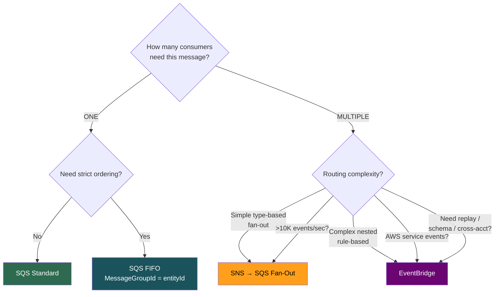
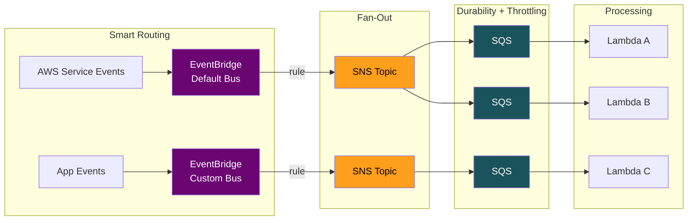
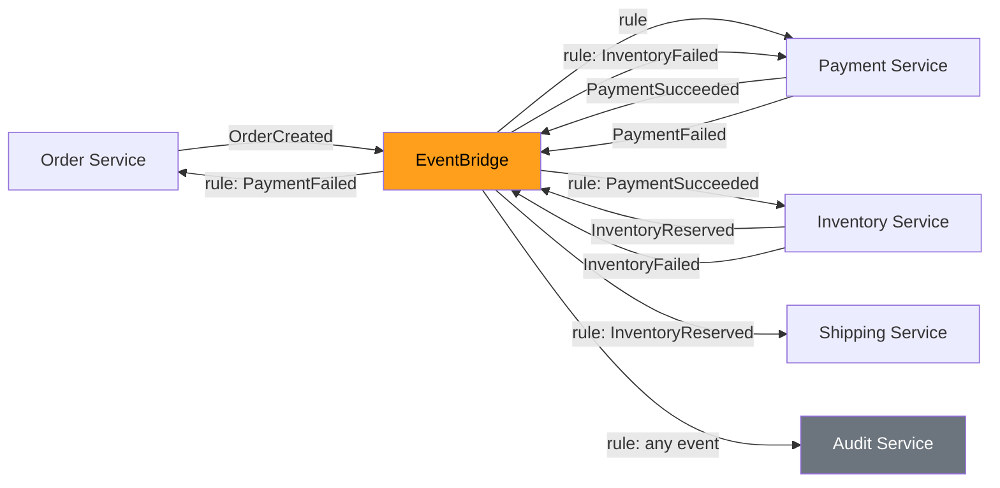
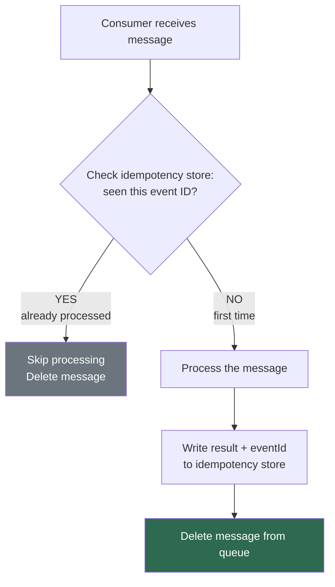

# SQS vs SNS vs EventBridge — Decision Framework & Architecture Patterns

## The Decision Matrix

| Scenario | Use This | Why |
|----------|----------|-----|
| 1 producer, 1 consumer, task processing | **SQS** | Simple queue, durable |
| 1 producer, N consumers, all need every msg | **SNS → SQS** | Fan-out + durability |
| Strict ordering per entity | **SQS FIFO** | MessageGroupId per entity |
| Ordered fan-out | **SNS FIFO → SQS FIFO** | Ordered broadcast |
| Complex routing, growing ecosystem | **EventBridge** | Content-based routing, schema registry |
| React to AWS service events | **EventBridge** | AWS emits to default bus natively |
| Scheduled / delayed one-time actions | **EventBridge Scheduler** | Per-item at scale |
| Ultra-high throughput (>10K/sec) | **SQS or Kinesis** | EventBridge has 10K/sec limit |
| Need replay / event history | **EventBridge** (archive) | Unique feature |
| Cross-account event routing | **EventBridge** | Native bus-to-bus |
| Email / SMS notifications | **SNS** | Direct protocol support |
| Buffer fast producer ↔ slow consumer | **SQS** | That's what queues do |

---

## The Quick Decision Flow



## They're Complementary, Not Competing



**Magic phrase:** "EventBridge for routing, SNS for fan-out, SQS for durability and throttling."

---

## Architecture Patterns

### Pattern 1: Choreography Saga (Event-Driven)



- Each service emits events, others react
- Pro: fully decoupled. Con: hard to debug (no single view of state)
- **Better approach:** Step Functions for critical path + EventBridge for side effects

### Pattern 2: SNS+SQS Fan-Out (The Classic)
```
Service → SNS Topic → SQS Queue A → Lambda A (with DLQ, maxConcurrency)
                    → SQS Queue B → Lambda B (independent retry)
                    → SQS Queue C → Lambda C (independent scaling)
```
- Each consumer is isolated: own DLQ, own retry, own scaling

### Pattern 3: Load Leveling (Backpressure)
```
100K spike → SQS (absorbs all instantly) → Lambda (maxConcurrency: 50) → DB (safe at 50 TPS)
```
- Queue drains over time. Zero messages dropped.

### Pattern 4: Idempotency at Scale



- **Idempotency key:** use original event ID from body, NOT SQS MessageId
- AWS Powertools has `@idempotent` decorator built-in

---

## Every Design Must Address These 5 Things

1. **Idempotency** — "consumers use DynamoDB-based dedup"
2. **Dead Letter Queues** — "failed msgs go to DLQ, alert on depth > 0"
3. **Backpressure** — "maxConcurrency protects downstream"
4. **Monitoring** — "queue depth, message age, DLQ depth, consumer errors"
5. **Retry strategy** — "exponential backoff, maxReceiveCount before DLQ"

---

## Senior-Level Gotchas

1. Event ordering across services is an illusion — each service processes at its own speed
2. Exactly-once is a system property, not a service feature — needs idempotent consumers + dedup
3. Don't over-event — internal function calls don't need a queue
4. Schema evolution — additive-only changes (add fields, never remove/rename)
5. Testing event-driven systems — invest in correlation IDs, structured logging, archive+replay
