# AWS S3 — Interview Revision Notes
## Object Storage vs Block vs File

| Dimension | Block (EBS) | File (EFS) | Object (S3) |
|-----------|-------------|------------|-------------|
| **Analogy** | Parking garage (numbered spots) | Filing cabinet (drawers & folders) | Warehouse of sealed, barcoded boxes |
| **Structure** | Fixed-size blocks, no awareness of content | Hierarchical dirs + files | Flat key-value store |
| **Access Pattern** | Random byte-level R/W | Shared mount (NFS/SMB) | HTTP PUT/GET of whole objects |
| **Attach Points** | 1 EC2 at a time | N compute nodes | ∞ concurrent access |
| **Max Size** | 64 TiB per volume | Petabytes | 5 TB per object |
| **When To Use** | Databases, boot volumes, low-latency I/O | Shared ML data, CMS, home dirs | Logs, backups, media, data lake |

> ⚠️ **The deciding factor is access pattern, not data size.** If you need random byte-level I/O → EBS. If you need shared mount → EFS. If you need HTTP-based whole-object access at infinite scale → S3.

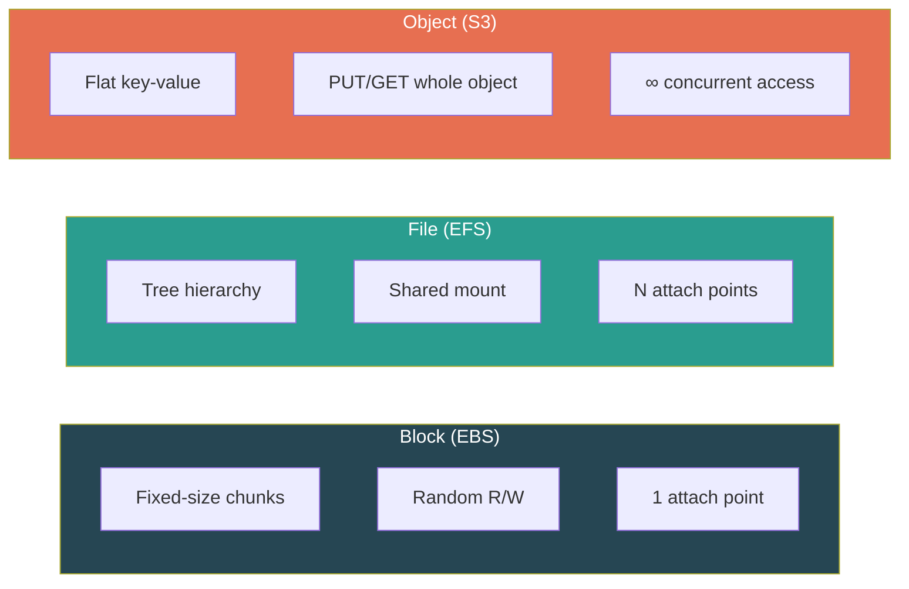

---

## S3 Data Model

S3 has **two first-class entities**: Buckets and Objects.

### Buckets

- Container for objects — a **top-level namespace**
- **Globally unique** name across ALL AWS accounts worldwide
- Created in a specific **Region** — data stays there unless you replicate
- Flat structure inside — no nested buckets
- Limit: **100 per account** (soft limit, can request ~1000)
- Naming: 3–63 chars, lowercase + numbers + hyphens only, DNS-compliant

### Objects

| Component | Description | Limit |
|-----------|-------------|-------|
| **Key** | The full "path" string (e.g., `2024/logs/app.log`) | 1024 bytes UTF-8 |
| **Value** | The binary data blob | 0 bytes – **5 TB** |
| **Version ID** | Assigned if versioning enabled | Auto-generated |
| **Metadata** | System (Content-Type, Last-Modified) + user-defined key-value | **2 KB** user metadata |
| **Sub-resources** | ACL, torrent info | — |

### The "Fake Folder" Illusion

> ⚠️ **S3 has NO directories.** The `/` in a key is just a character. `images/cat.png` is a single flat key.

The AWS Console fakes folders using the `ListObjectsV2` API with `Prefix` and `Delimiter`:

```
ListObjectsV2(Prefix="images/", Delimiter="/")
  → Objects: [images/logo.png, images/hero.jpg]
  → CommonPrefixes: [images/thumbnails/]   ← "subdirectories"
```

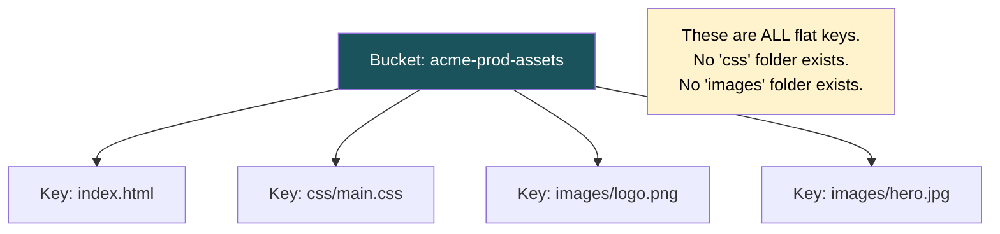

### Multi-Tenant Pattern

**Never** create one bucket per user/tenant (100 bucket limit). Instead:
```
s3://saas-uploads/tenant-123/invoices/2024/inv-001.pdf
              ↑                ↑
           bucket         key prefix (scoped by bucket policy)
```

---

## Consistency Model

### Pre-December 2020 (Legacy — Interviewers Still Ask)
- New PUTs: read-after-write consistent
- Overwrite PUTs & DELETEs: **eventually consistent** (stale reads possible)

### Post-December 2020 (Current)
**Strong read-after-write consistency for ALL operations:**

| Operation | Guarantee |
|-----------|-----------|
| PUT new object → GET | ✅ Immediate |
| Overwrite object → GET | ✅ Latest version |
| DELETE → GET | ✅ 404 guaranteed |
| PUT → LIST | ✅ Appears in listing |

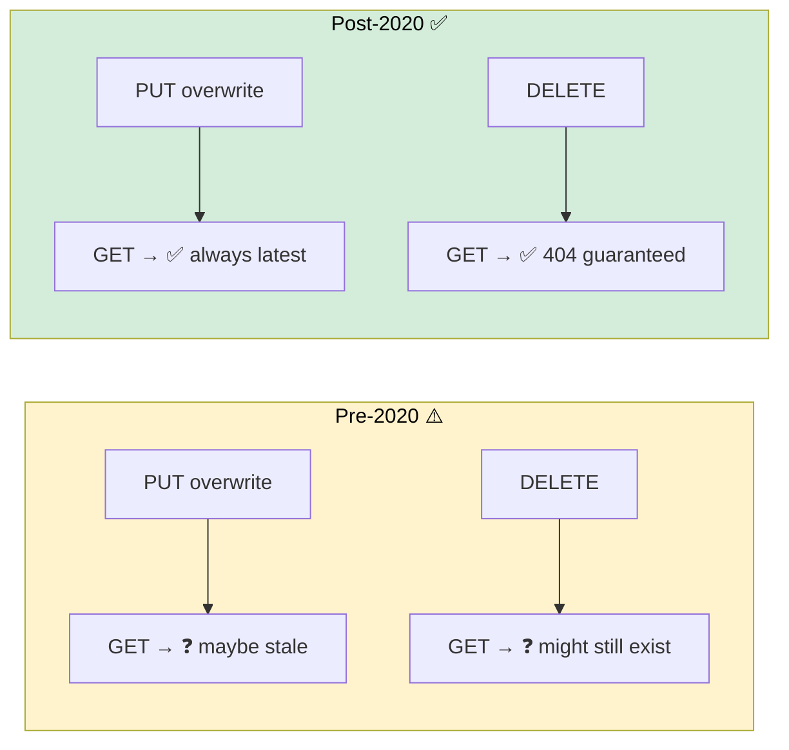

### What Consistency Does NOT Mean

- **No multi-object transactions** — can't atomically update `config.json` and `schema.json` together
- **No locking** — two concurrent PUTs → **last writer wins** (timestamp-based)
- **Conditional writes** (2024 feature) — use `If-None-Match` headers for optimistic concurrency
- **Listing pagination** — each page is consistent at its request time, but objects can change between pages

---

## Storage Classes

### The 7 Tiers

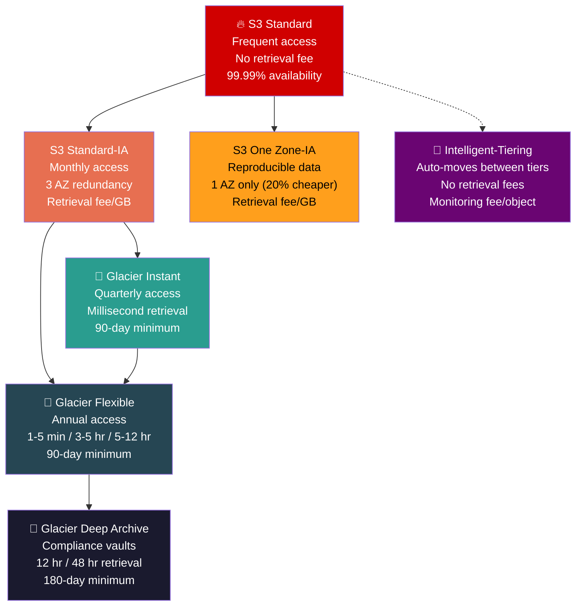

### Quick Reference Table

| Class | Access Frequency | Retrieval Time | Min Duration | Min Size Charge | Availability |
|-------|-----------------|----------------|-------------|-----------------|-------------|
| Standard | Frequent | Instant | None | None | 99.99% |
| Standard-IA | Monthly | Instant | **30 days** | **128 KB** | 99.9% |
| One Zone-IA | Monthly (reproducible) | Instant | 30 days | 128 KB | 99.5% |
| Glacier Instant | Quarterly | **Milliseconds** | **90 days** | 128 KB | 99.9% |
| Glacier Flexible | Annual | 1-5 min / 3-5 hr / 5-12 hr | 90 days | — | 99.99% |
| Deep Archive | Rarely/never | 12 hr / 48 hr | **180 days** | — | 99.99% |
| Intelligent-Tiering | Unpredictable | Varies (auto) | None | None | 99.9% |

> **All classes share 11 nines (99.999999999%) durability.** Durability ≠ Availability.

### Real-World Storage Strategy

```
Product images     → Standard         (served constantly)
Order invoices     → Standard-IA      (monthly access for disputes)
Resized thumbnails → One Zone-IA      (reproducible, regenerate if AZ fails)
CCTV footage       → Glacier Flexible (legal hold, incident-only access)
Tax records 10yr   → Deep Archive     (~$1/TB/month, compliance vault)
User behavior logs → Intelligent-Tiering (hot during analysis, cold otherwise)
```

### Intelligent-Tiering Internals (5 Auto-Tiers)

```
Frequent Access ──(30 days no access)──→ Infrequent Access
                 ──(90 days)──→ Archive Instant Access
                 ──(90 days, opt-in)──→ Archive Access
                 ──(180 days, opt-in)──→ Deep Archive Access

No retrieval fees. Small monitoring fee per object.
Best for: unpredictable access patterns where you can't set lifecycle rules.
```

---

## Lifecycle Policies

Automate transitions and expiration with rules scoped by prefix/tag.

### Transition Waterfall (Allowed Directions ONLY)

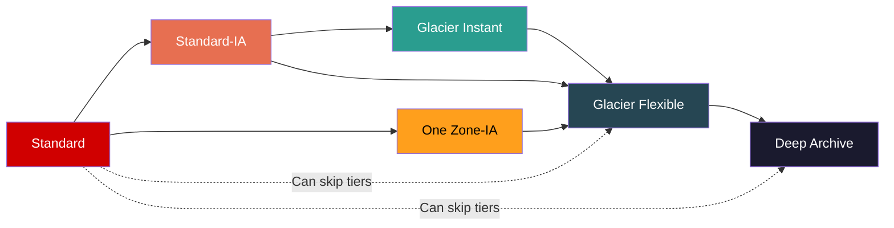

> ⚠️ **Transitions only go DOWNWARD (colder). Never back up automatically.** To move cold → hot, you must RESTORE + COPY manually.

### Minimum Day Constraints — Interview Trap!

```
Standard → IA/One Zone-IA:     minimum 30 days after creation
IA → Glacier:                  minimum 30 days AFTER the IA transition
                               (so effectively day 60+ from creation)
```

**Example lifecycle rule:**
```json
{
  "Rules": [{
    "ID": "logs-lifecycle",
    "Filter": {"Prefix": "logs/"},
    "Transitions": [
      {"Days": 30,  "StorageClass": "STANDARD_IA"},
      {"Days": 90,  "StorageClass": "GLACIER"},
      {"Days": 365, "StorageClass": "DEEP_ARCHIVE"}
    ],
    "Expiration": {"Days": 2555}
  }]
}
```

---

## Versioning & MFA Delete

### Three Bucket States

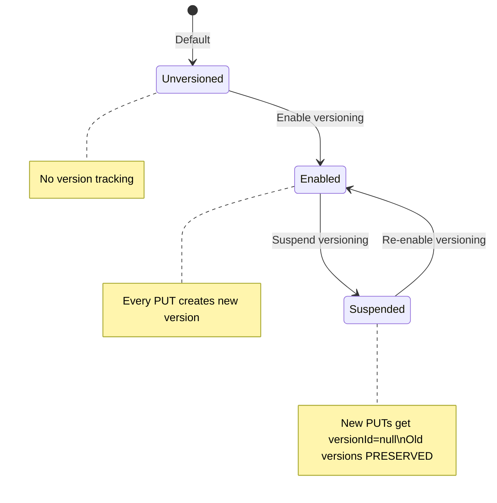

> ⚠️ **You can NEVER go back to Unversioned.** Only toggle Enabled ↔ Suspended.

### How DELETE Works With Versioning

```
WITHOUT versioning:
  DELETE photo.jpg → gone forever

WITH versioning:
  DELETE photo.jpg → inserts DELETE MARKER (zero-byte placeholder)
                   → GET returns 404
                   → ALL previous versions still exist!

  To recover: delete the delete marker → previous version becomes current
  To truly delete: DELETE photo.jpg?versionId=abc123 → that version gone permanently
```

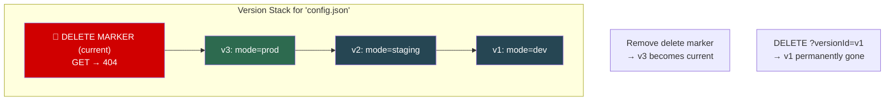

### MFA Delete

- Requires MFA for: **permanently deleting a version** + **changing versioning state**
- **Only root account** can enable (not IAM users, not admins)
- **CLI/API only** — not available in console
- Defense against compromised IAM credentials

### Ransomware Protection Pattern

```
1. Enable versioning on all critical buckets
2. Enable MFA Delete (root account)
3. Lifecycle: expire non-current versions after 90 days
4. Bucket policy: deny s3:DeleteObject except break-glass role

Attack scenario:
  → Attacker encrypts all objects (PUT overwrites)
  → New versions = encrypted, old versions = untouched
  → Restore from previous versions
  → Attacker can't disable versioning (MFA Delete blocks it)
  → Attacker can't purge old versions (needs MFA token)
```

---

## Key Gotchas — Storage & Lifecycle

1. **Minimum duration billing** — delete from Glacier after 10 days → still billed for 90 days
2. **128 KB minimum charge** for IA classes — millions of tiny files in IA = massive waste
3. **Glacier Instant vs Standard-IA** — both have ms retrieval! Glacier Instant cheaper storage, pricier retrieval. Breakeven: quarterly access
4. **Versioning multiplies costs** — 10 overwrites of 1 GB = 10 GB stored. MUST pair with `NoncurrentVersionExpiration`
5. **Suspended ≠ disabled** — suspending versioning does NOT delete existing versions (still billing)
6. **Delete markers accumulate** — auto-expire with `ExpiredObjectDeleteMarker: true`
7. **One Zone-IA** — NOT for irreplaceable data. AZ destruction = permanent loss
8. **Object metadata is immutable** — to change Content-Type, you must `CopyObject` to itself with `MetadataDirective: REPLACE`

---

## Interview Quick-Fire — Core Concepts

- **"What makes S3 different from EBS?"** → Access pattern: HTTP whole-object PUT/GET (S3) vs random byte-level I/O (EBS). Not about size.
- **"Does S3 have folders?"** → No. Flat namespace. Console renders `/` as folders via `ListObjectsV2` with prefix+delimiter.
- **"Is S3 eventually consistent?"** → No (since Dec 2020). Strong read-after-write for all operations. But no multi-object atomicity.
- **"Two services write to same key simultaneously?"** → Last writer wins. Use versioning to preserve both, or conditional writes for conflict detection.
- **"How to change object metadata?"** → CopyObject to itself with REPLACE directive. Metadata is immutable after upload.
- **"When to use Intelligent-Tiering?"** → Unpredictable access patterns. Don't use when pattern is known (lifecycle rules are cheaper — no monitoring fee).
- **"Glacier Instant vs Standard-IA?"** → Both have ms access. Glacier Instant: cheaper storage, pricier retrieval. Use for <quarterly access.
- **"How many buckets per account?"** → 100 default (soft limit). Never create per-user/per-tenant buckets — use key prefixes.

---

## The Four Layers of S3 Access Control

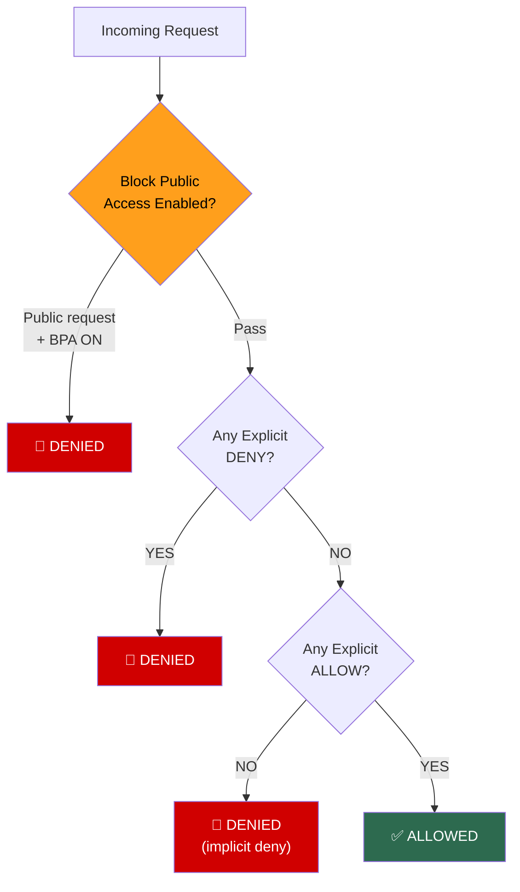

> **Cardinal Rule: Explicit DENY always wins.** 10 policies say Allow + 1 says Deny = DENIED.

---

## Layer 1: IAM Policies (Identity-Based)

Attached to IAM users/roles/groups. Says "this identity can do X on resource Y."

```json
{
  "Effect": "Allow",
  "Action": "s3:GetObject",
  "Resource": "arn:aws:s3:::my-bucket/reports/*"
}
```

## Layer 2: Bucket Policies (Resource-Based)

Attached to the bucket itself. Can grant **cross-account** access and reference **anonymous** principals.

```json
{
  "Effect": "Allow",
  "Principal": {"AWS": "arn:aws:iam::123456789:root"},
  "Action": "s3:GetObject",
  "Resource": "arn:aws:s3:::my-bucket/*"
}
```

**Size limit: 20 KB.** Complex multi-tenant policies hit this → use S3 Access Points (each gets its own policy).

## Layer 3: ACLs (Legacy — Avoid)

Predefined grants (READ, WRITE, FULL_CONTROL). A relic from before IAM.
**Disabled by default since April 2023** — "Bucket owner enforced" setting.

## Layer 4: Block Public Access (Kill Switch)

Four independent toggles at account or bucket level:

| Setting | What It Blocks |
|---------|---------------|
| `BlockPublicAcls` | Rejects PUTs with public ACLs |
| `IgnorePublicAcls` | Ignores existing public ACLs |
| `BlockPublicPolicy` | Rejects bucket policies granting public access |
| `RestrictPublicBuckets` | Restricts buckets with public policies to AWS principals only |

These **override** any policy or ACL that tries to make things public.

---

## Same-Account vs Cross-Account — The Critical Difference

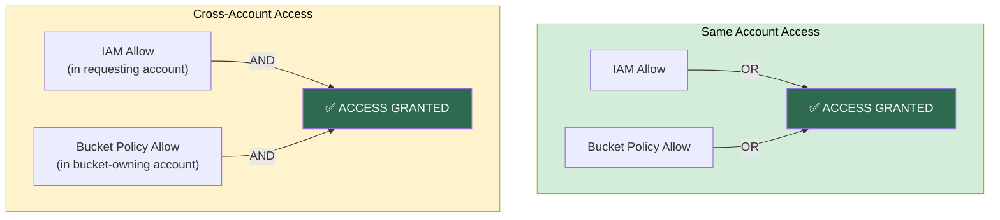

| Scenario | Rule |
|----------|------|
| Same account | IAM Allow **OR** Bucket Policy Allow = access |
| Cross account | IAM Allow **AND** Bucket Policy Allow = access (both required) |

> ⚠️ **This is the #1 tested access control concept in interviews.**

### ListBucket vs GetObject — The ARN Trap

```
s3:ListBucket → operates on BUCKET ARN   → "arn:aws:s3:::my-bucket"
s3:GetObject  → operates on OBJECT ARN   → "arn:aws:s3:::my-bucket/logs/*"

Mixing these up = can't list OR can't download. Classic debugging issue.
```

---

## Pre-Signed URLs & Pre-Signed POSTs

### Pre-Signed GET (Download)

Your backend generates a URL with embedded temporary credentials:
```
https://bucket.s3.amazonaws.com/secret-report.pdf
  ?X-Amz-Algorithm=AWS4-HMAC-SHA256
  &X-Amz-Credential=AKIA.../us-east-1/s3/aws4_request
  &X-Amz-Expires=3600          ← valid for 1 hour
  &X-Amz-Signature=abc123...   ← HMAC signature
```
Anyone with this URL can download for the specified duration. No AWS creds needed.

### Pre-Signed PUT (Upload — Server Never Touches Bytes)

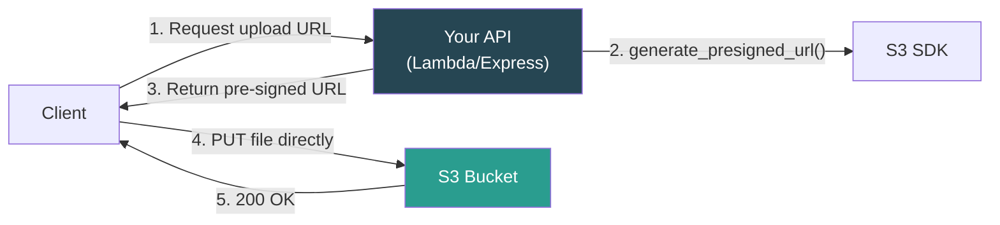

**Why this pattern wins:** No bandwidth on your server. No file-size memory pressure. S3 handles upload at its scale. Backend just does auth + URL generation.

### Pre-Signed POST (Browser Uploads with Constraints)

More powerful than PUT — allows **conditions**:
```json
["content-length-range", 0, 5242880],       // max 5 MB
["starts-with", "$Content-Type", "image/"],  // must be image
["starts-with", "$key", "uploads/"]          // key must start with uploads/
```

### Maximum Expiration — The STS Trap

| Credential Type | Max Pre-Signed URL Lifetime |
|----------------|----------------------------|
| IAM User (long-term creds) | **7 days** |
| IAM Role / STS (temp creds) | **Remaining session duration** (typically 1-12 hours) |
| Lambda function (always uses STS) | **Capped at role session** (often ~1 hour) |

```
Lambda gets STS token → session valid for ~1-6 hours
ExpiresIn = 86400 (24 hours)

Effective expiry = min(ExpiresIn, STS session remaining)
                 = min(24 hours, ~1-6 hours)
                 = URL dies in hours, NOT 24 hours!
```

> ⚠️ **Pre-signed URL permissions = INTERSECTION of signer's permissions and URL scope.** If the IAM role loses `s3:GetObject` after signing, the URL stops working — even if not expired.

---

## Encryption

### In Transit
Always HTTPS. Enforce with bucket policy:
```json
{"Effect": "Deny", "Action": "s3:*", "Resource": "...",
 "Condition": {"Bool": {"aws:SecureTransport": "false"}}}
```

### At Rest — Four Options

| Method | Who Encrypts | Who Manages Keys | Audit Trail | Use When |
|--------|-------------|-------------------|-------------|----------|
| **SSE-S3** | S3 | S3 (fully managed) | ❌ | Default. Low-effort. Non-regulated data. |
| **SSE-KMS** | S3 | KMS (you control) | ✅ CloudTrail | **Production standard.** Regulated industries. |
| **SSE-C** | S3 | YOU (per request) | ❌ (S3 side) | You must own keys. Lose key = lose data. |
| **CSE** | YOU (before upload) | YOU (entirely) | ❌ (your infra) | Zero trust in cloud provider. Defense/intel. |

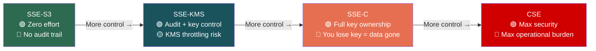

> **SSE-S3 is the default since January 2023.** All new objects are auto-encrypted even without config.

### Envelope Encryption (SSE-KMS Internals)

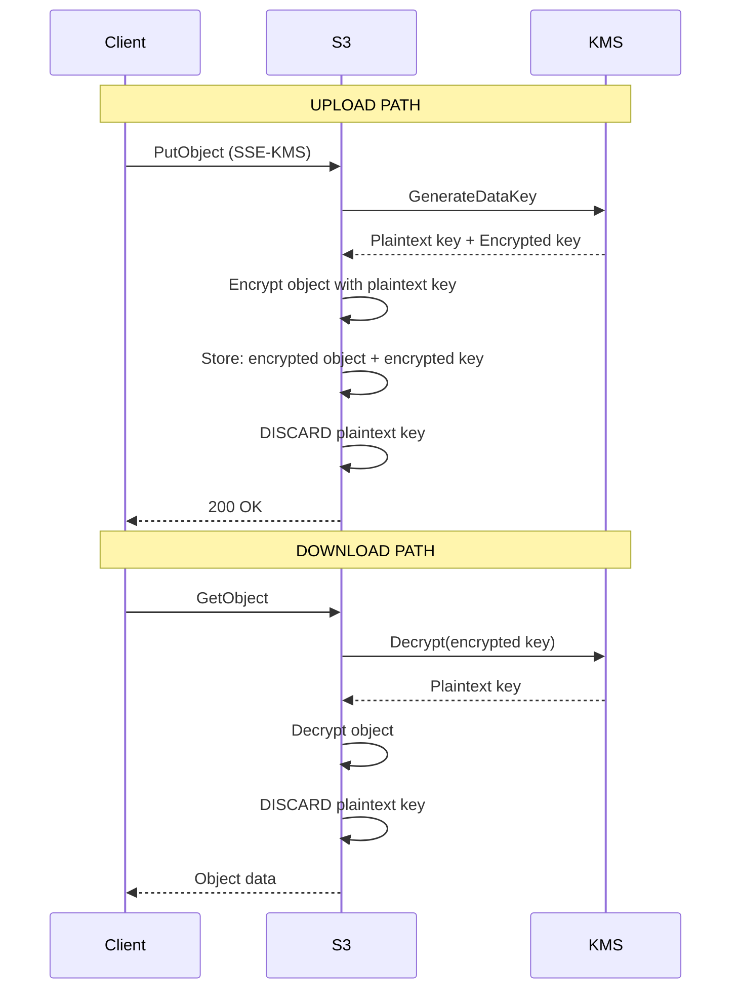

**The CMK never leaves KMS.** Only short-lived data keys move. This is envelope encryption.

### The KMS Throttling Trap

- Every SSE-KMS GET/PUT calls KMS
- KMS limit: **5,500 – 30,000 req/sec** per region
- High-throughput workloads → `ThrottlingException` on S3 calls
- **Fix: S3 Bucket Keys** — reduces KMS calls by up to **99%** by caching a bucket-level data key

### SSE-KMS for HIPAA/Compliance — The Pitch

| HIPAA Requirement | SSE-S3 | SSE-KMS (CMK) |
|---|---|---|
| Audit trail of key access | ❌ | ✅ CloudTrail logs every Decrypt |
| Key access control | ❌ | ✅ KMS key policy = independent gate |
| Key rotation documentation | ❌ | ✅ Controlled schedule |
| Crypto-shredding | ❌ | ✅ Delete CMK → all data unreadable |

> **Default encryption ≠ forced encryption.** To force SSE-KMS, add a bucket policy denying PUTs without the correct `s3:x-amz-server-side-encryption` header.

---

## Key Gotchas — Security

1. **Cross-account needs BOTH sides** — IAM Allow + Bucket Policy Allow (intersection rule)
2. **Cross-account with SSE-KMS** — also needs `kms:Decrypt` on source CMK + `kms:Encrypt` on destination CMK
3. **Pre-signed URL from Lambda** — max expiry capped at STS session, not ExpiresIn parameter
4. **PUT pre-signed URLs don't enforce Content-Type** — use Pre-signed POST with conditions
5. **ACLs are legacy** — disabled by default since 2023. Say "bucket owner enforced" unprompted in interviews.
6. **20 KB bucket policy limit** — use S3 Access Points for complex multi-tenant scenarios
7. **S3 Bucket Keys** — essential for SSE-KMS at scale. Reduces cost + avoids throttling.

---

## Interview Quick-Fire — Security

- **"Cross-account Lambda can't read S3?"** → Bucket policy must also allow (intersection rule). Plus check KMS permissions if SSE-KMS.
- **"How to let users upload without AWS creds?"** → Pre-signed PUT URL (download-only: pre-signed GET). For constraints: pre-signed POST.
- **"SSE-S3 vs SSE-KMS?"** → SSE-S3: zero effort, no audit. SSE-KMS: CloudTrail audit, key policy, crypto-shredding. SSE-KMS for production/compliance.
- **"What is envelope encryption?"** → CMK encrypts a data key. Data key encrypts the object. CMK never leaves KMS.
- **"HIPAA — is SSE-S3 enough?"** → No. Need SSE-KMS for audit trail (CloudTrail), key access control (key policy), and crypto-shredding.
- **"Pre-signed URL expired but ExpiresIn says 24h?"** → Signed with STS/role creds. Effective expiry = min(ExpiresIn, session duration).

---

## Performance Internals

### Request Rate Limits

| Operation | Limit |
|-----------|-------|
| PUT/COPY/POST/DELETE | **3,500 req/sec per prefix** |
| GET/HEAD | **5,500 req/sec per prefix** |

### Auto-Partitioning (Post-2018 Change)

**Before 2018:** S3 partitioned by first characters of key. Teams prepended random hex:
```
a1f3/logs/2024/app.log    ← forced randomization
7bc2/logs/2024/error.log
```

**After 2018:** S3 auto-partitions based on access patterns. Use clean, logical keys:
```
logs/service-a/2024/app.log    ← S3 handles distribution
logs/service-b/2024/app.log
```

> ⚠️ **Auto-partitioning isn't instant.** Sudden spike from 0 → 5,000 req/sec on a cold prefix may trigger `503 Slow Down`. Ramp up gradually for predictable spikes.

### Key Design Matters

```
GOOD: logs/{service-name}/{timestamp}.log
  → High-cardinality component (service-name) early = many partitions

BAD: logs/{timestamp}/{service-name}.log  
  → All services hammer same timestamp prefix momentarily = hot partition
```

---

## Multipart Uploads

### Rules
- **Required** for objects > 5 GB (single PUT limit)
- **Recommended** above 100 MB
- Part size: 5 MB – 5 GB, max **10,000 parts** → max object **5 TB**

### Three-Step Lifecycle

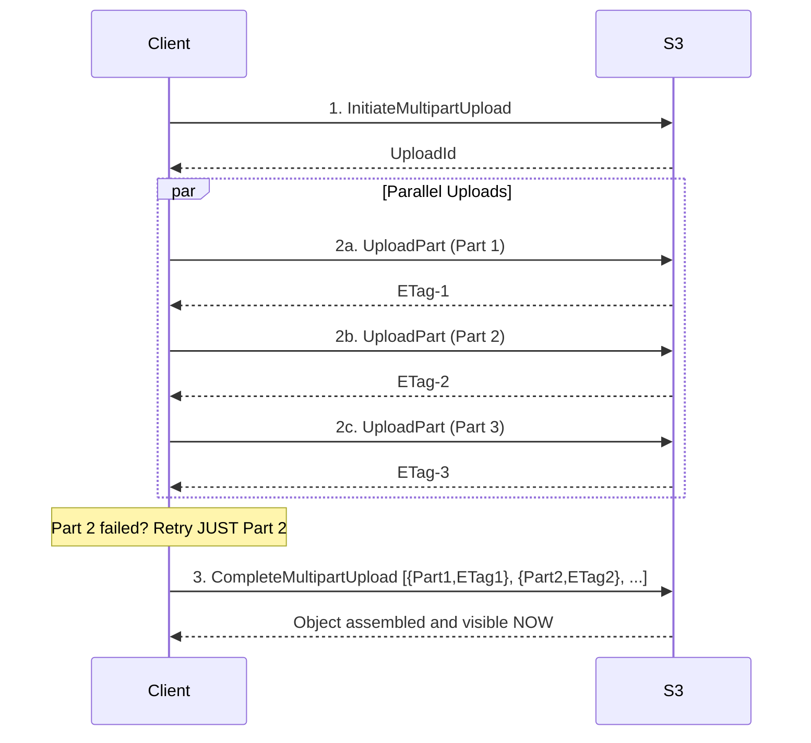

**Advantages over single PUT:**
- Parallel upload streams → faster
- Retry individual failed parts → no restart from zero
- Can pause and resume uploads

### Byte-Range Fetches (Parallel Downloads)

Two use cases:
1. **Speed** — Download 1 GB with 10 parallel range-GETs: `Range: bytes=0-104857599`
2. **Efficiency** — Read only first 1 KB header of a 5 GB file without full download

### Transfer Acceleration

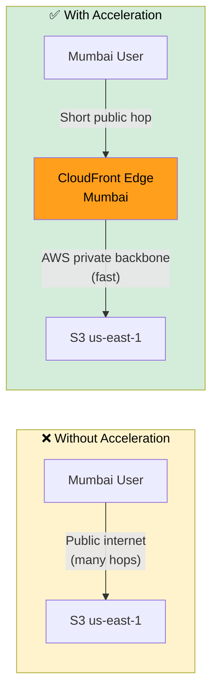

Endpoint: `bucket.s3-accelerate.amazonaws.com`
Useful for cross-continent transfers only. Same-region adds latency.

### Performance Gotchas

1. **Abandoned multipart parts bill forever** — lifecycle rule `AbortIncompleteMultipartUpload: DaysAfterInitiation: 7` is MANDATORY
2. **ListObjectsV2 returns max 1,000 keys/call** — for millions of objects use **S3 Inventory** (daily CSV/Parquet export)
3. **SSE-KMS + multipart** = one KMS call per part → KMS throttling at high concurrency → use **S3 Bucket Keys**
4. **Single GET** is limited by TCP throughput → use parallel byte-range fetches for max speed

---

## Event Notifications & EventBridge

### Event Types

| Event | Fires When |
|-------|-----------|
| `s3:ObjectCreated:*` | PUT, POST, COPY, CompleteMultipartUpload |
| `s3:ObjectRemoved:*` | Explicit DELETE or lifecycle expiration |
| `s3:ObjectRestore:Completed` | Glacier object restored |
| `s3:LifecycleTransition` | Object moved between storage classes |
| `s3:ObjectTagging:*` | Tags added or removed |

### Three Native Destinations

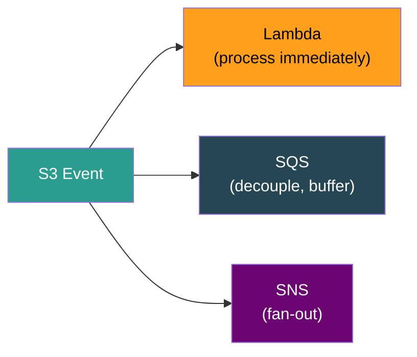

### EventBridge (The Modern Path — Since 2021)

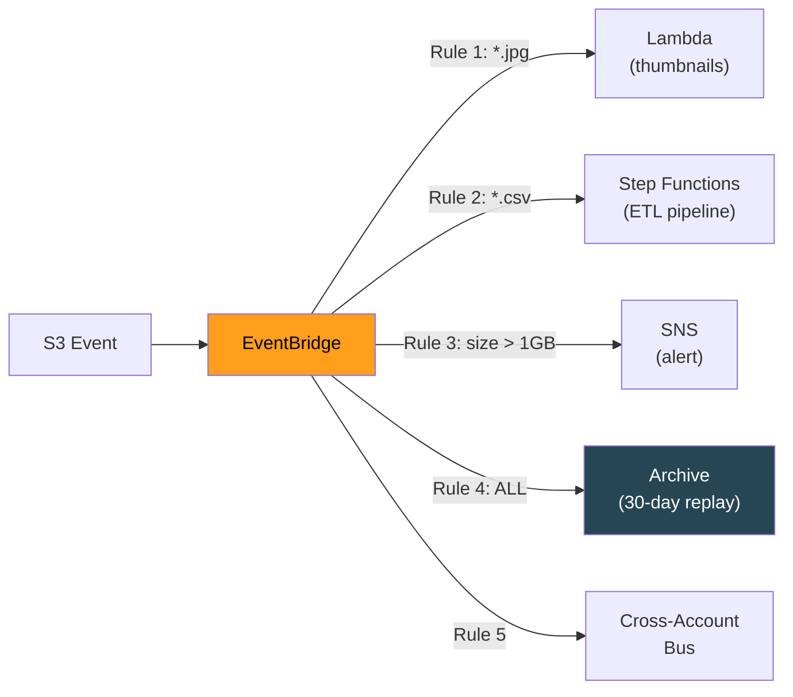

### Native vs EventBridge

| Feature | Native (Lambda/SQS/SNS) | EventBridge |
|---------|------------------------|-------------|
| Filtering | Prefix + suffix only | **Content-based** (key, size, metadata) |
| Multiple rules per event | ❌ One config per prefix+event | ✅ Unlimited rules |
| Archive & replay | ❌ | ✅ |
| Cross-account routing | ❌ | ✅ Native bus-to-bus |
| Latency | Near real-time | ~1 minute delay |
| Schema discovery | ❌ | ✅ Auto-generates schemas |

> **Use native for latency-critical (< 1 sec). Use EventBridge for everything else.**

### Event Architecture Pattern — Fast/Slow Path Decomposition

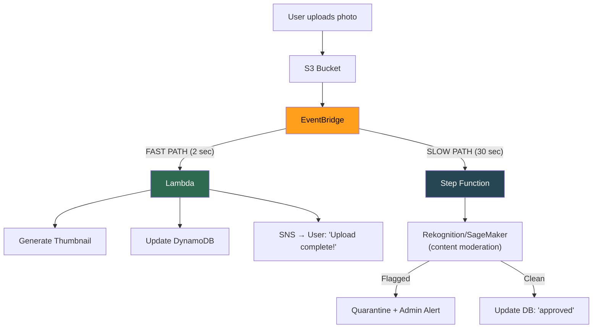

**Key design:** Fast and slow paths fire **simultaneously** from the same event. User notification is instant. Moderation runs independently.

### Event Gotchas

1. **At-least-once delivery** — design consumers for **idempotency** (use versionId/ETag as dedup key)
2. **EventBridge must be explicitly enabled** — bucket properties → Event notifications → Amazon EventBridge → "On"
3. **Event payload has NO object data** — just metadata (bucket, key, size, ETag). Consumer must `GetObject` to read content.
4. **Native: one config per prefix+event combo** — can't send same event to Lambda AND SQS. Workaround: SNS fan-out, or use EventBridge.

---

## Replication (CRR & SRR)

### Two Flavors

| Type | Source → Destination | Use Case |
|------|---------------------|----------|
| **CRR** (Cross-Region) | Different regions | DR, latency reduction, compliance |
| **SRR** (Same-Region) | Same region | Log aggregation, prod↔test copy |

### Prerequisites

1. **Versioning ON** on both source and destination buckets
2. IAM role with replication permissions
3. If SSE-KMS: role needs `kms:Decrypt` (source) + `kms:Encrypt` (destination)

### What Replicates vs What Doesn't

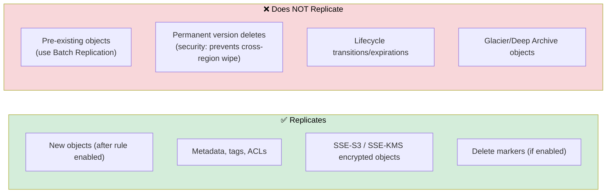

### Replication Time Control (RTC)

Standard replication: best-effort, most objects within 15 min, no SLA.
**RTC**: guarantees **99.99% within 15 minutes** + CloudWatch monitoring. Required for DR with RPO requirements.

### Replication Rules

- **No chaining:** A→B + B→C does NOT replicate A to C. Need explicit A→C rule.
- **Bi-directional** is possible (A↔B). S3 detects replicas and won't re-replicate (no loops).
- **Storage class override:** Replicate to cheaper class at destination (Standard → Glacier for DR).
- **S3 Multi-Region Access Points:** Single global endpoint, auto-routes to nearest replica.

---

## S3 Select & Glacier Select

### Concept

10 GB CSV in S3. You need 3 columns from matching rows. Without S3 Select: download 10 GB, parse, discard 99%. With S3 Select: SQL runs **inside S3**, returns only matching data.

```sql
SELECT s.name, s.age FROM s3object s WHERE s.city = 'Mumbai'
```

**Supported formats:** CSV, JSON, **Parquet** (best — columnar, S3 skips unneeded columns)

### When To Use What

| Need | Tool |
|------|------|
| Quick filter on **single file** | S3 Select |
| SQL across **many files**, complex joins | Athena |
| Join S3 data with Redshift tables | Redshift Spectrum |
| Real-time stream queries | Kinesis + Lambda |

> S3 Select = **scalpel** (one file, simple filter). Athena = **full query engine**.

### S3 Select Gotchas
- No JOINs, subqueries, or window functions
- **Parquet + S3 Select = column pruning** — SELECT 2 of 50 columns → only 2 read from disk
- Max input: 256 GB compressed

---

## Static Website Hosting & CloudFront

### S3 Website Hosting

Enable static website hosting → set `index.html` + `404.html` error document.
Endpoint: `http://bucket.s3-website-{region}.amazonaws.com`

> ⚠️ **HTTP only.** For HTTPS, must front with CloudFront.

### CloudFront + S3 (Production Pattern)

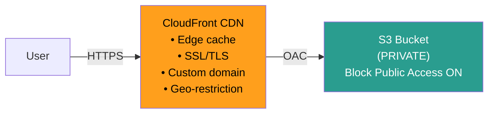

**Origin Access Control (OAC)** — modern replacement for OAI:
- Bucket stays private (Block Public Access = ON)
- Only CloudFront can read via special bucket policy
- Users can't bypass CloudFront to hit S3 directly

### Website vs REST Endpoint

| Behavior | Website Endpoint | REST Endpoint |
|----------|-----------------|---------------|
| URL format | `bucket.s3-website-region.amazonaws.com` | `bucket.s3.amazonaws.com` |
| Root `/` returns | `index.html` | XML listing |
| Redirect support | ✅ | ❌ |
| Custom error pages | ✅ | ❌ |
| SPA routing | Works with CloudFront error config | XML errors on deep links |

> **CloudFront must point to website endpoint for SPA routing to work.**

### CORS Configuration

When `app.example.com` makes AJAX to `assets.example.com`:
```json
[{
  "AllowedOrigins": ["https://app.example.com"],
  "AllowedMethods": ["GET", "PUT"],
  "AllowedHeaders": ["*"],
  "MaxAgeSeconds": 3600
}]
```

### SPA Routing Fix

React/Vue deep links → CloudFront asks S3 for `/dashboard` → 404. Fix: CloudFront custom error response: return `index.html` with HTTP 200 for 403/404 errors.

---

## Logging, Monitoring & Cost Control

### Three Monitoring Layers

| Layer | What | Latency | Cost |
|-------|------|---------|------|
| **Server Access Logs** | Every request (requester, op, status, latency) | Hour+ delay | Free (storage cost only) |
| **CloudTrail Data Events** | GetObject/PutObject/DeleteObject as CloudTrail events | Near real-time | Per event ($$) |
| **S3 Storage Lens** | Org-wide dashboard: usage, activity, cost recommendations | Daily | Free (28 metrics) / Paid (35+) |

> ⚠️ **Never set log destination = same bucket → infinite logging loop!**

### Cost Control Toolkit

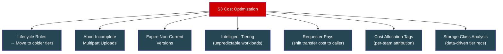

**Requester Pays:** Caller provides their AWS account for transfer billing. Used for public datasets (NOAA weather, genomics data).

---

## Key Gotchas — Performance & Advanced

1. **Orphaned multipart parts** are invisible in `ListObjectsV2` but bill you → lifecycle rule is mandatory
2. **Event delivery is at-least-once** → always design for idempotency
3. **EventBridge has ~1 min latency** vs near-real-time native triggers
4. **Replication doesn't backfill** existing objects → use S3 Batch Replication
5. **Permanent version deletes NEVER replicate** → by design, prevents cross-region wipe attack
6. **Replication doesn't chain** → A→B→C requires explicit A→C rule
7. **CloudFront cache invalidation costs money** after 1,000 paths/month → use versioned filenames
8. **S3 website endpoint = HTTP only** → always front with CloudFront for HTTPS
9. **Server access logs can loop** → never log to the same bucket

---

## Interview Quick-Fire — Performance & Advanced

- **"How to upload 50 GB file?"** → Multipart upload. Parallel parts, retry per-part, 10,000 parts max.
- **"S3 rate limits?"** → 3,500 writes / 5,500 reads per prefix per second. Auto-partitioning since 2018.
- **"Random prefixes needed?"** → Not since 2018. S3 auto-partitions. Use clean, logical keys.
- **"S3 costs jumped 40%, same object count?"** → Check for abandoned multipart parts (invisible in listings).
- **"CRR vs SRR?"** → CRR = cross-region (DR, latency). SRR = same-region (aggregation, cross-account).
- **"How to query S3 data?"** → Single file simple filter: S3 Select. Multi-file SQL: Athena. Join with Redshift: Spectrum.
- **"SPA on S3 shows XML errors?"** → CloudFront pointing to REST endpoint instead of website endpoint. Or missing custom error response config.
- **"How to reduce S3 costs?"** → Lifecycle rules (biggest lever) + abort multipart + expire versions + Intelligent-Tiering + Requester Pays.

---

## Pattern 1: Data Lake Architecture

```mermaid
flowchart LR
    subgraph INGEST["Ingestion"]
        API["API Logs"]
        IOT["IoT Streams"]
        DB_CDC["DB CDC Events"]
    end

    subgraph RAW["Raw Zone (Standard)"]
        R1["s3://lake/raw/\nJSON, CSV, logs\n(as-is, immutable)"]
    end

    subgraph PROCESSED["Processed Zone (Standard-IA)"]
        P1["s3://lake/processed/\nParquet, partitioned\n(cleaned, typed)"]
    end

    subgraph CURATED["Curated Zone"]
        C1["s3://lake/curated/\nAggregated tables\n(business-ready)"]
    end

    INGEST -->|"Kinesis / EventBridge"| RAW
    RAW -->|"Glue ETL / EMR"| PROCESSED
    PROCESSED -->|"Athena / Redshift"| CURATED
    CURATED --> BI["QuickSight\nDashboards"]

    style RAW fill:#d00000,color:#fff
    style PROCESSED fill:#e76f51,color:#fff
    style CURATED fill:#2d6a4f,color:#fff
```

**Key Decisions:**
- **Parquet** for analytics zone (columnar, compressed, enables column pruning)
- **Partition by date/region** in keys: `processed/year=2024/month=04/region=us/` → Athena skips irrelevant partitions
- **Glue Catalog** for schema management (acts as Hive metastore)
- **Lifecycle:** Raw → Standard-IA after 90 days → Glacier after 1 year
- **Event-driven ETL:** EventBridge on `ObjectCreated` in raw zone triggers Glue jobs

---

## Pattern 2: Media Processing Pipeline

```mermaid
flowchart TD
    USER["User"] -->|"Pre-signed PUT URL"| S3_RAW["S3: raw/"]
    S3_RAW -->|"EventBridge"| SF["Step Functions"]
    
    SF --> T1["MediaConvert\n(transcode to HLS)"]
    SF --> T2["Lambda\n(generate thumbnails)"]
    SF --> T3["Rekognition\n(content moderation)"]
    
    T1 --> S3_PROC["S3: processed/"]
    T2 --> S3_PROC
    T3 -->|"Flagged"| QUARANTINE["S3: quarantine/"]
    T3 -->|"Clean"| DDB["DynamoDB\n(status: approved)"]
    
    S3_PROC --> CF["CloudFront CDN"]
    CF --> END_USER["End Users"]

    style SF fill:#ff9f1c,color:#000
    style CF fill:#2a9d8f,color:#fff
    style S3_RAW fill:#264653,color:#fff
    style S3_PROC fill:#264653,color:#fff
```

**Key Decisions:**
- **Pre-signed URLs** for upload (server never touches bytes)
- **Multipart upload** for large videos
- **Step Functions** for orchestration (not Lambda chains — need visibility + retries)
- **Lifecycle:** Raw → Glacier after 90 days, processed stays in Standard (CDN origin)
- **CloudFront + OAC** for delivery (private origin, edge caching)

---

## Pattern 3: Backup & Disaster Recovery

```mermaid
flowchart LR
    subgraph PRIMARY["Primary Region (us-east-1)"]
        P_BUCKET["Prod Bucket\n• Standard\n• Versioning ✅\n• MFA Delete ✅"]
    end

    subgraph DR["DR Region (eu-west-1)"]
        DR_BUCKET["DR Bucket\n• Standard-IA (cheaper)\n• Versioning ✅"]
    end

    P_BUCKET -->|"CRR + RTC\n< 15 min RPO"| DR_BUCKET
    
    MRAP["S3 Multi-Region\nAccess Point\n(single global endpoint)"]
    P_BUCKET --> MRAP
    DR_BUCKET --> MRAP

    style PRIMARY fill:#2d6a4f,color:#fff
    style DR fill:#264653,color:#fff
    style MRAP fill:#ff9f1c,color:#000
```

**Key Decisions:**
- **CRR + RTC** for guaranteed < 15 min RPO
- **Storage class override:** Destination uses Standard-IA (cheaper, DR = infrequent reads)
- **Versioning + MFA Delete:** Ransomware protection (attacker can't purge versions)
- **Multi-Region Access Points:** Single endpoint, auto-failover to DR on primary outage
- **Monitoring:** RTC CloudWatch metrics for replication lag alerting

---

## Pattern 4: Pre-Signed URL Upload at Scale

```mermaid
sequenceDiagram
    participant Client
    participant API as API Gateway + Lambda
    participant S3
    participant EB as EventBridge
    participant Processor as Post-Processing Lambda

    Client->>API: 1. "I want to upload" (with auth token)
    API->>API: 2. Validate auth, generate pre-signed PUT URL
    API-->>Client: 3. Pre-signed URL + key
    Client->>S3: 4. PUT file directly (bypasses server)
    S3-->>Client: 5. 200 OK
    S3->>EB: 6. ObjectCreated event
    EB->>Processor: 7. Process (thumbnails, metadata, etc.)
    Processor-->>Client: 8. WebSocket/SNS notification
```

**Why this is the correct pattern:**
- **Server never touches file bytes** → no bandwidth cost, no memory pressure
- **Scales to millions of uploads** → S3 handles all the heavy lifting
- **Backend is purely auth + URL generation** → millisecond response times
- **Pre-signed POST** for browser uploads with size/type constraints

---

## Pattern 5: Event Sourcing / Immutable Log

S3's immutable-object model = natural **append-only event store**:

```
s3://events/orders/2024/04/28/14/order-abc-created.json
s3://events/orders/2024/04/28/14/order-abc-paid.json
s3://events/orders/2024/04/28/15/order-abc-shipped.json
```

- Objects are **never overwritten** (each event = new key)
- **Versioning** provides safety net
- **Athena** can query the full event history with SQL
- **Lifecycle** moves old events to Glacier for cost optimization
- **Partition by time** for efficient range queries

---

## Complete S3 Decision Framework

### "Which Storage Class?"

```mermaid
flowchart TD
    START{"How often\nis data accessed?"} -->|"Constantly"| STD["S3 Standard"]
    START -->|"Monthly"| IA_Q{"Is data\nreproducible?"}
    IA_Q -->|"Yes"| OZ["One Zone-IA\n(cheapest warm)"]
    IA_Q -->|"No"| SIA["Standard-IA\n(3-AZ redundancy)"]
    START -->|"Quarterly or less"| COLD{"Need instant\naccess when you do?"}
    COLD -->|"Yes, milliseconds"| GI["Glacier Instant\nRetrieval"]
    COLD -->|"Can wait hours"| GF["Glacier Flexible\nRetrieval"]
    START -->|"Almost never\n(compliance)"| DA["Glacier Deep Archive"]
    START -->|"Unpredictable"| IT["Intelligent-Tiering"]

    style STD fill:#d00000,color:#fff
    style SIA fill:#e76f51,color:#fff
    style OZ fill:#ff9f1c,color:#000
    style GI fill:#2a9d8f,color:#fff
    style GF fill:#264653,color:#fff
    style DA fill:#1a1a2e,color:#fff
    style IT fill:#6a0572,color:#fff
```

### "Which Encryption?"

```mermaid
flowchart TD
    START{"Regulatory\nrequirements?"} -->|"None"| SSE_S3["SSE-S3\n(default, zero effort)"]
    START -->|"Need audit trail\n+ key control"| KMS["SSE-KMS\n(production standard)"]
    START -->|"Must own keys\nentirely"| SSE_C["SSE-C\n(you provide key per request)"]
    START -->|"Zero trust in\ncloud provider"| CSE["Client-Side\nEncryption"]

    KMS -->|"High throughput?"| BK["Enable S3 Bucket Keys\n(99% fewer KMS calls)"]

    style SSE_S3 fill:#2d6a4f,color:#fff
    style KMS fill:#1a535c,color:#fff
    style SSE_C fill:#e76f51,color:#fff
    style CSE fill:#d00000,color:#fff
    style BK fill:#ff9f1c,color:#000
```

### "How Should Events Flow?"

```mermaid
flowchart TD
    START{"Event routing\ncomplexity?"} -->|"Single consumer\nlow latency"| NATIVE_L["Native → Lambda"]
    START -->|"Simple fan-out\n> 10K/sec"| NATIVE_SNS["Native → SNS → SQS"]
    START -->|"Complex routing\nmultiple rules\ncross-account"| EB["EventBridge"]
    START -->|"Need replay\nor archive"| EB

    style NATIVE_L fill:#2d6a4f,color:#fff
    style NATIVE_SNS fill:#ff9f1c,color:#000
    style EB fill:#6a0572,color:#fff
```

---

## The 10 Things Every S3 Design Must Address

1. **Upload mechanism** — Pre-signed URLs (server never touches bytes)
2. **Encryption** — SSE-KMS with Bucket Keys for regulated data
3. **Access control** — Least privilege (IAM + bucket policy + Block Public Access)
4. **Versioning** — ON for critical data, paired with non-current version expiration
5. **Lifecycle** — Progressive tier transition + expiration
6. **Multipart cleanup** — `AbortIncompleteMultipartUpload` lifecycle rule
7. **Event processing** — EventBridge for complex routing, native for low latency
8. **Idempotency** — At-least-once delivery → dedup with versionId/ETag
9. **Replication** — CRR for DR, SRR for cross-account. Don't forget Batch Replication for backfill.
10. **Monitoring** — Storage Lens for dashboards, CloudTrail data events for audit, lifecycle for cost

---

## Master Limits Table — Memorize These

| Resource | Limit |
|----------|-------|
| Max object size | **5 TB** |
| Single PUT limit | **5 GB** (use multipart above this) |
| Multipart parts | **10,000** max |
| Part size | **5 MB – 5 GB** |
| Buckets per account | **100** (soft, ~1000 with increase) |
| Key length | **1024 bytes** UTF-8 |
| User metadata | **2 KB** per object |
| Bucket policy size | **20 KB** |
| PUT rate | **3,500/sec** per prefix |
| GET rate | **5,500/sec** per prefix |
| Lifecycle rules per bucket | **1,000** |
| Tags per object | **10** |
| Pre-signed URL max expiry (IAM user) | **7 days** |
| Pre-signed URL max expiry (STS/role) | **Session duration** |

---

## Senior-Level Gotchas — Rapid Fire

1. **S3 has no folders** — flat namespace, prefix+delimiter API creates the illusion
2. **Object metadata is immutable** — CopyObject to itself with REPLACE to change it
3. **Last writer wins** — no locking, timestamp-based. Use conditional writes or versioning.
4. **Cross-account = intersection** — IAM + Bucket Policy BOTH must allow
5. **Pre-signed URL from Lambda** — expires with STS session, not ExpiresIn
6. **Lifecycle minimum 30 days** between tier transitions
7. **128 KB minimum billing** for IA classes — tiny files = massive waste
8. **Glacier min duration billing** — delete early, still pay for 90/180 days
9. **Replication doesn't backfill** — existing objects stay unreplicated. Use Batch Replication.
10. **Permanent deletes never replicate** — by design, prevents cross-region wipe attacks
11. **KMS throttling** — SSE-KMS + high throughput = ThrottlingException. Fix: Bucket Keys.
12. **Abandoned multipart = hidden cost** — invisible in listings, bill forever
13. **Server access logs can loop** — never log to the same bucket
14. **S3 website endpoint = HTTP only** — must front with CloudFront for HTTPS
15. **Events are at-least-once** — always design for idempotency

---

## Interview Quick-Fire — System Design

- **"Design a file sharing service"** → Pre-signed URLs for upload/download, versioning for edit history, lifecycle for cold storage, CloudFront for global delivery
- **"Design a data lake"** → Raw/Processed/Curated zones, Parquet + partitioning, Glue Catalog, Athena for queries, lifecycle for cost
- **"Design a backup strategy"** → Versioning + MFA Delete + CRR with RTC + Multi-Region Access Points for failover
- **"How to handle millions of uploads?"** → Pre-signed URLs via Lambda, EventBridge for post-processing, Step Functions for orchestration
- **"How to minimize S3 costs?"** → Lifecycle rules + abort multipart + expire versions + Intelligent-Tiering + Storage Lens for analysis + Requester Pays for shared datasets
- **"S3 vs DynamoDB for metadata?"** → S3 for blobs/files. DynamoDB for structured metadata with fast key-value lookups. Never use S3 for frequently mutated small records.
- **"How to serve an SPA?"** → S3 website hosting + CloudFront (OAC, HTTPS, custom error for SPA routing) + Route 53 for custom domain

---

