# AWS VPC — Interview Revision Notes

## What is a VPC?
- **Virtual Private Cloud** — your own isolated, private network inside AWS
- Logically equivalent to a **LAN in a data center**, but software-defined (SDN)
- You control: IP ranges, subnets, route tables, gateways, firewalls
- All resources (EC2, RDS, Lambda in VPC mode, ECS) live inside a VPC
- Region-scoped — a VPC cannot span regions

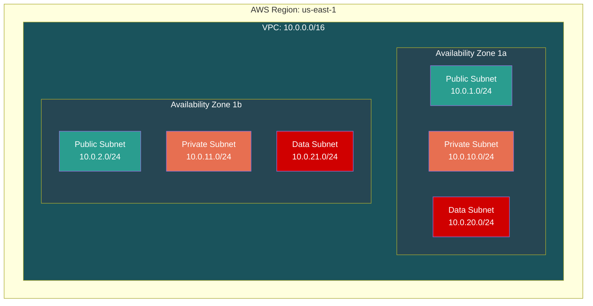

---

## Networking Fundamentals (Pre-requisites)

### OSI Layers That Matter

| Layer | Name | What It Does | Protocol Examples | AWS Relevance |
|-------|------|-------------|-------------------|---------------|
| 7 | Application | What your code talks to | HTTP, DNS, SSH | ALB operates here |
| 4 | Transport | Reliable vs fast delivery | TCP, UDP | NLB operates here |
| 3 | Network | Addressing & path finding | IP, ICMP | VPC routing, IP addressing |
| 2 | Data Link | Local hop-to-hop delivery | Ethernet, ARP | MAC addresses, ENIs |

### Packet Encapsulation

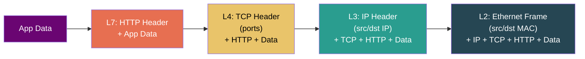

### The Golden Rule
> **MAC address changes at every router hop. IP address stays the same end-to-end.**

### L4 vs L7 Load Balancers

| Capability | NLB (Layer 4) | ALB (Layer 7) |
|---|---|---|
| Routes based on | IP + Port only | HTTP headers, paths, cookies |
| Path-based routing (`/api` vs `/web`) | ❌ | ✅ |
| Host-based routing (multi-domain) | ❌ | ✅ |
| Static/Elastic IP | ✅ | ❌ |
| Ultra-low latency | ✅ | ❌ |
| WebSocket support | ✅ | ✅ |

---

## IP Addressing & CIDR

### Private IP Ranges (RFC 1918) — Memorize These

| Range | CIDR | Total IPs | Typical Use |
|-------|------|-----------|-------------|
| 10.0.0.0 – 10.255.255.255 | 10.0.0.0/8 | 16.7M | VPCs (most common) |
| 172.16.0.0 – 172.31.255.255 | 172.16.0.0/12 | 1M | VPCs |
| 192.168.0.0 – 192.168.255.255 | 192.168.0.0/16 | 65K | Home networks |

### CIDR Quick Calculator

**Formula:** `2^(32 - prefix) = total IPs`

| CIDR | Free Bits | Total IPs | AWS Usable (−5) |
|------|-----------|-----------|-----------------|
| /16 | 16 | 65,536 | 65,531 |
| /20 | 12 | 4,096 | 4,091 |
| /22 | 10 | 1,024 | 1,019 |
| /23 | 9 | 512 | 507 |
| /24 | 8 | 256 | 251 |
| /28 | 4 | 16 | 11 |

### CIDR Mental Model
```
Bigger prefix number = SMALLER block    /28 = 16 IPs (tiny)
Smaller prefix number = BIGGER block    /8  = 16M IPs (huge)

Think zoom lens:
  /8  = zoomed OUT → huge area
  /32 = zoomed IN  → single IP
```

### AWS VPC CIDR Limits
- **Maximum VPC CIDR:** /16 (65,536 IPs)
- **Minimum subnet CIDR:** /28 (16 IPs)
- **Max CIDRs per VPC:** 1 primary + 4 secondary = 5 total
- **Primary CIDR cannot be changed** after creation — plan big

---

## Subnets

### What Is a Subnet?
- A **subdivision of your VPC's CIDR** — if VPC is the building, subnets are the floors
- Each subnet lives in **exactly one AZ** (cannot span AZs)
- Each subnet is associated with **exactly one route table**
- Subnet CIDRs **cannot overlap** within a VPC

### Public vs Private — The Crucial Distinction

> ⚠️ **A subnet is "public" because its route table has a route to an IGW — NOT because instances have public IPs.**

| | Public Subnet | Private Subnet |
|---|---|---|
| Route table has | `0.0.0.0/0 → IGW` | `0.0.0.0/0 → NAT` or no default route |
| Instances can | Receive inbound from internet (with public IP) | Cannot be reached from internet |
| Used for | ALBs, bastion hosts, NAT Gateways | App servers, containers |

### AWS Reserved IPs — 5 Per Subnet

For subnet `10.0.1.0/24`:

| IP | Reserved For |
|----|-------------|
| 10.0.1.0 | Network address |
| 10.0.1.1 | VPC router |
| 10.0.1.2 | Amazon DNS |
| 10.0.1.3 | Future use |
| 10.0.1.255 | Broadcast (VPC doesn't support broadcast, still reserved) |

**Usable = Total − 5.** A /24 gives 251, a /28 gives only 11.

### Subnet Sizing Trap: Rolling Deployments
ECS Fargate tasks each consume one subnet IP. During rolling deployments, old + new tasks run simultaneously:
- 200 tasks steady-state → needs 400 IPs during deploy → /24 (251 usable) **FAILS**
- **Always size for peak (2×), not steady-state**

---

## Route Tables & Routing

### Anatomy of a Route

| Destination | Target | Meaning |
|-------------|--------|---------|
| 10.0.0.0/16 | local | Stay inside VPC (auto-created, **immutable**) |
| 0.0.0.0/0 | igw-abc | Send to Internet Gateway |
| 0.0.0.0/0 | nat-xyz | Send to NAT Gateway |
| 10.1.0.0/16 | pcx-peer | Send through VPC peering connection |
| pl-xxxxx | vpce-gw | Send to VPC Gateway Endpoint (e.g., S3) |

### Longest Prefix Match — The Core Rule

When multiple routes match, **the most specific one wins** (longest prefix):

```
Routes:  10.0.0.0/16 → local    |   0.0.0.0/0 → igw
Packet to 10.0.5.20:
  /16 matches ✅ (prefix=16)
  /0  matches ✅ (prefix=0)
  Winner: /16 → local  (16 > 0, more specific)
```

### Best Practices
- **Never modify the main route table** — create custom ones per subnet tier
- One subnet → one route table. One route table → many subnets.
- The `local` route **cannot be deleted** (but more specific routes can override via longest prefix match)

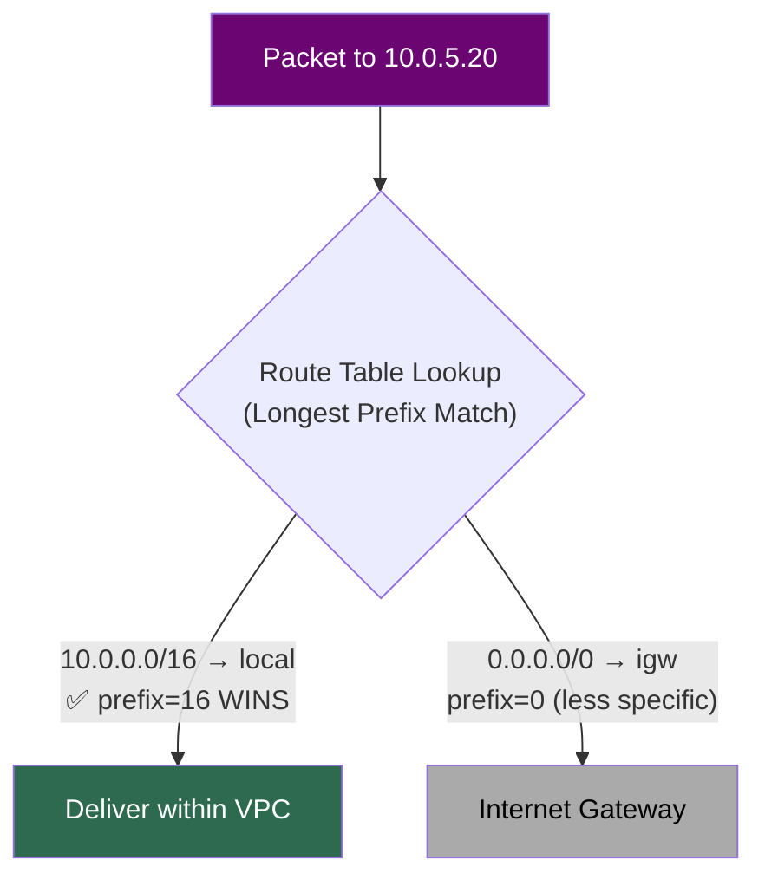

---

## Internet Gateway (IGW)

- **One per VPC**, AWS-managed, horizontally scaled, no bandwidth limit
- Does a **1:1 IP mapping** between private IP ↔ public/elastic IP
- **Free** (you only pay for data transfer)
- The EC2 instance **never sees its own public IP** — only the IGW knows the mapping

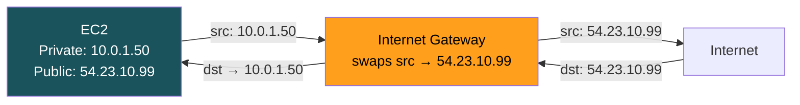

> To discover its public IP, an instance queries the **metadata service**: `curl http://169.254.169.254/latest/meta-data/public-ipv4`

---

## NAT Gateway

- Lets **private subnet instances** make outbound internet calls (pip install, API calls)
- **Outbound only** — blocks all inbound from internet
- Lives **in a public subnet**, needs an **Elastic IP**
- Cost: **~$0.045/hr + $0.045/GB processed** — costs add up fast

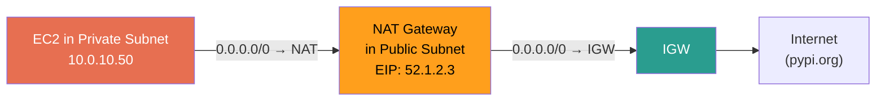

### IGW vs NAT Gateway

| | IGW | NAT Gateway |
|---|---|---|
| Direction | Bidirectional | Outbound only |
| Where it lives | Attached to VPC | Inside a public subnet |
| Cost | Free | ~$0.045/hr + per-GB |
| Bandwidth | Unlimited | 5–45 Gbps |
| HA | Fully managed, multi-AZ | **Single AZ** — deploy one per AZ |

### Critical Gotchas
- **NAT Gateway is single-AZ.** AZ goes down → all private subnets lose internet. **One NAT per AZ in production.**
- **No Security Group on NAT Gateway.** Use NACLs on the subnet instead.
- **Idle timeout: 350 seconds.** Long-lived TCP connections drop silently.
- **NAT costs explode** when S3/ECR/CloudWatch traffic goes through it → use VPC Endpoints instead.

---

## Security Groups vs NACLs

### Security Groups — Instance-Level Firewall

| Property | Value |
|----------|-------|
| Scope | Instance (ENI) level |
| Stateful | ✅ Allow inbound → response auto-allowed |
| Rule type | **Allow only** — cannot write deny rules |
| Evaluation | All rules evaluated, any match = allow |
| Default | Deny all inbound, allow all outbound |

**Killer feature — SG referencing:**
```
DB Security Group:
  Inbound: Port 5432 from sg-app-servers  ← reference SG, not IPs!

Add 100 new app servers with sg-app-servers → ALL get DB access automatically.
```

### NACLs — Subnet-Level Firewall

| Property | Value |
|----------|-------|
| Scope | Subnet level |
| Stateless | ❌ Must define BOTH inbound AND outbound |
| Rule type | **Allow AND deny** |
| Evaluation | **Numbered order, first match wins** |
| Default NACL | Allows all |
| Custom NACL | **Denies all** |

**Stateless trap:** NACL allows inbound on port 443, but no outbound rule for ephemeral ports (1024–65535)? → **Response silently dropped.** Hours of debugging.

### The Comparison — Expect This in Every Interview

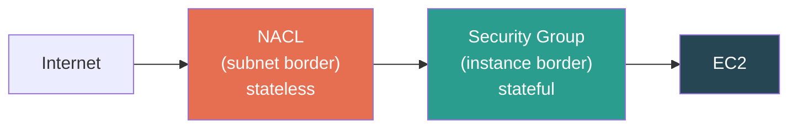

Traffic must pass **both** layers. NACL first, then SG.

| | Security Group | NACL |
|---|---|---|
| Scope | Instance | Subnet |
| Stateful? | ✅ | ❌ |
| Can deny? | ❌ | ✅ |
| Rule eval | All at once, any match = allow | Numbered, first match wins |
| Use case | Primary defense, always use | Explicit deny (block attacker IPs), compliance |

### Multiple SGs on One Instance
- Rules are **merged (union)** — additive only, more permissive
- SG-A allows 443, SG-B allows 8080 → instance allows **both**
- **Cannot** use a second SG to restrict what the first allows

### Debugging Connectivity — The Order

| Step | Check | Layer |
|------|-------|-------|
| 1 | Route table → does path exist? | Subnet |
| 2 | Public/Elastic IP → is instance addressable? | Instance |
| 3 | Security Group → is traffic allowed? | Instance |
| 4 | NACL → is subnet blocking it? | Subnet |
| 5 | OS firewall (iptables, Windows Firewall) | OS |

---

## VPC Peering

- **Direct private link** between two VPCs — traffic stays on AWS backbone
- **Non-transitive:** A↔B peered, B↔C peered → A **CANNOT** reach C through B
- **No overlapping CIDRs** — even partial overlap blocks peering
- Works **cross-account** and **cross-region**
- Both sides must: accept peering + add route table entries

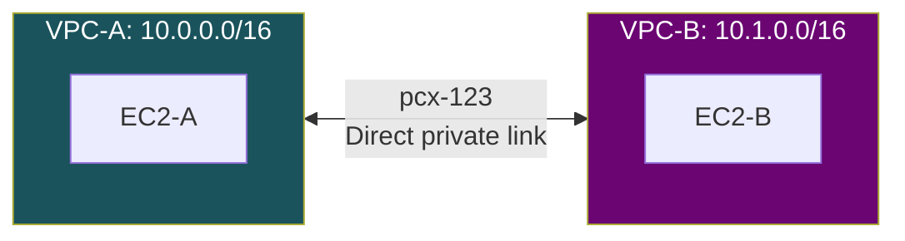

**Route tables needed on BOTH sides:**
- VPC-A: `10.1.0.0/16 → pcx-123`
- VPC-B: `10.0.0.0/16 → pcx-123`

**When to use:** 2–3 VPCs. Beyond that, peering connections explode: `n*(n-1)/2`. 20 VPCs = 190 connections. Use Transit Gateway instead.

---

## VPC Endpoints — Stop Paying NAT for AWS Traffic

### Gateway Endpoints (S3 & DynamoDB only)

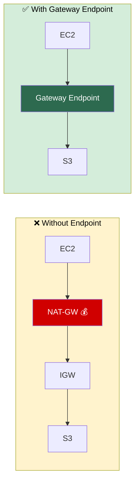

- Adds a route to your route table (`pl-xxxxx → vpce-gw`)
- **Free.** Zero cost. Zero reason not to use it.
- Longest prefix match ensures S3 traffic takes this route over `0.0.0.0/0 → NAT`

### Interface Endpoints (PrivateLink) — Everything Else

- Creates an **ENI with a private IP** in your subnet
- DNS resolves `ecr.us-east-1.amazonaws.com` to the private IP
- Cost: ~$0.01/hr per AZ + data processing
- Used for: ECR, SQS, SNS, CloudWatch, Secrets Manager, etc.

### Which Endpoint for Which Service?

| Service | Endpoint Type | Cost |
|---------|--------------|------|
| S3 | Gateway | **Free** |
| DynamoDB | Gateway | **Free** |
| ECR | Interface (PrivateLink) | ~$0.01/hr |
| CloudWatch | Interface (PrivateLink) | ~$0.01/hr |
| SQS, SNS, Secrets Manager | Interface (PrivateLink) | ~$0.01/hr |

---

## Transit Gateway (TGW)

### The Problem with Peering at Scale

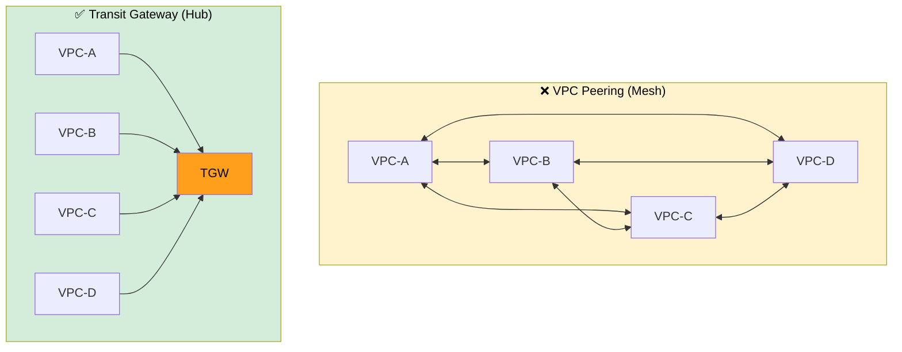

- **Hub-and-spoke** — all VPCs connect to one central hub
- **Transitive routing** — unlike peering, A can reach C through TGW
- Supports: VPCs, VPNs, Direct Connect — all through one hub
- TGW route tables enable **segmentation** (prod can't talk to dev)
- Cost: ~$0.05/hr per attachment + $0.02/GB

### When to Use What?

| Scenario | Solution |
|----------|----------|
| 2–3 VPCs, simple | VPC Peering |
| 5+ VPCs, multi-account | Transit Gateway |
| Private access to AWS services | VPC Endpoints |
| On-prem to AWS | VPN or Direct Connect via TGW |

---

## DNS in VPC

- Every VPC gets a **built-in DNS resolver** at `VPC CIDR base + 2` (e.g., `10.0.0.2`)
- Two settings control DNS behavior:

| Setting | What It Does | Must Be ON For |
|---------|-------------|----------------|
| `enableDnsSupport` | VPC can use Amazon DNS | Basic DNS resolution |
| `enableDnsHostnames` | Instances get public DNS names | VPC Endpoints with private DNS |

- **Both must be ON** for Interface Endpoints to work — classic debugging trap

### Route 53 Resolver (Hybrid DNS)
- **Inbound Endpoint:** on-prem DNS forwards queries → Route 53 resolves
- **Outbound Endpoint:** Route 53 forwards queries → on-prem DNS resolves

---

## VPC Flow Logs

- Captures **metadata** about traffic (NOT packet contents) — who talked to whom, accepted or rejected
- Attach at 3 levels: **VPC** (all traffic), **Subnet**, or **ENI** (specific instance)
- ~10 minute capture delay — **not real-time**

### Flow Log Record (Key Fields)
```
account  eni-id      src-ip      dst-ip     src-port  dst-port  protocol  action
123456   eni-abc     10.0.1.50   10.0.2.30  49152     443       6(TCP)    ACCEPT
```

### Debugging with Flow Logs

| Symptom | What To Look For |
|---------|-----------------|
| Can't connect to EC2 | REJECT entries → SG or NACL blocking |
| Who's accessing my DB? | Filter by dst = DB IP, inspect source IPs |
| Traffic is slow | Flow logs DON'T capture latency — wrong tool |

### Destinations
- **CloudWatch Logs** — easy querying
- **S3** — cheap long-term storage
- **Kinesis Firehose** — real-time analysis pipelines

---

## Production VPC Design Patterns

### Pattern 1: The Standard 3-Tier VPC

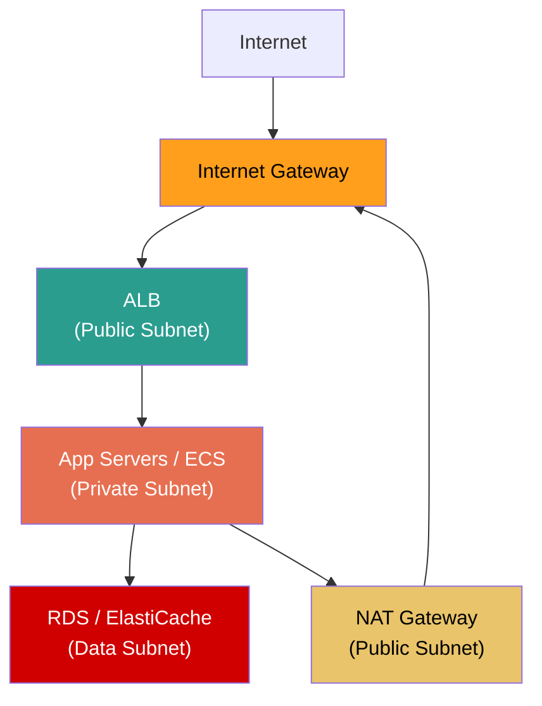

**Defense in depth:** Attacker compromises ALB → can't reach DB directly (different subnet, restrictive SG, no internet route).

### Pattern 2: Multi-Account CIDR Strategy

Allocate non-overlapping CIDRs per environment to enable peering/TGW:

```
Prod:    10.0.0.0/16  and  10.1.0.0/16   (across regions)
Staging: 10.2.0.0/16  and  10.3.0.0/16
Dev:     10.4.0.0/16  and  10.5.0.0/16
```

### Pattern 3: Egress VPC (Centralized Internet Access)

Instead of NAT Gateways in every VPC, route all outbound through one egress VPC:

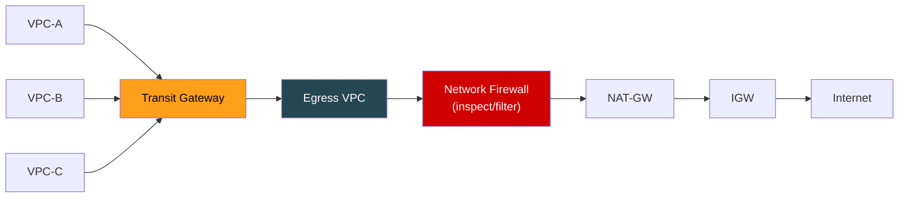

**Benefit:** Single place to monitor, filter, and audit all outbound traffic.

### Pattern 4: Shared Services VPC

Common infra (CI/CD, logging, monitoring, artifact repos) in one VPC, accessible to all via TGW. Avoids duplicating infrastructure.

---

## Key Gotchas — Rapid Fire

1. **VPC primary CIDR is permanent** — can add secondary, can't change primary
2. **Overlapping CIDRs prevent peering** — plan on day one or suffer forever
3. **NAT Gateway is single-AZ** — one per AZ for production HA
4. **NACLs are stateless** — forget outbound ephemeral ports = silent drops
5. **EC2 never sees its public IP** — IGW does 1:1 mapping transparently
6. **IPv6 in VPC is always public** — no NAT for IPv6, use Egress-only IGW
7. **Security Groups are additive** — multiple SGs = union of rules, can't deny
8. **VPC peering is non-transitive** — A↔B + B↔C ≠ A↔C
9. **Subnet cannot span AZs** — one subnet = one AZ, always
10. **Flow Logs have ~10 min delay** — not suitable for real-time detection

---

## Interview Quick-Fire Answers

- **"What makes a subnet public?"** → Its **route table has `0.0.0.0/0 → IGW`**, not whether instances have public IPs
- **"SG vs NACL?"** → SG = stateful, allow-only, instance-level. NACL = stateless, allow+deny, subnet-level, ordered rules
- **"How does routing work?"** → **Longest prefix match.** Most specific route wins. Local route is immutable.
- **"Can you resize a VPC?"** → Can't change primary CIDR. Can add up to 4 secondary CIDRs.
- **"Why can't two VPCs peer?"** → Overlapping CIDRs create ambiguous routes.
- **"How to reduce NAT costs?"** → **VPC Endpoints.** Gateway (free) for S3/DynamoDB, Interface for everything else.
- **"VPC Peering vs Transit Gateway?"** → Peering for 2–3 VPCs. TGW for 5+ (hub-and-spoke, transitive routing).
- **"EC2 can't reach internet from private subnet?"** → Check: route table has NAT route → NAT is in public subnet with EIP → NAT's subnet has IGW route → SG outbound allows → NACL allows both directions
- **"Does EC2 know its public IP?"** → **No.** Query metadata service at `169.254.169.254`
- **"How to connect on-prem to VPC?"** → Site-to-site VPN (quick, over internet) or Direct Connect (dedicated fiber, consistent latency)
- **"How many IPs in a /24?"** → 256 total, **251 usable** (AWS reserves 5)
