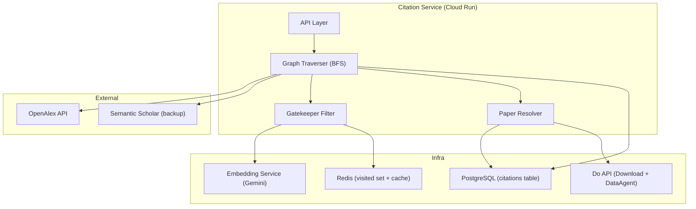
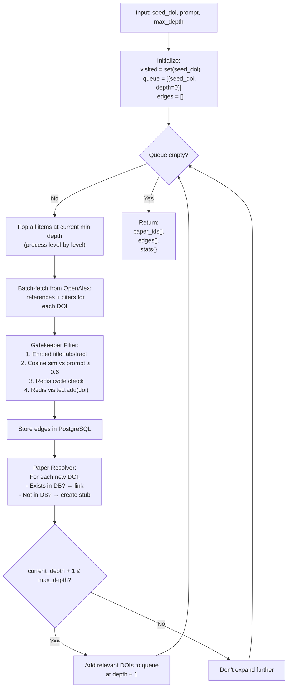
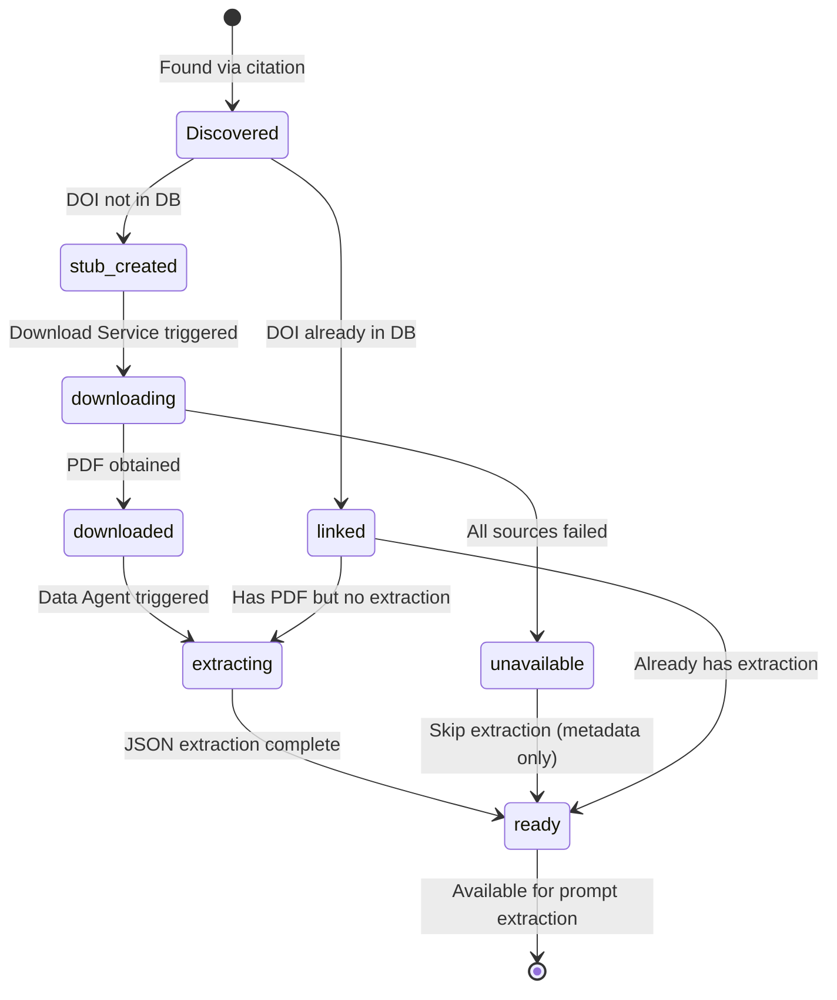
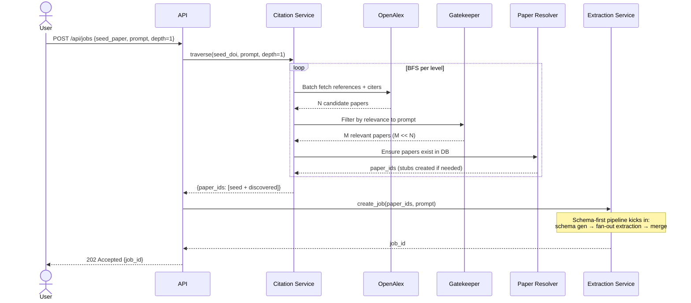

# Citation Service — Deep Dive Design

---

## 1. What Problem Does It Solve?

A researcher gives us a **seed paper**. They want data not just from that paper, but from **all related research** — papers it references, papers that cite it, and papers those cite, etc.

Naive approach: fetch all citations recursively → **exponential explosion**.
- 1 paper → 50 refs → 2,500 at depth 2 → 125,000 at depth 3
- Can't extract from all of them — too slow, too expensive

The Citation Service solves this with: **BFS traversal + relevance-gated pruning + lazy paper materialisation**.

---

## 2. Internal Architecture



### Component Responsibilities

| Component | What It Does |
|-----------|-------------|
| **Graph Traverser** | BFS engine. Level-by-level expansion. Controls depth. Orchestrates everything. |
| **Gatekeeper Filter** | Decides if a cited paper is relevant to the user's prompt. Embeds title+abstract → cosine sim. Also handles cycle detection via Redis. |
| **Paper Resolver** | Given a DOI, ensures the paper exists in our DB. If not, creates a stub and optionally triggers download + extraction. |
| **OpenAlex Client** | HTTP client for OpenAlex. Handles batching, rate limits, pagination. |

---

## 3. OpenAlex Integration — The Details

### 3.1 What OpenAlex Gives Us

OpenAlex is a free, open catalog of **250M+ academic works**. No API key needed (but an email in the header gets you into the "polite pool" — faster rate limits).

**Key fields we use:**

```json
// GET https://api.openalex.org/works/doi:10.1016/j.biortech.2020.123456
{
  "id": "W2345678901",
  "doi": "https://doi.org/10.1016/j.biortech.2020.123456",
  "title": "Biochar production from rice husk...",
  "authorships": [
    {"author": {"display_name": "Zhang, L."}, "institutions": [...]}
  ],
  "publication_date": "2020-06-15",
  "primary_location": {
    "source": {"display_name": "Bioresource Technology"}
  },
  "abstract_inverted_index": {"Biochar": [0], "was": [1], ...},

  // OUTGOING CITATIONS (papers this paper references)
  "referenced_works": [
    "https://openalex.org/W111111111",
    "https://openalex.org/W222222222",
    ...  // typically 20-80 entries
  ],

  // INCOMING CITATIONS (papers that cite this paper)
  "cited_by_count": 142,
  "cited_by_api_url": "https://api.openalex.org/works?filter=cites:W2345678901"
}
```

### 3.2 Fetching References (Outgoing)

References are embedded directly in the work response — no extra API call needed.

```python
async def fetch_references(openalex_id: str) -> list[dict]:
    """Get papers that this paper cites."""
    work = await openalex_client.get_work(openalex_id)
    ref_ids = work.get("referenced_works", [])

    # Batch-resolve OpenAlex IDs to get metadata
    # OpenAlex supports filtering by multiple IDs: openalex:W111|W222|W333
    if not ref_ids:
        return []

    # Fetch in batches of 50 (OpenAlex per_page limit)
    all_refs = []
    for batch in chunk_list(ref_ids, 50):
        id_filter = "|".join(batch)
        results = await openalex_client.get_works(
            filter=f"openalex:{id_filter}",
            select="id,doi,title,authorships,publication_date,abstract_inverted_index",
            per_page=50
        )
        all_refs.extend(results)

    return all_refs
```

### 3.3 Fetching Citers (Incoming)

Citers require a **separate paginated API call**. We only fetch the first page (most recent citers) to avoid explosion.

```python
async def fetch_citers(openalex_id: str, limit: int = 50) -> list[dict]:
    """Get papers that cite this paper (most recent first)."""
    results = await openalex_client.get_works(
        filter=f"cites:{openalex_id}",
        select="id,doi,title,authorships,publication_date,abstract_inverted_index",
        sort="publication_date:desc",
        per_page=min(limit, 50)
    )
    return results
```

### 3.4 Reconstructing Abstracts

OpenAlex stores abstracts as **inverted indexes** (word → positions) to save space. We need to reconstruct:

```python
def reconstruct_abstract(inverted_index: dict) -> str:
    """OpenAlex stores abstracts as inverted indexes. Reconstruct to plain text."""
    if not inverted_index:
        return ""
    # {word: [position1, position2, ...]}
    word_positions = []
    for word, positions in inverted_index.items():
        for pos in positions:
            word_positions.append((pos, word))
    word_positions.sort(key=lambda x: x[0])
    return " ".join(word for _, word in word_positions)
```

### 3.5 Rate Limiting & Polite Pool

```python
class OpenAlexClient:
    BASE_URL = "https://api.openalex.org"

    def __init__(self, email: str):
        self.session = aiohttp.ClientSession(headers={
            "User-Agent": f"ResearchExtractor/1.0 (mailto:{email})",
            # Adding email gets us into the "polite pool" — 100 req/s vs 10 req/s
        })
        self.rate_limiter = AsyncLimiter(max_rate=80, time_period=1)  # 80 req/s to stay safe

    async def get_works(self, **params) -> list[dict]:
        async with self.rate_limiter:
            resp = await self.session.get(f"{self.BASE_URL}/works", params=params)
            if resp.status == 429:
                retry_after = int(resp.headers.get("Retry-After", 5))
                await asyncio.sleep(retry_after)
                return await self.get_works(**params)  # retry once
            resp.raise_for_status()
            data = await resp.json()
            return data.get("results", [])
```

---

## 4. BFS Graph Traversal — The Core Algorithm



### Full Implementation

```python
async def traverse_citations(
    seed_doi: str,
    prompt: str,
    max_depth: int = 1,
    max_papers_per_hop: int = 50,
    relevance_threshold: float = 0.6,
    fetch_citers: bool = True,
    job_id: str = None
) -> CitationGraph:
    """
    BFS citation traversal with relevance-gated pruning.
    
    Returns paper IDs relevant to the prompt, sorted by depth.
    """
    # ── State ──
    visited: set[str] = set()
    queue: list[tuple[str, int]] = []  # (openalex_id, depth)
    all_edges: list[CitationEdge] = []
    all_paper_ids: list[str] = []
    stats = {"total_discovered": 0, "filtered_out": 0, "depth_reached": 0}

    # ── Pre-compute prompt embedding (once) ──
    prompt_embedding = await embedding_service.embed(prompt)

    # ── Resolve seed paper ──
    seed_work = await openalex_client.get_work_by_doi(seed_doi)
    if not seed_work:
        raise PaperNotFoundError(f"DOI {seed_doi} not found in OpenAlex")
    
    seed_oa_id = seed_work["id"]
    visited.add(seed_oa_id)
    queue.append((seed_oa_id, 0))
    seed_paper_id = await paper_resolver.ensure_exists(seed_doi, seed_work)
    all_paper_ids.append(seed_paper_id)

    # ── BFS Loop ──
    while queue:
        # Process one level at a time
        current_depth = min(depth for _, depth in queue)
        current_level = [(oa_id, d) for oa_id, d in queue if d == current_depth]
        queue = [(oa_id, d) for oa_id, d in queue if d != current_depth]

        stats["depth_reached"] = current_depth

        for oa_id, depth in current_level:
            # ── Fetch citations from OpenAlex ──
            references = await fetch_references(oa_id)
            citers = await fetch_citers(oa_id, limit=max_papers_per_hop) if fetch_citers else []
            
            all_candidates = references + citers
            stats["total_discovered"] += len(all_candidates)

            # ── Gatekeeper Filter ──
            for candidate in all_candidates:
                candidate_oa_id = candidate["id"]

                # 1. Cycle check (Redis SET)
                if candidate_oa_id in visited:
                    continue
                if await redis.sismember(f"citation:visited:{job_id}", candidate_oa_id):
                    continue

                # 2. Relevance check (embedding similarity)
                candidate_abstract = reconstruct_abstract(
                    candidate.get("abstract_inverted_index", {})
                )
                candidate_text = f"{candidate.get('title', '')} {candidate_abstract}"
                
                if not candidate_text.strip():
                    stats["filtered_out"] += 1
                    continue  # no text to judge relevance

                candidate_embedding = await embedding_service.embed(candidate_text)
                similarity = cosine_similarity(prompt_embedding, candidate_embedding)

                if similarity < relevance_threshold:
                    stats["filtered_out"] += 1
                    visited.add(candidate_oa_id)
                    await redis.sadd(f"citation:visited:{job_id}", candidate_oa_id)
                    continue  # not relevant to the extraction prompt

                # ── Passed gatekeeper — accept this paper ──
                visited.add(candidate_oa_id)
                await redis.sadd(f"citation:visited:{job_id}", candidate_oa_id)

                # Determine edge direction
                candidate_doi = candidate.get("doi", "").replace("https://doi.org/", "")
                if candidate in references:
                    edge_type = "references"  # seed → candidate
                else:
                    edge_type = "cited_by"    # candidate → seed

                # Resolve paper (create stub if not in DB)
                paper_id = await paper_resolver.ensure_exists(candidate_doi, candidate)
                all_paper_ids.append(paper_id)

                # Store edge
                all_edges.append(CitationEdge(
                    citing=oa_id if edge_type == "references" else candidate_oa_id,
                    cited=candidate_oa_id if edge_type == "references" else oa_id,
                    similarity=similarity,
                    depth=depth + 1
                ))

                # Enqueue for next level (if not at max depth)
                if depth + 1 < max_depth:
                    queue.append((candidate_oa_id, depth + 1))

        # ── Batch persist edges after each level ──
        await store_citation_edges(all_edges)

    # Set TTL on the Redis visited set (cleanup after 24h)
    await redis.expire(f"citation:visited:{job_id}", 86400)

    return CitationGraph(
        seed_paper_id=seed_paper_id,
        paper_ids=all_paper_ids,
        edges=all_edges,
        stats=stats
    )
```

---

## 5. Gatekeeper Filter — The 75% Cost Saver

### Why Not Just Fetch Everything?

| Approach | Papers at depth 2 | Gemini cost (@ $0.03/paper) | Time |
|----------|-------------------|----------------------------|------|
| No filter | ~2,500 | $75 | ~20 min |
| **With Gatekeeper** | **~80** | **$2.40** | **~1 min** |

The gatekeeper is what makes the system **economically viable**.

### How It Decides Relevance

```python
async def is_relevant(
    candidate_text: str,
    prompt_embedding: list[float],
    threshold: float = 0.6
) -> tuple[bool, float]:
    """
    Determines if a cited paper is relevant to the user's extraction prompt.
    
    Uses title + abstract embedding similarity. NOT the full paper text —
    we don't have the PDF yet at this stage.
    """
    if len(candidate_text.strip()) < 20:
        return False, 0.0  # not enough text to judge

    candidate_embedding = await embedding_service.embed(candidate_text)
    similarity = cosine_similarity(prompt_embedding, candidate_embedding)

    return similarity >= threshold, similarity
```

### Threshold Tuning

| Threshold | Behavior | When to Use |
|-----------|----------|-------------|
| 0.4 | Loose — lets in tangentially related papers | Broad exploratory searches |
| **0.6** | **Balanced — default** | **Most use cases** |
| 0.8 | Strict — only very closely related papers | Focused, specific queries |

The threshold is configurable per job via the API:
```json
POST /api/jobs
{
  "seed_paper_id": "...",
  "prompt": "biochar yield vs temperature",
  "citation_depth": 2,
  "relevance_threshold": 0.6  // adjustable
}
```

### Embedding Caching

We'll see the same papers across multiple users' citation traversals. Cache embeddings:

```python
async def embed_with_cache(text: str) -> list[float]:
    text_hash = hashlib.sha256(text.encode()).hexdigest()[:16]
    
    # Check Redis cache (TTL = 7 days)
    cached = await redis.get(f"embed:{text_hash}")
    if cached:
        return json.loads(cached)
    
    embedding = await gemini_embedding_api.embed(text)
    await redis.set(f"embed:{text_hash}", json.dumps(embedding), ex=604800)
    return embedding
```

---

## 6. Redis — Cycle Detection & State

### Why Redis (not just a Python set)?

The traversal runs across **multiple workers** in the Do API worker pool. An in-memory Python set only exists in one process. Redis provides a **shared visited set** across all workers processing the same job.

### Redis Key Structure

```
citation:visited:{job_id}   → SET of OpenAlex IDs already visited
                               TTL: 24 hours (auto-cleanup)

embed:{text_hash}           → STRING (JSON array of floats)
                               TTL: 7 days

citation:cache:{doi}        → HASH {references: [...], citers: [...], fetched_at: ...}
                               TTL: 24 hours (OpenAlex data can change)
```

### Cycle Detection Flow

```
Paper A → cites → Paper B → cites → Paper C → cites → Paper A (CYCLE!)

BFS Step 1: Process A → discover B, C, D
            visited = {A, B, C, D}

BFS Step 2: Process B → discover E, A, F
            A is in visited → SKIP (cycle detected)
            visited = {A, B, C, D, E, F}

BFS Step 3: Process C → discover A, G
            A is in visited → SKIP
            visited = {A, B, C, D, E, F, G}
```

Without cycle detection, the traversal would loop infinitely (A → B → C → A → B → ...).

---

## 7. Paper Resolver — Stub Lifecycle

When we discover papers via citation traversal, they might not exist in our database yet. The Paper Resolver manages this:



### Stub vs Full Paper

```python
async def ensure_exists(doi: str, openalex_data: dict) -> str:
    """Ensure paper exists in DB. Create stub if not. Return paper_id."""
    
    # Check if already exists
    existing = await db.query(
        "SELECT id, extraction_status FROM papers WHERE doi = $1", doi
    )
    if existing:
        return existing.id

    # Create stub — metadata from OpenAlex, no PDF yet
    paper_id = await db.query("""
        INSERT INTO papers (
            doi, title, authors, abstract, publication_date, journal,
            source, extraction_status
        ) VALUES ($1, $2, $3, $4, $5, $6, 'openalex', 'pending')
        RETURNING id
    """,
        doi,
        openalex_data.get("title"),
        json.dumps(extract_authors(openalex_data)),
        reconstruct_abstract(openalex_data.get("abstract_inverted_index", {})),
        openalex_data.get("publication_date"),
        extract_journal(openalex_data)
    )

    # Async: trigger download + extraction (non-blocking)
    await Task('PaperIngestion_Worker').Do({
        "paper_id": paper_id,
        "doi": doi,
        "priority": "low"  # citation-discovered papers are lower priority than user-uploaded
    })

    return paper_id
```

### The Paper Ingestion Worker (triggered by resolver)

```python
# This worker handles: download PDF → Data Agent → embedding
async def paper_ingestion_worker(payload):
    paper_id = payload["paper_id"]
    doi = payload["doi"]

    # 1. Download PDF
    try:
        pdf_uri = await download_service.fetch(doi)
        await db.query(
            "UPDATE papers SET pdf_gcs_uri = $1, extraction_status = 'processing' WHERE id = $2",
            pdf_uri, paper_id
        )
    except DownloadError:
        await db.query(
            "UPDATE papers SET extraction_status = 'unavailable' WHERE id = $1",
            paper_id
        )
        return {"paper_id": paper_id, "status": "unavailable"}

    # 2. Data Agent extraction
    json_uri = await data_agent.extract(paper_id, pdf_uri)

    # 3. Generate embeddings for search
    chunks = chunk_paper_json(load_json(json_uri))
    embeddings = await embedding_service.embed_batch([c.text for c in chunks])
    await store_chunks_with_embeddings(paper_id, chunks, embeddings)

    # 4. Mark complete
    await db.query(
        "UPDATE papers SET extraction_status = 'completed' WHERE id = $1",
        paper_id
    )
    return {"paper_id": paper_id, "status": "completed"}
```

---

## 8. Storing Citation Edges

### Bidirectional Edges

```sql
-- Paper A references Paper B  →  (A, B)
-- Paper C cites Paper A       →  (C, A)
-- Both stored as (citing, cited) — always the same direction

INSERT INTO citations (citing_paper_id, cited_paper_id, source, context_snippet)
VALUES ($1, $2, 'openalex', $3)
ON CONFLICT (citing_paper_id, cited_paper_id) DO NOTHING;
```

### Querying the Graph

**Direct references (1 hop out):**
```sql
SELECT p.* FROM citations c
JOIN papers p ON c.cited_paper_id = p.id
WHERE c.citing_paper_id = :seed_id;
```

**Direct citers (1 hop in):**
```sql
SELECT p.* FROM citations c
JOIN papers p ON c.citing_paper_id = p.id
WHERE c.cited_paper_id = :seed_id;
```

**N-hop recursive (both directions):**
```sql
WITH RECURSIVE citation_graph AS (
    -- Hop 0: direct references
    SELECT cited_paper_id AS paper_id, 0 AS depth, 'reference' AS relation
    FROM citations WHERE citing_paper_id = :seed_id
    UNION
    -- Hop 0: direct citers
    SELECT citing_paper_id AS paper_id, 0 AS depth, 'citer' AS relation
    FROM citations WHERE cited_paper_id = :seed_id
    UNION
    -- Recursive expansion
    SELECT 
        CASE WHEN c.citing_paper_id = cg.paper_id THEN c.cited_paper_id
             ELSE c.citing_paper_id END,
        cg.depth + 1,
        CASE WHEN c.citing_paper_id = cg.paper_id THEN 'reference' ELSE 'citer' END
    FROM citations c
    JOIN citation_graph cg ON c.citing_paper_id = cg.paper_id OR c.cited_paper_id = cg.paper_id
    WHERE cg.depth < :max_depth
)
SELECT DISTINCT p.id, p.doi, p.title, cg.depth, cg.relation
FROM citation_graph cg
JOIN papers p ON p.id = cg.paper_id
WHERE p.id != :seed_id
ORDER BY cg.depth, p.title;
```

---

## 9. Failure Modes & Recovery

| Failure | Impact | Recovery |
|---------|--------|----------|
| **OpenAlex API down** | Can't discover citations | Retry 3× with backoff. Fall back to Semantic Scholar API. If both fail, return seed paper only with warning. |
| **OpenAlex returns no results for DOI** | Paper not in OpenAlex | Try Semantic Scholar. If not found anywhere, the paper has no discoverable citations — skip. |
| **Embedding service timeout** | Can't compute relevance | Skip gatekeeper filter for this batch. Accept all candidates (higher cost but no data loss). |
| **Redis down** | No cycle detection, no embed cache | Fall back to in-memory Python set (works for single-worker jobs). Log warning. |
| **Too many papers pass gatekeeper** | Cost/time explosion | Hard cap: `max_papers_per_level = 50`. If more pass filter, take top-50 by similarity score. |
| **Download Service fails for stub** | Paper has metadata but no PDF/extraction | Mark as `unavailable`. Include in results with `has_extraction: false`. User sees which papers couldn't be fetched. |

### Circuit Breaker for OpenAlex

```python
class OpenAlexCircuitBreaker:
    """If OpenAlex fails 5 times in a row, stop calling for 60 seconds."""
    FAILURE_THRESHOLD = 5
    RESET_TIMEOUT = 60

    async def call(self, fn, *args):
        if self.state == 'open' and time.time() - self.last_failure > self.RESET_TIMEOUT:
            self.state = 'half_open'
        if self.state == 'open':
            raise CircuitOpenError("OpenAlex circuit breaker is open")
        try:
            result = await fn(*args)
            self.failures = 0
            self.state = 'closed'
            return result
        except (aiohttp.ClientError, asyncio.TimeoutError):
            self.failures += 1
            self.last_failure = time.time()
            if self.failures >= self.FAILURE_THRESHOLD:
                self.state = 'open'
            raise
```

---

## 10. API Endpoints

```
POST /api/citations/discover
  Body: {
    "paper_id": "abc-123",
    "prompt": "biochar yield vs temperature",   // for relevance filtering
    "max_depth": 2,
    "relevance_threshold": 0.6,
    "fetch_citers": true,
    "max_papers_per_hop": 50
  }
  Response: {
    "job_id": "cite-job-456",          // async — poll for results
    "status": "processing"
  }

GET /api/citations/discover/:job_id
  Response: {
    "status": "completed",
    "graph": {
      "seed": {"id": "abc-123", "doi": "...", "title": "..."},
      "nodes": [
        {"id": "def-456", "doi": "...", "title": "...", "depth": 1,
         "similarity": 0.82, "has_pdf": true, "has_extraction": true},
        {"id": "ghi-789", "doi": "...", "title": "...", "depth": 1,
         "similarity": 0.67, "has_pdf": false, "has_extraction": false}
      ],
      "edges": [
        {"from": "abc-123", "to": "def-456", "type": "references"},
        {"from": "ghi-789", "to": "abc-123", "type": "cites"}
      ],
      "stats": {
        "total_discovered": 342,
        "filtered_out": 264,
        "accepted": 78,
        "depth_reached": 2,
        "with_pdf": 52,
        "with_extraction": 48,
        "unavailable": 6
      }
    }
  }

GET /api/papers/:id/citations?depth=1
  Response: {
    "references": [...],    // papers this paper cites
    "cited_by": [...],      // papers that cite this paper
    "total_references": 45,
    "total_cited_by": 128
  }
```

---

## 11. How It Integrates With Extraction Pipeline



The citation service is **purely a discovery layer**. It finds relevant paper IDs. The extraction pipeline is separate — it takes those IDs and does the actual data extraction.
