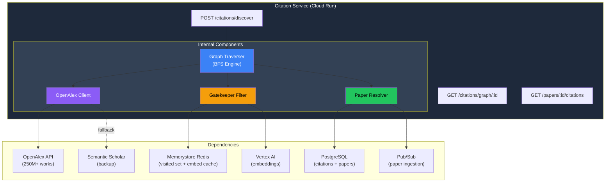
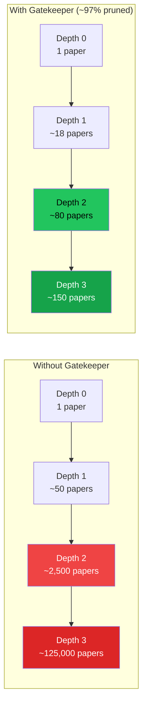
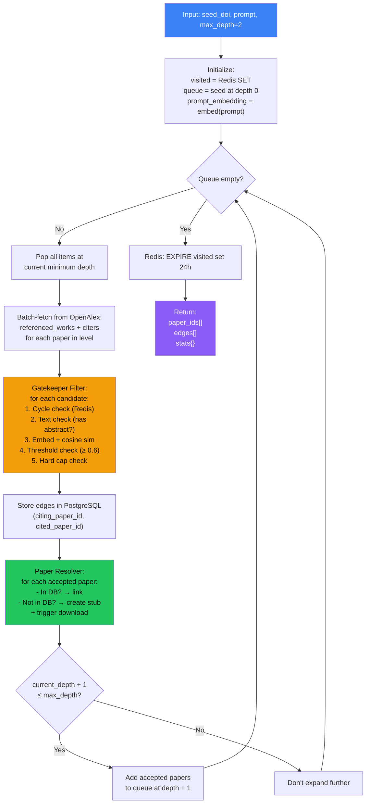
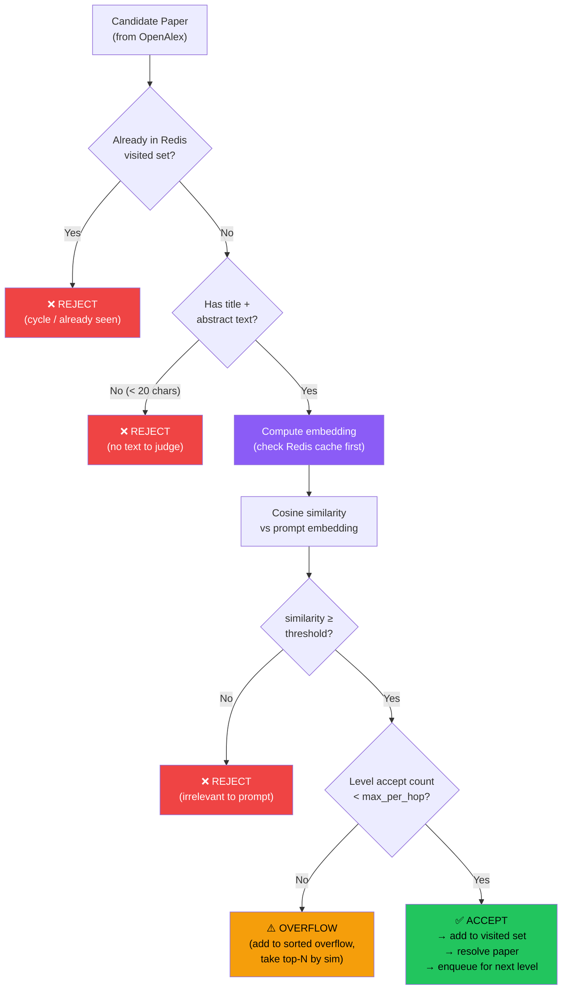
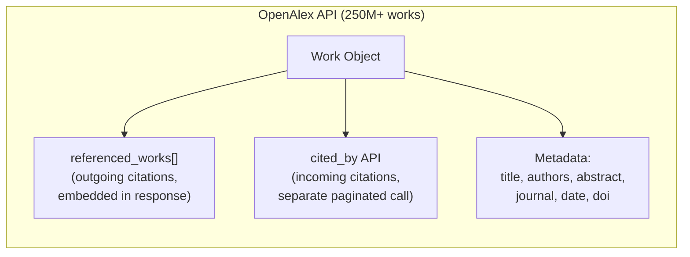
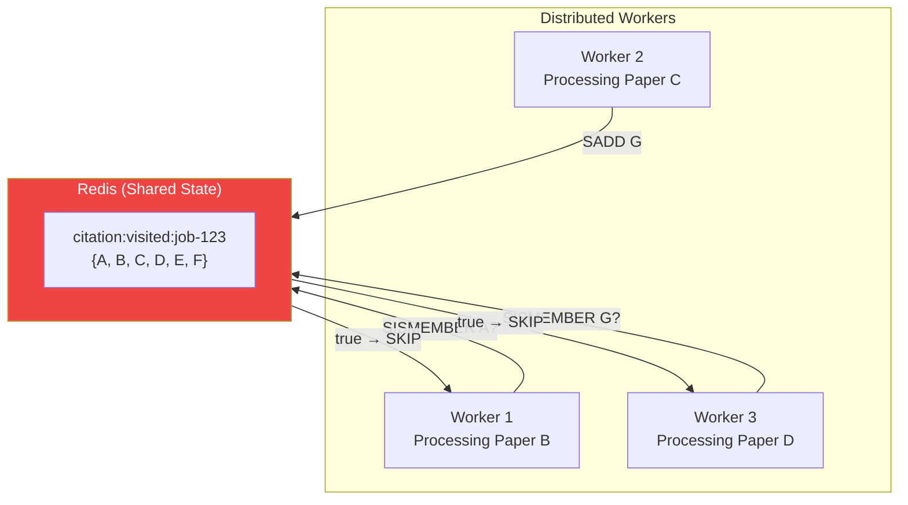
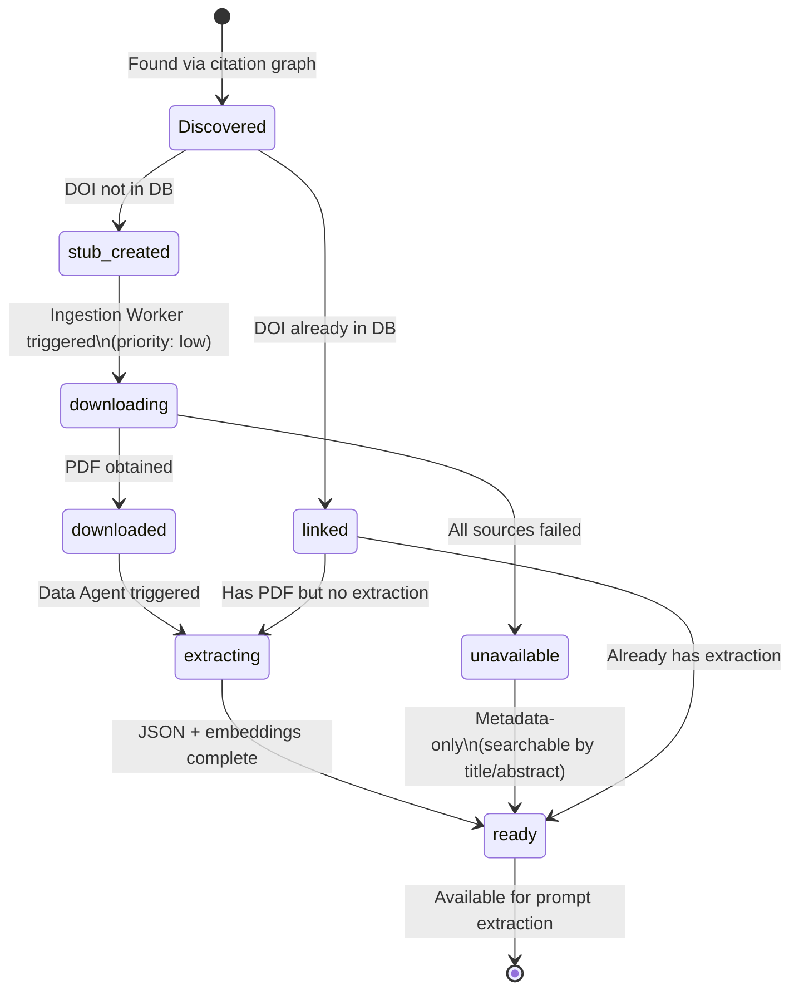
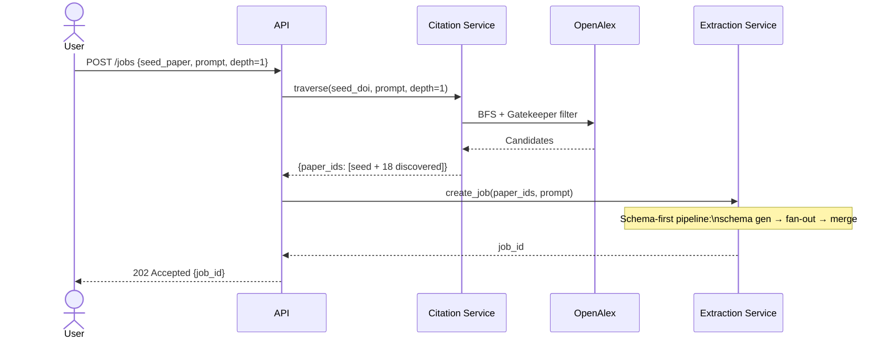

# Citation Service — Deep Dive

> **One-liner**: Discovers related papers through the citation graph using BFS traversal with relevance-gated pruning, turning 1 seed paper into a curated set of relevant research.

---

## 1. Architecture Overview



---

## 2. What Exists vs What Changed

| Aspect | What Exists (Built at Infocusp) | Reimagined (v2) |
|--------|-------------------------------|-----------------|
| **Graph source** | OpenAlex only | OpenAlex primary + Semantic Scholar fallback |
| **Traversal** | BFS with depth limit | Same — BFS level-by-level, max_depth configurable |
| **Relevance filter** | Embedding cosine similarity (Gatekeeper) | Same — with embedding cache in Redis to avoid re-computation |
| **Cycle detection** | Redis SET per job | Same — `citation:visited:{job_id}` with 24h TTL |
| **Paper resolution** | Create stub if not in DB, trigger download | Same — with priority levels (citation-discovered = low priority) |
| **Circuit breaker** | None | Added for OpenAlex client (5 failures → 60s cooldown) |
| **Observability** | Basic logging | Correlation IDs, per-level metrics, traversal stats returned |
| **Hard caps** | None | `max_papers_per_level = 50` to prevent cost explosion |

---

## 3. The Problem — Graph Explosion

Why this service exists:



| | Unfiltered | With Gatekeeper | Savings |
|---|---|---|---|
| Papers at depth 2 | ~2,500 | ~80 | **97% fewer** |
| Gemini cost (@ $0.03/paper) | $75 | $2.40 | **97% cheaper** |
| Processing time | ~20 min | ~1 min | **95% faster** |

---

## 4. API Contract

### 4.1 Discover Citations (Async)

```
POST /api/citations/discover
Content-Type: application/json

Body:
{
  "paper_id": "abc-123",
  "prompt": "biochar yield vs pyrolysis temperature",
  "max_depth": 2,
  "relevance_threshold": 0.6,
  "fetch_citers": true,
  "max_papers_per_hop": 50
}

Response:
  202 Accepted
  {
    "job_id": "cite-job-456",
    "status": "processing"
  }
```

### 4.2 Get Discovery Results (Poll)

```
GET /api/citations/discover/:job_id

Response:
  200 OK
  {
    "status": "completed",
    "graph": {
      "seed": {"id": "abc-123", "doi": "...", "title": "..."},
      "nodes": [
        {
          "id": "def-456",
          "doi": "10.1016/...",
          "title": "Biochar properties...",
          "depth": 1,
          "similarity": 0.82,
          "has_pdf": true,
          "has_extraction": true,
          "direction": "reference"
        },
        {
          "id": "ghi-789",
          "doi": "10.1021/...",
          "title": "Pyrolysis optimization...",
          "depth": 1,
          "similarity": 0.67,
          "has_pdf": false,
          "has_extraction": false,
          "direction": "citer"
        }
      ],
      "edges": [
        {"from": "abc-123", "to": "def-456", "type": "references"},
        {"from": "ghi-789", "to": "abc-123", "type": "cites"}
      ],
      "stats": {
        "total_discovered": 342,
        "filtered_out": 264,
        "accepted": 78,
        "depth_reached": 2,
        "with_pdf": 52,
        "with_extraction": 48,
        "unavailable": 6
      }
    }
  }
```

### 4.3 Get Citation Graph (Already Stored)

```
GET /api/papers/:id/citations?depth=1

Response:
  200 OK
  {
    "references": [
      {"id": "...", "doi": "...", "title": "...", "similarity": 0.85}
    ],
    "cited_by": [
      {"id": "...", "doi": "...", "title": "...", "similarity": 0.72}
    ],
    "total_references": 45,
    "total_cited_by": 128
  }
```

---

## 5. BFS Traversal — Core Algorithm

### 5.1 Level-by-Level Flow



### 5.2 Implementation

```python
async def traverse_citations(
    seed_doi: str,
    prompt: str,
    max_depth: int = 1,
    max_papers_per_hop: int = 50,
    relevance_threshold: float = 0.6,
    fetch_citers: bool = True,
    job_id: str = None
) -> CitationGraph:

    visited: set[str] = set()
    queue: list[tuple[str, int]] = []  # (openalex_id, depth)
    all_edges: list[CitationEdge] = []
    all_paper_ids: list[str] = []
    stats = {"total_discovered": 0, "filtered_out": 0, "depth_reached": 0}

    # Pre-compute prompt embedding (once, cached)
    prompt_embedding = await embed_with_cache(prompt)

    # Resolve seed paper
    seed_work = await openalex_client.get_work_by_doi(seed_doi)
    if not seed_work:
        raise PaperNotFoundError(f"DOI {seed_doi} not found in OpenAlex")

    seed_oa_id = seed_work["id"]
    visited.add(seed_oa_id)
    await redis.sadd(f"citation:visited:{job_id}", seed_oa_id)
    queue.append((seed_oa_id, 0))

    seed_paper_id = await paper_resolver.ensure_exists(seed_doi, seed_work)
    all_paper_ids.append(seed_paper_id)

    # ── BFS Loop ──
    while queue:
        current_depth = min(depth for _, depth in queue)
        current_level = [(oa_id, d) for oa_id, d in queue if d == current_depth]
        queue = [(oa_id, d) for oa_id, d in queue if d != current_depth]

        stats["depth_reached"] = current_depth
        level_accepted = 0

        for oa_id, depth in current_level:
            # Fetch citations from OpenAlex
            references = await fetch_references(oa_id)
            citers = (await fetch_citers(oa_id, limit=max_papers_per_hop)
                     if fetch_citers else [])

            all_candidates = references + citers
            stats["total_discovered"] += len(all_candidates)

            # Gatekeeper filter
            for candidate in all_candidates:
                candidate_oa_id = candidate["id"]

                # 1. Cycle check (Redis SET — shared across workers)
                if candidate_oa_id in visited:
                    continue
                if await redis.sismember(
                    f"citation:visited:{job_id}", candidate_oa_id
                ):
                    continue

                # 2. Relevance check
                candidate_text = build_candidate_text(candidate)
                if not candidate_text.strip():
                    stats["filtered_out"] += 1
                    continue

                candidate_embedding = await embed_with_cache(candidate_text)
                similarity = cosine_similarity(prompt_embedding, candidate_embedding)

                if similarity < relevance_threshold:
                    stats["filtered_out"] += 1
                    visited.add(candidate_oa_id)
                    await redis.sadd(
                        f"citation:visited:{job_id}", candidate_oa_id
                    )
                    continue

                # 3. Hard cap check
                if level_accepted >= max_papers_per_hop:
                    break  # hit cap for this level

                # ── Passed gatekeeper — accept ──
                visited.add(candidate_oa_id)
                await redis.sadd(f"citation:visited:{job_id}", candidate_oa_id)
                level_accepted += 1

                # Resolve paper + store edge
                candidate_doi = extract_doi(candidate)
                paper_id = await paper_resolver.ensure_exists(
                    candidate_doi, candidate
                )
                all_paper_ids.append(paper_id)

                edge_type = ("references" if candidate in references
                            else "cited_by")
                all_edges.append(CitationEdge(
                    citing=oa_id if edge_type == "references" else candidate_oa_id,
                    cited=candidate_oa_id if edge_type == "references" else oa_id,
                    similarity=similarity,
                    depth=depth + 1
                ))

                # Enqueue for next level
                if depth + 1 < max_depth:
                    queue.append((candidate_oa_id, depth + 1))

        # Batch persist edges after each level
        await store_citation_edges(all_edges)

    # Cleanup
    await redis.expire(f"citation:visited:{job_id}", 86400)

    return CitationGraph(
        seed_paper_id=seed_paper_id,
        paper_ids=all_paper_ids,
        edges=all_edges,
        stats=stats
    )
```

---

## 6. Gatekeeper Filter — Decision Tree

The Gatekeeper is what makes this system economically viable. It decides, for each candidate paper, whether it's worth including.



### Threshold Tuning

| Threshold | Behavior | Use Case |
|-----------|----------|----------|
| **0.4** | Loose — lets in tangentially related papers | Broad exploratory searches |
| **0.6** | **Balanced — default** | Most extraction jobs |
| **0.8** | Strict — only very closely related | Focused, specific queries |

The threshold is configurable per job via the API request body.

---

## 7. OpenAlex Integration

### 7.1 What OpenAlex Provides



### 7.2 Fetching References vs Citers

| | References (outgoing) | Citers (incoming) |
|---|---|---|
| **API** | Embedded in work response | Separate `GET /works?filter=cites:{id}` |
| **Extra call needed?** | No | Yes (paginated) |
| **Typical count** | 20-80 | 0 to 10,000+ |
| **We fetch** | All | First page only (limit 50, most recent) |

### 7.3 Abstract Reconstruction

OpenAlex stores abstracts as **inverted indexes** to save space:

```python
# OpenAlex returns: {"Biochar": [0], "was": [1], "prepared": [2], ...}
# We reconstruct: "Biochar was prepared..."

def reconstruct_abstract(inverted_index: dict) -> str:
    if not inverted_index:
        return ""
    word_positions = []
    for word, positions in inverted_index.items():
        for pos in positions:
            word_positions.append((pos, word))
    word_positions.sort(key=lambda x: x[0])
    return " ".join(word for _, word in word_positions)
```

### 7.4 Rate Limiting & Polite Pool

```python
class OpenAlexClient:
    BASE_URL = "https://api.openalex.org"

    def __init__(self, email: str):
        self.session = aiohttp.ClientSession(headers={
            "User-Agent": f"PaperExtractor/1.0 (mailto:{email})",
            # Email header → polite pool: 100 req/s (vs 10 req/s)
        })
        self.rate_limiter = AsyncLimiter(max_rate=80, time_period=1)
        self.circuit_breaker = CircuitBreaker(
            failure_threshold=5, reset_timeout=60
        )
```

---

## 8. Redis — Cycle Detection & Caching

### 8.1 Why Redis (Not In-Memory Set)

The traversal can run across **multiple Do API workers** (one per BFS level for parallelism). A Python `set()` lives in one process. Redis provides a **shared visited set** across all workers.



### 8.2 Redis Key Design

```
citation:visited:{job_id}     → SET of OpenAlex IDs       TTL: 24h
embed:{text_hash}             → STRING (JSON float array)  TTL: 7d
citation:cache:{oa_id}        → HASH {refs, citers, ts}    TTL: 24h
```

### 8.3 Embedding Cache

Same papers appear across different users' traversals. Cache embeddings to avoid redundant Gemini calls:

```python
async def embed_with_cache(text: str) -> list[float]:
    text_hash = hashlib.sha256(text.encode()).hexdigest()[:16]

    cached = await redis.get(f"embed:{text_hash}")
    if cached:
        return json.loads(cached)

    embedding = await vertex_ai.embed(text)
    await redis.set(f"embed:{text_hash}", json.dumps(embedding), ex=604800)
    return embedding
```

---

## 9. Paper Resolver — Stub Lifecycle

When the traversal discovers a paper via citations, it might not exist in our database. The Paper Resolver handles this:



```python
async def ensure_exists(doi: str, openalex_data: dict) -> str:
    """Ensure paper exists in DB. Create stub if not. Return paper_id."""

    existing = await db.fetchrow(
        "SELECT id FROM papers WHERE doi = $1", doi
    )
    if existing:
        return existing["id"]

    # Create stub with OpenAlex metadata
    paper_id = await db.fetchval("""
        INSERT INTO papers (
            doi, title, authors, abstract, publication_date,
            journal, source, extraction_status
        ) VALUES ($1, $2, $3, $4, $5, $6, 'openalex', 'pending')
        ON CONFLICT (doi) DO NOTHING
        RETURNING id
    """, doi, openalex_data.get("title"),
        json.dumps(extract_authors(openalex_data)),
        reconstruct_abstract(openalex_data.get("abstract_inverted_index", {})),
        openalex_data.get("publication_date"),
        extract_journal(openalex_data))

    if not paper_id:
        # Race condition — another worker created it
        return (await db.fetchval(
            "SELECT id FROM papers WHERE doi = $1", doi
        ))

    # Trigger async download + extraction (low priority)
    await pubsub.publish("paper-ingestion", {
        "paper_id": paper_id,
        "doi": doi,
        "source": "citation_discovery",
        "priority": "low"
    })

    return paper_id
```

---

## 10. Storing & Querying Citation Edges

### 10.1 Edge Storage

```sql
-- Always stored as (citing → cited)
INSERT INTO citations (citing_paper_id, cited_paper_id, source, similarity)
VALUES ($1, $2, 'openalex', $3)
ON CONFLICT (citing_paper_id, cited_paper_id) DO NOTHING;
```

### 10.2 N-Hop Recursive Query

```sql
WITH RECURSIVE citation_graph AS (
    -- Hop 0: direct references
    SELECT cited_paper_id AS paper_id, 0 AS depth, 'reference' AS relation
    FROM citations WHERE citing_paper_id = :seed_id
    UNION
    -- Hop 0: direct citers
    SELECT citing_paper_id AS paper_id, 0 AS depth, 'citer' AS relation
    FROM citations WHERE cited_paper_id = :seed_id
    UNION
    -- Recursive expansion (both directions)
    SELECT
        CASE WHEN c.citing_paper_id = cg.paper_id THEN c.cited_paper_id
             ELSE c.citing_paper_id END,
        cg.depth + 1,
        CASE WHEN c.citing_paper_id = cg.paper_id THEN 'reference'
             ELSE 'citer' END
    FROM citations c
    JOIN citation_graph cg
        ON c.citing_paper_id = cg.paper_id
        OR c.cited_paper_id = cg.paper_id
    WHERE cg.depth < :max_depth
)
SELECT DISTINCT p.id, p.doi, p.title, cg.depth, cg.relation
FROM citation_graph cg
JOIN papers p ON p.id = cg.paper_id
WHERE p.id != :seed_id
ORDER BY cg.depth, p.title;
```

---

## 11. Integration with Extraction Pipeline

The Citation Service is **purely a discovery layer**. It finds relevant paper IDs. The Extraction Service takes those IDs and runs the schema-first pipeline.



---

## 12. Failure Modes & Recovery

| Failure | Impact | Recovery |
|---------|--------|----------|
| **OpenAlex down** | Can't discover citations | Retry 3× → Semantic Scholar fallback → return seed only with warning |
| **OpenAlex returns empty** | Paper not indexed | Try Semantic Scholar. If not found → paper has no discoverable citations |
| **Embedding service timeout** | Can't compute relevance | Skip gatekeeper for this batch → accept all candidates (higher cost, no data loss) |
| **Redis down** | No shared cycle detection | Fall back to in-memory `set()` (works for single-worker). Log warning |
| **Too many papers pass filter** | Cost explosion | Hard cap: `max_papers_per_level = 50`. Overflow sorted by similarity, top-N taken |
| **Download fails for stub** | No PDF/extraction | Mark `unavailable`. Include in results with `has_extraction: false` |

---

## 13. Key Design Decisions

| Decision | Chosen | Alternative | Why |
|----------|--------|-------------|-----|
| **BFS (not DFS)** | Level-by-level expansion | DFS with backtracking | BFS gives consistent depth control. DFS can go deep on irrelevant branches before backtracking |
| **Embedding similarity (not keyword)** | Cosine similarity on embeddings | Keyword/TF-IDF matching | Embeddings capture semantic meaning: "pyrolysis temp" matches "thermal decomposition temperature" |
| **Redis visited set** | Shared across workers | In-memory Python set | Workers are distributed — need shared state for cycle detection |
| **Stub creation (lazy)** | Create stub, trigger async download | Download inline during traversal | Traversal would take minutes if downloading PDFs inline. Stubs are instant |
| **Citers: first page only** | Limit 50 most recent | Fetch all citers | Some papers have 10,000+ citers. Fetching all would overwhelm the gatekeeper |
| **Threshold configurable** | Per-job threshold (default 0.6) | Fixed threshold | Different research questions need different precision/recall tradeoffs |
| **Circuit breaker on OpenAlex** | 5 failures → 60s cooldown | Unlimited retries | Prevents hammering a struggling API. Fails fast so user gets a partial result |
