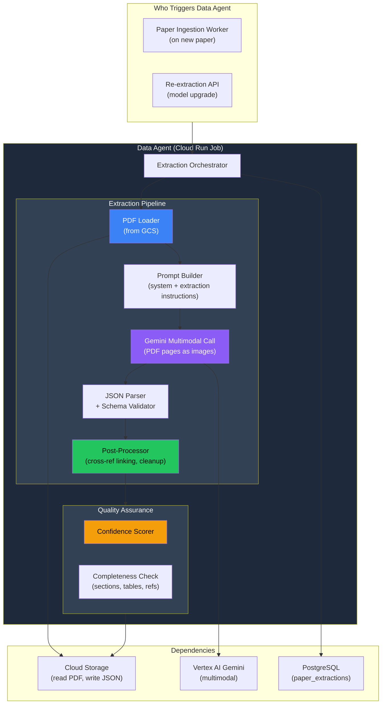
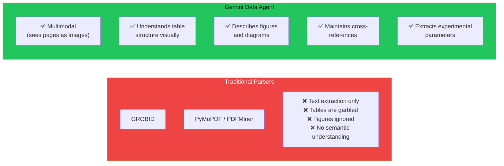
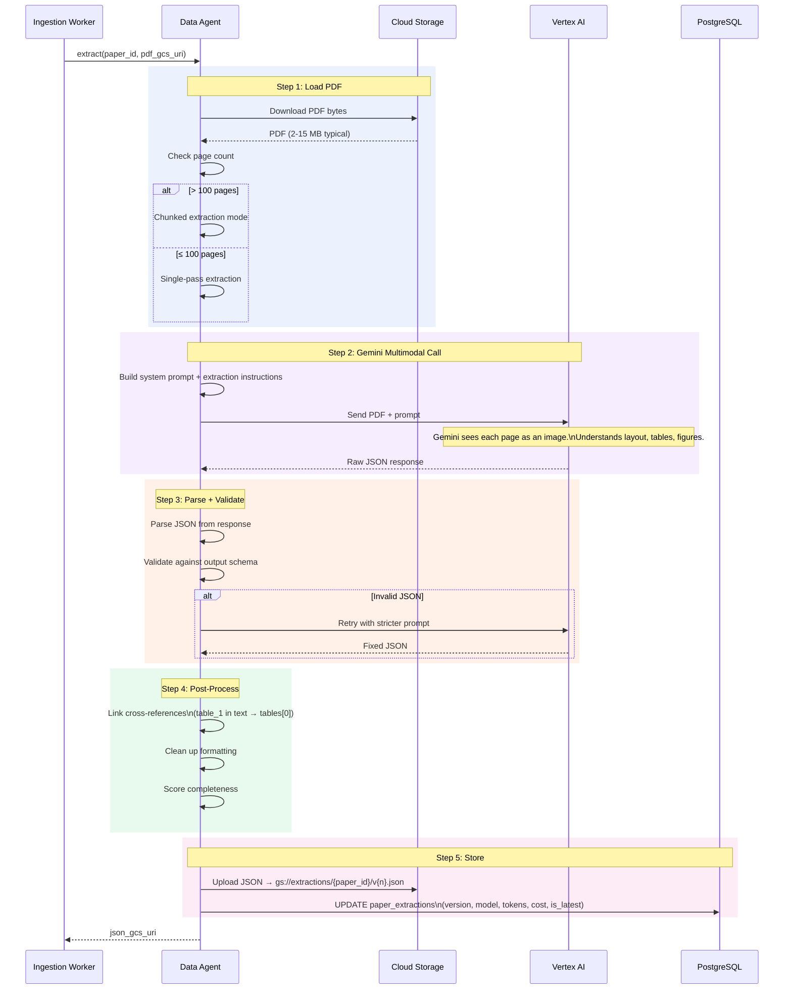
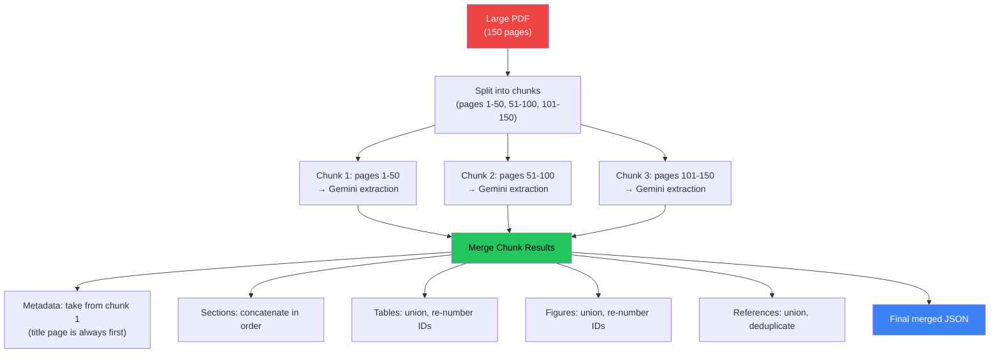
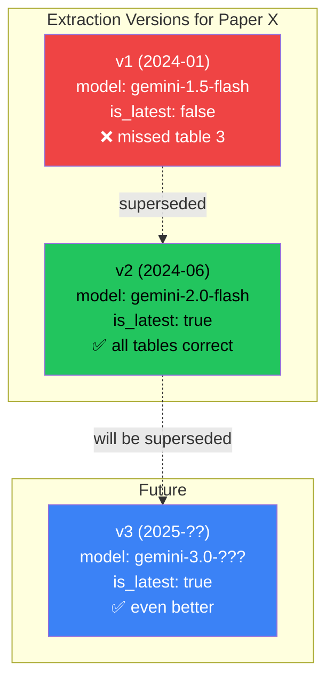
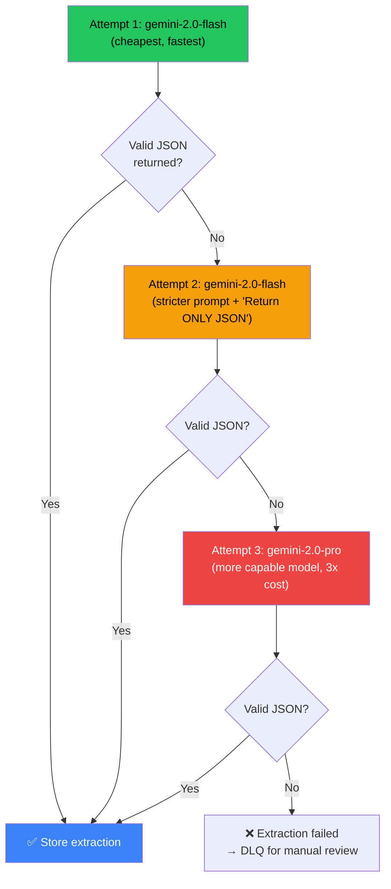
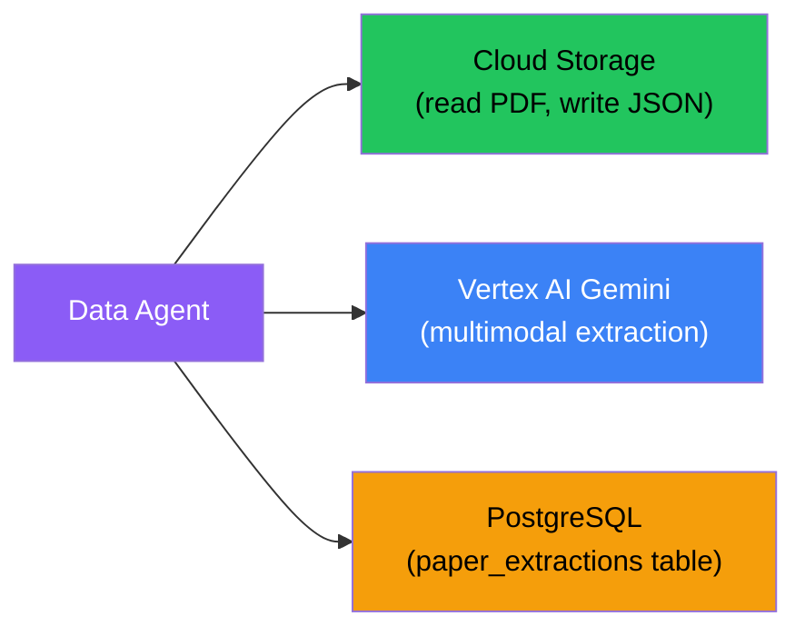

# Data Agent — Deep Dive

> **One-liner**: A Gemini-powered multimodal extraction engine that converts raw research paper PDFs into comprehensive, structured JSON — understanding not just text, but tables, figures, cross-references, and experimental methodology.

---

## 1. Architecture Overview



---

## 2. What Exists vs What Changed

| Aspect | What Exists (Built at Infocusp) | Reimagined (v2) |
|--------|-------------------------------|-----------------|
| **Model** | Gemini 1.5 Flash | Gemini 2.0 Flash (cheaper, better at tables) |
| **Input** | PDF sent as multimodal input | Same — full PDF pages as images to Gemini |
| **Output** | Structured JSON (sections, tables, figures, refs) | Same schema — with added `experimental_parameters` and `key_findings` |
| **Versioning** | Single extraction per paper | Versioned: v1, v2... with `is_latest` flag |
| **Error handling** | Basic retry | Retry with model fallback (flash → pro), chunked extraction for large papers |
| **Validation** | None | JSON schema validation + completeness scoring |
| **Cost tracking** | None | Token counts + cost per extraction stored in DB |

---

## 3. Why Gemini, Not Traditional Parsers

This is the most common interview question about this component.



| Capability | GROBID / PyMuPDF | Gemini Data Agent |
|------------|------------------|-------------------|
| **Plain text extraction** | ✅ Good | ✅ Good |
| **Tables** | ⚠️ Heuristic row/column detection — often wrong for complex tables | ✅ Sees table as image, understands structure |
| **Figures / Diagrams** | ❌ Cannot interpret visual content | ✅ Describes what the figure shows, links to text |
| **Cross-references** | ❌ No semantic linking | ✅ Knows "Table 1" in text refers to actual Table 1 |
| **Methodology extraction** | ❌ No understanding of scientific method | ✅ Extracts: feedstock, temperature, time, equipment |
| **Multi-column layouts** | ⚠️ Struggles with 2-column academic PDFs | ✅ Handles natively (sees the page image) |
| **Supplementary materials** | ❌ | ✅ If included in PDF |
| **Cost** | Free | ~$0.10/paper |
| **Speed** | ~1-2s | ~30s-2min |

> [!IMPORTANT]
> The $0.10/paper cost is justified because the extraction runs **once per paper** (cached in GCS). All subsequent prompt extractions use the cached JSON — the expensive Gemini call is amortized across every future use of that paper.

---

## 4. Output JSON Schema

The Data Agent produces a comprehensive JSON representation of the entire paper:

```json
{
  "metadata": {
    "title": "Biochar production from rice husk at varying temperatures",
    "authors": [
      {"name": "Zhang, L.", "affiliation": "Zhejiang University"},
      {"name": "Wang, H.", "affiliation": "Chinese Academy of Sciences"}
    ],
    "doi": "10.1016/j.biortech.2020.123456",
    "journal": "Bioresource Technology",
    "publication_date": "2020-06-15",
    "abstract": "This study investigates the effects of pyrolysis temperature..."
  },

  "sections": [
    {
      "heading": "Introduction",
      "content": "Biochar has gained significant attention...",
      "subsections": []
    },
    {
      "heading": "Materials and Methods",
      "content": "Rice husk was collected from...",
      "subsections": [
        {
          "heading": "2.1 Feedstock Preparation",
          "content": "Rice husk was washed, dried at 105°C..."
        },
        {
          "heading": "2.2 Pyrolysis Procedure",
          "content": "Pyrolysis was performed in a tubular furnace..."
        }
      ]
    }
  ],

  "tables": [
    {
      "id": "table_1",
      "caption": "Properties of biochar at different pyrolysis temperatures",
      "headers": ["Temperature (°C)", "Yield (%)", "BET (m²/g)", "pH"],
      "rows": [
        ["300", "42.1", "12.3", "7.2"],
        ["500", "31.5", "256.7", "9.8"],
        ["700", "24.8", "389.1", "10.5"]
      ],
      "referenced_in_sections": ["Results", "Discussion"]
    }
  ],

  "figures": [
    {
      "id": "figure_1",
      "caption": "SEM images of biochar produced at (a) 300°C, (b) 500°C, (c) 700°C",
      "description": "Scanning electron microscopy images showing increasing porosity with temperature. At 300°C, the surface is relatively smooth. At 500°C, micropores are visible. At 700°C, a highly porous honeycomb structure is evident.",
      "referenced_in_sections": ["Results"]
    }
  ],

  "references": [
    {"ref_number": 1, "title": "Biochar for environmental management", "doi": "10.4324/9781849770552", "year": 2009, "authors": ["Lehmann, J.", "Joseph, S."]},
    {"ref_number": 2, "title": "A review of biochar properties", "doi": "10.1016/j.chemosphere.2014.01.043", "year": 2014, "authors": ["Ahmad, M."]}
  ],

  "key_findings": [
    "Biochar yield decreased from 42.1% to 24.8% as temperature increased from 300°C to 700°C",
    "BET surface area increased 30-fold (12.3 to 389.1 m²/g) over the same temperature range",
    "Optimal temperature for soil amendment was 500°C, balancing yield and surface area"
  ],

  "experimental_parameters": {
    "feedstock": "rice husk",
    "pyrolysis_temperature_range": "300-700°C",
    "residence_time": "2 hours",
    "heating_rate": "10°C/min",
    "atmosphere": "nitrogen",
    "equipment": "tubular furnace"
  }
}
```

---

## 5. Extraction Pipeline — Step by Step



### 5.1 The Extraction Prompt

```python
SYSTEM_PROMPT = """You are a research paper data extraction agent.
Your task is to extract ALL structured information from the given
research paper PDF. You see each page as an image.

You MUST return a single JSON object with this exact structure:
{schema}

Rules:
1. Extract ALL tables exactly as they appear — preserve every row and column.
2. For figures, describe what the figure shows (not the caption text).
3. Maintain cross-references: if the text says "as shown in Table 1",
   link it to the corresponding table object.
4. Extract experimental parameters: feedstock, temperature, time,
   equipment, atmosphere, etc.
5. List key findings as concise bullet points.
6. For references, extract DOI when available.
7. Return ONLY valid JSON. No markdown, no explanation.
"""
```

### 5.2 Large Paper Handling (Chunked Extraction)

Papers > 100 pages (reviews, theses) can exceed Gemini's context window. We handle this with **chunked extraction + merge**:



```python
async def extract_large_paper(pdf_bytes: bytes, page_count: int) -> dict:
    """Chunked extraction for papers exceeding context window."""
    CHUNK_SIZE = 50  # pages per chunk

    chunks = split_pdf_pages(pdf_bytes, CHUNK_SIZE)
    chunk_results = []

    for i, chunk in enumerate(chunks):
        result = await gemini_extract(
            chunk,
            extra_instruction=f"This is chunk {i+1}/{len(chunks)} of a large paper."
        )
        chunk_results.append(result)

    return merge_chunk_results(chunk_results)


def merge_chunk_results(chunks: list[dict]) -> dict:
    """Merge extraction results from multiple chunks."""
    merged = {
        "metadata": chunks[0].get("metadata", {}),  # metadata from first chunk
        "sections": [],
        "tables": [],
        "figures": [],
        "references": [],
        "key_findings": [],
        "experimental_parameters": {}
    }

    table_counter = 1
    figure_counter = 1

    for chunk in chunks:
        merged["sections"].extend(chunk.get("sections", []))

        for table in chunk.get("tables", []):
            table["id"] = f"table_{table_counter}"
            table_counter += 1
            merged["tables"].append(table)

        for figure in chunk.get("figures", []):
            figure["id"] = f"figure_{figure_counter}"
            figure_counter += 1
            merged["figures"].append(figure)

        merged["references"].extend(chunk.get("references", []))
        merged["key_findings"].extend(chunk.get("key_findings", []))

        # Merge experimental parameters (later chunks override)
        merged["experimental_parameters"].update(
            chunk.get("experimental_parameters", {})
        )

    # Deduplicate references by DOI
    merged["references"] = deduplicate_refs(merged["references"])

    return merged
```

---

## 6. Versioning System

The same paper can be re-extracted when models improve. This is critical for quality over time.



### Version Management

```python
async def store_extraction(paper_id: str, json_data: dict, model: str) -> str:
    """Store a new extraction version. Mark previous as not latest."""

    # Get next version number
    current_max = await db.fetchval(
        "SELECT COALESCE(MAX(version), 0) FROM paper_extractions WHERE paper_id = $1",
        paper_id
    )
    new_version = current_max + 1
    json_gcs_uri = f"gs://bucket/extractions/{paper_id}/v{new_version}.json"

    # Upload JSON to GCS
    await gcs.upload_json(json_gcs_uri, json_data)

    # Atomic version swap in a transaction
    async with db.transaction():
        # Mark all previous versions as not latest
        await db.execute(
            "UPDATE paper_extractions SET is_latest = FALSE WHERE paper_id = $1",
            paper_id
        )

        # Insert new version
        await db.execute("""
            INSERT INTO paper_extractions
                (paper_id, version, json_gcs_uri, model_used,
                 token_input, token_output, cost_usd, is_latest)
            VALUES ($1, $2, $3, $4, $5, $6, $7, TRUE)
        """, paper_id, new_version, json_gcs_uri, model,
            token_counts["input"], token_counts["output"],
            calculate_cost(model, token_counts))

    return json_gcs_uri
```

### GCS Layout

```
gs://bucket/extractions/
└── {paper_id}/
    ├── v1.json    ← gemini-1.5-flash (2024-01)
    └── v2.json    ← gemini-2.0-flash (2024-06, current)
```

> [!TIP]
> Old versions are kept in GCS for comparison and rollback. A GCS lifecycle rule can move versions older than 90 days to Nearline storage (50% cheaper).

---

## 7. Quality Assurance

### 7.1 Completeness Scoring

After extraction, we check what the agent captured vs what we expect:

```python
def score_completeness(extraction: dict, page_count: int) -> float:
    """Score 0-1 indicating extraction completeness."""
    checks = {
        "has_title": bool(extraction.get("metadata", {}).get("title")),
        "has_abstract": bool(extraction.get("metadata", {}).get("abstract")),
        "has_sections": len(extraction.get("sections", [])) >= 3,
        "has_references": len(extraction.get("references", [])) >= 5,
        "has_tables": len(extraction.get("tables", [])) >= 1,  # most papers have tables
        "has_key_findings": len(extraction.get("key_findings", [])) >= 1,
    }
    return sum(checks.values()) / len(checks)
```

### 7.2 JSON Validation

```python
def validate_extraction(data: dict) -> list[str]:
    """Validate extraction against expected schema. Return list of issues."""
    issues = []

    # Required top-level keys
    required = ["metadata", "sections", "tables", "figures", "references"]
    for key in required:
        if key not in data:
            issues.append(f"Missing required key: {key}")

    # Metadata validation
    meta = data.get("metadata", {})
    if not meta.get("title"):
        issues.append("Missing paper title")

    # Table structure validation
    for i, table in enumerate(data.get("tables", [])):
        if not table.get("headers"):
            issues.append(f"Table {i+1}: missing headers")
        if not table.get("rows"):
            issues.append(f"Table {i+1}: missing rows")
        elif table.get("headers"):
            expected_cols = len(table["headers"])
            for j, row in enumerate(table["rows"]):
                if len(row) != expected_cols:
                    issues.append(
                        f"Table {i+1}, row {j+1}: expected {expected_cols} "
                        f"columns, got {len(row)}"
                    )

    return issues
```

### 7.3 Retry Strategy on Failure



| Attempt | Model | Cost | Strategy |
|---------|-------|------|----------|
| 1 | `gemini-2.0-flash` | ~$0.05 | Standard prompt |
| 2 | `gemini-2.0-flash` | ~$0.05 | Stricter prompt, explicit "JSON only" instruction |
| 3 | `gemini-2.0-pro` | ~$0.15 | More capable model as last resort |

---

## 8. Cost Tracking

Every extraction records token usage and cost:

```sql
-- Stored per extraction
paper_extractions:
  token_input:  125000    -- ~60 page PDF
  token_output: 8500      -- ~4KB JSON output
  cost_usd:     0.0825    -- flash pricing
  model_used:   'gemini-2.0-flash'
```

### Cost per Paper (by type)

| Paper Type | Pages | Input Tokens | Output Tokens | Cost |
|------------|-------|-------------|---------------|------|
| **Short article** | 6-10 | ~25K | ~3K | ~$0.03 |
| **Standard research** | 15-25 | ~60K | ~6K | ~$0.08 |
| **Review paper** | 40-60 | ~120K | ~12K | ~$0.15 |
| **Thesis/book chapter** | 100+ | ~250K (chunked) | ~25K | ~$0.35 |

---

## 9. Dependencies



> [!NOTE]
> The Data Agent does **not** call the Download Service. It receives a `pdf_gcs_uri` — the PDF is already in GCS by the time the Data Agent runs. The Ingestion Worker handles the orchestration: Download → Data Agent → Embeddings.

---

## 10. Failure Modes & Recovery

| Failure | Impact | Recovery |
|---------|--------|----------|
| **Gemini returns invalid JSON** | Can't parse extraction | Retry with stricter prompt → fallback to pro model → DLQ |
| **Gemini timeout (> 5 min)** | Extraction hangs | Timeout + retry. For large papers, switch to chunked mode |
| **Gemini quota exceeded** | Can't make API calls | Exponential backoff. Queue backs up. Processes when quota resets |
| **PDF is scanned images (no OCR)** | Poor text extraction | Gemini handles this — it sees pages as images. Quality may be lower |
| **PDF is corrupted** | Gemini can't process | Return extraction error. Paper marked with `extraction_status = 'failed'` |
| **GCS upload fails** | JSON not persisted | Retry 3×. If persistent, nack Pub/Sub message for redelivery |
| **Multi-column layout confusion** | Sections out of order | Gemini generally handles this. Post-processing reorders if needed |
| **Very large paper (200+ pages)** | Context window exceeded | Chunked extraction mode (50 pages/chunk) |

---

## 11. Key Design Decisions

| Decision | Chosen | Alternative | Why |
|----------|--------|-------------|-----|
| **Gemini multimodal** | PDF pages as images | Text-only extraction (PyMuPDF) | Tables, figures, and layouts require visual understanding |
| **Full paper extraction** | Extract everything into JSON | Extract only what the user asked for | JSON is cached and reused across unlimited future prompts. Extract once, query many |
| **JSON in GCS, metadata in PG** | Large JSON in GCS, summary in PG | Store JSON as JSONB in PostgreSQL | JSONs are 50-500KB. GCS is cheaper. PG stays fast for queries |
| **Versioned extractions** | Keep v1, v2... with `is_latest` | Overwrite old extraction | Models improve. Need history for comparison, rollback, and A/B testing |
| **Flash first, Pro fallback** | Try cheap model first | Always use Pro for quality | Flash handles 95%+ of papers correctly. Pro is 3× the cost |
| **Chunked extraction** | Split large PDFs into 50-page chunks | Reject papers > 100 pages | Reviews and theses are valuable sources. Worth the extra cost |
| **One extraction per paper** | Cached, amortized cost | Re-extract per user query | $0.10 once vs $0.10 × N queries. Cache wins immediately |
