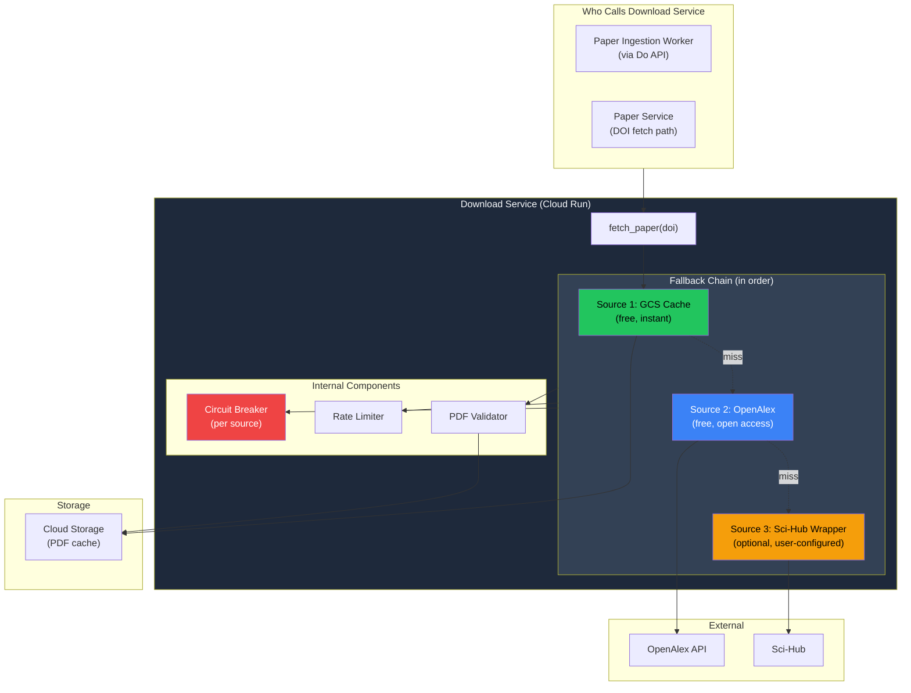
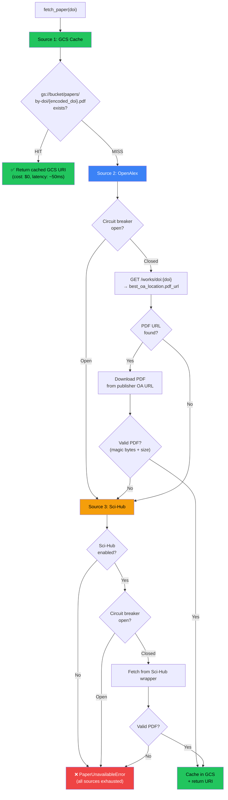
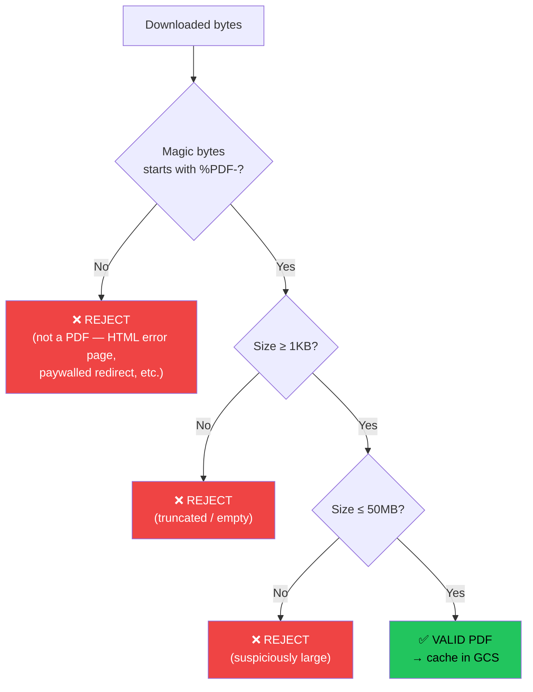
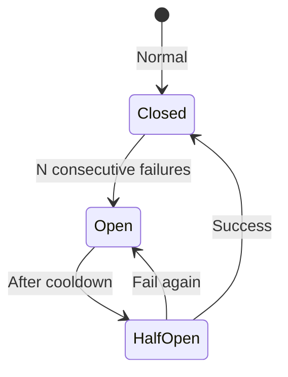
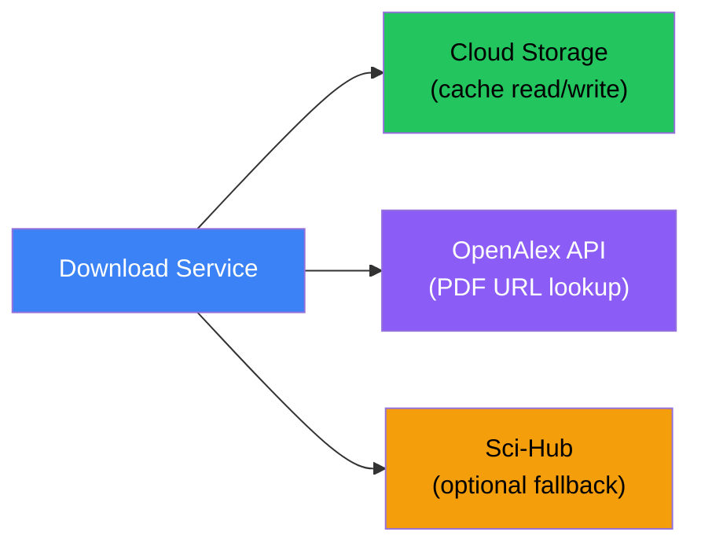

# Download Service — Deep Dive

> **One-liner**: Multi-source PDF resolver that fetches research papers via a cascading fallback chain (GCS cache → OpenAlex → Sci-Hub), ensuring maximum paper availability while minimizing redundant downloads.

---

## 1. Architecture Overview



---

## 2. What Exists vs What Changed

| Aspect | What Exists (Built at Infocusp) | Reimagined (v2) |
|--------|-------------------------------|-----------------|
| **GCS cache** | ✅ Cache check before external calls | Same — DOI-keyed cache in GCS |
| **OpenAlex** | ✅ Fetch open access PDF URL | Same — with circuit breaker added |
| **Sci-Hub** | ✅ Wrapper (optional, user-configured) | Same — behind feature flag |
| **Validation** | Basic (check Content-Type) | Full: magic bytes, file size, corruption check |
| **Circuit breaker** | None | Per-source circuit breaker (5 failures → 60s cooldown) |
| **Rate limiting** | Basic | AsyncLimiter per source to respect upstream limits |
| **Retry logic** | Simple retry | Exponential backoff with jitter per source |
| **Metrics** | None | Download latency, cache hit rate, source success rates |

---

## 3. The Fallback Chain — Detailed Flow



### Why This Order?

| Source | Cost | Latency | Reliability | Why This Position |
|--------|------|---------|-------------|-------------------|
| **GCS Cache** | $0.0004/read | ~50ms | 99.99% | Always check first — instant, free, most reliable |
| **OpenAlex** | Free | ~500ms-2s | ~95% | Legal, open access. But only ~40% of papers have OA PDFs |
| **Sci-Hub** | Free | ~2-5s | ~80% | Highest coverage (~85% of papers) but legally gray. Optional, last resort |

---

## 4. Implementation

```python
class DownloadService:
    """Multi-source PDF resolver with cascading fallback."""

    def __init__(self, config: DownloadConfig):
        self.gcs = GCSClient(config.bucket)
        self.openalex = OpenAlexClient(config.email)
        self.scihub = SciHubWrapper() if config.scihub_enabled else None

        # Per-source circuit breakers
        self.cb_openalex = CircuitBreaker(failure_threshold=5, reset_timeout=60)
        self.cb_scihub = CircuitBreaker(failure_threshold=3, reset_timeout=120)

        # Rate limiters
        self.rl_openalex = AsyncLimiter(max_rate=80, time_period=1)
        self.rl_scihub = AsyncLimiter(max_rate=5, time_period=1)

    async def fetch_paper(self, doi: str) -> str:
        """
        Fetch PDF for a DOI. Returns GCS URI.
        Tries sources in order: GCS cache → OpenAlex → Sci-Hub.
        Raises PaperUnavailableError if all sources fail.
        """
        encoded_doi = url_encode(doi)
        cache_key = f"papers/by-doi/{encoded_doi}.pdf"

        # ── Source 1: GCS Cache ──
        if await self.gcs.exists(cache_key):
            metrics.cache_hits.inc()
            return f"gs://{self.gcs.bucket}/{cache_key}"

        metrics.cache_misses.inc()

        # ── Source 2: OpenAlex (open access) ──
        pdf_bytes = await self._try_openalex(doi)
        if pdf_bytes:
            return await self._cache_and_return(cache_key, pdf_bytes)

        # ── Source 3: Sci-Hub (optional) ──
        if self.scihub:
            pdf_bytes = await self._try_scihub(doi)
            if pdf_bytes:
                return await self._cache_and_return(cache_key, pdf_bytes)

        raise PaperUnavailableError(
            f"Could not fetch PDF for DOI {doi}. "
            f"Sources tried: GCS cache, OpenAlex"
            f"{', Sci-Hub' if self.scihub else ''}"
        )

    async def _try_openalex(self, doi: str) -> bytes | None:
        """Attempt to fetch open access PDF via OpenAlex."""
        try:
            async with self.rl_openalex:
                result = await self.cb_openalex.call(
                    self._fetch_openalex_pdf, doi
                )
                return result
        except (CircuitOpenError, DownloadError, asyncio.TimeoutError):
            return None

    async def _fetch_openalex_pdf(self, doi: str) -> bytes | None:
        work = await self.openalex.get_work_by_doi(doi)
        if not work:
            return None

        # Find best open access PDF URL
        pdf_url = self._extract_pdf_url(work)
        if not pdf_url:
            return None

        # Download the actual PDF
        pdf_bytes = await self._download_with_retry(
            pdf_url, max_retries=3, timeout=30
        )

        # Validate it's actually a PDF
        if not self._validate_pdf(pdf_bytes):
            raise DownloadError(f"Invalid PDF from {pdf_url}")

        metrics.openalex_downloads.inc()
        return pdf_bytes

    async def _try_scihub(self, doi: str) -> bytes | None:
        """Attempt to fetch PDF via Sci-Hub wrapper."""
        try:
            async with self.rl_scihub:
                result = await self.cb_scihub.call(
                    self.scihub.fetch, doi
                )
                if result and self._validate_pdf(result):
                    metrics.scihub_downloads.inc()
                    return result
                return None
        except (CircuitOpenError, DownloadError, asyncio.TimeoutError):
            return None

    def _extract_pdf_url(self, work: dict) -> str | None:
        """Extract best PDF URL from OpenAlex work object."""
        # Priority: primary_location > best_oa_location > locations
        for location_key in ["primary_location", "best_oa_location"]:
            location = work.get(location_key, {})
            if location and location.get("pdf_url"):
                return location["pdf_url"]

        # Check all locations
        for loc in work.get("locations", []):
            if loc.get("pdf_url") and loc.get("is_oa"):
                return loc["pdf_url"]

        return None

    def _validate_pdf(self, data: bytes) -> bool:
        """Validate PDF: magic bytes + size checks."""
        if not data or len(data) < 1024:
            return False  # too small to be a real PDF
        if len(data) > 50 * 1024 * 1024:
            return False  # > 50MB, suspicious
        if not data[:5] == b'%PDF-':
            return False  # not a PDF (magic bytes)
        return True

    async def _download_with_retry(
        self, url: str, max_retries: int = 3, timeout: int = 30
    ) -> bytes:
        """Download URL with exponential backoff + jitter."""
        for attempt in range(max_retries):
            try:
                async with aiohttp.ClientSession() as session:
                    async with session.get(
                        url, timeout=aiohttp.ClientTimeout(total=timeout)
                    ) as resp:
                        if resp.status == 200:
                            return await resp.read()
                        if resp.status == 429:
                            retry_after = int(
                                resp.headers.get("Retry-After", 5)
                            )
                            await asyncio.sleep(retry_after)
                            continue
                        resp.raise_for_status()
            except (aiohttp.ClientError, asyncio.TimeoutError):
                if attempt == max_retries - 1:
                    raise DownloadError(f"Failed after {max_retries} attempts")
                wait = (2 ** attempt) + random.uniform(0, 1)  # exp backoff + jitter
                await asyncio.sleep(wait)

    async def _cache_and_return(self, cache_key: str, pdf_bytes: bytes) -> str:
        """Store PDF in GCS cache and return URI."""
        await self.gcs.upload(cache_key, pdf_bytes, content_type="application/pdf")
        return f"gs://{self.gcs.bucket}/{cache_key}"
```

---

## 5. GCS Cache Design

### 5.1 Cache Layout

```
gs://paper-extraction-prod/
└── papers/
    ├── {paper_id}/
    │   └── original.pdf           ← Canonical storage (by paper ID)
    │
    └── by-doi/
        ├── 10.1016%2Fj.biortech.2020.123456.pdf   ← DOI-keyed cache
        ├── 10.1021%2Facs.est.9b04321.pdf
        └── ...
```

### 5.2 Two Storage Paths

| Path | Key | Used By | Purpose |
|------|-----|---------|---------|
| `papers/{paper_id}/original.pdf` | Paper UUID | Paper Service, Data Agent | Canonical paper storage. Survives DOI changes |
| `papers/by-doi/{encoded_doi}.pdf` | URL-encoded DOI | Download Service cache | Fast cache lookup by DOI. Avoids re-downloading |

> [!NOTE]
> When a paper is downloaded, it's stored in **both** locations:
> - `by-doi/` for cache hits on future DOI lookups
> - `{paper_id}/` for the Data Agent to reference
>
> The `by-doi/` copy can be cleaned up by GCS lifecycle rules (e.g., delete after 90 days) since the canonical copy exists under `{paper_id}/`.

### 5.3 Cache Hit Rates

| Scenario | Expected Hit Rate | Why |
|----------|-------------------|-----|
| **First user uploads paper** | 0% | Never seen before |
| **Second user fetches same DOI** | ~100% | DOI-keyed cache |
| **Citation traversal re-encounters paper** | ~100% | Already downloaded during earlier traversal |
| **Across different jobs, same research area** | ~30-50% | Related papers often share citations |

---

## 6. PDF Validation — Why It Matters

Without validation, the system can ingest corrupted or fake PDFs, wasting Gemini API calls and producing garbage extractions.



### Common Invalid Responses

| What You Get | Why | Magic Bytes Check |
|-------------|-----|-------------------|
| HTML page ("Access Denied") | Publisher paywall redirect | `<html` not `%PDF-` → caught |
| Empty response | Server error, rate limit | Size < 1KB → caught |
| Truncated PDF | Network timeout mid-download | May pass magic bytes but Data Agent will fail (handled upstream) |
| CAPTCHA page | Sci-Hub anti-bot | `<html` not `%PDF-` → caught |

---

## 7. Circuit Breaker — Per Source

Each external source has its own circuit breaker to prevent hammering a failing service:



| Source | Failure Threshold | Cooldown | Rationale |
|--------|------------------|----------|-----------|
| **OpenAlex** | 5 failures | 60s | Generally reliable, short cooldown |
| **Sci-Hub** | 3 failures | 120s | Less reliable, longer cooldown to avoid bans |

When a circuit is **open**, the source is skipped immediately (no network call) and the next source in the chain is tried.

---

## 8. Rate Limiting

| Source | Limit | Why |
|--------|-------|-----|
| **OpenAlex** | 80 req/s | Polite pool allows 100 req/s. We use 80 to stay safe |
| **Sci-Hub** | 5 req/s | Aggressive rate limiting to avoid IP bans |
| **GCS** | Unlimited | GCS handles thousands of req/s natively |

```python
# Using aiolimiter for async rate limiting
from aiolimiter import AsyncLimiter

openalex_limiter = AsyncLimiter(max_rate=80, time_period=1)

async def rate_limited_call():
    async with openalex_limiter:
        # This blocks if we've exceeded 80 calls in the last second
        return await openalex.get_work(...)
```

---

## 9. Dependencies



> [!IMPORTANT]
> The Download Service does **NOT** talk to PostgreSQL. It only deals with fetching PDFs and caching them in GCS. The Paper Ingestion Worker is the one that updates DB status after calling the Download Service.

---

## 10. Failure Modes & Recovery

| Failure | Impact | Recovery |
|---------|--------|----------|
| **OpenAlex: DOI not found** | No OA PDF URL | Skip to Sci-Hub (or fail if disabled) |
| **OpenAlex: PDF URL returns 403/paywall** | Got URL but can't download | Validate response → not a PDF → skip to Sci-Hub |
| **OpenAlex: rate limited (429)** | Temporary block | Respect `Retry-After` header, exponential backoff |
| **OpenAlex: circuit open** | Source disabled for 60s | Skip directly to Sci-Hub |
| **Sci-Hub: CAPTCHA / blocked** | Can't fetch | Circuit breaker opens after 3 failures. Return `PaperUnavailableError` |
| **GCS: upload fails** | PDF fetched but not cached | Retry 3× → raise error → worker will retry entire flow |
| **Network timeout** | Mid-download failure | Exponential backoff + jitter, 3 retries per source |
| **Corrupted PDF** | Invalid bytes | PDF validation catches it → treated as source failure → try next |
| **All sources fail** | No PDF at all | `PaperUnavailableError` → worker marks paper `unavailable` |

---

## 11. Key Design Decisions

| Decision | Chosen | Alternative | Why |
|----------|--------|-------------|-----|
| **Cache-first** | Always check GCS before external calls | Always fetch fresh | Papers don't change. Cache hit = $0 cost + ~50ms latency |
| **DOI-keyed cache** | `by-doi/{encoded_doi}.pdf` | Paper-ID-keyed only | Download Service doesn't know paper IDs — it only receives DOIs. DOI is the natural cache key |
| **Separate circuit breakers** | One per source | Single shared breaker | OpenAlex down shouldn't disable Sci-Hub and vice versa |
| **PDF magic byte validation** | Check `%PDF-` header | Trust Content-Type header | Publishers often return HTML error pages with `200 OK`. Can't trust status codes |
| **Sci-Hub behind feature flag** | `config.scihub_enabled` | Always available | Legal gray area. Client (Google) may want it disabled. Must be opt-in |
| **No DB access** | Download Service is stateless | Track download history in DB | Keeps the service simple. State tracking is the caller's (Ingestion Worker's) job |
| **Exponential backoff + jitter** | `(2^attempt) + random(0,1)` | Fixed retry delay | Prevents thundering herd when many workers retry simultaneously |
