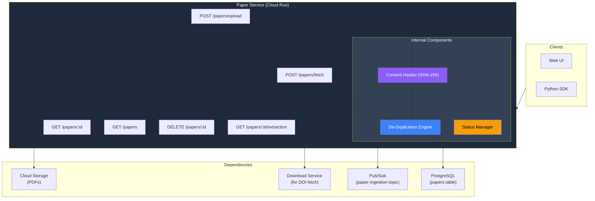
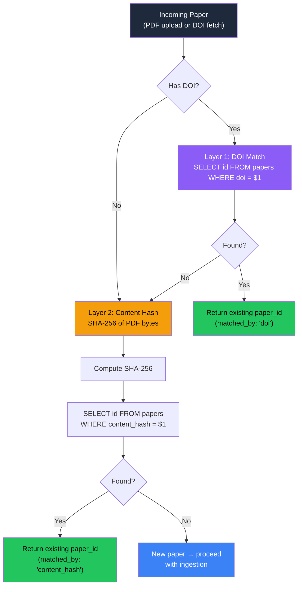
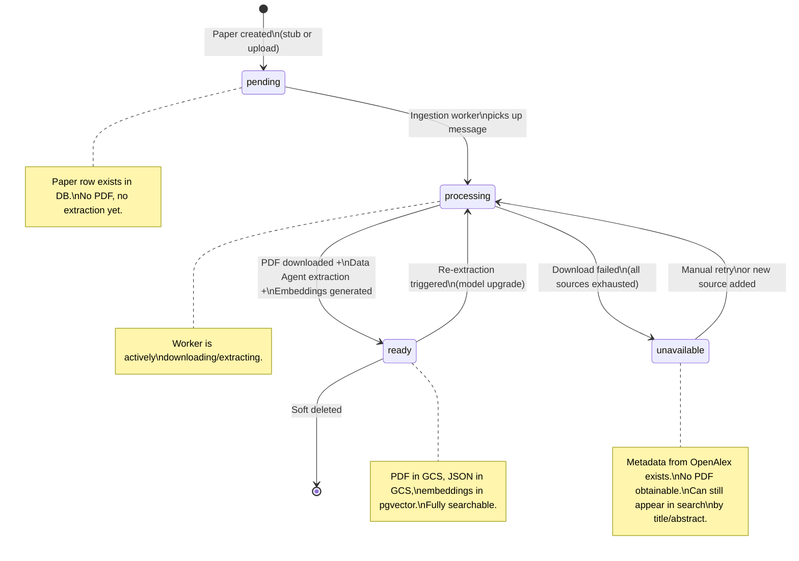
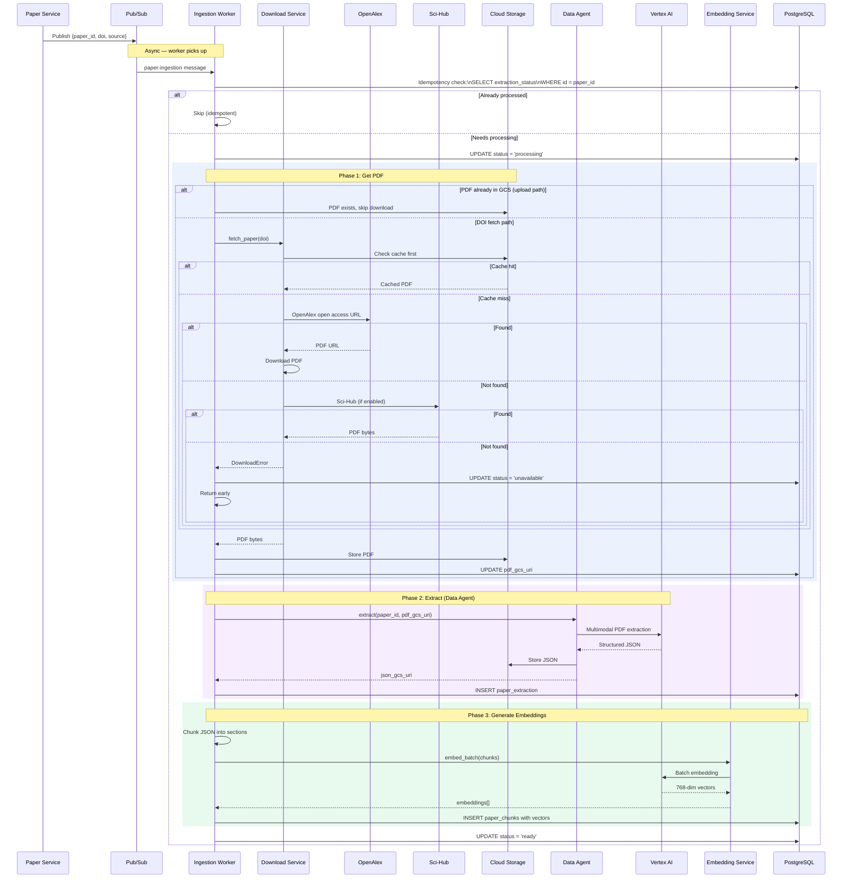
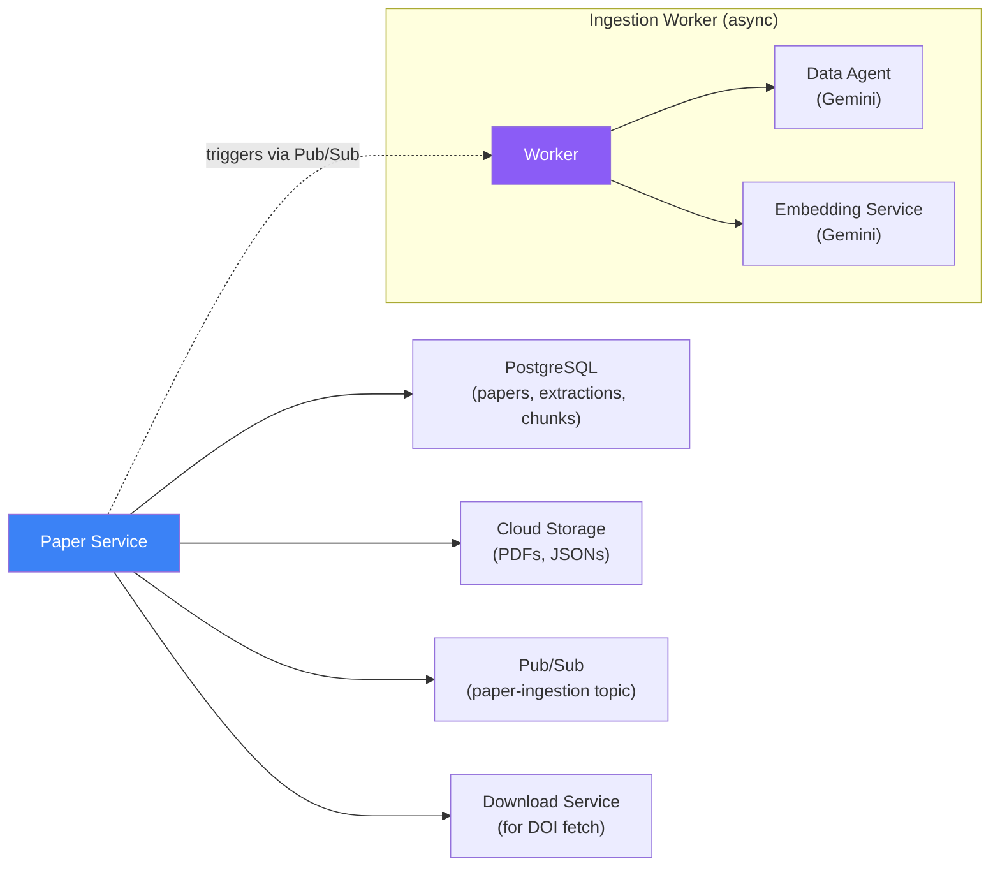

# Paper Service — Deep Dive

> **One-liner**: The entry point for all papers into the system. Handles upload, DOI-based fetch, de-duplication, and orchestrates the async ingestion pipeline.

---

## 1. Architecture Overview



---

## 2. What Exists vs What Changed

| Aspect | What Exists (Built at Infocusp) | Reimagined (v2) |
|--------|-------------------------------|-----------------|
| **Upload** | PDF upload → GCS → trigger Data Agent | Same, but with content hash de-dup layer added |
| **DOI fetch** | DOI → Download Service → GCS | Same, but with GCS cache check first (avoid re-download) |
| **De-duplication** | DOI match only | Two layers: DOI match (instant) + SHA-256 content hash (catches papers without DOIs) |
| **Status tracking** | Basic (pending/done) | Full state machine: `pending → processing → ready → unavailable` |
| **Extraction versioning** | Single extraction per paper | Versioned: v1, v2... with `is_latest` flag for model upgrades |
| **Storage** | GCS for PDFs and JSONs | Same — GCS for blobs, PostgreSQL for metadata + URIs |
| **Error handling** | Basic try/catch | Circuit breaker on Download Service, idempotent ingestion workers |

---

## 3. API Contract

### 3.1 Upload Paper (PDF)

```
POST /api/papers/upload
Content-Type: multipart/form-data

Body:
  file: <PDF binary>
  metadata (optional): {
    "doi": "10.1016/j.biortech.2020.123456",
    "title": "Biochar production from rice husk"
  }

Response (new paper):
  202 Accepted
  {
    "paper_id": "abc-123",
    "status": "processing",
    "message": "Paper accepted. Extraction in progress."
  }

Response (duplicate detected):
  200 OK
  {
    "paper_id": "existing-456",
    "status": "ready",
    "duplicate": true,
    "matched_by": "content_hash"  // or "doi"
  }

Errors:
  400 — Invalid file (not a PDF, corrupted)
  413 — File too large (>50MB)
  500 — GCS upload failed
```

### 3.2 Fetch Paper by DOI

```
POST /api/papers/fetch
Content-Type: application/json

Body:
  {
    "doi": "10.1016/j.biortech.2020.123456"
  }

Response (new paper):
  202 Accepted
  {
    "paper_id": "abc-123",
    "status": "processing",
    "message": "Download initiated. Extraction will follow."
  }

Response (already exists):
  200 OK
  {
    "paper_id": "existing-456",
    "status": "ready",
    "duplicate": true,
    "matched_by": "doi"
  }

Errors:
  404 — DOI not found in any source (OpenAlex, Sci-Hub)
  502 — All download sources failed
```

### 3.3 Get Paper

```
GET /api/papers/:id

Response:
  200 OK
  {
    "id": "abc-123",
    "doi": "10.1016/...",
    "title": "Biochar production...",
    "authors": [{"name": "Zhang, L.", "affiliation": "..."}],
    "abstract": "...",
    "publication_date": "2020-06-15",
    "journal": "Bioresource Technology",
    "source": "upload",
    "extraction_status": "ready",
    "has_pdf": true,
    "has_extraction": true,
    "extraction_version": 2,
    "created_at": "..."
  }
```

### 3.4 Get Latest Extraction

```
GET /api/papers/:id/extraction

Response:
  200 OK
  {
    "paper_id": "abc-123",
    "version": 2,
    "model_used": "gemini-2.0-flash",
    "download_url": "https://storage.googleapis.com/...?X-Goog-Signature=...",
    "expires_in": 3600,
    "summary": {
      "section_count": 8,
      "table_count": 3,
      "figure_count": 5,
      "reference_count": 42
    }
  }
```

> [!NOTE]
> The actual JSON extraction (50-500KB) is served via a **GCS signed URL** — not embedded in the API response. This keeps the API response lightweight and lets the client download the JSON directly from GCS at CDN speeds.

### 3.5 List Papers (Paginated)

```
GET /api/papers?page=1&per_page=20&status=ready&sort=created_at:desc

Response:
  200 OK
  {
    "papers": [...],
    "pagination": {
      "page": 1,
      "per_page": 20,
      "total": 142,
      "total_pages": 8
    }
  }
```

### 3.6 Delete Paper

```
DELETE /api/papers/:id

Response:
  204 No Content

Note: Soft delete — sets is_deleted = true.
GCS objects cleaned up via lifecycle policy after 30 days.
```

---

## 4. De-Duplication Engine — The Two-Layer System

This is the most important internal component. Without it, users upload the same paper repeatedly, wasting Gemini API calls ($0.10/paper).

### 4.1 Flow



### 4.2 Why Two Layers?

| Layer | Speed | Catches | Misses |
|-------|-------|---------|--------|
| **DOI match** | O(1) — indexed lookup | Same paper fetched by different users, same paper from different sources | Papers without DOIs (preprints, user uploads) |
| **Content hash** (SHA-256) | O(1) — indexed lookup after hash computation | Papers without DOIs, papers with different DOIs for same content, same PDF uploaded by two users | Different PDF renderings of same paper (e.g., author copy vs publisher copy) |

> [!IMPORTANT]
> **Layer 1 is instant** (just a DB lookup). **Layer 2 requires reading the entire PDF** to compute the hash — still fast (milliseconds for a typical 2MB PDF), but we only do it if Layer 1 misses.

### 4.3 Race Condition Handling

Two users upload the same paper at the same time:

```sql
-- Uses ON CONFLICT to handle races
INSERT INTO papers (doi, title, content_hash, ...)
VALUES ($1, $2, $3, ...)
ON CONFLICT (doi) DO NOTHING
RETURNING id;

-- If RETURNING is empty → another request won the race
-- → SELECT the existing paper_id and return it
```

---

## 5. Paper Status — State Machine



### Status Transitions (Who Triggers What)

| From | To | Triggered By | SQL |
|------|----|-------------|-----|
| `—` | `pending` | Paper Service (on upload/fetch) | `INSERT INTO papers (..., extraction_status='pending')` |
| `pending` | `processing` | Ingestion Worker (on Pub/Sub message) | `UPDATE papers SET extraction_status='processing' WHERE id=$1` |
| `processing` | `ready` | Ingestion Worker (after successful extraction) | `UPDATE papers SET extraction_status='ready' WHERE id=$1` |
| `processing` | `unavailable` | Ingestion Worker (download failed) | `UPDATE papers SET extraction_status='unavailable' WHERE id=$1` |
| `ready` | `processing` | Re-extraction API call | `UPDATE papers SET extraction_status='processing' WHERE id=$1` |

---

## 6. Ingestion Pipeline (Async Worker)

The Paper Service itself is a **thin HTTP handler**. The heavy lifting happens in the **Paper Ingestion Worker** — a Cloud Run Job triggered via Pub/Sub.



### Worker Implementation

```python
async def paper_ingestion_worker(message):
    """
    Pub/Sub push handler. Idempotent — safe to retry.
    Phases: Download PDF → Data Agent → Embeddings → Mark Ready
    """
    payload = json.loads(message.data)
    paper_id = payload["paper_id"]
    doi = payload.get("doi")
    source = payload["source"]  # 'upload' or 'doi_fetch'

    # ── Idempotency check ──
    paper = await db.fetchrow(
        "SELECT extraction_status, pdf_gcs_uri FROM papers WHERE id = $1",
        paper_id
    )
    if paper["extraction_status"] in ("ready", "processing"):
        message.ack()
        return  # already handled or being handled

    await db.execute(
        "UPDATE papers SET extraction_status = 'processing' WHERE id = $1",
        paper_id
    )

    # ── Phase 1: Get PDF ──
    pdf_gcs_uri = paper["pdf_gcs_uri"]
    if not pdf_gcs_uri:
        try:
            pdf_gcs_uri = await download_service.fetch(doi)
            await db.execute(
                "UPDATE papers SET pdf_gcs_uri = $1 WHERE id = $2",
                pdf_gcs_uri, paper_id
            )
        except DownloadError:
            await db.execute(
                "UPDATE papers SET extraction_status = 'unavailable' WHERE id = $1",
                paper_id
            )
            message.ack()
            return

    # ── Phase 2: Data Agent Extraction ──
    json_gcs_uri = await data_agent.extract(paper_id, pdf_gcs_uri)
    await db.execute("""
        UPDATE paper_extractions SET is_latest = FALSE
        WHERE paper_id = $1 AND is_latest = TRUE
    """, paper_id)
    await db.execute("""
        INSERT INTO paper_extractions (paper_id, version, json_gcs_uri, model_used, is_latest)
        VALUES ($1, (SELECT COALESCE(MAX(version),0)+1 FROM paper_extractions WHERE paper_id=$1),
                $2, $3, TRUE)
    """, paper_id, json_gcs_uri, "gemini-2.0-flash")

    # ── Phase 3: Embeddings ──
    paper_json = await gcs.download_json(json_gcs_uri)
    chunks = chunk_paper_json(paper_json)  # split into ~500-token sections
    embeddings = await embedding_service.embed_batch([c.text for c in chunks])
    await store_chunks_with_embeddings(paper_id, chunks, embeddings)

    # ── Done ──
    await db.execute(
        "UPDATE papers SET extraction_status = 'ready' WHERE id = $1",
        paper_id
    )
    message.ack()
```

---

## 7. GCS Bucket Layout

```
gs://paper-extraction-prod/
├── papers/
│   ├── {paper_id}/
│   │   └── original.pdf              ← Raw uploaded/downloaded PDF
│   └── by-doi/
│       └── {url_encoded_doi}.pdf      ← DOI-keyed cache (for Download Service)
│
├── extractions/
│   └── {paper_id}/
│       ├── v1.json                    ← Data Agent output v1
│       └── v2.json                    ← Re-extraction with newer model
│
└── jobs/
    └── {job_id}/
        └── result.json                ← Aggregated multi-paper result
```

---

## 8. Database Tables Owned

The Paper Service **owns** (reads + writes):

```sql
-- Primary table
papers (id, doi, title, authors, abstract, publication_date, journal,
        source, pdf_gcs_uri, content_hash, extraction_status, ...)

-- Written by Ingestion Worker
paper_extractions (id, paper_id, version, json_gcs_uri, model_used,
                   is_latest, ...)

-- Written by Ingestion Worker
paper_chunks (id, paper_id, chunk_index, chunk_text, section, embedding)
```

**Other services read but don't write** to these tables.

---

## 9. Dependencies



---

## 10. Failure Modes & Recovery

| Failure | Impact | Detection | Recovery |
|---------|--------|-----------|----------|
| **GCS upload fails** | PDF not stored | Worker catches exception | Retry 3× → nack message → Pub/Sub redelivers |
| **Download Service: all sources fail** | No PDF obtainable | `DownloadError` raised | Mark paper `unavailable`. User notified. Can retry later if new source added |
| **Data Agent (Gemini) timeout** | No JSON extraction | Worker timeout after 5 min | Retry with exponential backoff (3 attempts). If all fail → nack → DLQ |
| **Embedding Service fails** | No vector chunks | Worker catches exception | Paper still marked `ready` but without embeddings → not searchable. Background job can backfill later |
| **PostgreSQL connection fail** | Can't update status | Connection pool error | Cloud SQL Proxy auto-reconnects. Worker retries. If persistent → circuit breaker → nack |
| **Pub/Sub duplicate message** | Worker runs twice for same paper | Idempotency check at start | `SELECT extraction_status` → skip if already `processing` or `ready` |
| **Worker OOM crash** | Mid-processing crash | Pub/Sub ack timeout | Message redelivered. Idempotent worker picks up safely |
| **Two users upload same paper simultaneously** | Race condition on INSERT | `ON CONFLICT DO NOTHING` | Second request gets existing paper_id |

---

## 11. Key Design Decisions

| Decision | What We Chose | Alternative | Why |
|----------|--------------|-------------|-----|
| **Two-layer de-dup** | DOI + SHA-256 hash | DOI only | Many papers lack DOIs (preprints, user uploads). Content hash catches these |
| **Async ingestion** | Pub/Sub → Worker | Synchronous in API handler | Extraction takes 30s-5min. Can't block the HTTP response |
| **Soft delete** | `is_deleted` flag | Hard delete | GCS objects need lifecycle cleanup. Allows undo within 30 days |
| **Signed URLs for extraction JSON** | GCS signed URL in response | Embed JSON in API response | JSONs are 50-500KB. Signed URL serves from CDN, keeps API response small |
| **Extraction versioning** | Version column + `is_latest` flag | Overwrite old extraction | Models improve — need history for comparison and rollback |
| **Status as column** | `extraction_status` on papers table | Separate status table | One fewer join. Status is always read with the paper |
| **Content hash on full PDF** | SHA-256 of entire file | Hash of first N bytes | Slight speed cost but guarantees uniqueness. Prevents collisions from shared headers |
