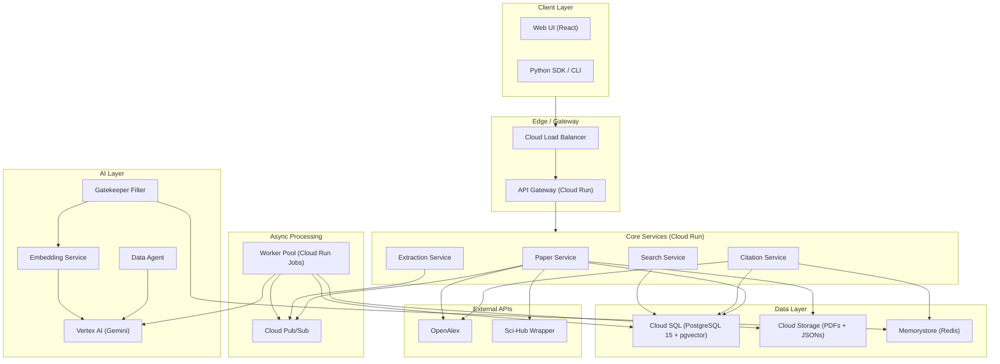
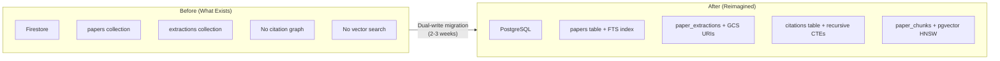
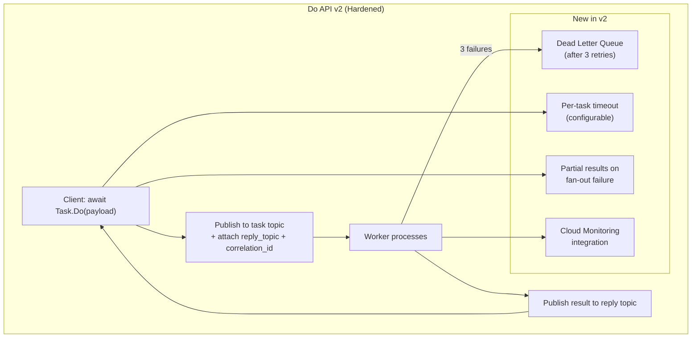
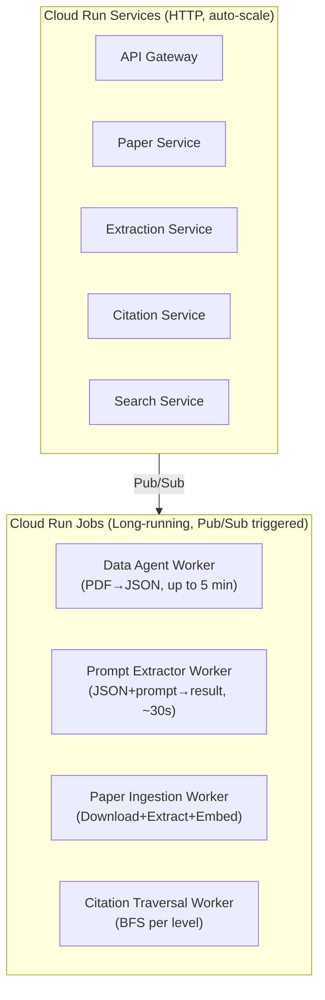
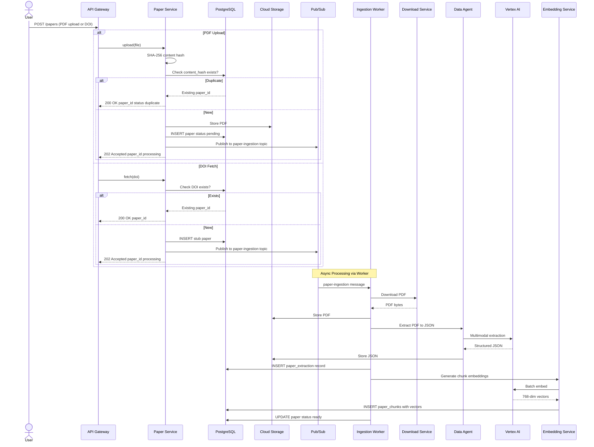
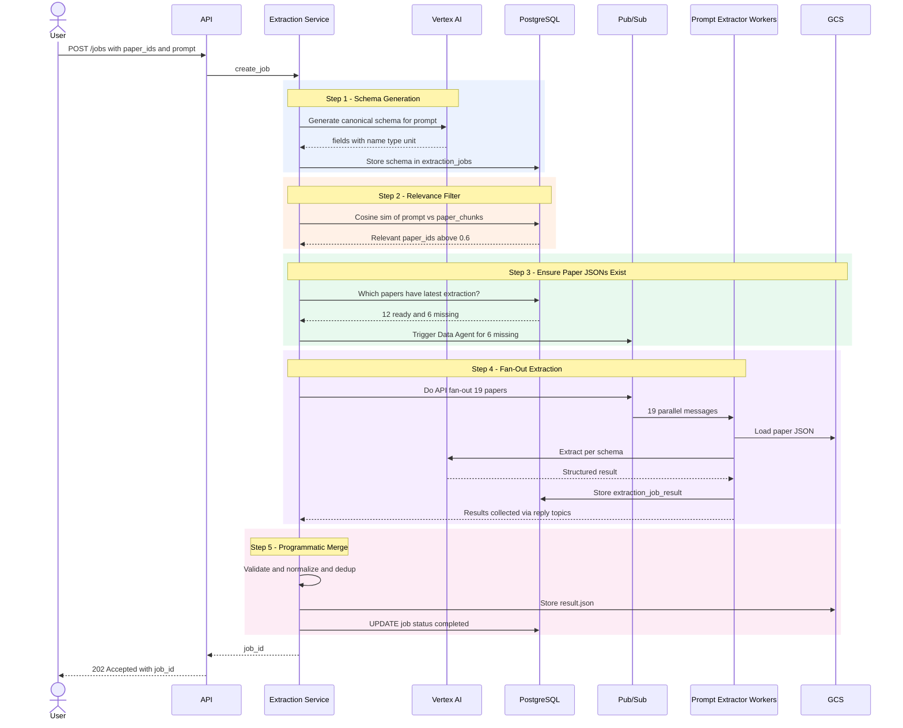
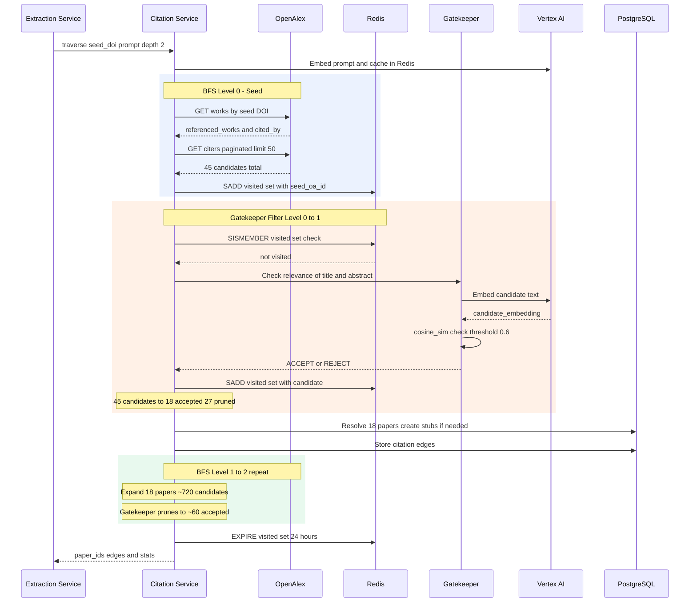

# Paper Extraction System — Reimagined on GCP (Part 1)

> A ground-up redesign of the Research Paper Data Extraction Engine, with detailed tradeoff analysis for every major architectural decision.

---

## 1. High-Level Architecture



### Core Principle: **Services are Thin Orchestrators, Workers Do Heavy Lifting**

Every Cloud Run service is a lightweight HTTP handler that validates, orchestrates, and delegates. All expensive work (LLM calls, PDF processing, embedding) happens in async workers via Pub/Sub.

---

## 2. Tradeoff Discussions

### 2.1 Database: PostgreSQL (Cloud SQL) vs Alternatives

#### Candidates Evaluated

| | **Cloud SQL (PG 15 + pgvector)** | **Firestore** | **AlloyDB** | **Cloud Spanner** |
|---|---|---|---|---|
| **Model** | Relational | Document (NoSQL) | PostgreSQL-compatible | Globally distributed relational |
| **Joins** | ✅ Native SQL joins | ❌ No joins — denormalize or fan-out reads | ✅ Full SQL | ✅ Full SQL |
| **Vector search** | ✅ pgvector (HNSW/IVFFlat) | ❌ None — need separate service | ✅ pgvector compatible | ❌ No native vector |
| **Citation graph queries** | ✅ Recursive CTEs | ❌ Extremely painful | ✅ Recursive CTEs | ✅ But expensive |
| **Schema flexibility** | Rigid schema + JSONB for flexible parts | ✅ Schemaless | Same as PG | Rigid |
| **Scaling** | Vertical (read replicas for reads) | ✅ Auto-scales horizontally | Auto-scales reads | ✅ Horizontal + global |
| **Cost (small-medium)** | **~$70/mo** | ~$30/mo | ~$200/mo | ~$500/mo minimum |
| **Operational burden** | Medium (backups, connections) | Low (managed) | Low-Medium | Low |

#### Why We Chose PostgreSQL (Cloud SQL)

```
The system has THREE data patterns that drive this decision:

1. RELATIONAL — Papers → Extractions → Jobs → Results
   → Need JOINs, foreign keys, transactions
   → Firestore: painful (fan-out reads, no joins)
   → PostgreSQL: natural fit

2. GRAPH — Citation network (paper A cites B cites C)
   → Need recursive CTEs for N-hop traversal
   → Firestore: impossible without external graph DB
   → PostgreSQL: WITH RECURSIVE works perfectly

3. VECTOR — Semantic search over paper chunks
   → Need cosine similarity on 768-dim embeddings
   → Firestore: need separate Vertex AI Vector Search ($200+/mo)
   → PostgreSQL: pgvector handles this in-DB
```

> [!IMPORTANT]
> **PostgreSQL handles all three patterns in ONE database.** This avoids the operational complexity of running Firestore + a graph DB + a vector DB separately.

#### Why NOT AlloyDB or Spanner?

- **AlloyDB**: Better performance than Cloud SQL, but **3x the cost** (~$200/mo). Our scale (< 100K papers) doesn't justify it. If we hit performance walls with Cloud SQL, AlloyDB is a drop-in upgrade path.
- **Spanner**: Global distribution is irrelevant (single-region app). Minimum ~$500/mo. Massive overkill.

#### The Firestore Migration Story



---

### 2.2 Async Framework: Do API (Custom) vs Cloud Tasks vs Eventarc

This is the most consequential architecture decision. The existing system uses a **custom Do API** built on Pub/Sub with reply topics. Let's evaluate whether to keep it.

#### What the Do API Does Today

```
Client code:
  result = await Task('DataAgent_Worker').Do(payload)

Under the hood:
  1. Client creates ephemeral reply topic
  2. Publishes payload to worker's task topic
  3. Worker processes, publishes result to reply topic
  4. Client receives result
  5. Reply topic cleaned up
```

This gives **synchronous await semantics over an async Pub/Sub backbone**.

#### Candidates

| | **Do API (Custom Pub/Sub)** | **Cloud Tasks** | **Eventarc + Workflows** | **Pub/Sub (raw, no reply)** |
|---|---|---|---|---|
| **Request-Reply** | ✅ Built-in (reply topics) | ❌ Fire-and-forget only | ⚠️ Via Workflows state | ❌ Fire-and-forget |
| **Fan-Out + Collect** | ✅ `Task.Do([p1,p2,...])` | ❌ No result aggregation | ⚠️ Complex workflow DSL | ❌ Manual aggregation |
| **Back-pressure** | ⚠️ Manual | ✅ Rate limiting built-in | ✅ Managed | ❌ Manual |
| **Dead Letter Queue** | ⚠️ Manual setup | ✅ Built-in | ✅ Built-in | ✅ Pub/Sub DLQ |
| **Observability** | ⚠️ Custom logging | ✅ Cloud Console | ✅ Cloud Console | ⚠️ Custom |
| **Vendor lock-in** | Low (Pub/Sub is standard) | High (GCP-specific) | High | Low |
| **Complexity** | High (you maintain it) | Low | Medium | Low |
| **Cost** | Pub/Sub pricing only | Pub/Sub + Tasks pricing | Higher (Workflows billing) | Pub/Sub only |

#### Decision: Keep Do API, But Harden It



> [!TIP]
> **Why not switch to Cloud Tasks?** The killer feature of Do API is **request-reply with fan-out aggregation**. Cloud Tasks is fire-and-forget — you'd need to build a separate results-collection layer (polling DB, callbacks, etc.), which recreates Do API's complexity anyway.

#### What We ADD to Do API v2

| Enhancement | Why |
|---|---|
| **Dead Letter Queue** | Failed messages after 3 retries go to DLQ topic instead of being lost |
| **Per-task timeout** | Workers that hang don't block the entire fan-out |
| **Partial results** | If 3/50 workers fail, return 47 results + 3 errors instead of failing everything |
| **Correlation IDs** | Trace a request from API → Pub/Sub → Worker → Reply across Cloud Logging |
| **Cloud Monitoring metrics** | `do_api_tasks_total`, `do_api_task_duration_seconds`, `do_api_failures_total` |

---

### 2.3 Compute: Cloud Run vs GKE vs Cloud Functions

| | **Cloud Run (services)** | **Cloud Run Jobs** | **GKE Autopilot** | **Cloud Functions** |
|---|---|---|---|---|
| **Use case** | HTTP services | Batch / async workers | Full container orchestration | Single-function triggers |
| **Scale to zero** | ✅ | ✅ | ❌ (min node pool) | ✅ |
| **Max timeout** | 60 min | 24 hours | Unlimited | 9 min (gen2) |
| **Concurrency** | Up to 1000 req/instance | 1 task/instance | Configurable | 1 req/instance |
| **GPU** | ❌ | ❌ | ✅ | ❌ |
| **Cost at low scale** | **Very low** (pay per request) | **Very low** | ~$70+/mo minimum | Very low |
| **Startup time** | ~1-3s cold start | ~5-10s | N/A (always running) | ~1-5s |

#### Decision: Cloud Run Services + Cloud Run Jobs



> [!NOTE]
> **Why not GKE?** Scale-to-zero is critical for cost. At our scale (< 1000 requests/day), GKE's minimum node pool cost exceeds Cloud Run's entire bill. GKE becomes relevant at >10K concurrent extractions.
>
> **Why not Cloud Functions?** The 9-minute timeout is too short for Data Agent extraction (can take 5+ min for large papers). Cloud Run Jobs support 24-hour timeouts.

---

### 2.4 Search: pgvector vs Vertex AI Vector Search vs Elasticsearch

| | **pgvector (in PostgreSQL)** | **Vertex AI Vector Search** | **Elasticsearch** |
|---|---|---|---|
| **Setup** | `CREATE EXTENSION vector;` | Managed index + endpoint | Self-managed or Elastic Cloud |
| **Latency (10K vectors)** | ~5-15ms | ~2-5ms | ~5-10ms |
| **Latency (1M vectors)** | ~50-100ms | ~5-10ms | ~10-20ms |
| **Full-text search** | ✅ Same DB (tsvector) | ❌ Separate service needed | ✅ Native |
| **Hybrid search** | ✅ SQL JOIN of vector + FTS | ❌ Manual fusion | ✅ Native |
| **Operational cost** | **$0 extra** (in existing PG) | ~$200/mo (always-on endpoint) | ~$150/mo |
| **Filter + search** | ✅ SQL WHERE clauses | ⚠️ Pre/post-filtering | ✅ Native |
| **Max scale** | ~5M vectors comfortable | 100M+ | 100M+ |

#### Decision: pgvector

At our scale (< 500K chunks across < 100K papers), pgvector with HNSW indexing handles everything. The killer advantage is **hybrid search in a single SQL query** — join vector similarity with full-text ranking and metadata filters, all in one round-trip.

If we grow past 1M papers, Vertex AI Vector Search is the upgrade path.

---

### 2.5 Cache Layer: Memorystore Redis vs Memcached

| | **Memorystore (Redis)** | **Memorystore (Memcached)** |
|---|---|---|
| **Data structures** | SET, HASH, SORTED SET, LIST | Key-Value only |
| **Persistence** | Optional (RDB/AOF) | None |
| **Use: Cycle detection** | ✅ `SADD citation:visited:{job_id} doi` | ❌ No SET type |
| **Use: Embedding cache** | ✅ `SET embed:{hash} [vector]` | ✅ Same |
| **Use: Rate limiting** | ✅ `INCR` + `EXPIRE` | ❌ No atomic incr+expire |
| **Use: Job progress** | ✅ `HSET job:{id} completed 5` | ❌ No HASH |
| **Cost** | ~$30/mo (1GB basic) | ~$20/mo |

#### Decision: Redis (Memorystore)

The SET data structure for cycle detection and HASH for job progress tracking are essential. Memcached can't do either.

#### Redis Key Design

```
citation:visited:{job_id}     → SET of OpenAlex IDs       TTL: 24h
embed:{text_hash}             → STRING (JSON float array)  TTL: 7d
citation:cache:{doi}          → HASH {refs, citers, ts}    TTL: 24h
ratelimit:openalex:{minute}   → INT (request count)        TTL: 60s
job:progress:{job_id}         → HASH {total, completed, failed}  TTL: 48h
```

---

### 2.6 LLM Integration: Vertex AI vs Direct Gemini API

| | **Vertex AI (Gemini)** | **Direct Gemini API (ai.google.dev)** |
|---|---|---|
| **Auth** | Service account (IAM) | API key |
| **VPC access** | ✅ Private endpoint | ❌ Public internet |
| **Model garden** | ✅ All models + fine-tuning | Limited |
| **Grounding** | ✅ Google Search grounding | ❌ |
| **Batch API** | ✅ (cheaper, async) | ❌ |
| **Pricing** | Same or cheaper (committed use) | Pay-as-you-go |
| **Observability** | ✅ Cloud Monitoring integration | Manual |

#### Decision: Vertex AI

Running on GCP, Vertex AI gives us IAM-based auth (no API key management), VPC-native access, and the **Batch Prediction API** for high-volume extractions at reduced cost.

---

## 3. Data Flow Architecture

### 3.1 Paper Ingestion Flow



### 3.2 Multi-Paper Extraction Flow (Schema-First)



### 3.3 Citation Discovery Flow



---

> [!NOTE]
> **Part 2** will cover: detailed component designs, full PostgreSQL schema, failure handling & circuit breakers, observability stack, security (IAM + VPC), and cost analysis.

**Ready for Part 2? Or want to discuss any of these tradeoffs first?**
