# Paper Extraction System — Reimagined on GCP (Part 2)

> Component designs, PostgreSQL schema, failure handling, observability, security, and cost analysis.

---

## 4. PostgreSQL Schema (Complete)

### 4.1 Entity Relationship Diagram

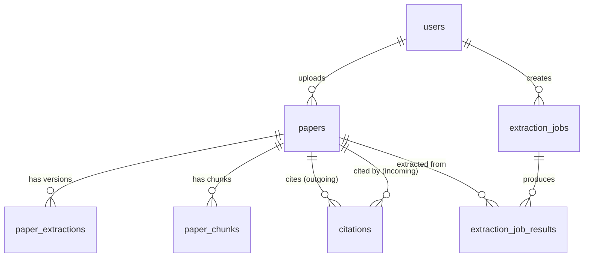

### 4.2 Tables

```sql
-- ═══════════════════════════════════════
-- USERS & AUTH
-- ═══════════════════════════════════════
CREATE TABLE users (
    id              UUID PRIMARY KEY DEFAULT gen_random_uuid(),
    email           TEXT UNIQUE NOT NULL,
    display_name    TEXT,
    auth_provider   TEXT NOT NULL,       -- 'google' | 'orcid' | 'email'
    auth_provider_id TEXT,
    created_at      TIMESTAMPTZ DEFAULT now(),
    updated_at      TIMESTAMPTZ DEFAULT now()
);

-- ═══════════════════════════════════════
-- PAPERS (core entity)
-- ═══════════════════════════════════════
CREATE TABLE papers (
    id              UUID PRIMARY KEY DEFAULT gen_random_uuid(),
    doi             TEXT UNIQUE,
    title           TEXT NOT NULL,
    authors         JSONB,               -- [{name, affiliation, orcid}]
    abstract        TEXT,
    publication_date DATE,
    journal         TEXT,
    source          TEXT NOT NULL,        -- 'upload' | 'openalex' | 'scihub'
    pdf_gcs_uri     TEXT,                -- gs://bucket/papers/{id}/original.pdf
    content_hash    TEXT,                -- SHA-256 of PDF bytes
    extraction_status TEXT DEFAULT 'pending',  -- pending|processing|ready|unavailable
    uploaded_by     UUID REFERENCES users(id),
    is_public       BOOLEAN DEFAULT FALSE,
    created_at      TIMESTAMPTZ DEFAULT now(),
    updated_at      TIMESTAMPTZ DEFAULT now()
);

CREATE INDEX idx_papers_doi ON papers(doi);
CREATE INDEX idx_papers_hash ON papers(content_hash);
CREATE INDEX idx_papers_status ON papers(extraction_status);
CREATE INDEX idx_papers_fts ON papers
    USING GIN (to_tsvector('english', coalesce(title,'') || ' ' || coalesce(abstract,'')));

-- ═══════════════════════════════════════
-- PAPER EXTRACTIONS (Data Agent output, versioned)
-- ═══════════════════════════════════════
CREATE TABLE paper_extractions (
    id              UUID PRIMARY KEY DEFAULT gen_random_uuid(),
    paper_id        UUID NOT NULL REFERENCES papers(id) ON DELETE CASCADE,
    version         INT NOT NULL DEFAULT 1,
    json_gcs_uri    TEXT NOT NULL,        -- gs://bucket/extractions/{paper_id}/v{version}.json
    summary         JSONB,               -- {section_count, table_count, figure_count}
    model_used      TEXT,                -- 'gemini-2.0-flash'
    token_input     INT,
    token_output    INT,
    cost_usd        NUMERIC(8,5),
    is_latest       BOOLEAN DEFAULT TRUE,
    created_at      TIMESTAMPTZ DEFAULT now(),
    UNIQUE(paper_id, version)
);

CREATE INDEX idx_extractions_latest ON paper_extractions(paper_id) WHERE is_latest = TRUE;

-- ═══════════════════════════════════════
-- CITATION GRAPH
-- ═══════════════════════════════════════
CREATE TABLE citations (
    citing_paper_id UUID NOT NULL REFERENCES papers(id) ON DELETE CASCADE,
    cited_paper_id  UUID NOT NULL REFERENCES papers(id) ON DELETE CASCADE,
    context_snippet TEXT,
    source          TEXT DEFAULT 'openalex',  -- 'openalex' | 'extracted'
    similarity      FLOAT,                    -- gatekeeper relevance score
    created_at      TIMESTAMPTZ DEFAULT now(),
    PRIMARY KEY (citing_paper_id, cited_paper_id)
);

CREATE INDEX idx_citations_cited ON citations(cited_paper_id);

-- ═══════════════════════════════════════
-- VECTOR EMBEDDINGS (for semantic search)
-- ═══════════════════════════════════════
CREATE EXTENSION IF NOT EXISTS vector;

CREATE TABLE paper_chunks (
    id          UUID PRIMARY KEY DEFAULT gen_random_uuid(),
    paper_id    UUID NOT NULL REFERENCES papers(id) ON DELETE CASCADE,
    chunk_index INT NOT NULL,
    chunk_text  TEXT NOT NULL,
    section     TEXT,                    -- 'abstract' | 'methodology' | 'results'
    embedding   vector(768),             -- Gemini embedding dimension
    created_at  TIMESTAMPTZ DEFAULT now(),
    UNIQUE(paper_id, chunk_index)
);

CREATE INDEX idx_chunks_embedding ON paper_chunks USING hnsw (embedding vector_cosine_ops);
CREATE INDEX idx_chunks_paper ON paper_chunks(paper_id);

-- ═══════════════════════════════════════
-- EXTRACTION JOBS (multi-paper prompt extraction)
-- ═══════════════════════════════════════
CREATE TABLE extraction_jobs (
    id               UUID PRIMARY KEY DEFAULT gen_random_uuid(),
    user_id          UUID NOT NULL REFERENCES users(id),
    prompt           TEXT NOT NULL,
    canonical_schema JSONB NOT NULL,      -- {fields: [{name, type, unit, description}]}
    paper_ids        UUID[] NOT NULL,
    citation_depth   INT DEFAULT 0,
    status           TEXT DEFAULT 'pending',  -- pending|extracting|merging|completed|failed
    total_papers     INT,
    completed_papers INT DEFAULT 0,
    failed_papers    INT DEFAULT 0,
    result_gcs_uri   TEXT,               -- gs://bucket/jobs/{id}/result.json
    created_at       TIMESTAMPTZ DEFAULT now(),
    completed_at     TIMESTAMPTZ
);

CREATE TABLE extraction_job_results (
    id              UUID PRIMARY KEY DEFAULT gen_random_uuid(),
    job_id          UUID NOT NULL REFERENCES extraction_jobs(id) ON DELETE CASCADE,
    paper_id        UUID NOT NULL REFERENCES papers(id),
    extracted_data  JSONB NOT NULL,
    confidence      FLOAT,
    error           TEXT,
    token_input     INT,
    token_output    INT,
    cost_usd        NUMERIC(8,5),
    created_at      TIMESTAMPTZ DEFAULT now()
);

CREATE INDEX idx_job_results_job ON extraction_job_results(job_id);
```

### 4.3 Key Schema Decisions

| Decision | What | Why |
|----------|------|-----|
| **JSON in GCS, metadata in PG** | Extraction JSONs (50-500KB) live in GCS; PG holds URIs + summary | PG stays fast; GCS is cheaper for blobs |
| **JSONB for authors** | `authors JSONB` not a separate table | Rarely queried independently; avoids join overhead |
| **UUID primary keys** | `gen_random_uuid()` everywhere | No sequential leaks; safe for distributed inserts |
| **Composite PK on citations** | `PRIMARY KEY (citing, cited)` | Natural dedup; `ON CONFLICT DO NOTHING` for idempotency |
| **`is_latest` flag** | On paper_extractions | Partial index `WHERE is_latest = TRUE` → O(1) lookup for latest extraction |
| **`extraction_status` on papers** | State machine column | Workers update status; UI polls; avoids separate status table |

---

## 5. Service-Level Deep Dives

### 5.1 Paper Service

**Responsibility**: CRUD for papers, ingestion orchestration, de-duplication.

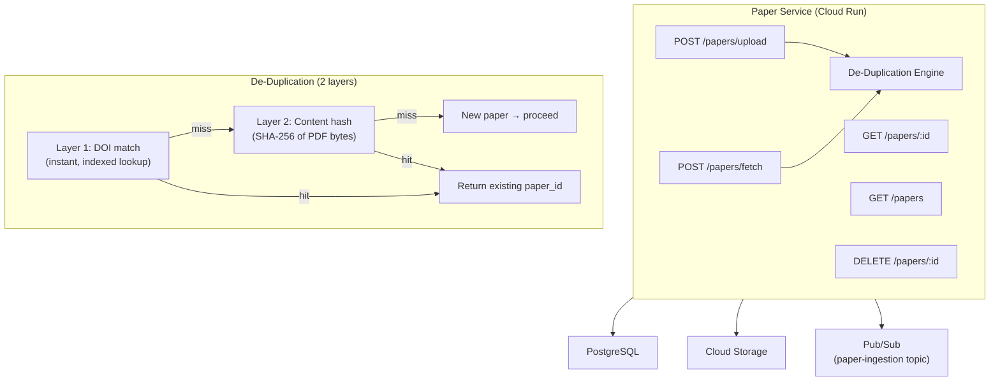

**Key implementation details:**

- **Upload path**: Compute SHA-256 hash of uploaded PDF → check `content_hash` index → if new, store in GCS and publish ingestion message
- **DOI fetch path**: Check DOI index → if new, create stub row (metadata only, no PDF yet) and publish ingestion message
- **Soft delete**: Sets `is_deleted = true`; GCS objects cleaned up via lifecycle policy after 30 days
- **Concurrency**: Uses `INSERT ... ON CONFLICT DO NOTHING` to handle race conditions where two users upload the same paper simultaneously

---

### 5.2 Extraction Service

**Responsibility**: Schema-first multi-paper extraction pipeline orchestration.

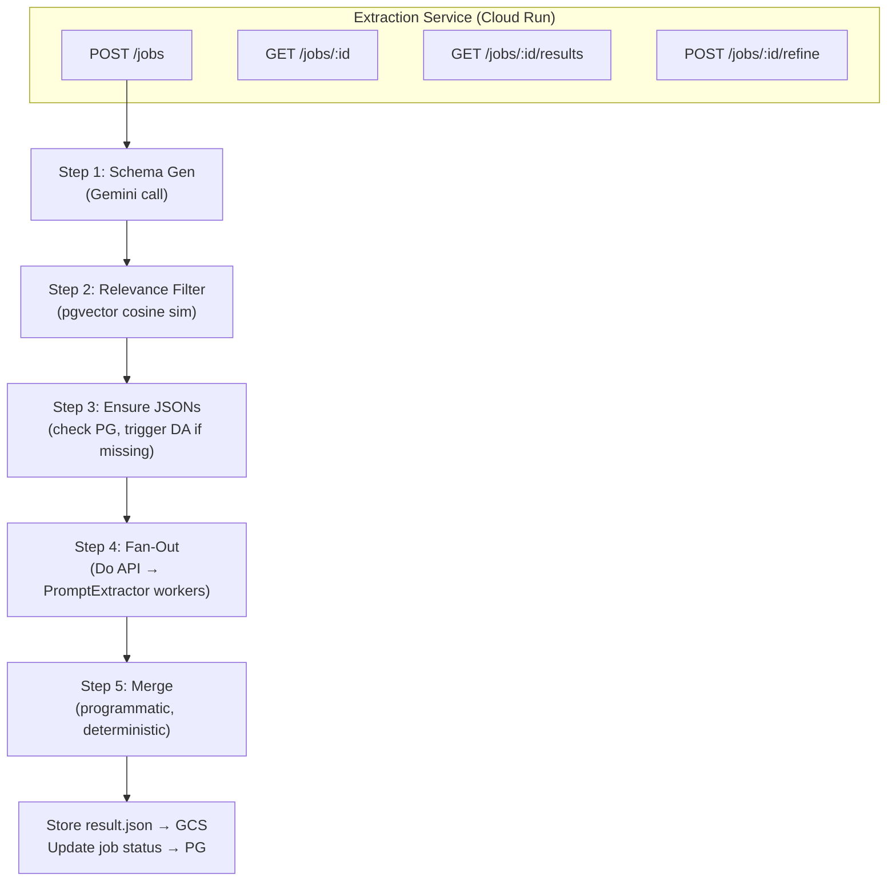

**Schema Generation Prompt (sent to Gemini):**

```
You are a schema designer for scientific data extraction.
Given the user's extraction prompt, generate a canonical JSON schema
that standardizes the field names, types, and units.

User prompt: "{user_prompt}"

Return JSON: {
  "fields": [
    {"name": "field_name", "type": "number|string|boolean|array",
     "unit": "unit_or_null", "description": "what this field captures"}
  ]
}
```

**Why the merge is programmatic (not LLM):**

| Concern | LLM Merge | Programmatic Merge |
|---------|-----------|-------------------|
| Determinism | ❌ Different outputs each run | ✅ Identical every time |
| Auditability | ❌ Can't trace values | ✅ Every row has `paper_id` |
| Scale | ❌ Context window limit | ✅ Unlimited papers |
| Hallucination | ❌ May "correct" values | ✅ Impossible |
| Cost | ❌ Extra LLM call | ✅ Zero |

---

### 5.3 Citation Service

**Responsibility**: BFS citation graph traversal with relevance-gated pruning.

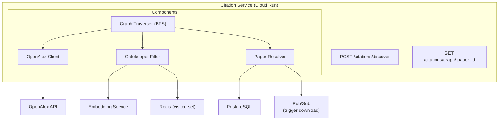

**Gatekeeper Decision Tree (per candidate paper):**

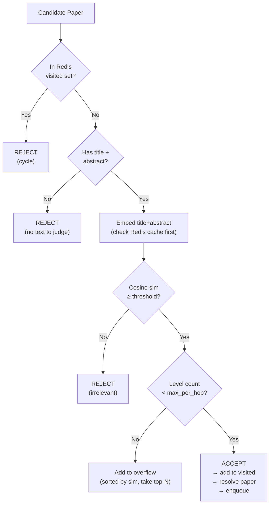

**Why Redis for cycle detection (not in-memory set):**

The BFS traversal can be distributed across multiple Do API workers (one worker per BFS level for parallelism). An in-memory Python `set()` only exists in one process. Redis provides a **shared visited set** across all workers processing the same job. The key `citation:visited:{job_id}` is a Redis SET with 24h TTL for auto-cleanup.

---

### 5.4 Search Service

**Responsibility**: Hybrid semantic + full-text search over papers.

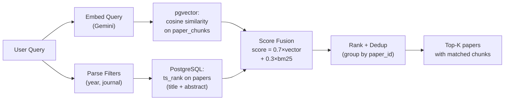

**Hybrid Search SQL:**

```sql
WITH vector_hits AS (
    SELECT paper_id,
           1 - (embedding <=> :query_embedding) AS vector_score
    FROM paper_chunks
    ORDER BY embedding <=> :query_embedding
    LIMIT 100
),
fts_hits AS (
    SELECT id AS paper_id,
           ts_rank_cd(
             to_tsvector('english', title || ' ' || abstract),
             plainto_tsquery('english', :query_text)
           ) AS fts_score
    FROM papers
    WHERE to_tsvector('english', title || ' ' || abstract)
       @@ plainto_tsquery('english', :query_text)
    LIMIT 100
)
SELECT p.id, p.title, p.doi, p.abstract,
       COALESCE(v.vector_score, 0) * 0.7
       + COALESCE(f.fts_score, 0) * 0.3 AS final_score
FROM papers p
LEFT JOIN (SELECT paper_id, MAX(vector_score) AS vector_score
           FROM vector_hits GROUP BY paper_id) v ON p.id = v.paper_id
LEFT JOIN fts_hits f ON p.id = f.paper_id
WHERE v.paper_id IS NOT NULL OR f.paper_id IS NOT NULL
ORDER BY final_score DESC
LIMIT :limit;
```

---

### 5.5 Data Agent (Gemini PDF → JSON)

**Responsibility**: Multimodal extraction of full paper content into structured JSON.

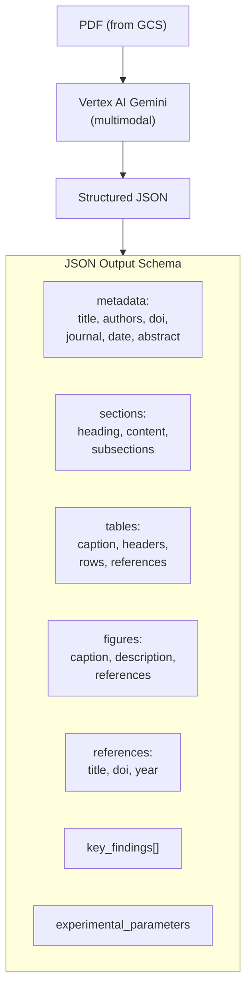

**Why Gemini over GROBID/PyMuPDF:**

| Capability | GROBID/PyMuPDF | Gemini Data Agent |
|------------|----------------|-------------------|
| Plain text | ✅ | ✅ |
| Tables | ⚠️ Heuristics, often wrong | ✅ Understands structure from images |
| Figures/Diagrams | ❌ Can't interpret | ✅ Describes content |
| Cross-references | ❌ | ✅ Maintains relationships |
| Methodology extraction | ❌ | ✅ Extracts experimental parameters |
| Cost | Free | ~$0.10/paper |

**Versioning**: Same paper can be re-extracted when models improve. Each extraction is versioned with `is_latest` flag. On re-extraction: `UPDATE SET is_latest = false WHERE paper_id = X`, then `INSERT` new version with `is_latest = true`.

---

## 6. Failure Handling & Resilience

### 6.1 Failure Matrix

| Component | Failure | Impact | Recovery |
|-----------|---------|--------|----------|
| **OpenAlex API** | Down / 429 | Can't discover citations | Retry 3× with exponential backoff → fall back to Semantic Scholar → return seed paper only with warning |
| **Vertex AI (Gemini)** | Timeout / quota | Can't extract or embed | Retry with backoff → switch model (flash → pro) → DLQ for manual retry |
| **Redis** | Down | No cycle detection, no embed cache | Fall back to in-memory `set()` (works for single-worker) + log warning |
| **PostgreSQL** | Connection pool exhausted | All services blocked | Connection pooling via PgBouncer (Cloud SQL Proxy) + circuit breaker |
| **GCS** | Upload fails | PDF/JSON not stored | Retry 3× → fail the ingestion task → DLQ |
| **Download Service** | All sources fail | Paper has no PDF | Mark paper as `unavailable`; include in results with `has_extraction: false` |
| **Do API Worker** | Crash mid-task | Partial work lost | Pub/Sub redelivers (ack deadline) → worker is idempotent (checks if work already done) |

### 6.2 Circuit Breaker Pattern

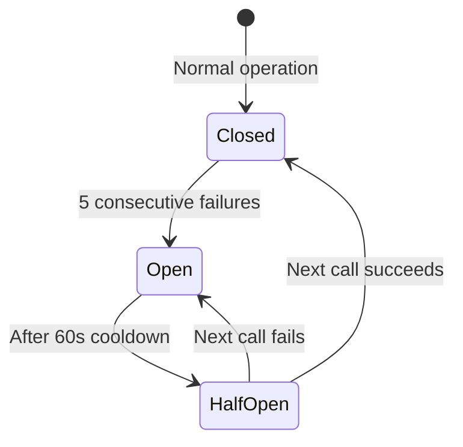

Applied to: **OpenAlex client**, **Vertex AI client**, **Download Service**.

```python
class CircuitBreaker:
    FAILURE_THRESHOLD = 5
    RESET_TIMEOUT = 60  # seconds

    def __init__(self):
        self.state = 'closed'
        self.failures = 0
        self.last_failure = 0

    async def call(self, fn, *args):
        if self.state == 'open':
            if time.time() - self.last_failure > self.RESET_TIMEOUT:
                self.state = 'half_open'
            else:
                raise CircuitOpenError()
        try:
            result = await fn(*args)
            self.failures = 0
            self.state = 'closed'
            return result
        except Exception:
            self.failures += 1
            self.last_failure = time.time()
            if self.failures >= self.FAILURE_THRESHOLD:
                self.state = 'open'
            raise
```

### 6.3 Idempotency

Every worker checks before doing work:

```python
async def data_agent_worker(payload):
    paper_id = payload["paper_id"]

    # Idempotency check — already extracted?
    existing = await db.query(
        "SELECT id FROM paper_extractions WHERE paper_id = $1 AND is_latest = TRUE",
        paper_id
    )
    if existing:
        return {"paper_id": paper_id, "status": "already_exists"}

    # ... proceed with extraction
```

This ensures Pub/Sub redelivery (on ack timeout) doesn't cause duplicate work.

---

## 7. Observability Stack

### 7.1 Three Pillars

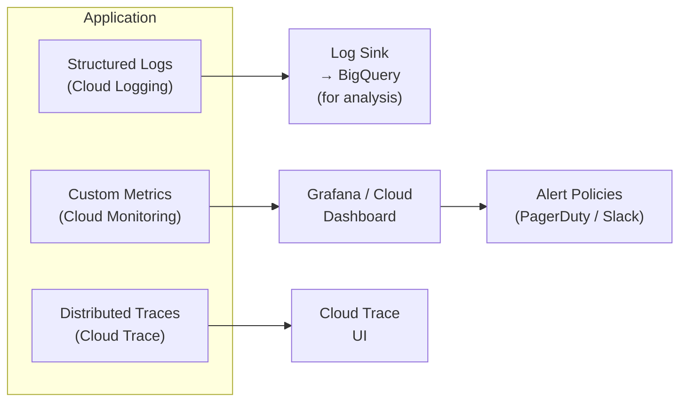

### 7.2 Key Metrics

| Metric | Type | Alert Threshold |
|--------|------|-----------------|
| `paper_ingestion_duration_seconds` | Histogram | p95 > 120s |
| `extraction_job_duration_seconds` | Histogram | p95 > 300s |
| `gemini_api_latency_seconds` | Histogram | p95 > 30s |
| `gemini_api_errors_total` | Counter | > 10/min |
| `do_api_tasks_in_flight` | Gauge | > 100 |
| `do_api_dlq_messages_total` | Counter | > 0 (any DLQ message) |
| `openalex_circuit_breaker_state` | Gauge (0/1/2) | state = open |
| `papers_extraction_status` | Gauge per status | `unavailable` > 50 |
| `redis_connection_errors_total` | Counter | > 5/min |

### 7.3 Correlation IDs

Every request gets a `correlation_id` (UUID) that flows through:

```
API Gateway → Paper Service → Pub/Sub message attributes → Worker → Reply
     ↓              ↓                    ↓                    ↓
 Cloud Logging   Cloud Logging      Cloud Logging        Cloud Logging
 (same correlation_id across all log entries)
```

Query all logs for a single request:
```
resource.type="cloud_run_revision"
jsonPayload.correlation_id="abc-123-def"
```

---

## 8. Security Architecture

### 8.1 Network Topology

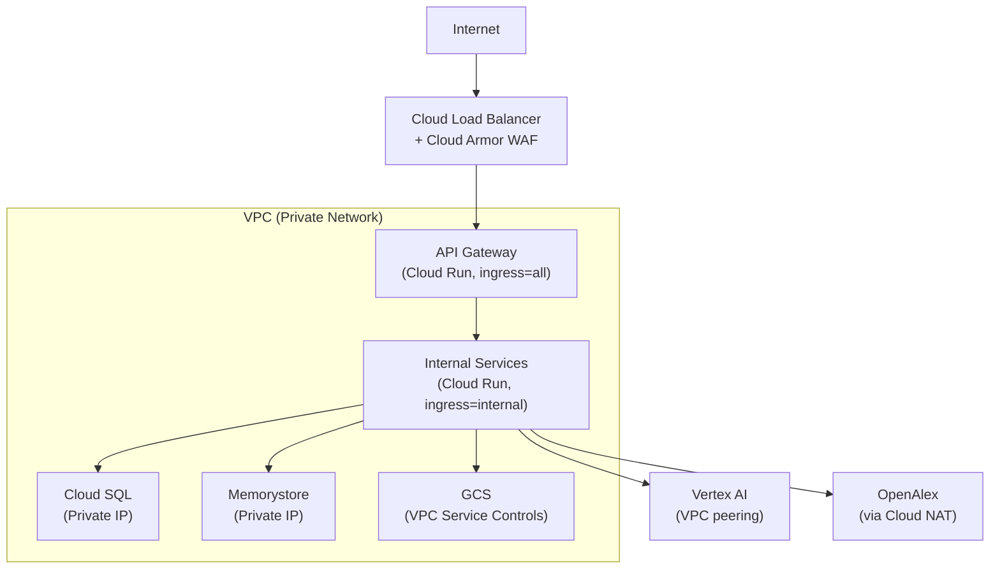

### 8.2 IAM Roles (Principle of Least Privilege)

| Service | IAM Role | Access |
|---------|----------|--------|
| API Gateway | `roles/run.invoker` | Invoke internal services only |
| Paper Service | `roles/storage.objectAdmin` (scoped bucket) | Read/write PDFs and JSONs |
| Workers | `roles/aiplatform.user` | Call Vertex AI |
| Workers | `roles/storage.objectViewer` | Read paper JSONs |
| Citation Service | No GCS role | Doesn't touch storage directly |
| All services | `roles/cloudsql.client` | Connect to Cloud SQL |

### 8.3 Secrets Management

- **API keys** (OpenAlex email, Sci-Hub config): Secret Manager → mounted as env vars in Cloud Run
- **DB credentials**: Cloud SQL IAM authentication (no password, service account auth)
- **No API keys for Gemini**: Vertex AI uses service account identity

---

## 9. Cost Analysis

### 9.1 Monthly Cost Breakdown

| Resource | Spec | Monthly Cost |
|----------|------|-------------|
| **Cloud SQL (PostgreSQL)** | db-custom-2-8192, 100GB SSD, 1 region | ~$70 |
| **Cloud Run (Services)** | 5 services, 2 vCPU, 4GB, scale-to-zero | ~$30-50 |
| **Cloud Run Jobs (Workers)** | Burst usage, ~500 jobs/month | ~$10-20 |
| **Pub/Sub** | ~100K messages/month | ~$5 |
| **Cloud Storage** | 100GB Standard | ~$2 |
| **Memorystore (Redis)** | 1GB Basic tier | ~$30 |
| **Vertex AI — Data Agent** | 500 papers × ~$0.10/paper | ~$50 |
| **Vertex AI — Prompt Extraction** | 2K extractions × ~$0.03 | ~$60 |
| **Vertex AI — Embeddings** | 500 papers × 20 chunks | ~$5 |
| **Cloud SQL Proxy / Networking** | VPC, NAT, etc. | ~$10 |
| **Cloud Logging/Monitoring** | First 50GB free | ~$0 |
| | **TOTAL** | **~$270-300/mo** |

### 9.2 Cost Optimization Levers

| Lever | Savings | Trade-off |
|-------|---------|-----------|
| **Committed Use Discount (Cloud SQL)** | 30-50% off | 1-3 year commitment |
| **Vertex AI Batch API** | 50% cheaper | Results in hours, not seconds |
| **Gatekeeper pruning** | 75% fewer Gemini calls | May miss some relevant papers |
| **Embedding cache (Redis)** | ~40% fewer embed calls | 7-day stale embeddings |
| **Scale-to-zero (Cloud Run)** | Pay nothing when idle | Cold start latency (~2s) |
| **GCS Nearline** (old extractions) | 50% storage savings | Retrieval fee on access |

---

## 10. API Contract Summary

### Papers
```
POST   /api/papers/upload          → Upload PDF → trigger ingestion
POST   /api/papers/fetch           → Fetch by DOI → trigger download
GET    /api/papers                 → List user's papers (paginated)
GET    /api/papers/:id             → Paper metadata + extraction status
GET    /api/papers/:id/extraction  → Latest JSON extraction (GCS signed URL)
DELETE /api/papers/:id             → Soft delete
```

### Extraction Jobs
```
POST   /api/jobs                   → Create multi-paper extraction job
GET    /api/jobs/:id               → Job status + progress
GET    /api/jobs/:id/results       → Aggregated results (JSON table)
GET    /api/jobs/:id/results/csv   → Export as CSV
POST   /api/jobs/:id/refine        → Re-run with updated prompt/schema
```

### Citations
```
POST   /api/citations/discover     → Trigger BFS citation discovery
GET    /api/citations/graph/:id    → Citation subgraph (with depth param)
GET    /api/papers/:id/citations   → Direct references + citers
```

### Search
```
POST   /api/search                 → Hybrid semantic + full-text search
GET    /api/search/suggest         → Autocomplete suggestions
```

---

## 11. What to Build — Priority Order

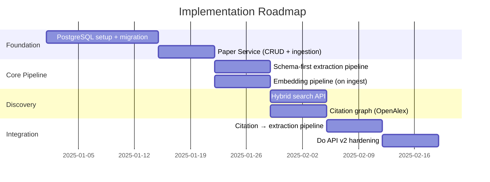

| # | Task | Depends On | Unlocks | Effort |
|---|------|-----------|---------|--------|
| 1 | PostgreSQL setup + Firestore migration | Nothing | Everything | 2 weeks |
| 2 | Paper Service (upload, fetch, dedup) | PostgreSQL | Ingestion | 1 week |
| 3 | Schema-first multi-paper extraction | Do API + PG | Core product | 1 week |
| 4 | Embedding pipeline (on paper ingestion) | PostgreSQL + pgvector | Search | 1 week |
| 5 | Hybrid search API | Embeddings | Discovery | 1 week |
| 6 | Citation graph (OpenAlex + Gatekeeper) | PostgreSQL + Redis | Graph expansion | 1 week |
| 7 | Citation → extraction integration | Citations + extraction | Full E2E | 1 week |
| 8 | Do API v2 (DLQ, timeouts, partial) | Existing Do API | Reliability | 1 week |
