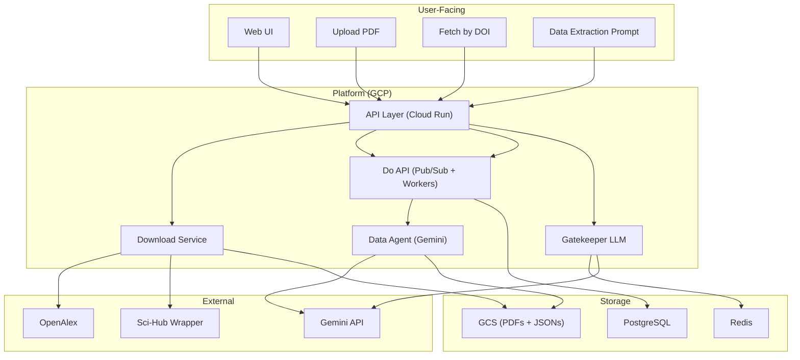
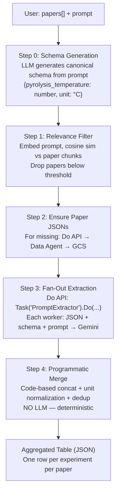
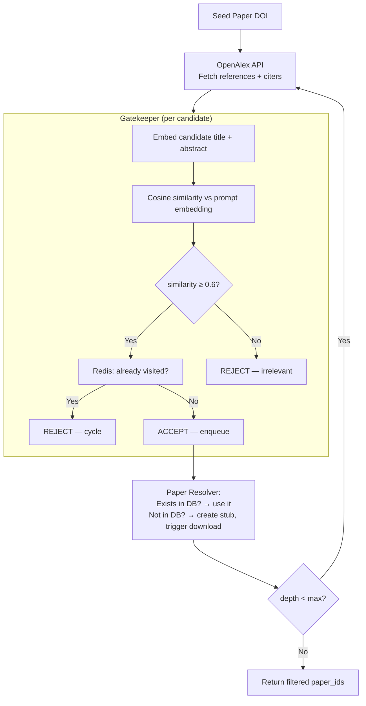
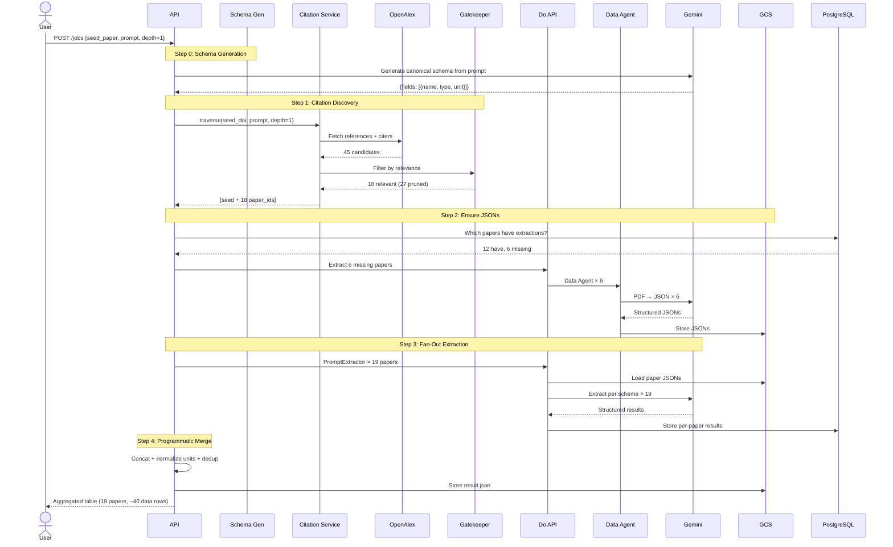

# Paper Extraction Feature — What I Built

> A detailed breakdown of the Research Paper Data Extraction Engine I designed and built at Infocusp (Client: Google). This document explains what exists, how it works end-to-end, and the key technical decisions behind it.

---

## High-Level System Overview



---

## Feature 1: Paper Ingestion

### What It Does
Users add papers to the system in two ways — upload a PDF directly, or provide a DOI and let the system fetch it automatically.

### Flow

```
User provides PDF or DOI
        │
        ├── PDF Upload:
        │     1. Compute SHA-256 content hash
        │     2. De-dup check (DOI match → content hash match)
        │     3. Store PDF → GCS: gs://bucket/papers/{id}/original.pdf
        │     4. Trigger Data Agent extraction (async via Do API)
        │
        └── DOI Fetch:
              1. De-dup check by DOI
              2. Download Service resolves PDF:
              │     OpenAlex (open access PDF URL)
              │       ↓ if unavailable
              │     Sci-Hub Wrapper (optional, user-configured)
              │       ↓ if unavailable
              │     GCS Cache (previously downloaded)
              3. Store PDF → GCS
              4. Trigger Data Agent extraction (async via Do API)
```

### De-Duplication (Two Layers)

| Layer | Speed | Catches |
|-------|-------|---------|
| **DOI match** | Instant | Same paper fetched by different users |
| **Content hash** (SHA-256) | Fast | Papers without DOIs, or different DOIs for same content |

If duplicate found → link to existing paper, no re-extraction.

### Download Service — Multi-Source Fallback

```python
async def fetch_paper(doi: str) -> str:
    # 1. Check GCS cache first
    cached = await gcs.check(f"papers/by-doi/{encode(doi)}.pdf")
    if cached:
        return cached  # cache hit — free, instant

    # 2. OpenAlex → open access PDF
    oa_work = await openalex.get(f"/works/doi:{doi}")
    pdf_url = oa_work.best_oa_location?.pdf_url
    if pdf_url:
        return await download_and_cache(pdf_url, doi)

    # 3. Sci-Hub (optional, user-configured)
    if config.scihub_enabled:
        return await scihub_wrapper.fetch(doi)

    raise PaperUnavailableError(doi)
```

### GCS Bucket Layout

```
gs://bucket/
  papers/
    {paper_id}/original.pdf          — raw PDF
    by-doi/{encoded_doi}.pdf         — DOI-keyed cache
  extractions/
    {paper_id}/v1.json               — Data Agent output v1
    {paper_id}/v2.json               — re-extraction with newer model
  jobs/
    {job_id}/result.json             — aggregated extraction result
```

---

## Feature 2: Data Agent (Gemini-Based PDF → JSON)

### What It Does
Takes a PDF and produces a **comprehensive, structured JSON** of the entire paper. This is NOT a simple text extractor — it's a multimodal Gemini agent that understands diagrams, tables, cross-references, and scientific methodology.

### Why Gemini, Not GROBID/PyMuPDF

| | GROBID/PyMuPDF | Our Gemini Data Agent |
|-|----------------|----------------------|
| Plain text | ✅ | ✅ |
| Tables | ⚠️ Heuristics, often wrong | ✅ Understands table structure from images |
| Figures/Diagrams | ❌ Can't interpret | ✅ Describes content, links to text |
| Cross-references | ❌ | ✅ Maintains relationships |
| Methodology extraction | ❌ | ✅ Extracts experimental parameters |
| Cost | Free | ~$0.10/paper |

### Output JSON Schema

```json
{
  "metadata": {
    "title": "...", "authors": [...], "doi": "...",
    "journal": "...", "publication_date": "...", "abstract": "..."
  },
  "sections": [
    {
      "heading": "Materials and Methods",
      "content": "Biochar was prepared at 500°C...",
      "subsections": [...]
    }
  ],
  "tables": [
    {
      "id": "table_1",
      "caption": "Properties of biochar at different temperatures",
      "headers": ["Temperature (°C)", "Yield (%)", "BET (m²/g)"],
      "rows": [["300", "42.1", "12.3"], ["500", "31.5", "256.7"]],
      "referenced_in_sections": ["Results"]
    }
  ],
  "figures": [
    {
      "id": "figure_1",
      "caption": "SEM image of biochar at 500°C",
      "description": "Porous structure visible at 10μm scale...",
      "referenced_in_sections": ["Results"]
    }
  ],
  "references": [
    {"ref_number": 1, "title": "...", "doi": "...", "year": 2019}
  ],
  "key_findings": ["...", "..."],
  "experimental_parameters": {
    "feedstock": "rice husk",
    "pyrolysis_temperature_range": "300-700°C",
    "residence_time": "2 hours"
  }
}
```

### Versioning

Same paper can be re-extracted when models improve. Each extraction is versioned:

```
paper_extractions table:
  (paper_id, version=1, model="gemini-1.5-flash", is_latest=false)
  (paper_id, version=2, model="gemini-2.0-flash", is_latest=true)  ← current
```

On re-extraction: mark old version `is_latest=false`, insert new version with `is_latest=true`.

---

## Feature 3: Do API — Async Execution Framework

### What It Does
Custom-built async/await framework on top of GCP Pub/Sub. Enables fan-out of heavy tasks (Gemini calls, downloads) across a worker pool.

### Architecture

```
Client Code                     Infrastructure
─────────────                   ──────────────
result = await Task(            Pub/Sub "task" topic
  'DataAgent_Worker'              │
).Do(payload)                     ▼
                                Worker Pool (Cloud Run)
      ▲                           │
      │                           ▼
      └────────────────── Pub/Sub "reply" topic
                          (per-client, ephemeral)
```

### How It Works

```
1. Client calls: await Task('WorkerName').Do(payload)
2. Client creates a unique reply topic
3. Client publishes payload to the worker's task topic
4. Worker pulls from task topic, processes, publishes result to reply topic
5. Client receives result from reply topic
6. Reply topic is cleaned up
```

### Fan-Out (Multiple Tasks)

```python
# Extract from 50 papers in parallel
results = await Task('PromptExtractor').Do([
    {"paper_id": "p1", "json_gcs_uri": "gs://..."},
    {"paper_id": "p2", "json_gcs_uri": "gs://..."},
    ...  # 50 papers
])
# results = [r1, r2, r3, ..., r50]
```

Each payload becomes a separate Pub/Sub message. Workers pull independently. Results aggregated by the client.

---

## Feature 4: Single-Paper Extraction

### What It Does
User selects a paper and provides a natural-language prompt. System extracts specific data from that paper.

### Flow

```
User: paper_id + prompt ("extract pyrolysis temp and yield")
  │
  ├── 1. Get paper's JSON extraction from GCS (or trigger Data Agent if new)
  │
  ├── 2. Send (JSON + prompt) to Gemini
  │      "Given this paper data, extract: {prompt}"
  │
  └── 3. Return structured result to user
```

This is the **foundational flow** — it works. The multi-paper feature builds on top of this.

---

## Feature 5: Multi-Paper Tabular Extraction (Schema-First)

### What It Does
User selects multiple papers + prompt. System extracts the same data fields from ALL papers and returns an aggregated table.

### The Problem
Without a schema, each paper returns different field names:
```
Paper A: {temp: 500}
Paper B: {temperature_celsius: 500}
Paper C: {pyrolysis_temp_C: 500}
```
These can't be merged into a table.

### The Solution — Schema-First Pipeline



### Why Programmatic Merge, Not LLM Merge

| | LLM Merge | Programmatic Merge (what we do) |
|-|-----------|--------------------------------|
| Deterministic | ❌ Same inputs → different outputs | ✅ Always identical |
| Auditable | ❌ Can't trace values to source | ✅ Every row has paper_id |
| Scale | ❌ Context limit at ~50 papers | ✅ Unlimited |
| Cost | ❌ One massive API call | ✅ Zero cost |
| Hallucination | ❌ LLM may "correct" values | ✅ Impossible |

### Multi-Experiment Handling

**Critical detail**: Papers often report multiple experiments. The Data Agent's JSON may contain a table with 5 different temperature/yield combinations. The LLM must return an **array**, not a single object:

```json
{
  "data": [
    {"pyrolysis_temperature": 300, "biochar_yield": 42.1},
    {"pyrolysis_temperature": 500, "biochar_yield": 31.5},
    {"pyrolysis_temperature": 700, "biochar_yield": 24.8}
  ],
  "confidence": 0.92
}
```

---

## Feature 6: Citation Graph Traversal + Gatekeeper

### What It Does
Given a seed paper and a prompt, discover related papers through the citation graph, filter by relevance, and include them in the extraction.

### The Problem — Graph Explosion

| Depth | Unfiltered Papers |
|-------|------------------|
| 0 | 1 (seed only) |
| 1 | ~50 |
| 2 | ~2,500 |
| 3 | ~125,000 |

Can't extract from 2,500 papers. Too slow, too expensive.

### The Solution — Gatekeeper LLM Filter



### Result
- **~97% of papers pruned** per hop
- **2,500 → ~80 papers** at depth 2
- **75% reduction** in Gemini API costs

### Redis Cycle Detection

Why Redis instead of in-memory set? The traversal runs across **multiple Do API workers**. An in-memory Python set only exists in one process. Redis provides a **shared visited set**.

```
Key:    citation:visited:{job_id}    (SET)
TTL:    24 hours
Values: OpenAlex IDs of visited papers
```

```
Process: Paper A → cites B, C, D
         visited = {A, B, C, D}
         Paper B → cites E, A     ← A already visited, SKIP
         Paper C → cites A, G     ← A already visited, SKIP
         No infinite loops.
```

---

## End-to-End Flow (Full Pipeline)



---

## Key Technical Decisions & Why

| Decision | What I Chose | Alternative | Why |
|----------|-------------|-------------|-----|
| PDF parsing | Gemini Agent | GROBID / PyMuPDF | Handles tables, figures, cross-refs natively. Worth the $0.10/paper cost. |
| Async framework | Custom Do API (Pub/Sub) | Cloud Tasks / Celery | Needed await-style semantics with reply topics. Cloud Tasks doesn't support response collection. |
| Merge strategy | Programmatic code | LLM merge | Deterministic, auditable, scales beyond 50 papers, zero cost. |
| Citation pruning | Gatekeeper embedding filter | No filter / keyword filter | Embedding similarity captures semantic relevance, not just keyword overlap. 75% cost reduction. |
| Cycle detection | Redis SET | In-memory set | Workers are distributed across Cloud Run instances. Shared state needed. |
| Extraction versioning | Version column + is_latest flag | Overwrite old extraction | Models improve — need to keep history for comparison and rollback. |
| Paper storage | GCS (PDFs + JSONs) | DB BLOBs | JSON extractions are 50-500KB. GCS is cheaper and serves signed URLs directly. |
| De-duplication | DOI + content hash | DOI only | Many papers lack DOIs (preprints, user uploads). Content hash catches these. |
