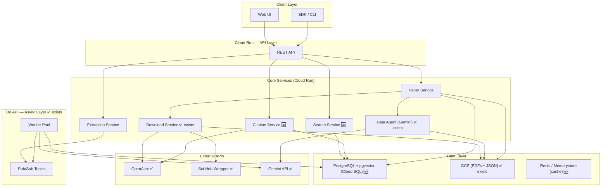
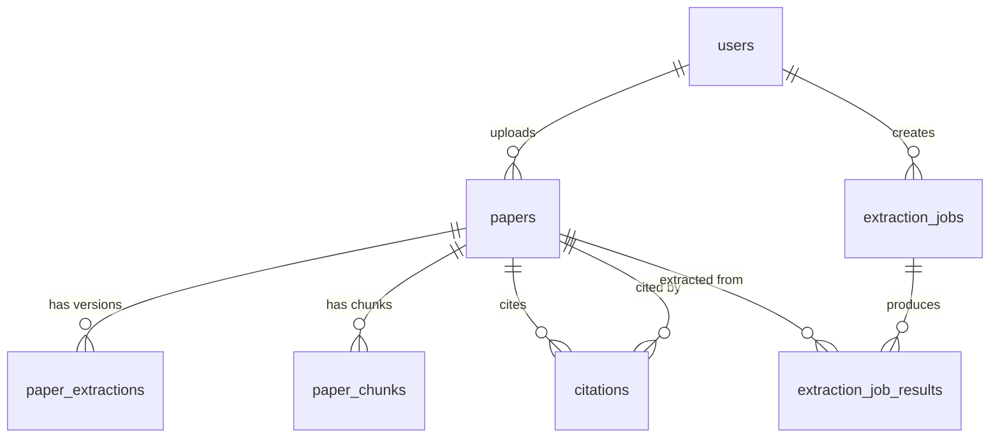
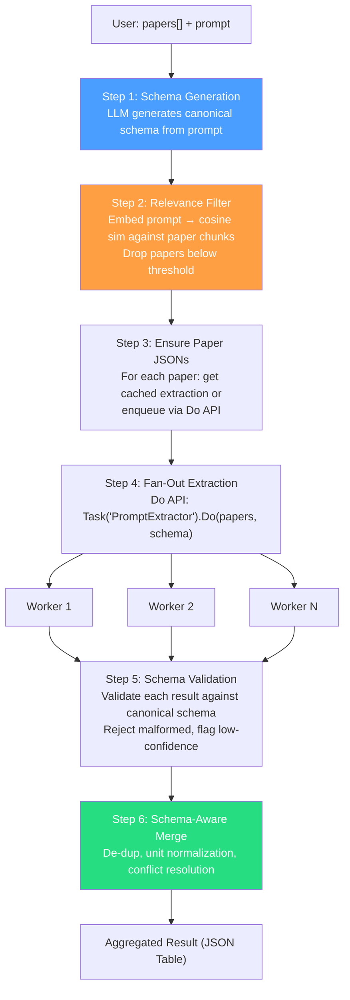
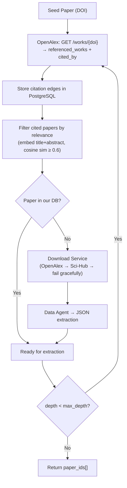
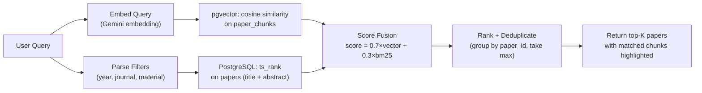

# Research Paper Data Extraction Engine — Deep Dive Design (v2)

> Built on what exists: **Data Agent (Gemini)**, **Do API (Pub/Sub + Workers)**, **Download Service**, **GCS**. This design adds what's missing while preserving your working infrastructure.

---

## 1. Target Architecture



**✅ = exists today, 🆕 = new**

---

## 2. PostgreSQL Schema (Cloud SQL)

### 2.1 Users & Auth

```sql
CREATE TABLE users (
    id              UUID PRIMARY KEY DEFAULT gen_random_uuid(),
    email           TEXT UNIQUE NOT NULL,
    display_name    TEXT,
    auth_provider   TEXT NOT NULL,      -- 'google' | 'orcid' | 'email'
    auth_provider_id TEXT,
    created_at      TIMESTAMPTZ DEFAULT now(),
    updated_at      TIMESTAMPTZ DEFAULT now()
);
```

### 2.2 Papers

```sql
CREATE TABLE papers (
    id              UUID PRIMARY KEY DEFAULT gen_random_uuid(),
    doi             TEXT UNIQUE,
    title           TEXT NOT NULL,
    authors         JSONB,              -- [{name, affiliation, orcid}]
    abstract        TEXT,
    publication_date DATE,
    journal         TEXT,
    source          TEXT NOT NULL,       -- 'upload' | 'openalex' | 'scihub'
    
    -- GCS references
    pdf_gcs_uri     TEXT,               -- gs://bucket/papers/{id}.pdf
    
    -- De-duplication
    content_hash    TEXT,               -- SHA-256 of PDF bytes
    
    -- Ownership
    uploaded_by     UUID REFERENCES users(id),
    is_public       BOOLEAN DEFAULT FALSE,
    
    created_at      TIMESTAMPTZ DEFAULT now(),
    updated_at      TIMESTAMPTZ DEFAULT now()
);

CREATE INDEX idx_papers_doi ON papers(doi);
CREATE INDEX idx_papers_uploaded_by ON papers(uploaded_by);
CREATE INDEX idx_papers_fts ON papers
    USING GIN (to_tsvector('english', coalesce(title,'') || ' ' || coalesce(abstract,'')));
```

### 2.3 Extractions (Data Agent Output)

The Data Agent produces a full JSON representation of the paper. This replaces your Firestore `extractions` and `extraction_versions` collections.

```sql
CREATE TABLE paper_extractions (
    id              UUID PRIMARY KEY DEFAULT gen_random_uuid(),
    paper_id        UUID NOT NULL REFERENCES papers(id) ON DELETE CASCADE,
    version         INT NOT NULL DEFAULT 1,
    
    -- GCS reference to the full JSON (can be large, 50KB-500KB)
    json_gcs_uri    TEXT NOT NULL,       -- gs://bucket/extractions/{paper_id}/v{version}.json
    
    -- Denormalized summary for fast access (key fields only)
    summary         JSONB,              -- {section_count, table_count, figure_count, ...}
    
    -- Provenance
    model_used      TEXT,               -- 'gemini-2.0-flash' | 'gemini-2.0-pro'
    token_input     INT,
    token_output    INT,
    cost_usd        NUMERIC(8,5),
    
    is_latest       BOOLEAN DEFAULT TRUE,
    created_at      TIMESTAMPTZ DEFAULT now(),
    
    UNIQUE(paper_id, version)
);

-- Fast lookup: latest extraction for a paper
CREATE INDEX idx_extractions_latest ON paper_extractions(paper_id) WHERE is_latest = TRUE;
```

> [!NOTE]
> The JSON blob stays in GCS (it's large and unstructured). PostgreSQL holds metadata + the GCS URI. This preserves your current GCS-based storage pattern.

### 2.4 Citation Graph

```sql
CREATE TABLE citations (
    citing_paper_id UUID NOT NULL REFERENCES papers(id) ON DELETE CASCADE,
    cited_paper_id  UUID NOT NULL REFERENCES papers(id) ON DELETE CASCADE,
    context_snippet TEXT,              -- sentence around the citation
    source          TEXT DEFAULT 'openalex',  -- 'openalex' | 'extracted'
    created_at      TIMESTAMPTZ DEFAULT now(),
    PRIMARY KEY (citing_paper_id, cited_paper_id)
);

CREATE INDEX idx_citations_cited ON citations(cited_paper_id);
```

**Recursive query for N-hop citation graph:**

```sql
-- Get all papers within 2 hops of a seed paper
WITH RECURSIVE citation_graph AS (
    -- Seed
    SELECT cited_paper_id AS paper_id, 0 AS depth
    FROM citations WHERE citing_paper_id = :seed_paper_id
    
    UNION
    
    -- Expand
    SELECT c.cited_paper_id, cg.depth + 1
    FROM citations c
    JOIN citation_graph cg ON c.citing_paper_id = cg.paper_id
    WHERE cg.depth < :max_depth
)
SELECT DISTINCT p.*, cg.depth
FROM citation_graph cg
JOIN papers p ON p.id = cg.paper_id;
```

### 2.5 Vector Embeddings (for Search)

```sql
CREATE EXTENSION IF NOT EXISTS vector;

CREATE TABLE paper_chunks (
    id          UUID PRIMARY KEY DEFAULT gen_random_uuid(),
    paper_id    UUID NOT NULL REFERENCES papers(id) ON DELETE CASCADE,
    chunk_index INT NOT NULL,
    chunk_text  TEXT NOT NULL,
    section     TEXT,                   -- 'abstract' | 'methodology' | 'results' | ...
    embedding   vector(768),            -- Gemini embedding dimension
    created_at  TIMESTAMPTZ DEFAULT now(),
    
    UNIQUE(paper_id, chunk_index)
);

CREATE INDEX idx_chunks_embedding ON paper_chunks
    USING hnsw (embedding vector_cosine_ops);
CREATE INDEX idx_chunks_paper ON paper_chunks(paper_id);
```

### 2.6 Extraction Jobs (Multi-Paper Prompt Extraction)

```sql
CREATE TABLE extraction_jobs (
    id              UUID PRIMARY KEY DEFAULT gen_random_uuid(),
    user_id         UUID NOT NULL REFERENCES users(id),
    prompt          TEXT NOT NULL,
    
    -- The canonical schema generated from the prompt
    canonical_schema JSONB NOT NULL,     -- {fields: [{name, type, unit, description}]}
    
    -- Paper scope
    paper_ids       UUID[] NOT NULL,     -- input paper IDs
    citation_depth  INT DEFAULT 0,       -- 0 = only selected papers, 1+ = expand citations
    
    -- Status
    status          TEXT DEFAULT 'pending',  -- pending | schema_generated | extracting | merging | completed | failed
    total_papers    INT,
    completed_papers INT DEFAULT 0,
    failed_papers   INT DEFAULT 0,
    
    -- Result
    result_gcs_uri  TEXT,               -- gs://bucket/jobs/{id}/result.json
    
    created_at      TIMESTAMPTZ DEFAULT now(),
    completed_at    TIMESTAMPTZ
);

CREATE TABLE extraction_job_results (
    id              UUID PRIMARY KEY DEFAULT gen_random_uuid(),
    job_id          UUID NOT NULL REFERENCES extraction_jobs(id) ON DELETE CASCADE,
    paper_id        UUID NOT NULL REFERENCES papers(id),
    
    -- Per-paper extraction result (structured by canonical_schema)
    extracted_data  JSONB NOT NULL,
    confidence      FLOAT,
    error           TEXT,               -- null if success
    
    -- Cost tracking
    token_input     INT,
    token_output    INT,
    cost_usd        NUMERIC(8,5),
    
    created_at      TIMESTAMPTZ DEFAULT now()
);

CREATE INDEX idx_job_results_job ON extraction_job_results(job_id);
```

### 2.7 Schema: Entity Relationship



---

## 3. Multi-Paper Extraction Pipeline — Redesigned

### Current Flow (Problems Identified)

```
[j1,j2,j3...] = await Task('Extraction_Worker').Do([p1,p2,p3..])
[r1,r2,r3...] = await LLMCall([j1,j2,j3...], user_prompt)
R = await merge_result(r1,r2,r3....)
```

### Improved Flow — Schema-First with Relevance Filtering



### Step-by-Step Detail

#### Step 1 — Schema Generation (NEW)

```
Input:  user_prompt = "Extract pyrolysis temperature, biochar yield, and BET surface area"
Output: canonical_schema = {
    "fields": [
        {"name": "pyrolysis_temperature", "type": "number", "unit": "°C", "description": "Temperature of pyrolysis"},
        {"name": "biochar_yield",         "type": "number", "unit": "%",  "description": "Yield of biochar"},
        {"name": "bet_surface_area",      "type": "number", "unit": "m²/g", "description": "BET surface area"}
    ]
}
```

**Why**: Without this, paper A returns `{temp: 500}` and paper B returns `{temperature_celsius: 500}`. Merge is impossible.

#### Step 2 — Relevance Filter (NEW)

```python
prompt_embedding = embed(user_prompt)
relevant_papers = []
for paper in papers:
    max_sim = max(cosine_sim(prompt_embedding, chunk.embedding) for chunk in paper.chunks)
    if max_sim >= 0.6:
        relevant_papers.append(paper)
```

**Why**: If user selects 50 papers but only 30 are relevant, save 40% LLM cost by skipping irrelevant ones.

#### Step 3 — Ensure Paper JSONs (EXISTING — with cache check)

```python
# Uses your existing Data Agent + Do API
missing = [p for p in relevant_papers if not has_extraction(p.id)]
if missing:
    await Task('DataAgent_Worker').Do(missing)  # existing extraction pipeline
jsons = [load_json_from_gcs(p.extraction.json_gcs_uri) for p in relevant_papers]
```

#### Step 4 — Fan-Out with Do API (IMPROVED)

```python
# KEY CHANGE: Pass canonical_schema to each worker
results = await Task('PromptExtractor').Do(
    payload={
        "papers": [{"id": p.id, "json_gcs_uri": p.json_gcs_uri} for p in relevant_papers],
        "prompt": user_prompt,
        "schema": canonical_schema
    },
    timeout_per_task=30,      # seconds — NEW: per-task timeout
    max_concurrency=10,       # NEW: back-pressure control
    partial_results=True      # NEW: return what you have on partial failure
)
```

**LLM prompt for each paper:**

```
Given this research paper data (JSON) and the extraction schema below,
extract the requested fields. Return ONLY a JSON object matching the schema.
If a field is not found in the paper, set it to null.

Schema: {canonical_schema}
Paper JSON: {paper_json_or_relevant_chunks}
```

#### Step 5 — Schema Validation (NEW)

```python
for result in results:
    try:
        validate(result.data, canonical_schema)       # JSON schema validation
        if result.confidence < 0.7:
            result.flag = "low_confidence"
    except ValidationError:
        result.status = "malformed"
        job.failed_papers += 1
```

#### Step 6 — Schema-Aware Merge (IMPROVED)

```python
def merge_results(results, schema):
    table = []
    for r in results:
        if r.status == "malformed":
            continue
        row = {"paper_id": r.paper_id, "paper_title": r.paper_title, "doi": r.doi}
        for field in schema["fields"]:
            value = r.data.get(field["name"])
            value = normalize_unit(value, field["unit"])  # "500 C" → 500.0
            row[field["name"]] = value
        table.append(row)
    
    # De-duplicate (same DOI appearing twice)
    table = dedup_by_doi(table)
    return table
```

---

## 4. Citation Graph Traversal Service

### Flow



### Integration with Extraction Jobs

```python
# User creates job with citation_depth > 0
async def create_extraction_job(seed_paper_id, prompt, citation_depth=1):
    # 1. Discover citation graph
    paper_ids = await citation_service.traverse(
        seed_id=seed_paper_id,
        depth=citation_depth,
        relevance_prompt=prompt,
        threshold=0.6
    )
    # 2. Run multi-paper extraction on discovered papers
    job = await extraction_service.create_job(
        paper_ids=paper_ids,
        prompt=prompt
    )
    return job
```

---

## 5. Hybrid Search Service

### Search Pipeline



### API

```
POST /api/search
Body: {
    "query": "biochar pyrolysis temperature yield",
    "filters": {
        "year_min": 2020,
        "journal": "Bioresource Technology"
    },
    "limit": 20,
    "aggregation": "table" | "summary" | "stats" | null
}
```

### SQL (simplified)

```sql
-- Hybrid search: vector + full-text
WITH vector_hits AS (
    SELECT paper_id, 
           1 - (embedding <=> :query_embedding) AS vector_score,
           chunk_text
    FROM paper_chunks
    ORDER BY embedding <=> :query_embedding
    LIMIT 100
),
fts_hits AS (
    SELECT id AS paper_id,
           ts_rank_cd(to_tsvector('english', title || ' ' || abstract), 
                      plainto_tsquery('english', :query_text)) AS fts_score
    FROM papers
    WHERE to_tsvector('english', title || ' ' || abstract) @@ plainto_tsquery('english', :query_text)
    LIMIT 100
)
SELECT p.*, 
       COALESCE(v.vector_score, 0) * 0.7 + COALESCE(f.fts_score, 0) * 0.3 AS final_score
FROM papers p
LEFT JOIN (SELECT paper_id, MAX(vector_score) AS vector_score FROM vector_hits GROUP BY paper_id) v 
    ON p.id = v.paper_id
LEFT JOIN fts_hits f ON p.id = f.paper_id
WHERE v.paper_id IS NOT NULL OR f.paper_id IS NOT NULL
ORDER BY final_score DESC
LIMIT :limit;
```

---

## 6. Updated API Contracts

### Papers
```
POST   /api/papers/upload              Upload PDF → Data Agent → JSON → store
POST   /api/papers/fetch               Fetch by DOI (Download Service)
GET    /api/papers                     List user's papers (paginated)
GET    /api/papers/:id                 Get paper metadata
GET    /api/papers/:id/extraction      Get latest JSON extraction (GCS signed URL)
GET    /api/papers/:id/citations       Get citation graph (depth param)
DELETE /api/papers/:id                 Soft delete
```

### Extraction Jobs
```
POST   /api/jobs                       Create multi-paper extraction job
GET    /api/jobs/:id                   Get job status + progress
GET    /api/jobs/:id/results           Get aggregated results (JSON table)
GET    /api/jobs/:id/results/csv       Export as CSV
POST   /api/jobs/:id/refine            Re-run with updated prompt/schema
```

### Search
```
POST   /api/search                     Hybrid search
GET    /api/search/suggest             Autocomplete
```

### Citations
```
POST   /api/citations/discover         Trigger citation discovery for a paper
GET    /api/citations/graph/:paper_id  Get citation subgraph (with depth)
```

---

## 7. Firestore → PostgreSQL Migration Strategy

> [!WARNING]
> This is the riskiest change. Dual-write during migration to avoid downtime.

| Phase | Action | Duration |
|-------|--------|----------|
| **1. Setup** | Provision Cloud SQL (PostgreSQL 15 + pgvector). Create schemas. | 1 day |
| **2. Dual-Write** | API writes to both Firestore AND PostgreSQL. Reads still from Firestore. | 1 week |
| **3. Backfill** | Script to migrate all existing Firestore docs → PostgreSQL. Verify counts. | 2-3 days |
| **4. Switch Reads** | API reads from PostgreSQL. Firestore becomes backup. | 1 day |
| **5. Decommission** | Remove Firestore writes after 2 weeks of stable PostgreSQL reads. | 2 weeks |

**GCS stays unchanged** — PDFs and JSON extractions remain in GCS. PostgreSQL only stores metadata + GCS URIs.

---

## 8. Cost Estimates (GCP)

| Resource | Spec | Monthly Cost |
|----------|------|-------------|
| Cloud SQL (PostgreSQL) | db-custom-2-8192, 100 GB SSD | ~$70 |
| Cloud Run (API + Workers) | 2 vCPU, 4 GB, min 0 instances | ~$30-60 (usage-based) |
| GCS | 100 GB Standard | ~$2 |
| Pub/Sub | ~100 K messages/month | ~$5 |
| Gemini API (Data Agent) | ~500 papers/month, avg $0.10/paper | ~$50 |
| Gemini API (Prompt Extraction) | ~2 K extractions/month, avg $0.03 | ~$60 |
| Gemini Embeddings | ~500 papers × 20 chunks | ~$5 |
| **Total** | | **~$220-250/month** |

---

## 9. What To Build Next (Priority Order)

| # | Task | Depends On | Unlocks | Effort |
|---|------|-----------|---------|--------|
| 1 | **PostgreSQL setup + migration** | Nothing | Everything below | 2 weeks |
| 2 | **Schema-first multi-paper extraction** | Already have Do API | Aggregated results | 1 week |
| 3 | **Embedding pipeline** (on paper ingestion) | PostgreSQL + pgvector | Search | 1 week |
| 4 | **Hybrid search API** | Embeddings | Core product feature | 1 week |
| 5 | **Citation graph (OpenAlex integration)** | PostgreSQL | Seed → expand flows | 1 week |
| 6 | **Citation → extraction pipeline** | Citations + multi-paper extraction | Full end-to-end | 1 week |
